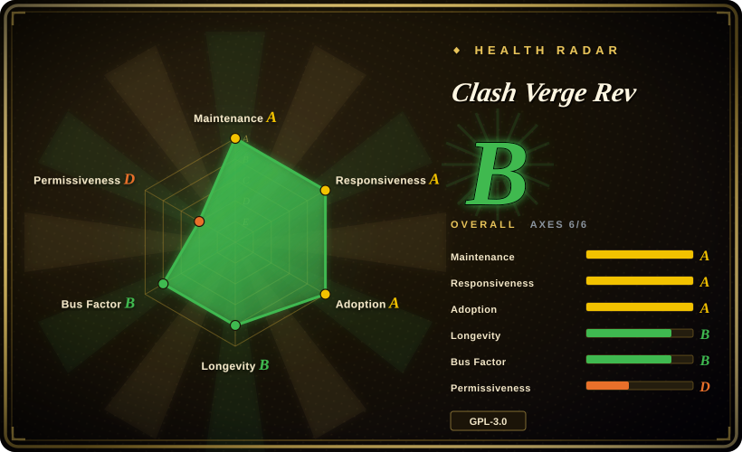
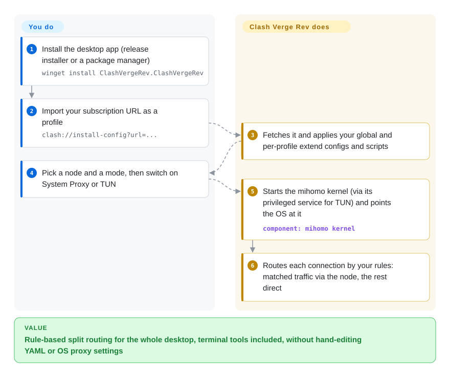

# Clash Verge Rev

Your browser reaches the sites you need through a proxy subscription, but `git clone` in the terminal still times out, and every dead node means hand-editing a YAML file and flipping OS proxy settings. Clash Verge Rev is a desktop app that imports the subscription, runs the mihomo rule engine for you, and routes the whole machine through it with one toggle.

## When to use

You're a developer on Windows, macOS or Linux who pays for (or runs) a proxy subscription in Clash format, and you want split routing on your workstation: domestic sites and the company VPN direct, GitHub, package registries and model APIs through a node. The browser works with the OS proxy setting, but `npm install` or `docker pull` in the terminal hangs because command-line tools ignore it. Clash for Windows, the GUI most tutorials still mention, stopped in 2023 and its GitHub repository now returns 404. You install Clash Verge Rev, paste the subscription URL, pick a node, and switch on TUN mode — a virtual network card that captures traffic from every program, terminal tools included — so the rule list decides where each connection goes.

You pick it over the other mihomo GUIs when you want the most widely used desktop client in this family (about 46 million release-asset downloads by 2026-10) and its layered config extensions: a global YAML override plus a per-subscription override and JavaScript hook that run every time a subscription refreshes, so your own rules survive the provider's updates. Pick [FlClash](https://github.com/chen08209/FlClash) instead when the same subscription has to run on Android too; pick [dae](../../networking/dae.md) when the box to route is a Linux gateway serving a whole LAN rather than one desktop.

## How it works

Clash Verge Rev is a GUI around a separate engine. The engine is mihomo (formerly Clash.Meta), a Go program that reads one YAML config and decides, connection by connection, whether traffic goes direct or through a proxy node. **The app does the plumbing**: it downloads your subscription, runs it through a fixed chain of edits (app settings, then the global extend config and script, then the per-subscription config and script, then the app's own fields written back so the extensions cannot break ports or TUN), writes the final config, starts the bundled kernel, and edits the OS proxy settings for you. **You supply the subscription and choose a mode**: System Proxy only covers programs that honour the OS setting; TUN covers everything, but creating a virtual network card needs administrator rights. For that, the app installs `clash-verge-service`, a background service that keeps running after you quit the GUI and launches the kernel with elevated rights; without it the kernel runs as an ordinary child process ("Sidecar" mode) and TUN is unavailable unless you start the app as administrator.

<!-- flow-steps:begin (generated from flows/clash-verge-rev.json by tools/flow_card.py — do not edit) -->

Text version of the flow

1. **You**: Install the desktop app (release installer or a package manager) — `winget install ClashVergeRev.ClashVergeRev`
2. **You**: Import your subscription URL as a profile — `clash://install-config?url=...`
3. **Clash Verge Rev**: Fetches it and applies your global and per-profile extend configs and scripts
4. **You**: Pick a node and a mode, then switch on System Proxy or TUN
5. **Clash Verge Rev**: Starts the mihomo kernel (via its privileged service for TUN) and points the OS at it — component: `mihomo kernel`
6. **Clash Verge Rev**: Routes each connection by your rules: matched traffic via the node, the rest direct

**Value**: Rule-based split routing for the whole desktop, terminal tools included, without hand-editing YAML or OS proxy settings

<!-- flow-steps:end -->

## When NOT to use

- **You need it on a phone.** It is a desktop app only (Windows, Linux, macOS 11+). On Android use [FlClash](https://github.com/chen08209/FlClash) (not indexed), which runs the same mihomo engine and Clash subscriptions; on iOS the clients are closed-source App Store apps.
- **The machine is a Linux router or gateway for a whole LAN.** A desktop GUI with a TUN card relays every flow, direct ones included, through a userspace process. Use [dae](../../networking/dae.md), which splits traffic in-kernel with eBPF, or a mihomo/sing-box OpenWrt plugin instead.
- **The host is headless.** On a server or in a container there is nothing for the GUI to show; run [mihomo](https://github.com/MetaCubeX/mihomo) (not indexed) directly as a service with your own YAML instead of installing a Tauri desktop app.
- **You cannot install a privileged service.** TUN needs either the background service (runs as administrator/root and stays resident) or running the whole app elevated; Windows antivirus suites such as 360 block the service install, according to the project FAQ. On a locked-down work laptop, stay in Sidecar mode with System Proxy only and set `HTTPS_PROXY` for terminal tools, or use the proxy your IT department provides.
- **Your provider ships Xray/V2Ray share links rather than Clash YAML.** Use [v2rayN](https://github.com/2dust/v2rayN) (not indexed), which drives Xray and sing-box cores and is built around that link format.
- **You want to ship a modified, closed-source client.** The app is GPL-3.0, and so is mihomo itself (the LICENSE on its `Meta` source branch). Every GUI in this family checked here is GPL-3.0 too, so there is no permissive drop-in; either publish your fork's source or ship the unmodified upstream build.

## Comparison

| Alternative | In index | Our verdict | Tradeoff |
| --- | --- | --- | --- |
| [FlClash](https://github.com/chen08209/FlClash) | not indexed | When the same Clash subscription must work on Android as well as the desktop, pick FlClash; pick Clash Verge Rev for a desktop-only setup that leans on per-subscription extend scripts and a resident TUN service. | One Flutter codebase across mobile and desktop, ad-free by policy; fewer documented config-extension layers than Clash Verge Rev. |
| [Clash Nyanpasu](https://github.com/libnyanpasu/clash-nyanpasu) | not indexed | When you want another Tauri desktop client over mihomo with its own UI, Nyanpasu is a like-for-like swap; default to Clash Verge Rev because its user base and documentation are several times larger. | Same stack and GPL-3.0 license; about 13k stars versus 150k, so fewer guides and FAQ answers for edge cases. |
| [v2rayN](https://github.com/2dust/v2rayN) | not indexed | When your provider hands out Xray/VLESS share links and you want Xray or sing-box as the core, pick v2rayN; pick Clash Verge Rev when the subscription is Clash YAML and you rely on Clash rule sets. | Multi-core desktop client (Windows, Linux, macOS) tuned for the V2Ray link ecosystem; different config model, so Clash rule sets and overrides do not carry over. |
| [mihomo](https://github.com/MetaCubeX/mihomo) | not indexed | On a headless box or when you manage YAML in git, run mihomo directly; add Clash Verge Rev only when a person needs a GUI to import subscriptions and switch nodes. | No GUI, no service installer, nothing to click; you edit the config, manage the service and the OS proxy settings yourself. |
| [dae](../../networking/dae.md) | ✅ | For a Linux gateway proxying a whole LAN, pick dae; for one Windows/macOS/Linux desktop, pick Clash Verge Rev. | In-kernel eBPF forwarding keeps direct traffic off the CPU; Linux-only, kernel 5.17+, config-file only, no desktop GUI. |

## Tech stack

- **Rust** — Tauri 2 backend, system-proxy and service integration (GitHub reports Rust as the largest language by bytes, with TypeScript close behind as of 2026-10).
- **TypeScript + React (Vite)** — the frontend UI.
- **mihomo (Clash.Meta)** — the bundled Go proxy kernel, switchable to its `Alpha` build.
- **NSIS** — Windows installer; `.deb`/`.rpm` and `.dmg` packages for Linux and macOS.

## Dependencies

- Windows (x64/x86), Linux (x64/arm64) or macOS 11+ (Intel/Apple Silicon).
- A proxy subscription or your own Clash-format config — the app ships no nodes.
- For TUN: administrator rights once, to install `clash-verge-service`, and a firewall rule allowing the `verge-mihomo` kernel (per the project docs).
- Optional: a WebDAV server for config backup and sync.

## Ops difficulty

**Low.** It is a desktop installer with a built-in updater; no server to run. The ongoing work is choosing a release channel (Stable vs the rolling AutoBuild), keeping the subscription URL valid, and occasionally re-installing the service after an update or a permissions problem — the Windows FAQ documents a security check that refuses to start the service if ordinary users can write to the kernel files, which drops you back to Sidecar mode without TUN. Rule and DNS overrides need some Clash-config literacy; note that since v2.5.5 a `dns` block in an extend config replaces the whole upstream `dns` section instead of merging entry by entry.

## Health & viability

- **Maintenance — very active.** Maintenance Grade A: commits in 13 of the last 13 weeks; v2.5.5, v2.5.6 and v2.5.7 shipped between 2026-09-22 and 2026-10-02. Not archived.
- **Governance — a community organisation, moderately concentrated.** Governance Grade B: top-3 contributor share 82.9% across 52 active maintainers in the last 12 months. The repo is owned by the `clash-verge-rev` organisation; the all-time top committer (`zzzgydi`) is the author of the archived original Clash Verge, whose history this fork inherited, and the current work is led by a handful of community maintainers.
- **Age & Lindy — young but already the default.** Longevity Grade B: the repository was created 2023-11 (1052 days old), right after the original Clash Verge was archived. Its predecessor's abrupt end is the reminder that this ecosystem's GUIs can disappear quickly.
- **Adoption — very high.** Adoption Grade A, from Homebrew installs and about 46 million release-asset downloads; roughly 150k GitHub stars (2026-10).
- **Risk flags.** Risk/License Grade D: GPL-3.0 (strong copyleft), no relicense history. The README and the docs' quick start carry affiliate promotions for paid proxy providers, which is how the project advertises funding alongside GitHub Sponsors. Proxy tools sit in a legal grey zone in some jurisdictions, which can affect distribution channels.

## Caveats (unverified)

- [未验证] Release-asset download and star counts are as reported by GitHub on 2026-10-08 and include automated and repeat downloads; treat them as indicative of scale only.
- [未验证] Clash for Windows' GitHub repository returning 404 was checked on 2026-10-08; the exact date and reason it was taken down were not re-verified here.
- [推断] The mihomo license reading comes from the LICENSE file on its `Meta` branch; the repo's default `main` branch currently carries an unrelated Python package with an MIT license, so tools that read GitHub metadata will misreport mihomo as MIT/Python.
- [推断] "No permissive drop-in" covers the GUIs checked for this page (Clash Verge Rev, FlClash, Clash Nyanpasu, v2rayN, all GPL-3.0); it is not a survey of every proxy client.
- [未验证] The antivirus and firewall requirements for service/TUN mode come from the project's own FAQ and may differ by OS version.
- [未验证] The legal status of proxy tools varies by jurisdiction; this page does not assess it.
