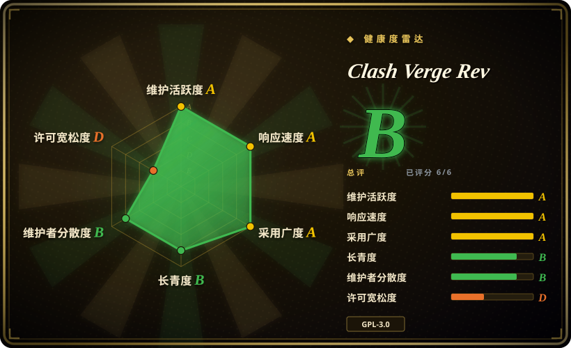
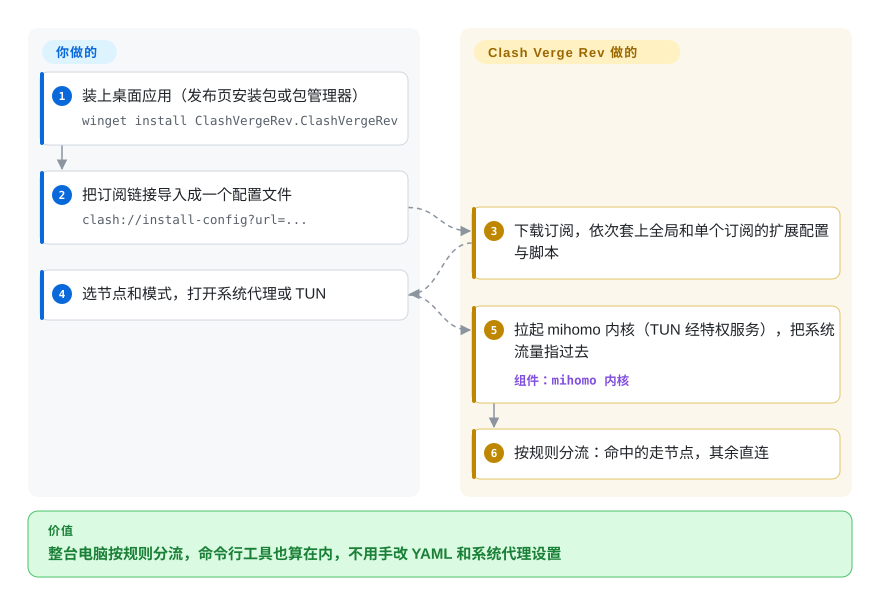

# Clash Verge Rev

浏览器靠代理订阅能打开要用的网站，终端里的 `git clone` 却照样超时；节点一挂，又得手改 YAML、手动切系统代理。Clash Verge Rev 是一个桌面应用：替你导入订阅、在后台跑 mihomo 规则引擎，一个开关就让整台电脑按规则走代理。

## 何时使用

你是在 Windows、macOS 或 Linux 上写代码的开发者，手里有一份 Clash 格式的代理订阅（买的或自建的），想在工作机上分流：国内网站和公司 VPN 直连，GitHub、包仓库、模型 API 走节点。浏览器认系统代理设置，可终端里的 `npm install`、`docker pull` 不认，一跑就卡住。很多教程还在提的 Clash for Windows 已在 2023 年停更，GitHub 仓库现在直接 404。你装上 Clash Verge Rev，粘贴订阅链接，选个节点，打开 TUN 模式——一张虚拟网卡，把每个程序（包括终端工具）的流量都接过来——之后每条连接走哪儿由规则说了算。

和其他 mihomo 图形客户端比，选它的理由是：它是这一族里用的人最多的桌面客户端（截至 2026-10，发布页安装包累计下载约 4600 万次），而且配置扩展分层：一份全局 YAML 覆写，加上每个订阅各自的覆写和 JavaScript 脚本，每次订阅刷新都会重新套上，你自己加的规则不会被服务商的更新冲掉。同一份订阅还要在安卓手机上用，就选 [FlClash](https://github.com/chen08209/FlClash)；要分流的是一台给整个局域网当网关的 Linux 机器而不是一台桌面电脑，就选 [dae](../../networking/dae.zh.md)。

## 怎么用起来

Clash Verge Rev 是套在独立引擎外面的一层图形界面。引擎是 mihomo（前身 Clash.Meta），一个 Go 写的程序：读一份 YAML 配置，逐条连接决定直连还是转给某个代理节点。**脏活由应用来做**：下载订阅；按固定顺序改写配置（先写应用设置，再套全局扩展配置和脚本，再套该订阅自己的扩展配置和脚本，最后把应用接管的字段写回去，免得扩展改坏端口或 TUN）；写出最终配置，启动自带内核，顺手改好系统代理设置。**你只提供订阅、选模式**：系统代理只管那些认系统设置的程序；TUN 管所有程序，但创建虚拟网卡要管理员权限。为此应用会装一个后台服务 `clash-verge-service`，它在你退出界面后仍常驻，用提升后的权限拉起内核；不装服务时内核以普通子进程运行（“Sidecar”模式），除非以管理员身份启动应用，否则用不了 TUN。

<!-- flow-steps:begin (generated from flows/clash-verge-rev.json by tools/flow_card.py — do not edit) -->

流程文字版

1. **你**：装上桌面应用（发布页安装包或包管理器） — `winget install ClashVergeRev.ClashVergeRev`
2. **你**：把订阅链接导入成一个配置文件 — `clash://install-config?url=...`
3. **Clash Verge Rev**：下载订阅，依次套上全局和单个订阅的扩展配置与脚本
4. **你**：选节点和模式，打开系统代理或 TUN
5. **Clash Verge Rev**：拉起 mihomo 内核（TUN 经特权服务），把系统流量指过去 — 组件：`mihomo 内核`
6. **Clash Verge Rev**：按规则分流：命中的走节点，其余直连

**价值**：整台电脑按规则分流，命令行工具也算在内，不用手改 YAML 和系统代理设置

<!-- flow-steps:end -->

## 何时不用

- **要在手机上用**——它只有桌面版（Windows、Linux、macOS 11+）。安卓用 [FlClash](https://github.com/chen08209/FlClash)（未收录），同样跑 mihomo 引擎、吃 Clash 订阅；iOS 上的客户端都是 App Store 里的闭源应用。
- **机器是给整个局域网当路由或网关的 Linux**——桌面客户端加 TUN 网卡，会让包括直连在内的每条连接都经过一个用户态进程中转。改用 [dae](../../networking/dae.zh.md)，它在内核里用 eBPF 分流；或者用 OpenWrt 上基于 mihomo/sing-box 的插件。
- **主机没有图形界面**——服务器或容器里没有界面可显示，直接把 [mihomo](https://github.com/MetaCubeX/mihomo)（未收录）配上你自己的 YAML 跑成服务，不要装一个 Tauri 桌面应用。
- **装不了特权服务**——TUN 要么靠后台服务（以管理员/root 身份常驻），要么整个应用提权运行；按项目 FAQ 的说法，360 这类 Windows 杀毒软件会拦截服务安装。在受管控的办公电脑上，就停在 Sidecar 模式只开系统代理，给终端工具设 `HTTPS_PROXY`，或者用 IT 部门提供的代理。
- **服务商给的是 Xray/V2Ray 分享链接而不是 Clash YAML**——改用 [v2rayN](https://github.com/2dust/v2rayN)（未收录），它驱动 Xray 和 sing-box 内核，围绕那种链接格式设计。
- **想发布一个改过、不开源的客户端**——应用本身是 GPL-3.0，mihomo 也是（看它 `Meta` 源码分支上的 LICENSE）。本页核对过的同族图形客户端也全是 GPL-3.0，没有宽松许可的直接替代品；要么公开你的分叉源码，要么原样分发上游构建。

## 横向对比

| 替代品 | 是否收录 | 我们的评价 | 取舍 |
| --- | --- | --- | --- |
| [FlClash](https://github.com/chen08209/FlClash) | 未收录 | 同一份 Clash 订阅既要在桌面又要在安卓上用，选 FlClash；只在桌面用、还要靠单订阅扩展脚本和常驻 TUN 服务，选 Clash Verge Rev。 | 一套 Flutter 代码覆盖手机和桌面，明确承诺无广告；文档里的配置扩展层次比 Clash Verge Rev 少。 |
| [Clash Nyanpasu](https://github.com/libnyanpasu/clash-nyanpasu) | 未收录 | 想换一个界面风格不同、同样基于 Tauri 和 mihomo 的桌面客户端，Nyanpasu 可以平替；默认仍选 Clash Verge Rev，因为它的用户群和文档大好几倍。 | 技术栈和 GPL-3.0 许可都一样；星标约 1.3 万对 15 万，边角问题能搜到的教程和 FAQ 少得多。 |
| [v2rayN](https://github.com/2dust/v2rayN) | 未收录 | 服务商给的是 Xray/VLESS 分享链接、你想用 Xray 或 sing-box 当内核，选 v2rayN；订阅是 Clash YAML、离不开 Clash 规则集，选 Clash Verge Rev。 | 多内核桌面客户端（Windows、Linux、macOS），为 V2Ray 链接生态打磨；配置模型不同，Clash 规则集和覆写搬不过去。 |
| [mihomo](https://github.com/MetaCubeX/mihomo) | 未收录 | 无界面主机，或者你习惯把 YAML 放进 git 管理，直接跑 mihomo；只有需要有人点界面导入订阅、切节点时才加上 Clash Verge Rev。 | 没有界面、没有服务安装器、没什么可点；配置、服务和系统代理设置全由你自己管。 |
| [dae](../../networking/dae.zh.md) | 已收录 | 给整个局域网做代理的 Linux 网关，选 dae；一台 Windows/macOS/Linux 桌面电脑，选 Clash Verge Rev。 | 内核 eBPF 转发让直连流量不占 CPU；只支持 Linux 且内核 5.17 以上，只能写配置文件，没有桌面界面。 |

## 技术栈

- **Rust**——Tauri 2 后端，系统代理与服务集成（截至 2026-10，GitHub 按字节统计 Rust 占比最大，TypeScript 紧随其后）。
- **TypeScript + React（Vite）**——前端界面。
- **mihomo（Clash.Meta）**——自带的 Go 代理内核，可切换到 `Alpha` 版本。
- **NSIS**——Windows 安装包；Linux 和 macOS 另有 `.deb`/`.rpm` 和 `.dmg`。

## 依赖

- Windows（x64/x86）、Linux（x64/arm64）或 macOS 11+（Intel/Apple Silicon）。
- 一份代理订阅或你自己的 Clash 格式配置——应用本身不带节点。
- 用 TUN 时：需要一次管理员权限来安装 `clash-verge-service`，并按项目文档在防火墙里放行 `verge-mihomo` 内核。
- 可选：一个 WebDAV 服务，用于配置备份与同步。

## 运维难度

**低**。桌面安装包自带更新器，不用跑服务器。日常要做的是：选发布通道（稳定版还是滚动更新的 AutoBuild）、维持订阅链接有效、偶尔在更新或权限出问题后重装服务——Windows FAQ 写明，如果普通用户能改动内核文件，服务会拒绝启动，应用随即退回没有 TUN 的 Sidecar 模式。写规则和 DNS 覆写需要懂一点 Clash 配置；注意从 v2.5.5 起，扩展配置里写出的 `dns` 段会整体替换订阅原有的 `dns` 段，不再逐条合并。

## 健康度与可持续性

- **维护活跃度——非常活跃**。维护活跃度 Grade A：最近 13 周中 13 周有提交；2026-09-22 到 2026-10-02 之间连发 v2.5.5、v2.5.6、v2.5.7。未归档。
- **治理——社区组织，集中度中等**。治理集中度 Grade B：过去 12 个月 52 位活跃维护者，前三贡献者占比 82.9%。仓库归 `clash-verge-rev` 组织所有；历史提交第一的 `zzzgydi` 是已归档的原版 Clash Verge 的作者，本分叉继承了那段历史，当前开发由几位社区维护者主导。
- **年龄与 Lindy——年轻，但已是默认选择**。长青度 Grade B：仓库创建于 2023-11（已 1052 天），紧跟在原版 Clash Verge 归档之后。前任说没就没，提醒你这个生态里的图形客户端可能很快消失。
- **采用度——非常高**。采用广度 Grade A，依据是 Homebrew 安装量和约 4600 万次发布页下载；GitHub 星标约 15 万（2026-10）。
- **风险信号**。许可证风险 Grade D：GPL-3.0（强 copyleft），没有改许可证的历史。README 和文档的快速上手里挂着付费代理服务商（“机场”）的推广链接，这是项目在 GitHub Sponsors 之外公开的资金来源。代理工具在部分司法辖区处于灰色地带，可能影响分发渠道。

## 存疑（未验证）

- [未验证] 发布页下载量和星标数是 2026-10-08 GitHub 上的数字，含自动化和重复下载，只能说明量级。
- [未验证] Clash for Windows 的 GitHub 仓库返回 404 是 2026-10-08 核对的；它下线的具体日期和原因这里没有重新核实。
- [推断] mihomo 的许可证是从它 `Meta` 分支上的 LICENSE 读出来的；仓库默认的 `main` 分支目前放着一个无关的 MIT 许可 Python 包，所以读 GitHub 元数据的工具会把 mihomo 误报成 MIT/Python。
- [推断] “没有宽松许可的直接替代品”只覆盖本页核对过的图形客户端（Clash Verge Rev、FlClash、Clash Nyanpasu、v2rayN，均为 GPL-3.0），不是对所有代理客户端的普查。
- [未验证] 服务模式和 TUN 对杀毒软件、防火墙的要求来自项目自己的 FAQ，不同系统版本可能不同。
- [未验证] 代理工具的合法性因司法辖区而异，本页不做评估。
