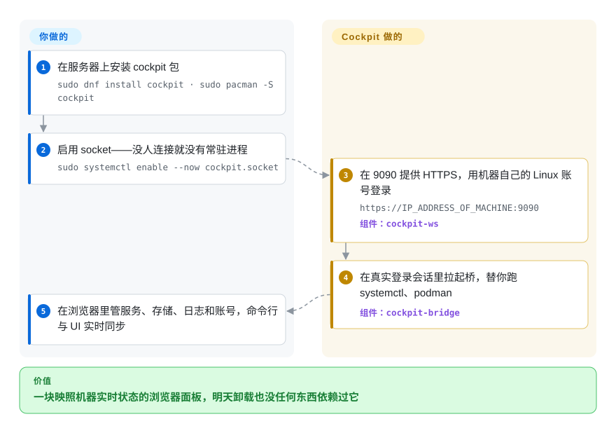

# Cockpit

面向 Linux 服务器的 Web 图形化管理界面——浏览器登录即可管理服务、存储、网络、容器、账号和日志，背后是一个真实的 `systemd` 会话，既没有 agent 也没有需要照看的常驻守护进程。

## 何时使用

你是系统管理员（或者刚接手一台 Ubuntu/Fedora/RHEL 机器的开发者），需要做点真正的运维——重启一个卡住的服务、看看磁盘为什么满了、加个用户、崩溃后翻一下 journal、挂一块新磁盘——但你不想背一堆 CLI 咒语，也不想为此请来一整套重型配置管理栈。你装一个包，打开 `https://server:9090`，用机器自己的 Linux 账号登录。Cockpit 把你放进一个实时会话里：它替你去调 `systemd`、`NetworkManager`、`udisks`、`podman` 和 journal，所以你看到的是操作系统的真实状态，而不是一份缓存的模型。在 UI 里改一下，机器上就真的改了；在命令行改一下，UI 也会跟着反映——没有第二份数据库会和真实状态漂移。

当你手上只有几台服务器、想要一个低仪式感的统一视图时，它特别合适；给那些懂 Linux 概念、但还不太会熟练敲 shell 的人做上手工具时也很合适。你可以从一个 Cockpit 通过 SSH 把其它机器加进来、在它们之间切换；而且因为它只是套在标准系统 API 之上的浏览器前端，你明天想卸载就卸载，什么都不会丢——你的服务器从来没有被改造成依赖它。

## 怎么用起来

Cockpit 分成两半。`cockpit-ws` 是一个小型 C 语言 Web 服务器，监听 TCP 9090、终结 HTTPS（在你换掉之前用自签名证书），并直接用机器自己的 PAM 账号做认证——不存在独立的 Cockpit 账户。你登录时，它在*你的用户的一个真实 Linux 登录会话*里拉起 `cockpit-bridge`，浏览器页面通过 WebSocket 协议和这个桥对话；桥再替你去说 D-Bus、跑那些寻常的系统工具（`systemctl`、journal、NetworkManager、udisks2、`podman`）。这就是为什么没有数据库、没有缓存模型、没有要照看的守护进程——UI 显示的是操作系统的实时状态，你在终端里做的改动会立刻反映到 UI；整套东西是 socket 激活的，没人连接时它什么都不消耗（如今桥是 `cockpit` 包里的 Python 实现，只有 ws/tls 核心还是 C）。仍然归你管的：把它暴露在哪里（防火墙/VPN、真实 TLS 证书、比密码更强的认证），以及所有 Cockpit 从来不想取代的 CLI 工作流。可选页面（podman、存储、网络、虚拟机）各连各的后端——不装对应的 `cockpit-<页面>` 包，那个标签页就干脆不存在。

<!-- flow-steps:begin (generated from flows/cockpit.json by tools/flow_card.py — do not edit) -->

流程文字版

1. **你**：在服务器上安装 cockpit 包 — `sudo dnf install cockpit · sudo pacman -S cockpit`
2. **你**：启用 socket——没人连接就没有常驻进程 — `sudo systemctl enable --now cockpit.socket`
3. **Cockpit**：在 9090 提供 HTTPS，用机器自己的 Linux 账号登录 — `https://IP_ADDRESS_OF_MACHINE:9090` — 组件：`cockpit-ws`
4. **Cockpit**：在真实登录会话里拉起桥，替你跑 systemctl、podman — 组件：`cockpit-bridge`
5. **你**：在浏览器里管服务、存储、日志和账号，命令行与 UI 实时同步

**价值**：一块映照机器实时状态的浏览器面板，明天卸载也没任何东西依赖过它

<!-- flow-steps:end -->

## 何时不用

- **机群级编排。** Cockpit 是按单台主机管理、外加可选的手动 SSH 跳转；它不是机群控制器。几十上百个节点时你要的是 Ansible、Salt、Puppet 或 Kubernetes 控制面——声明式、纳入版本控制、可重复。在每台机器上点 Cockpit 既不 scale，也不留审计痕迹。
- **你需要基础设施即代码 / 可复现。** UI 操作不会被 git 记录。如果你的标准是“每次改动都是一次评审过的提交”，一个点点点的管理面板就是在跟你作对。
- **非 Linux 或非 systemd 主机。** Cockpit 面向带 `systemd` 的现代 Linux；它不是给 Windows Server、macOS 或老旧 SysV-init 机器用的。[推断] 各类 BSD 也在范围之外。
- **你想要托管型的虚拟主机 / 多租户计费控制面板。** 那是 cPanel / Plesk / Webmin 的赛道（虚拟主机、邮件、DNS、分销账号）。Cockpit 是操作系统管理，不是面向托管生意的面板。
- **把它裸奔暴露到公网。** 它是一个绑在 9090 端口、具备 root 能力的特权面；不加防火墙、只用密码认证地跑就是个隐患。把它当内网/VPN 工具对待。
- **无人值守自动化。** 它没有一等的声明式 API 用来脚本化批量改动；它的界面就是给人用的 UI。批量场景请直接用底层 CLI/API。

## 横向对比

| 替代品 | 是否收录 | 我们的评价 | 取舍 |
|---|---|---|---|
| Webmin | 未收录 | 需要更老、更广的 Perl 控制面板，覆盖多种服务和 init 系统时，选 Webmin。 | 更老、更广的 Perl 控制面板，覆盖多种服务（邮件、DNS、Apache、BIND）且支持多种 init；更重、更不“实时会话”——Cockpit 更精简、systemd 原生，反映实时 OS 状态。 |
| cPanel / Plesk | 未收录 | 需要商业虚拟主机控制面板，覆盖虚拟主机、邮件、计费和分销账号时，选 cPanel / Plesk。 | 商业虚拟主机控制面板（虚拟主机、邮件、计费、分销账号）；解决的是托管业务问题，不是裸操作系统管理。闭源且收费。 |
| Ansible / Salt / Puppet | 未收录 | 需要面向机群、带版本控制和幂等性的声明式配置管理时，选 Ansible、Salt 或 Puppet。 | 面向机群的声明式配置管理，无 agent（Ansible）或有 agent，带版本控制和幂等性；规模上来后的正确工具，但没有用于临时单机排障的实时交互 UI。 |
| Portainer | 未收录 | 任务专门是 Docker/Kubernetes 容器 Web UI 管理时，选 Portainer。 | 专注 Docker/Kubernetes 容器管理的 Web UI；Cockpit 的容器视图（Podman）只是众多标签页之一，不是产品全部。 |
| Grafana + Prometheus | 未收录 | 需要面向机群的指标/告警可观测性仪表盘时，选 Grafana + Prometheus。 | 面向机群的指标/告警可观测性仪表盘；以只读监控为主，而 Cockpit 是对单台主机的动手管理。 |
| [DevToys](../data-tools/devtoys.zh.md) | ✅ | 需要桌面端开发者离线格式、编解码和转换工具箱时，选 DevToys。 | 桌面端的开发者离线格式/编解码/转换工具箱——是不相干的问题；列在这里只因同属本分类，并非替代品。 |

## 技术栈

- **前端：** JavaScript / TypeScript 单页 UI（React、PatternFly 设计体系），由 Cockpit 自带的 Web 服务器提供。
- **Web 服务器 / 会话：** `cockpit-ws`（C）负责终结 HTTPS 并做认证；`cockpit-bridge` 跑在用户的 Linux 会话内，代表用户说 D-Bus / 执行命令——在当前 `main` 上，桥是用 Python 实现的（`src/cockpit/bridge.py`），不是 C。
- **系统集成：** 主要通过 D-Bus 与 `systemd`、`NetworkManager`、`udisks2`/`storaged`、`podman`、`firewalld`、`journal`、以及做认证的 PAM/`sssd` 交互。
- **后端粘合：** 特权 ws/tls 核心用 C；桥与通道层（以及测试）用 Python；各页面 UI 模块是 JS/TS（GitHub linguist 2026-09：Python 与 JavaScript 几乎并列第一、各约 33%，C 约 18%，TS 约 10%）。
- **打包：** 原生发行版包（`cockpit`，加上可选的 `cockpit-podman`、`cockpit-machines`、`cockpit-storaged` 等）；另有用于连接远端主机的 Flatpak "Cockpit Client"。

## 依赖

- **操作系统：** 带 `systemd` 的现代 Linux 发行版（Fedora、RHEL/CentOS Stream、Debian、Ubuntu、Arch、openSUSE 等都自带）。[推断] 不支持 Windows/macOS。
- **运行时：** `systemd`、D-Bus、用于登录的 PAM 栈；网络页需要 `NetworkManager`，存储页需要 `udisks2`，容器页需要 `podman`，VM 页（经 `cockpit-machines`）需要 `libvirt`——每个可选附加页各自拉自己的后端。
- **客户端：** 任意现代浏览器；无需安装客户端（Flatpak 客户端是可选的，用于基于 SSH 的远程连接）。
- **网络：** 默认监听 TCP 9090(HTTPS)；通过 SSH 管理额外的远程机器。
- **安装：** `apt/dnf/pacman install cockpit` 后 `systemctl enable --now cockpit.socket`——它是 socket 激活的，没人连接时不占资源。

## 运维难度

**低。** 安装就是一个包加启用一个 socket；它是 socket 激活的，没有常驻守护进程要调，跟随发行版自动更新。它几乎没有需要备份的状态——Cockpit 自身几乎不存任何东西，按需读取实时 OS 状态，所以卸载很干净。主要的运维心思在**安全暴露面**而非维护负担：它是 9090 端口上一个具备 root 能力的 Web 面，所以你必须把它放在防火墙/VPN 之后、用真实 TLS 证书替换它默认生成的自签名证书，并考虑比密码更强的认证。难度只有在你加入多个可选页面时才上升，那些页面的后端（`libvirt`、`podman`、`udisks`）各有各的脾气。

## 健康度与可持续性

- **响应速度**：Grade A——中位首次响应时间 56.0 小时，基于 44 个 qualifying issues/PRs（评分器，2026-09-28）。
- **维护（2026-09）：** **活跃且稳定**——滚动整数版本高频发布（主线 `368`，2026-09-23 发布；最后 push 2026-09-28），回移植分支同一周还在出点发布（`356.4`、`366.1`、`310.10`）。这是一个持续发版的项目，而非吃老本。[推断：各分支对应哪些发行版渠道未逐一核对；GitHub「latest」徽章因数值排序会指到 310.10，主线号是 368]
- **治理与 bus factor：** `Organization` 名下的 `cockpit-project`，实质由 **Red Hat 背书**——一家在 Linux 工具链上有长期记录、且有多人团队的厂商，因此 bus-factor 风险低（组织治理，而非单人维护）。[推断]
- **年龄与 Lindy（约 12 年，2013-11 创建）：** **老且仍活跃**——强 Lindy 判定。十多年的持续发版加上随发行版默认分发（Fedora/RHEL/Debian/Ubuntu），在本类别里几乎是最稳的耐久性押注。
- **采用/生态：** 随主流发行版默认仓库分发，并集成标准系统 API（`systemd`/D-Bus/`podman`/`libvirt`）；真实部署面广。约 15.2k star（GitHub API，2026-09-28）低估了实际覆盖，因为它主要经包而非 GitHub 分发。[推断]
- **风险标记：** 无结构性风险；现实关切是运维上的安全暴露面（9090 端口上具备 root 能力的面），而非项目可持续性。

## 存疑（未验证）

- [未验证] 主线发布为 `368`，发布于 2026-09-23（据 GitHub release 元数据）；Cockpit 用滚动的整数版本号而非 semver，所以 "368" 是构建号，不是稳定性等级。仓库 `releases/latest` API 当前把回移植分支的 `310.10` 标为 latest，README 的 semver 排序徽章也因此显示 310.10。
- [未验证] 截至 2026-09-28，star 约 15.2k——GitHub star 不可靠且对时间敏感，仅供参考。
- [未验证] 该仓库是多许可证的（核心为 LGPL-2.1-or-later，另有 GPL-3.0-or-later、BSD-3-Clause、CC-BY-SA-3.0、MIT 用于不同部分，依据 README 与 `LICENSES/` 目录；Python 桥的源文件头标注 `GPL-3.0-or-later`）；frontmatter 仅标注占主导的核心许可证——具体文件条款请查 `LICENSES/`。
- [未验证] 各语言占比（Python ≈ JavaScript 各约 33%、C 约 18%、TS 约 10%，GitHub linguist 2026-09）随时间变化。
- [推断] 可选附加页面（machines/podman/storaged）以独立包分发、各带后端依赖；具体的包拆分因发行版而异。
- [推断] Cockpit 仅面向基于 systemd 的 Linux；BSD/macOS/Windows 与 SysV-init 系统在范围之外——具体发行版请对照项目的 "running" 文档核实。
