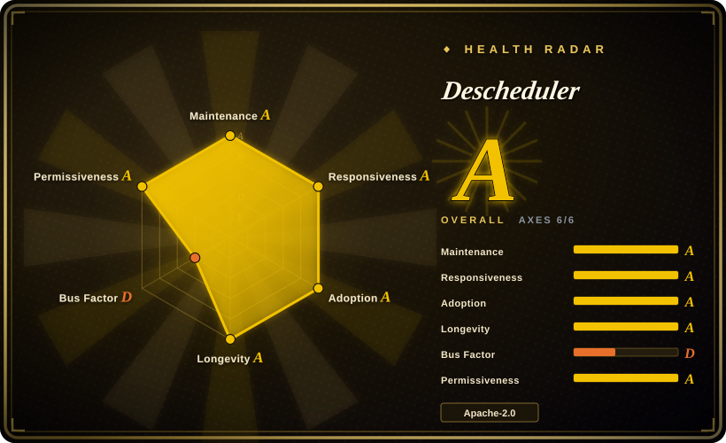
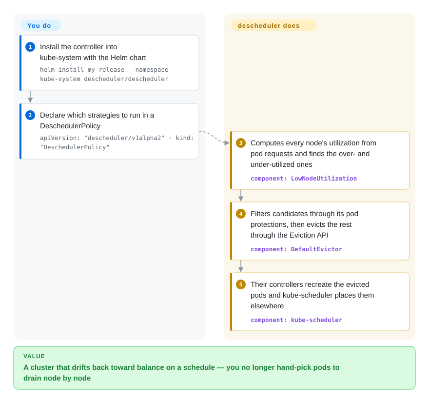

# Descheduler

The Kubernetes SIG controller that fixes placement *after* the fact: it periodically evicts pods that violate your policy — idle nodes beside hot ones, replicas bunched in one zone, pods that outlived their node affinity — so kube-scheduler can put them somewhere better.

## When to use

You operate a Kubernetes cluster and it has drifted. Nodes that were balanced at deploy time are now lopsided, because kube-scheduler only ever makes placement decisions for pods that are *being scheduled*: it never moves a running pod, so an imbalance introduced by a failed node, a rolling update, a scale-down or a batch of new pods persists indefinitely. You reach for the descheduler because it is the in-cluster, no-model answer to that drift: install it as a CronJob, declare a `DeschedulerPolicy` listing the strategies you want, and it periodically evicts the pods those strategies flag — the workloads' controllers recreate them and the scheduler re-places them, respecting PodDisruptionBudgets. The tradeoff that decides it against an offline optimizer like [Rebalancer](../../optimization-solvers/rebalancer.md) is *decision scope*: the descheduler only chooses **which pods to evict**, inside Kubernetes, using the cluster's own policy objects, whereas Rebalancer computes a whole placement from a model you write. Choose the descheduler when the policies you want are already expressible as Kubernetes objects (utilization thresholds, topology spread, affinity) and you want continuous, unattended correction; choose an optimizer when you need a plan, a scale Rebalancer is built for, or policies Kubernetes has no vocabulary for.

## How it works

The descheduler is a policy-driven eviction loop, not a solver. You install it into `kube-system` as a `Job`, `CronJob` or `Deployment` — the README notes it runs as a critical pod there so it does not evict itself — and you give it a `DeschedulerPolicy` (`apiVersion: "descheduler/v1alpha2"`) whose `profiles[].plugins` list enables strategies on two extension points: `Deschedule` plugins process pods one at a time, `Balance` plugins look at groups of pods to judge how a set was meant to be spread. `LowNodeUtilization` computes each node's utilization from pod requests and finds over- and under-utilized nodes; `DefaultEvictor` then filters the candidates through pod protections (PDBs, DaemonSets, critical pods, `nodeFit`) and evicts the survivors through the Eviction API. What you do is choose strategies and thresholds and decide who may be interrupted; what the descheduler does is the periodic sweep and the eviction call. What it explicitly does *not* do is decide the destination — the pod may return to the same node — so the outcome is "the cluster keeps being nudged", not "the cluster reaches a computed optimum".

<!-- flow-steps:begin (generated from flows/descheduler.json by tools/flow_card.py — do not edit) -->

Text version of the flow

1. **You**: Install the controller into kube-system with the Helm chart — `helm install my-release --namespace kube-system descheduler/descheduler`
2. **You**: Declare which strategies to run in a DeschedulerPolicy — `apiVersion: "descheduler/v1alpha2" · kind: "DeschedulerPolicy"`
3. **Descheduler**: Computes every node's utilization from pod requests and finds the over- and under-utilized ones — component: `LowNodeUtilization`
4. **Descheduler**: Filters candidates through its pod protections, then evicts the rest through the Eviction API — component: `DefaultEvictor`
5. **Descheduler**: Their controllers recreate the evicted pods and kube-scheduler places them elsewhere — component: `kube-scheduler`

**Value**: A cluster that drifts back toward balance on a schedule — you no longer hand-pick pods to drain node by node

<!-- flow-steps:end -->

## When NOT to use

- **You need a computed placement plan rather than incremental eviction.** Use [Rebalancer](../../optimization-solvers/rebalancer.md): it models shards/services onto hosts with capacity, balance and minimize-movement policies and returns an assignment, which is what you want when the answer must be a plan you can review, diff and apply — not a stream of evictions whose destination you do not control.
- **The imbalance is really a scheduling-policy problem.** If the kube-scheduler's own scoring configuration is what keeps choosing bad nodes, fix that — scheduler profiles and scoring plugins live in the scheduler's configuration surface, and evicting pods afterwards only fights the same inputs.
- **The cluster is short of capacity rather than badly balanced.** Descheduling moves pods between nodes; it does not add nodes. When the problem is total demand exceeding total capacity, node autoscaling (or resizing the nodes) is the lever, and eviction only adds churn.
- **The workloads cannot tolerate disruption.** Evictions are gated by PDBs and pod protections — which means on a fragile cluster the descheduler will report that it did nothing, not that it balanced anything. If a maintenance window is not available, capacity planning is the honest answer.
- **Your pods are placed by another control loop.** If a custom scheduler, a batch system, or a cloud provider's own placement controller owns assignment, evictions can thrash against it: you evict, it re-creates the same layout. Resolve ownership of placement before adding a second controller that disagrees.
- **On a managed control plane you cannot deploy into `kube-system` or grant eviction RBAC.** The provider's own rebalancing features are then the only available route, because the descheduler needs cluster-level read plus pod-eviction rights to work at all.

## Comparison

| Alternative | In index | Our verdict | Tradeoff |
|---|---|---|---|
| [Rebalancer](../../optimization-solvers/rebalancer.md) | ✅ | Choose Rebalancer when you need a computed placement over hosts/shards with policies Kubernetes has no vocabulary for and scale beyond eviction-driven nudging; choose the descheduler when the placement rules map onto Kubernetes objects and you want unattended, in-cluster correction with no model to maintain. | Rebalancer gives a reviewable plan and a policy DSL but is an external system you must feed and apply, and it is months old; the descheduler is in-cluster, boring and continuous, but only decides evictions and cannot promise a destination. |
| Managed-cloud node autoscaling and provider rebalancing features | 未收录 | Choose your cloud provider's built-in rebalancing/autoscaling when you are on a managed control plane, cannot grant cluster-wide eviction rights, or want the vendor to own the blast radius; choose the descheduler when you run the control plane and need policy you can read and version in the cluster. | Provider features are managed, integrated with node pools and need no install, at the cost of provider-specific behaviour and less control; the descheduler is a plain SIG project you install, tune and dry-run yourself. |
| Commercial Kubernetes placement / cost-optimization platforms | 未收录 | Choose a commercial platform when placement is a budget line and you want recommendations, dashboards and support; choose the descheduler when the need is continuous hygiene with an Apache-2.0 binary and no vendor relationship. | Commercial platforms add analysis, reporting and support on top of the same eviction mechanics, and charge for it; the descheduler is free, unopinionated and silent — it evicts and leaves the interpretation to you. |

## Tech stack

- **Language:** Go, shipped as a single in-cluster binary plus deployment manifests.
- **Policy model:** a `DeschedulerPolicy` (`apiVersion: "descheduler/v1alpha2"`, `kind: "DeschedulerPolicy"`) with `profiles[]` carrying `pluginConfig` (including `DefaultEvictor` with `podProtections` and `nodeFit`) and a `plugins` block that enables strategies on the `deschedule` and `balance` extension points.
- **Strategy plugins:** `RemoveDuplicates`, `LowNodeUtilization`, `HighNodeUtilization`, `RemovePodsViolatingInterPodAntiAffinity`, `RemovePodsViolatingNodeAffinity`, `RemovePodsViolatingNodeTaints`, `RemovePodsViolatingTopologySpreadConstraint`, `RemovePodsHavingTooManyRestarts`, `PodLifeTime`, `RemoveFailedPods`.
- **Deployment surfaces:** raw manifests under `kubernetes/` (job, cronjob, deployment), Kustomize overlays pinned to a release branch, and an official Helm chart (available since v0.18.0, also listed on artifact hub).
- **Observability:** metrics are opt-in — the example policy comments that metrics providers must be configured, with Prometheus supported; a `KubernetesMetrics` source exists for metrics-based utilization.
- **Compatibility:** the README carries an explicit compatibility matrix by Kubernetes release.

## Dependencies

- **A Kubernetes cluster**, with RBAC that lets the descheduler list pods and nodes and evict pods; it is conventionally deployed into `kube-system`.
- **Deployment tooling:** `kubectl` with the repo's manifests, Kustomize, or Helm 3 (chart `descheduler/descheduler`).
- **Optional metrics:** a metrics provider — the Kubernetes metrics server or Prometheus — if you want utilization judged by observed usage rather than by pod requests.
- **Optional policy objects:** PodDisruptionBudgets and the pod-protection classes you intend to rely on must already exist in the cluster for the guardrails to bite.
- **Runtime infrastructure:** nothing extra — it is one controller in the cluster; no database, no external service.

## Ops difficulty

**Low to install, medium to own — because the blast radius is cluster-wide evictions.** Installation is a Helm release or three manifests, and the project gives you a dry run (`--set cmdOptions.dry-run=true`) that reports what it *would* do, which is the right first move on any real cluster. The subtle part is that its default judgement of utilization comes from pod **requests and limits, not actual usage** — the README notes this is deliberate, to stay consistent with kube-scheduler — so a cluster that looks balanced to `kubectl top` may look unbalanced to the descheduler, and vice versa. Everything else is standard in-cluster hygiene: keep the CronJob's schedule and thresholds in version control, watch the eviction metrics, and confirm that PDBs and pod protections actually cover the workloads you cannot afford to have restarted. Escalation is inherently incremental — you tune thresholds and re-run, rather than computing a target state.

## Health & viability

- **Maintenance — A; Responsiveness — A; Longevity — A; Risk/licence — A; Adoption — `?`; Governance — D (measured 2026-09-22). Overall B (5/6).**
- **Maintenance / longevity.** Created 2017-07 and still released on a Kubernetesy cadence (v0.35.1 and v0.36.0 in 2026-03 and 2026-05, with a matching Helm chart release each time), this is the Lindy case working as intended: eight years of continuous, still-active life in a category where the surrounding platform changes twice a year.
- **Governance — D, and the number is worth reading literally.** The measured window shows 15 active maintainers in the last 12 months but a top-1 share of 0.84 and top-3 of 0.937, i.e. one person carries most of the recent work. For a `kubernetes-sigs` project that is a real signal about review throughput rather than about governance structure — the SIG owns the project and the licence is Apache-2.0, but the day-to-day change flow is concentrated. Plan for slower reviews, not for abandonment.
- **Adoption — `?` (unmeasurable, not low).** The radar could not derive a package-registry or dependent-repository signal for a Go binary distributed as manifests and a Helm chart, so the axis is unknown by construction. The qualitative evidence is strong: it is the default answer for Kubernetes placement drift, occupies `kube-system` in a great many clusters, and is maintained under the Kubernetes SIG umbrella.
- **Backing & bus factor.** Owned by `kubernetes-sigs` and versioned against Kubernetes releases, which is the strongest institutional backing available in this domain — the project cannot be relicensed or sold out from under you. The counterweight is the concentrated commit share noted above: the institution will not drop it, but the person doing the work is a single point of delay.
- **Risk flags.** None on licensing or relicensing (Apache-2.0 throughout). The operational flags are the ones to watch: its default utilization metric is pod requests rather than actual usage, its effectiveness depends on PDBs and pod protections being configured, and a beta-versioned manifest/CRD (`descheduler/v1alpha2` policy schema in the current docs) means the policy format can move between releases.

## Caveats (unverified)

- [未验证] Star (~5.5k), fork (~803) and open-issue (~65) counts are as of 2026-09-22.
- [未验证] The release history cited (v0.35.1 2026-03, v0.36.0 2026-05) comes from the four most recent releases; earlier tags and the full compatibility matrix were not enumerated.
- [推断] The governance reading ("one person carries most of the recent work") is my interpretation of the measured shares (top-1 0.84, top-3 0.937 over 15 active maintainers); the underlying commit data was not inspected directly.
- [推断] The claim that the descheduler "occupies kube-system in a great many clusters" is inferred from its documented deployment convention and SIG ownership, not from a measured install base.
- [未验证] Whether the `descheduler/v1alpha2` policy schema is stable across the major releases you might upgrade between was not checked release-by-release.
- [推断] The comparison rows against provider features and commercial platforms are reasoned from those offerings' public positioning, not benchmarked against the descheduler.
- [未验证] The behaviour of `LowNodeUtilization` when paired with a metrics provider (as opposed to pod requests) was not tested; only the README's description of both paths was read.
