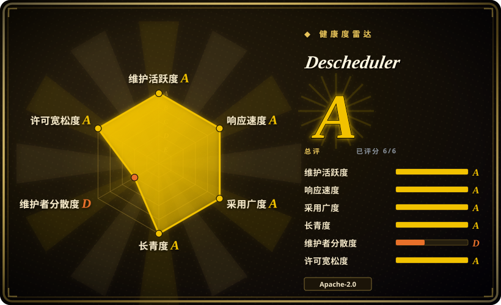
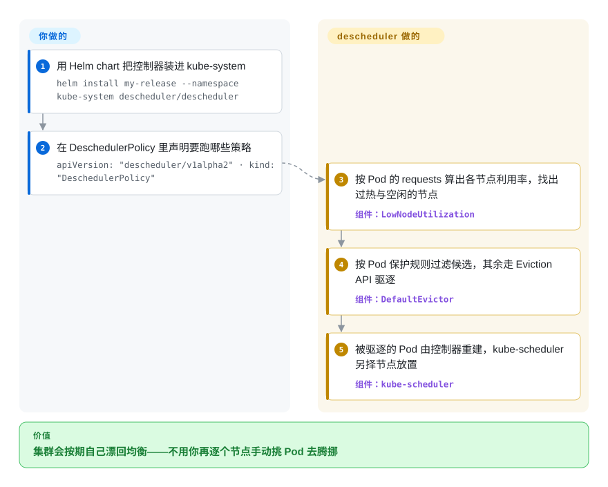

# Descheduler

Kubernetes SIG 出品、专门**事后**修 placement 的控制器：按你的策略定期驱逐违规的 Pod——热节点旁边的空闲节点、挤在同一可用区的副本、已经不符合节点亲和性的 Pod——好让 kube-scheduler 把它们放到更合适的地方。

## 何时使用

你在运营一个 Kubernetes 集群，而它已经漂了。部署时均衡的节点现在一头重一头轻，因为 kube-scheduler 只对**正在被调度**的 Pod 做placement 决策：它从不移动已运行的 Pod，所以由节点故障、滚动更新、缩容或一批新 Pod 引入的失衡会一直存在下去。你选 descheduler，是因为它对这种漂移给出的答案是集群内、不需要建模的那一种：装成 CronJob，声明一份 `DeschedulerPolicy` 列出要用的策略，它就会定期驱逐这些策略标出的 Pod——工作负载的控制器把它们重建出来，scheduler 在遵守 PodDisruptionBudget 的前提下重新安置。相对 [Rebalancer](../../optimization-solvers/rebalancer.zh.md) 这类离线优化器，决定性的取舍是**决策范围**：descheduler 只在 Kubernetes 内部决定**驱逐哪些 Pod**，用的是集群自己的策略对象；而 Rebalancer 是围绕你写的模型算出整套 placement。当你要的策略本来就能用 Kubernetes 对象表达（利用率阈值、拓扑打散、亲和性）、且想要持续无人值守的纠正时选 descheduler；当你需要一份计划、需要 Rebalancer 那种规模、或需要 Kubernetes 词汇里没有的策略时，选优化器。

## 怎么用起来

descheduler 是一个策略驱动的驱逐循环，不是求解器。你把它装进 `kube-system`，形式是 `Job`、`CronJob` 或 `Deployment`——README 指出它在那里以关键 Pod 的身份运行，这样不会驱逐自己——再给它一份 `DeschedulerPolicy`（`apiVersion: "descheduler/v1alpha2"`），其中 `profiles[].plugins` 在两个扩展点上启用策略：`Deschedule` 类逐个处理 Pod，`Balance` 类看的是成组的 Pod，用来判断一组 Pod 本该怎么散开。`LowNodeUtilization` 按 Pod 的 requests 算出各节点利用率，找出过热与空闲的节点；随后 `DefaultEvictor` 用 Pod 保护规则过滤候选（PDB、DaemonSet、关键 Pod、`nodeFit`），把剩下的通过 Eviction API 驱逐。你负责的是选策略与阈值、决定谁可以被中断；descheduler 负责的是周期性扫描与发起驱逐。它明确**不**做的是决定目的地——Pod 有可能回到同一个节点——所以结果是「集群不断被推一把」，而不是「集群到达某个算出来的最优」。

<!-- flow-steps:begin (generated from flows/descheduler.json by tools/flow_card.py — do not edit) -->

流程文字版

1. **你**：用 Helm chart 把控制器装进 kube-system — `helm install my-release --namespace kube-system descheduler/descheduler`
2. **你**：在 DeschedulerPolicy 里声明要跑哪些策略 — `apiVersion: "descheduler/v1alpha2" · kind: "DeschedulerPolicy"`
3. **Descheduler**：按 Pod 的 requests 算出各节点利用率，找出过热与空闲的节点 — 组件：`LowNodeUtilization`
4. **Descheduler**：按 Pod 保护规则过滤候选，其余走 Eviction API 驱逐 — 组件：`DefaultEvictor`
5. **Descheduler**：被驱逐的 Pod 由控制器重建，kube-scheduler 另择节点放置 — 组件：`kube-scheduler`

**价值**：集群会按期自己漂回均衡——不用你再逐个节点手动挑 Pod 去腾挪

<!-- flow-steps:end -->

## 何时不用

- **你要的是一份算出来的 placement 计划，而不是逐步驱逐。** 用 [Rebalancer](../../optimization-solvers/rebalancer.zh.md)：它把分片／服务建模到主机上，带容量、均衡与尽量少搬策略，返回一份分配结果——当答案必须是一份可评审、可 diff、可应用的计划，而不是一串你控制不了目的地的驱逐时，这才是你要的。
- **失衡其实是调度策略问题。** 如果就是 kube-scheduler 自己的打分配置一直在挑坏节点，那就去修它——调度器 profile 与打分插件属于调度器的配置面；事后驱逐 Pod 只是在跟同一批输入较劲。
- **集群是容量不够，而不是分配不均。** 反调度只在节点之间搬 Pod，它不加节点。当问题是总需求超过总容量时，杠杆是节点自动扩缩容（或把节点调大），驱逐只会增加搅动。
- **工作负载不能容忍中断。** 驱逐受 PDB 与 Pod 保护规则约束——这意味着在一个脆弱集群上，descheduler 会报告它「什么都没做」，而不是「均衡好了」。如果没有可用的维护窗口，诚实的答案是做容量规划。
- **你的 Pod 由另一个控制循环放置。** 如果自定义调度器、批处理系统或云厂商自己的 placement 控制器掌管分配，驱逐可能与它互相打——你驱逐，它把同样的布局重建回来。先解决 placement 的归属，再引入第二个意见不同的控制器。
- **在托管控制面上，你既不能部署到 `kube-system`，也拿不到驱逐 RBAC。** 那就只剩云厂商自己的再平衡功能，因为 descheduler 要工作，必须有集群级读权限加 Pod 驱逐权限。

## 横向对比

| 替代品 | 是否收录 | 我们的评价 | 取舍 |
|---|---|---|---|
| [Rebalancer](../../optimization-solvers/rebalancer.zh.md) | ✅ | 需要一份围绕主机／分片、带 Kubernetes 词汇表达不了的策略、且规模超出「靠驱逐推一把」的 placement 计算时选 Rebalancer；placement 规则能映射到 Kubernetes 对象、且想要集群内无人值守纠正、不维护模型时选 descheduler。 | Rebalancer 给可评审的计划与策略 DSL，但它是一个要喂数据、要应用结果的外部系统，且只有几个月历史；descheduler 在集群内、朴素、持续，但只决定驱逐、不承诺目的地。 |
| 云厂商的节点自动扩缩容与再平衡功能 | 未收录 | 在托管控制面上、拿不到集群级驱逐权限、或希望把爆炸半径交给厂商时，选云厂商自带的能力；你自己管控制面、且需要能在集群里读到、纳入版本管理的策略时选 descheduler。 | 厂商功能是托管的、与节点池集成、无需安装，代价是行为绑定厂商、可控性更低；descheduler 是一个你亲手装、亲手调、亲手 dry-run 的 SIG 项目。 |
| 商业化的 Kubernetes 放置／成本优化平台 | 未收录 | 当放置本身是一笔预算、且你要建议、看板与支持时选商业平台；当需求是持续卫生、只要一个 Apache-2.0 二进制、不想建立厂商关系时选 descheduler。 | 商业平台在同样的驱逐机制之上加了分析、报告与支持，并为此收费；descheduler 免费、不带观点、也不说话——它驱逐，解释留给你。 |

## 技术栈

- **语言：** Go，产物是单个集群内二进制加部署清单。
- **策略模型：** 一份 `DeschedulerPolicy`（`apiVersion: "descheduler/v1alpha2"`、`kind: "DeschedulerPolicy"`），其中 `profiles[]` 带 `pluginConfig`（含带 `podProtections` 与 `nodeFit` 的 `DefaultEvictor`）与一个 `plugins` 块，在 `deschedule` 与 `balance` 两个扩展点上启用策略。
- **策略插件：** `RemoveDuplicates`、`LowNodeUtilization`、`HighNodeUtilization`、`RemovePodsViolatingInterPodAntiAffinity`、`RemovePodsViolatingNodeAffinity`、`RemovePodsViolatingNodeTaints`、`RemovePodsViolatingTopologySpreadConstraint`、`RemovePodsHavingTooManyRestarts`、`PodLifeTime`、`RemoveFailedPods`。
- **部署面：** `kubernetes/` 下的原始清单（job、cronjob、deployment）、钉在某个 release 分支上的 Kustomize overlay，以及官方 Helm chart（自 v0.18.0 起提供，也列在 artifact hub 上）。
- **可观测性：** 指标是可选项——示例策略里注明必须自行配置 metrics provider，支持 Prometheus；另有 `KubernetesMetrics` 来源用于基于指标的利用率。
- **兼容性：** README 里带一份按 Kubernetes 版本划分的兼容性矩阵。

## 依赖

- **一个 Kubernetes 集群**，且 RBAC 允许 descheduler 列 Pod 与节点、并驱逐 Pod；惯例是部署到 `kube-system`。
- **部署工具：** `kubectl` 加仓库清单，或 Kustomize，或 Helm 3（chart `descheduler/descheduler`）。
- **可选指标：** 要按观测使用率（而不是 Pod requests）判断利用率时，需要 metrics provider——Kubernetes metrics server 或 Prometheus。
- **可选的策略对象：** 你打算依赖的 PodDisruptionBudget 与 Pod 保护类别必须已经在集群里存在，护栏才会生效。
- **运行时基础设施：** 没有额外的——它就是集群里的一个控制器；不需要数据库或外部服务。

## 运维难度

**安装低，长期持有中——因为它爆炸半径是全集群的驱逐。** 安装就是一次 Helm release 或三份清单，而且项目给你 dry run（`--set cmdOptions.dry-run=true`）来报告它**会**做什么，这是在真实集群上该做的第一步。微妙之处在于：它默认判断利用率看的是 Pod 的 **requests 与 limits，而不是实际使用率**——README 说明这是刻意的，为了与 kube-scheduler 保持一致——所以在 `kubectl top` 看来均衡的集群，在 descheduler 眼里可能不均衡，反之亦然。其余都是标准的集群内卫生：把 CronJob 的调度与阈值纳入版本管理、盯驱逐相关指标、确认 PDB 与 Pod 保护规则确实覆盖了那些你承受不起重启的工作负载。它的调优方式天然是渐进的——你调阈值再跑一遍，而不是算出一个目标状态。

## 健康度与可持续性

- **维护 A、响应 A、长寿 A、许可 A、采用 `?`、治理 D（2026-09-22 实测）。总分 B（5/6）。**
- **维护与长寿。** 创建于 2017-07，至今仍按 Kubernetes 的节奏发版（2026-03 与 2026-05 的 v0.35.1 与 v0.36.0，每次都配一个同版本的 Helm chart release），这正是 Lindy 先验该有的样子：八年连续、仍然活跃的寿命，而它所在的平台每半年就变一次。
- **治理 D，这个数字值得按字面读。** 测量窗口显示最近 12 个月有 15 位活跃维护者，但 top-1 占比 0.84、top-3 占比 0.937，也就是近期大部分工作压在一个人身上。对一个 `kubernetes-sigs` 项目来说，这是关于评审吞吐的真实信号，而不是关于治理结构——SIG 拥有项目、许可是 Apache-2.0，但日常改动流是集中的。请按「评审会更慢」来规划，而不是按「没人管了」。
- **采用 `?`（不可测，不是低分）。** 对一个以清单与 Helm chart 分发的 Go 二进制，雷达推不出包注册表或依赖仓库信号，所以这一轴在构造上就是未知。定性证据很强：它是 Kubernetes placement 漂移的默认答案，在很多集群里占着 `kube-system`，并且归在 Kubernetes SIG 名下维护。
- **背书与巴士因子。** 归 `kubernetes-sigs` 所有、并按 Kubernetes 发版对齐版本，这是这个领域里能拿到的最强机构背书——项目不可能被改许可或被卖掉。对冲的是上面那个集中的提交占比：机构不会放弃它，但做事的那个人是单一的延迟点。
- **风险信号。** 许可与 relicense 上没有信号（全程 Apache-2.0）。要盯的是运维侧的几条：默认利用率指标是 Pod requests 而不是实际使用率；效果取决于 PDB 与 Pod 保护规则是否配置好；以及当前文档里的策略 schema 是 beta 版本（`descheduler/v1alpha2`），意味着策略格式可能随版本变动。

## 存疑（未验证）

- [未验证] star（约 5.5k）、fork（约 803）与 open issue（约 65）数截至 2026-09-22。
- [未验证] 文中引用的发版记录（v0.35.1 2026-03、v0.36.0 2026-05）取自最近四个 release；更早的 tag 与完整兼容性矩阵未逐个列举。
- [推断] 治理的解读（「近期大部分工作压在一个人身上」）是我对测量占比（15 位活跃维护者，top-1 0.84、top-3 0.937）的解释；底层提交数据未直接查看。
- [推断] 「在很多集群里占着 kube-system」由文档约定的部署方式加 SIG 归属推断，不是实测的安装量。
- [未验证] 你可能跨版本升级的那些 release 之间，`descheduler/v1alpha2` 策略 schema 是否稳定，未逐版本核对。
- [推断] 与厂商功能、商业平台两行对比依据的是那些产品的公开定位，未与 descheduler 做基准对比。
- [未验证] 与 metrics provider 搭配时（而非用 Pod requests 时）`LowNodeUtilization` 的行为未经实测；此处只读了 README 对两条路径的描述。
