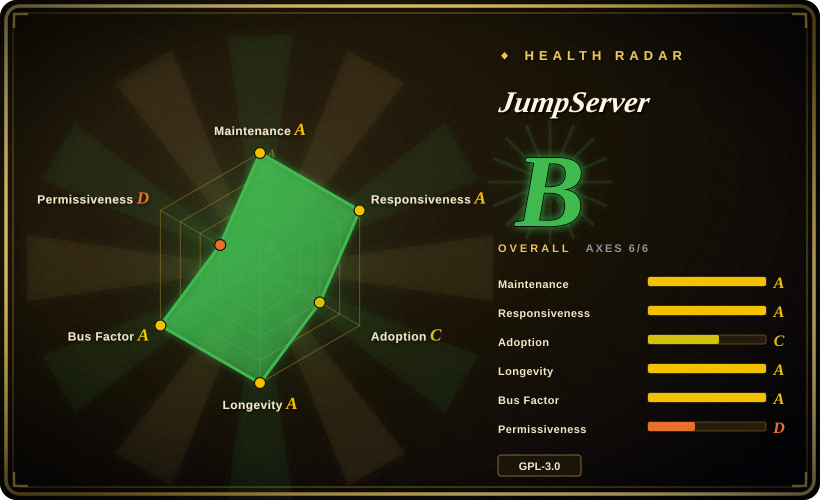
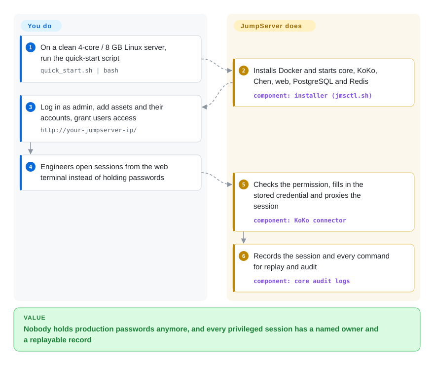

# JumpServer

Every engineer has root passwords for production in a text file, and when something breaks at 3 a.m. nobody can say who typed `rm -rf` on which box. JumpServer puts one self-hosted gate in front of your servers, databases and Kubernetes: people log into it, it logs into the target with credentials they never see, and it records every session for replay.

## When to use

You run operations for a company with a few hundred Linux and Windows hosts, a handful of MySQL/PostgreSQL instances and a Kubernetes cluster. Today access looks like this: a shared `ops` account whose password lives in a spreadsheet, SSH keys copied onto laptops that have since left the company, and an auditor asking "show me who ran `DROP TABLE orders` on 2026-08-14" — a question you can only answer by grepping shell history that the attacker could have deleted. You need a bastion host (a single gateway every privileged connection must pass through) that ties each session to a named person, holds the target credentials itself, and keeps a video-like recording of what happened.

That is JumpServer's home ground: a self-hosted, browser-first PAM (privileged access management) platform that covers SSH, RDP, VNC, databases, Kubernetes and web targets in one product, with per-user/per-asset authorization, command filtering and session replay out of the box. You pick it over **Teleport** when you want a full web console with asset trees, account vaulting and a Chinese/English admin UI rather than a certificate-based CLI-first access plane (and when Teleport's Community Edition licence terms — free only below 100 employees and US$10M revenue — do not fit you); over **Apache Guacamole** when you need the audit, authorization and credential-management layer that Guacamole leaves to you; and over **CyberArk**-class commercial PAM when the budget is zero and the fleet is under the Community Edition's 5,000-asset cap.

## How it works

JumpServer is a set of cooperating containers rather than one binary. The **core** (this repo — a Django REST API plus Celery workers) is the brain: it stores users, assets, accounts (the target-side credentials), permissions and audit logs in PostgreSQL (or MySQL) and Redis. The **connectors** are the doors: KoKo (Go) speaks SSH, SFTP, Telnet, Kubernetes and database protocols and, since v5, also carries the graphical RDP/VNC path through Apache Guacamole's `guacd`; Chen (Java) gives a web SQL console; Lina (Vue) is the admin UI and Luna (TypeScript) is the web terminal and native client. When a user opens a session, the connector asks the core "may this person reach this asset with this account?", pulls the stored secret, connects on the user's behalf — like a hotel front desk that opens the room for you without ever handing over the master key — and streams everything it relays into a recording and a command log. You do the policy work: import assets, register the accounts JumpServer should use on them, and write the authorization rules; JumpServer does the connecting, the credential injection and the recording. The installer (`jmsctl.sh`, a separate repo) wires all of it together with Docker Compose.

<!-- flow-steps:begin (generated from flows/jumpserver.json by tools/flow_card.py — do not edit) -->

Text version of the flow

1. **You**: On a clean 4-core / 8 GB Linux server, run the quick-start script — `quick_start.sh | bash`
2. **JumpServer**: Installs Docker and starts core, KoKo, Chen, web, PostgreSQL and Redis — component: `installer (jmsctl.sh)`
3. **You**: Log in as admin, add assets and their accounts, grant users access — `http://your-jumpserver-ip/`
4. **You**: Engineers open sessions from the web terminal instead of holding passwords
5. **JumpServer**: Checks the permission, fills in the stored credential and proxies the session — component: `KoKo connector`
6. **JumpServer**: Records the session and every command for replay and audit — component: `core audit logs`

**Value**: Nobody holds production passwords anymore, and every privileged session has a named owner and a replayable record

<!-- flow-steps:end -->

## When NOT to use

- **You manage more than 5,000 assets and will not buy a licence.** The Community Edition refuses to create the 5,000th asset (`The number of assets exceeds the limit of 5000`, enforced in `apps/assets/api/asset/asset.py`). Past that point, pay for Enterprise or choose **Teleport** / **Warpgate**, which have no asset cap in their open-source builds.
- **You need HA, SSO, password rotation or approval workflows for free.** The vendor's own pricing page lists active-standby/cluster HA, OIDC/SAML2/OAuth2 SSO, custom RBAC roles, JIT access with ticket approval, multi-tenancy, password rotation, and Oracle/SQL Server access as Enterprise-only. If any of those is a hard requirement and there is no budget, look at **Teleport** (certificate-based access with SSO in the open-source build) or keep a separate secret store such as [OpenBao](../../secrets-management/openbao.md) for rotation.
- **You want a lightweight transparent SSH/DB proxy, not a platform.** The quick start asks for a dedicated 4-core / 8 GB Linux server, and the default stack is six application containers plus PostgreSQL and Redis. If all you need is "record SSH and Postgres sessions with OIDC login", **Warpgate** is a single Rust binary with no external dependencies.
- **You only need clientless remote desktop in a browser.** If there is no audit or credential-custody requirement, **Apache Guacamole** alone (Apache-2.0) is smaller and is the same `guacd` engine JumpServer uses underneath.
- **Your threat model cannot tolerate a large, frequently-patched attack surface on the crown-jewel gateway.** A bastion holds every production credential, and JumpServer's own GitHub advisories list 28 entries between 2023-03 and 2026-09, several critical (unauthenticated session-replay download CVE-2023-42442, Ansible playbook RCE CVE-2024-29201/29202/40629, connection-token leak CVE-2025-62712). If you cannot commit to patching within days, a smaller codebase (Warpgate) or a managed commercial PAM is the safer bet.
- **You need a permissive licence to embed or resell it.** The code is GPL-3.0 and `CONTRIBUTING.md` states that contributors agree the producer "can adjust the open-source agreement to be more strict or relaxed" — a relicense option retained by the vendor. For an embeddable component, pick Apache-2.0 **Warpgate** or **Guacamole**.

## Comparison

| Alternative | In index | Our verdict | Tradeoff |
|---|---|---|---|
| Teleport (`gravitational/teleport`) | not indexed | Pick Teleport when engineers live in the CLI and you want short-lived certificates plus SSO in the open-source build; pick JumpServer when ops staff want a web console with asset trees, stored target passwords and graphical RDP recording. | Teleport gains identity-aware, certificate-based access and no asset cap, but source is AGPL-3.0 and the prebuilt Community binaries are only free below 100 employees / US$10M revenue; not added in this tab-intake batch. |
| Apache Guacamole (`apache/guacamole-server`) | not indexed | Pick Guacamole when you only need browser-based RDP/VNC/SSH and will build authorization and audit yourself; pick JumpServer when the audit trail and credential custody are the point. | Guacamole is Apache-2.0, ASF-governed and much smaller, but it has no asset/account model, command filtering or approval layer; not added in this tab-intake batch. |
| Warpgate (`warp-tech/warpgate`) | not indexed | Pick Warpgate for a transparent SSH/HTTPS/MySQL/PostgreSQL/Kubernetes bastion that ships as one Rust binary with OIDC and session recording; pick JumpServer when you need Windows RemoteApp, account discovery and a large admin UI. | Warpgate gains near-zero ops and memory safety, but has a far smaller feature surface and a smaller contributor base; not added in this tab-intake batch. |
| Next Terminal (`next-terminal/next-terminal`) | not indexed | Treat Next Terminal as a lightweight audit gateway only if you accept a closed backend; its README says the backend has not been open source since v2.0.0, so JumpServer is the fully open option. | Simpler deployment and a friendlier UI, but you cannot audit or fork the server side of a security gateway; not added in this tab-intake batch. |
| CyberArk Privileged Access Manager | not a repo | Pick CyberArk when a regulated enterprise needs vendor-backed PAM with mature password rotation and certified integrations; pick JumpServer Community when the budget is zero and the fleet is under 5,000 assets. | Closed commercial product with licence and implementation costs; JumpServer's own pricing FAQ quotes CyberArk fees starting around US$30,000/year — a vendor claim. |

## Tech stack

- **Core:** Python ≥ 3.14 (`pyproject.toml`), Django 5.2, Django REST Framework, Channels (WebSocket), Celery + django-celery-beat for scheduled jobs, Gunicorn/Uvicorn.
- **Automation:** Ansible 9 / ansible-runner for account discovery, push and batch operations (the source of several historical RCE advisories).
- **Auth integrations in code:** LDAP (`django-auth-ldap`, `ldap3`), RADIUS, CAS, SAML2 (`python3-saml`), OIDC, FIDO2/passkeys, TOTP; which of these are usable without a licence is decided by edition, not by what is compiled in.
- **Connectors (separate repos, all GPL-3.0):** KoKo (Go — SSH/SFTP/Telnet/K8s/DB, plus RDP/VNC via `guacd` since the Lion connector was folded in), Chen (Java — web database client), Lina (Vue admin UI), Luna (TypeScript web terminal / native client), Kael (Go — AI assistant).
- **Enterprise-only components (private repos):** Razor (native RDP proxy), Magnus (native DB-client proxy), Nec (VNC proxy), Panda (Linux app connector), video-worker, JDMC.
- **Packaging:** Docker images (`python:3.14-slim-trixie` base) orchestrated by the `jumpserver/installer` Compose files.

## Dependencies

- **Host:** a dedicated 64-bit Linux server, at least 4 CPU cores and 8 GB RAM (README quick start); installer README asks for kernel > 4.0 and x86_64.
- **Datastores:** PostgreSQL by default (MySQL/MariaDB supported by the installer), Redis; optional Elasticsearch for command storage, MinIO/S3 for recordings, Loki for logs.
- **Optional secret backend:** OpenBao (Vault-compatible) for account secrets and an SSH CA, disabled by default in `config-example.txt`.
- **Network:** HTTP/HTTPS for the web UI, TCP 2222 for SSH into KoKo, plus outbound reachability from the connectors to every managed asset.
- **Outbound call-home:** the installer pings `community.fit2cloud.com/installation-analytics` with product/type/version on install/upgrade unless `INSTALLATION_TELEMETRY_ENABLED=false`.

## Ops difficulty

**Medium-high.** Installation is genuinely one command, but you are then operating a security-critical, stateful cluster: eight-plus containers, a database whose loss means losing every stored credential and audit record, recordings that grow with usage, and TLS termination you should replace. The real burden is **patch discipline** — advisories arrive several times a year and some are critical, so upgrades (`jmsctl.sh upgrade`, database migrations included) must be routine rather than annual. Enterprise-grade concerns — HA, external storage for recordings, LDAP failover — are either Enterprise features or DIY Compose work. Defaults are China-centric (`TZ=Asia/Shanghai` in the example config; many issues and docs are in Chinese), which is a small but real friction for non-Chinese teams.

## Health & viability

- **Maintenance (2026-09):** very active — v5.0.0 shipped 2026-09-17, and two LTS lines are patched in parallel (v4.10.19 on 2026-08-20, v3.10.23 on 2026-08-24); the `dev` branch was pushed on 2026-09-29.
- **Governance & bus factor:** vendor-owned by FIT2CLOUD (the README copyright; commercial site operated by Lingxia (Hong Kong) Software / LXware). Top contributor `ibuler` has ~5.3k commits, followed by a multi-person team — a single-vendor roadmap, not a foundation.
- **Age & Lindy (~12 years, created 2014-07):** old *and* still shipping a major version in 2026 — a strong Lindy prior for continued existence.
- **Adoption:** ~31.7k stars and ~5.8k forks (2026-09-29); the vendor claims 500,000+ deployments [未验证：厂商宣传数字，无独立来源]. The ecosystem is heavily Chinese-language (issues, docs, forums).
- **Risk flags:** open-core — HA, SSO, rotation, approvals and >5,000 assets sit behind the Enterprise licence; contributor terms reserve the right to change the licence; and a steady stream of security advisories (28 published, several critical RCE / auth-bypass) for a product whose job is to be the most trusted box in the network.

## Caveats (unverified)

- [未验证] The Community-vs-Enterprise feature split (SSO, HA, password rotation, RBAC custom roles, JIT/ticket approval, Oracle/SQL Server) is taken from jumpserver.com/pricing (retrieved 2026-09-29); only the 5,000-asset cap was confirmed in source. The SSO/rotation gating code path was not located, so which parts are hard-gated vs merely unsupported is unconfirmed.
- [未验证] "500,000+ deployments" and the CyberArk price comparison are vendor marketing on jumpserver.com; no independent source.
- [推断] KoKo now carries the RDP/VNC (Lion) path in the Community Edition — inferred from KoKo's README (`make run` starts `guacd`), its commit log ("fix(lion): …", "unify terminal and Lion sharing entry"), the jumpserver PR "fix: soft delete lion component" (2026-09-28), and the installer's v5 service list (`core kael celery koko chen web`) no longer including `lion`; not verified by running v5.
- [推断] The 4 CPU / 8 GB minimum is the README's floor; real sizing for many concurrent graphical sessions and recordings was not benchmarked.
- [未验证] Star/fork counts (~31.7k / ~5.8k, GitHub API 2026-09-29) are date-sensitive.
- [推断] The advisory count (28 on GitHub Security Advisories, 2023-03 to 2026-09) is a signal of both attack surface and active disclosure handling; it was not compared against peers' advisory rates.
- [未验证] Teleport's Community Edition licence thresholds (100 employees / US$10M revenue) are from `build.assets/LICENSE-community` in the Teleport repo at 2026-09-29 and may change.
