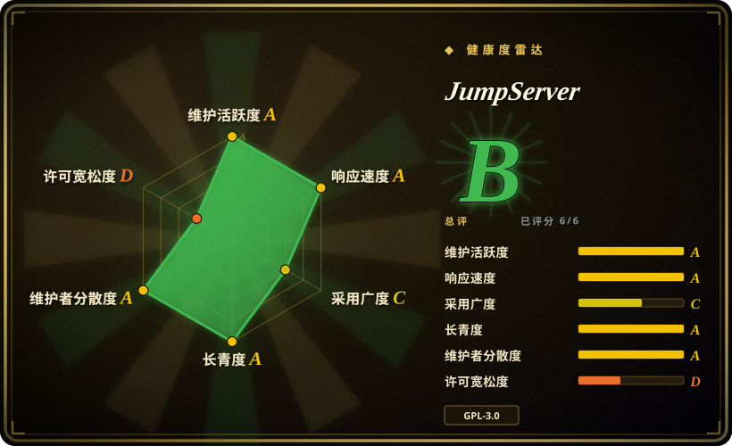
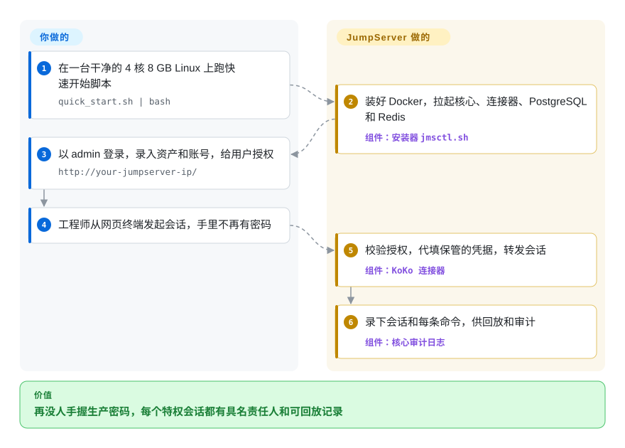

# JumpServer

生产服务器的 root 密码躺在每个运维的记事本里，凌晨三点出了事，没人说得清是谁在哪台机器上敲了 `rm -rf`。JumpServer 在服务器、数据库和 Kubernetes 前面立一道自建的门：人先登录它，它再用人看不到的凭据替人登录目标，并把每次会话录下来供回放。

## 何时使用

你在一家公司管运维，手上几百台 Linux 和 Windows 主机、几套 MySQL/PostgreSQL、一个 Kubernetes 集群。现在的访问方式是：一个共用的 `ops` 账号，密码记在表格里；SSH 私钥拷在早已离职同事的笔记本上；审计来问“2026-08-14 是谁在库上执行了 `DROP TABLE orders`”，你只能去翻可能早被删掉的 shell 历史。你需要一台堡垒机（所有特权连接都必须经过的唯一关口）：每个会话绑定到具体的人，目标机密码由它保管，发生过什么像录像一样留档。

这正是 JumpServer 的主场：一个自建、以浏览器为主的 PAM（特权访问管理）平台，一个产品覆盖 SSH、RDP、VNC、数据库、Kubernetes 和 Web 目标，开箱就有按人按资产授权、命令过滤和会话回放。和 **Teleport** 比，你要的是带资产树、账号托管、中英文管理界面的完整 Web 控制台，而不是以证书和命令行为主的访问平面（并且 Teleport 社区版的授权条款——员工少于 100 人且年营收低于一千万美元才免费——不适合你）时选它；和 **Apache Guacamole** 比，你需要 Guacamole 留给你自己做的审计、授权和凭据管理那一层时选它；和 **CyberArk** 这类商业 PAM 比，预算为零、资产数在社区版 5000 台上限以内时选它。

## 怎么用起来

JumpServer 不是一个二进制，而是一组分工协作的容器。**核心**（本仓库，Django REST API 加 Celery 后台任务）是大脑：用户、资产、账号（目标机上的登录凭据）、授权规则和审计日志都存在 PostgreSQL（或 MySQL）和 Redis 里。**连接器**是门：KoKo（Go）负责 SSH、SFTP、Telnet、Kubernetes 和数据库协议，v5 起还通过 Apache Guacamole 的 `guacd` 承接图形化的 RDP/VNC；Chen（Java）提供网页版 SQL 控制台；Lina（Vue）是管理后台，Luna（TypeScript）是网页终端和原生客户端。用户发起会话时，连接器先问核心“这个人能不能用这个账号连这台资产”，再取出保管的密码替用户连上去——像酒店前台替你开房门，却从不把万能钥匙交给你——同时把转发的一切写进录像和命令日志。你负责定规则：导入资产、登记 JumpServer 在这些资产上该用的账号、写授权；连接、凭据代填和录像由 JumpServer 做。安装器 `jmsctl.sh`（独立仓库）用 Docker Compose 把这一切拼起来。

<!-- flow-steps:begin (generated from flows/jumpserver.json by tools/flow_card.py — do not edit) -->

流程文字版

1. **你**：在一台干净的 4 核 8 GB Linux 上跑快速开始脚本 — `quick_start.sh | bash`
2. **JumpServer**：装好 Docker，拉起核心、连接器、PostgreSQL 和 Redis — 组件：`安装器 jmsctl.sh`
3. **你**：以 admin 登录，录入资产和账号，给用户授权 — `http://your-jumpserver-ip/`
4. **你**：工程师从网页终端发起会话，手里不再有密码
5. **JumpServer**：校验授权，代填保管的凭据，转发会话 — 组件：`KoKo 连接器`
6. **JumpServer**：录下会话和每条命令，供回放和审计 — 组件：`核心审计日志`

**价值**：再没人手握生产密码，每个特权会话都有具名责任人和可回放记录

<!-- flow-steps:end -->

## 何时不用

- **资产超过 5000 台又不打算买授权。** 社区版在资产数达到 5000 时拒绝再创建（报错 `The number of assets exceeds the limit of 5000`，写死在 `apps/assets/api/asset/asset.py`）。过了这条线，要么买企业版，要么选开源构建没有资产上限的 **Teleport** 或 **Warpgate**。
- **需要免费的高可用、SSO、改密或审批流。** 厂商自己的定价页把主备/集群高可用、OIDC/SAML2/OAuth2 单点登录、自定义 RBAC 角色、带工单审批的临时授权、多租户、自动改密、Oracle/SQL Server 访问都列为企业版功能。其中任何一项是硬需求又没有预算，看 **Teleport**（开源构建里就有基于证书的访问和 SSO），或者另起一个密钥库如 [OpenBao](../../secrets-management/openbao.zh.md) 来做轮换。
- **只想要一个轻量、透明的 SSH/数据库代理，而不是一整套平台。** 快速开始要求一台独占的 4 核 8 GB Linux 服务器，默认栈是六个应用容器加 PostgreSQL 和 Redis。如果需求只是“用 OIDC 登录、录下 SSH 和 Postgres 会话”，**Warpgate** 是一个不依赖外部组件的 Rust 单二进制。
- **只需要浏览器里的无客户端远程桌面。** 没有审计和凭据托管要求时，单用 **Apache Guacamole**（Apache-2.0）更小，而且它的 `guacd` 本来就是 JumpServer 底下用的那个引擎。
- **威胁模型容不下“最核心的关口本身是个大而频繁打补丁的攻击面”。** 堡垒机手握全部生产凭据，而 JumpServer 自己在 GitHub 上发布的安全公告从 2023-03 到 2026-09 共 28 条，其中多条为严重级（未授权下载会话录像 CVE-2023-42442、Ansible playbook 远程代码执行 CVE-2024-29201/29202/40629、连接令牌泄露 CVE-2025-62712）。如果做不到几天内跟进补丁，代码量小得多的 Warpgate 或托管的商业 PAM 更稳妥。
- **需要宽松许可证来嵌入或转售。** 代码是 GPL-3.0，且 `CONTRIBUTING.md` 写明贡献者同意厂商“可以根据需要把开源协议调得更严或更松”——厂商保留了改许可证的权利。要嵌入式组件，选 Apache-2.0 的 **Warpgate** 或 **Guacamole**。

## 横向对比

| 替代品 | 是否收录 | 我们的评价 | 取舍 |
|---|---|---|---|
| Teleport（`gravitational/teleport`） | 未收录 | 工程师习惯命令行、想要开源构建里就有短期证书加 SSO 时选 Teleport；运维人员要带资产树、托管目标机密码、能录图形化 RDP 的 Web 控制台时选 JumpServer。 | Teleport 换来基于身份和证书的访问、没有资产上限，代价是源码为 AGPL-3.0、官方预编译社区版只对员工少于 100 人且营收低于一千万美元的组织免费；本批次（tab intake）未收录。 |
| Apache Guacamole（`apache/guacamole-server`） | 未收录 | 只要浏览器里的 RDP/VNC/SSH、授权和审计自己搭时选 Guacamole；审计留痕和凭据托管本身就是目的时选 JumpServer。 | Guacamole 是 Apache-2.0、由 ASF 治理、体量小得多，但没有资产/账号模型、命令过滤和审批层；本批次（tab intake）未收录。 |
| Warpgate（`warp-tech/warpgate`） | 未收录 | 要一个透明的 SSH/HTTPS/MySQL/PostgreSQL/Kubernetes 堡垒、单个 Rust 二进制自带 OIDC 和会话录像时选 Warpgate；需要 Windows RemoteApp、账号发现和大而全的管理后台时选 JumpServer。 | Warpgate 换来几乎为零的运维和内存安全，代价是功能面窄得多、贡献者少得多；本批次（tab intake）未收录。 |
| Next Terminal（`next-terminal/next-terminal`） | 未收录 | 只有在能接受后端闭源时才把 Next Terminal 当轻量审计网关用——它的 README 写明自 v2.0.0 起后端不再开源，所以要完全开源的方案选 JumpServer。 | 部署更简单、界面更友好，但一个安全网关的服务端你既无法审计也无法 fork；本批次（tab intake）未收录。 |
| CyberArk Privileged Access Manager | 非仓库 | 受监管的大企业需要厂商兜底、成熟自动改密和认证过的集成时选 CyberArk；预算为零、资产在 5000 台以内时选 JumpServer 社区版。 | 闭源商业产品，有授权费和实施费；JumpServer 自己的定价 FAQ 称 CyberArk 年费约三万美元起——这是竞品厂商的说法。 |

## 技术栈

- **核心：** Python ≥ 3.14（见 `pyproject.toml`）、Django 5.2、Django REST Framework、Channels（WebSocket）、Celery 加 django-celery-beat 跑定时任务、Gunicorn/Uvicorn。
- **自动化：** Ansible 9 / ansible-runner，用于账号发现、推送和批量作业（也是历史上几条远程代码执行公告的来源）。
- **代码里的认证集成：** LDAP（`django-auth-ldap`、`ldap3`）、RADIUS、CAS、SAML2（`python3-saml`）、OIDC、FIDO2/通行密钥、TOTP；哪些不买授权就能用，由版本决定，而不是由编译进去了什么决定。
- **连接器（独立仓库，均为 GPL-3.0）：** KoKo（Go，SSH/SFTP/Telnet/K8s/数据库，Lion 并入后也经 `guacd` 承接 RDP/VNC）、Chen（Java，网页数据库客户端）、Lina（Vue 管理后台）、Luna（TypeScript 网页终端/原生客户端）、Kael（Go，AI 助手）。
- **仅企业版的组件（私有仓库）：** Razor（原生 RDP 代理）、Magnus（原生数据库客户端代理）、Nec（VNC 代理）、Panda（Linux 应用连接器）、video-worker、JDMC。
- **打包：** Docker 镜像（基础镜像 `python:3.14-slim-trixie`），由 `jumpserver/installer` 的 Compose 文件编排。

## 依赖

- **主机：** 一台独占的 64 位 Linux 服务器，至少 4 核 CPU、8 GB 内存（README 快速开始）；安装器 README 要求内核高于 4.0、x86_64。
- **数据存储：** 默认 PostgreSQL（安装器也支持 MySQL/MariaDB）、Redis；可选 Elasticsearch 存命令记录、MinIO/S3 存录像、Loki 存日志。
- **可选密钥后端：** OpenBao（兼容 Vault），用于存账号密码和 SSH CA，在 `config-example.txt` 里默认关闭。
- **网络：** Web 界面走 HTTP/HTTPS，SSH 接入 KoKo 走 TCP 2222，另外连接器要能访问每一台被管资产。
- **对外回传：** 安装器在安装/升级时会带着产品、类型、版本号请求 `community.fit2cloud.com/installation-analytics`，除非设置 `INSTALLATION_TELEMETRY_ENABLED=false`。

## 运维难度

**中偏高。** 安装确实是一条命令，但之后你运营的是一个安全关键、有状态的集群：八个以上容器，一个丢了就等于丢掉全部托管凭据和审计记录的数据库，随使用量增长的录像，以及应该换掉的默认 TLS。真正的负担是**打补丁的纪律**——安全公告一年来好几次，有的是严重级，所以升级（`jmsctl.sh upgrade`，含数据库迁移）必须成为日常而不是一年一次。高可用、录像外置存储、LDAP 故障切换这类企业级诉求，要么是企业版功能，要么得自己改 Compose。默认配置偏向中国环境（示例配置里 `TZ=Asia/Shanghai`，大量 issue 和文档是中文），对非中文团队是小而真实的摩擦。

## 健康度与可持续性

- **维护（2026-09）：** 非常活跃——v5.0.0 于 2026-09-17 发布，两条 LTS 线并行打补丁（v4.10.19 于 2026-08-20，v3.10.23 于 2026-08-24）；`dev` 分支 2026-09-29 仍有推送。
- **治理与巴士因子：** 由 FIT2CLOUD（飞致云，README 版权方）持有，商业站点由 Lingxia (Hong Kong) Software（LXware）运营。头号贡献者 `ibuler` 约 5.3k 次提交，其后是一个多人团队——单一厂商掌控路线图，不是基金会。
- **年龄与 Lindy（约 12 年，创建于 2014-07）：** 既老又在 2026 年发出大版本——对“会继续存在”是很强的 Lindy 先验。
- **采用度：** 约 31.7k star、约 5.8k fork（2026-09-29）；厂商自称部署量 50 万以上 [未验证：厂商宣传数字，无独立来源]。生态以中文为主（issue、文档、论坛）。
- **风险信号：** open-core——高可用、SSO、改密、审批和超过 5000 台资产都在企业版授权之后；贡献条款保留了改许可证的权利；以及对一个“全网最受信任的机器”来说，持续不断的安全公告（已发布 28 条，多条为严重级远程代码执行/认证绕过）。

## 存疑（未验证）

- [未验证] 社区版与企业版的功能划分（SSO、高可用、自动改密、自定义 RBAC 角色、临时授权/工单审批、Oracle/SQL Server）取自 jumpserver.com/pricing（2026-09-29 读取）；源码里只核实了 5000 台资产上限。SSO/改密的限制代码路径没有找到，因此哪些是硬性拦截、哪些只是不提供支持，未确认。
- [未验证] “50 万以上部署”和与 CyberArk 的价格对比都是 jumpserver.com 上的厂商宣传，没有独立来源。
- [推断] 社区版的 RDP/VNC（原 Lion）通道现由 KoKo 承接——依据是 KoKo README（`make run` 会启动 `guacd`）、其提交记录（“fix(lion): …”“unify terminal and Lion sharing entry”）、jumpserver 的 PR “fix: soft delete lion component”（2026-09-28），以及安装器 v5 服务清单（`core kael celery koko chen web`）已不含 `lion`；没有实际跑 v5 验证。
- [推断] 4 核 8 GB 是 README 给的下限；大量并发图形会话加录像时的真实容量没有压测。
- [未验证] star/fork 数（约 31.7k / 5.8k，GitHub API，2026-09-29）随时间变化。
- [推断] 公告数量（GitHub Security Advisories 共 28 条，2023-03 至 2026-09）既说明攻击面大，也说明披露流程在运转；没有和同类项目的公告频率做对比。
- [未验证] Teleport 社区版的授权门槛（100 名员工 / 一千万美元营收）取自 Teleport 仓库 2026-09-29 的 `build.assets/LICENSE-community`，今后可能变化。
