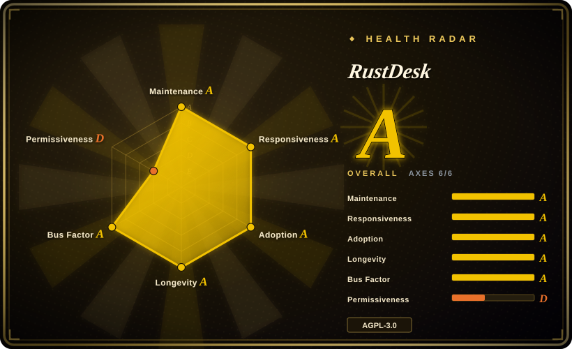
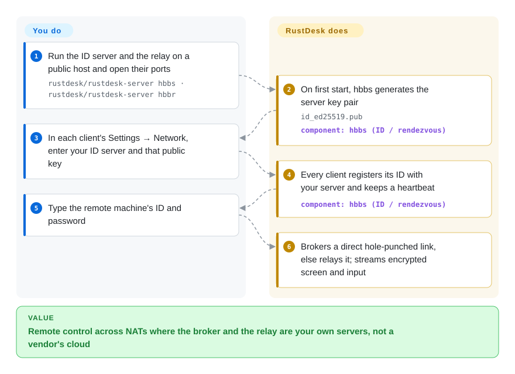

# RustDesk

You need to take over your parents' PC or an office workstation from somewhere else, and the familiar options are a commercial tool whose cloud brokers every session, or a VNC port forwarded on the router that is unencrypted by default and answers anyone who scans for it. RustDesk is a remote-desktop app whose two small servers — the one that finds machines by ID and the one that relays traffic — you can run yourself, so the connection broker is yours.

## When to use

You're the person who supports a handful of machines you don't sit in front of: family laptops, a small office's Windows desktops, a Linux box under a desk at work. Today that means walking someone through reading out a TeamViewer code, or opening port 5900 on a router and hoping the VNC password holds. You want the "type an ID, get the screen" experience of TeamViewer or AnyDesk, across NATs and on phones, but with the broker on a $5 VPS you control. You install the RustDesk client everywhere, run `hbbs` and `hbbr` in Docker on the VPS, paste your server's address and public key into each client once, and from then on every session is brokered by your box — direct peer-to-peer when the networks allow it, through your relay when they don't.

The deciding difference from the commercial tools is who runs the rendezvous and relay servers; the deciding difference from VNC/RDP is that RustDesk does NAT traversal and end-to-end encryption itself, so nothing has to be exposed on the remote side's router. If you need a web admin console, central address books, SSO or audit logs on top, that is RustDesk Server Pro, a paid closed-source product — the open-source server stops at ID and relay.

## How it works

Every RustDesk client gets a numeric ID and registers it with an ID server (`hbbs`), sending a small heartbeat over UDP so the server knows where it is. When you dial an ID, `hbbs` acts as a matchmaker: it tells the two clients each other's public addresses so they can try hole punching — both sides send packets at once so their NAT routers each think the other side's traffic is a reply and let it in. If that fails (strict corporate firewalls, symmetric NAT), traffic goes through the relay (`hbbr`) instead. Screen, input, clipboard and file transfer are encrypted end to end with libsodium keys; the server's public key (`id_ed25519.pub`, created on its first run) is what you paste into clients so they only trust your server. **RustDesk does the discovery, NAT traversal, relay fallback and encryption; you run the two daemons, open their ports and configure each client once.** Without that configuration, clients use RustDesk's public servers.

<!-- flow-steps:begin (generated from flows/rustdesk.json by tools/flow_card.py — do not edit) -->

Text version of the flow

1. **You**: Run the ID server and the relay on a public host and open their ports — `rustdesk/rustdesk-server hbbs · rustdesk/rustdesk-server hbbr`
2. **RustDesk**: On first start, hbbs generates the server key pair — `id_ed25519.pub` — component: `hbbs (ID / rendezvous)`
3. **You**: In each client's Settings → Network, enter your ID server and that public key
4. **RustDesk**: Every client registers its ID with your server and keeps a heartbeat — component: `hbbs (ID / rendezvous)`
5. **You**: Type the remote machine's ID and password
6. **RustDesk**: Brokers a direct hole-punched link, else relays it; streams encrypted screen and input

**Value**: Remote control across NATs where the broker and the relay are your own servers, not a vendor's cloud

<!-- flow-steps:end -->

## When NOT to use

- **You need central administration** — a web console, synced address books, user/group permissions, OIDC/LDAP/2FA login, connection and file-transfer audit logs, or a custom-branded preconfigured client. The open-source server is only `hbbs` + `hbbr`; these features are in RustDesk Server Pro (paid, not a repository). If you want them self-hosted and open source, use [MeshCentral](https://github.com/Ylianst/MeshCentral) (not indexed), a web-based remote-management server with agents.
- **You stream games or high-frame-rate video.** Use [Sunshine](https://github.com/LizardByte/Sunshine) with [Moonlight](https://github.com/moonlight-stream/moonlight-qt) (not indexed) instead, because they are built around hardware-encoded low-latency streaming rather than general remote support.
- **Everything is on one LAN, or behind a VPN you already run.** NAT traversal is the main thing RustDesk adds; inside a LAN or over WireGuard, use the built-in RDP on Windows or a VNC server such as [TigerVNC](https://github.com/TigerVNC/tigervnc) (not indexed), which work with standard clients everywhere.
- **The hosts are Linux desktops on Wayland.** Wayland support is still being fixed release by release (1.5.0's changelog has Wayland input fixes, and about two dozen open issues carry "Wayland" in the title as of 2026-10-08). For GNOME on Wayland, the desktop's built-in RDP server is the substitute to test first. [推断]
- **You will modify it and offer it to others as a service.** Both the client and the open-source server are AGPL-3.0, so a modified, network-offered version must publish its source. For a proprietary product, MeshCentral (Apache-2.0) is the permissive base.
- **You need a vendor contract, SLA or compliance paperwork.** The open-source edition has community support only; buy Server Pro, TeamViewer or AnyDesk instead.

## Comparison

| Alternative | In index | Our verdict | Tradeoff |
| --- | --- | --- | --- |
| TeamViewer | not a repo | When nobody on your side can run a server and you need vendor support, pick TeamViewer; pick RustDesk when owning the broker and avoiding per-seat licences matter more. | Zero infrastructure, polished management and support; closed source, paid for business use, every session brokered by the vendor's cloud. |
| AnyDesk | not a repo | For a light commercial client with a vendor behind it, AnyDesk is the like-for-like choice; RustDesk wins once you want the ID/relay servers on your own VPS. | Closed, cloud-brokered, licensed for commercial use; nothing to host, but nothing you can audit or move on-prem in the free tier. |
| [MeshCentral](https://github.com/Ylianst/MeshCentral) | not indexed | When you manage a fleet and need a web console, device groups and permissions in open source, pick MeshCentral; pick RustDesk for "type an ID and connect" support across phones and desktops. | Apache-2.0 web-based remote management with agents; heavier to run and browser-centric, with a less native client experience than RustDesk. |
| [Sunshine](https://github.com/LizardByte/Sunshine) + [Moonlight](https://github.com/moonlight-stream/moonlight-qt) | not indexed | For game or high-frame-rate streaming from a GPU machine, pick Sunshine + Moonlight; pick RustDesk for everyday remote support, file transfer and unattended access. | Hardware-encoded, very low-latency streaming; no ID/relay service, so you handle reachability (LAN, VPN or port forwarding) yourself. |
| [TigerVNC](https://github.com/TigerVNC/tigervnc) | not indexed | Inside a LAN or VPN where any VNC viewer must connect, pick TigerVNC; pick RustDesk when the machines sit behind NATs you don't control. | Standard RFB protocol and broad client support, GPL-2.0; no NAT traversal or ID service, so remote access needs a VPN or exposed port. |

## Tech stack

- **Rust** — the core client (screen capture, input, codecs, networking), on Tokio for async I/O and protobuf for messages.
- **Flutter / Dart** — the current desktop and mobile UI (via `flutter_rust_bridge`); the older Sciter UI is deprecated.
- **libsodium (`sodiumoxide`)** — connection encryption; TLS (rustls/native-tls) for WebSocket transport; a WebRTC transport was added in 1.5.0.
- **Codecs** — libvpx (VP8/VP9), AV1 (aom) and Opus audio via vcpkg, plus hardware codecs where available.
- **Server** — `rustdesk-server` (Rust, AGPL-3.0): `hbbs` and `hbbr` daemons, shipped as binaries and the `rustdesk/rustdesk-server` Docker image.

## Dependencies

- **Clients:** Windows, macOS, Linux (deb, rpm, Flatpak, AppImage), Android and iOS builds, plus a web client; no runtime dependencies to install.
- **Self-hosted server (optional):** any small Linux/Windows host or NAS with a public IP or domain, running `hbbs` and `hbbr` (Docker with host networking is the documented default). No database to provision.
- **Ports:** `21115`–`21117` TCP and `21116` UDP for the core service; `21118`/`21119` TCP only if you serve the web client. `21114` is the Pro web console.
- **Without a server:** clients fall back to RustDesk's public ID/relay servers.

## Ops difficulty

**Low** for the client, **low-to-medium** for a self-hosted server. Two containers and a firewall rule get you running, but a few details bite: `21116` must be open for both TCP and UDP; servers on a home network often need a NAT-loopback fix to be reachable from inside the same LAN; and if you open the web-client ports, `hbbs`/`hbbr` trust `X-Forwarded-For` headers on those WebSocket ports, so the docs say to put them behind a reverse proxy and firewall them off otherwise. The OSS server releases slowly (1.1.14 in 2025-01, 1.1.15 in 2026-01, 1.1.16 in 2026-07) while clients move monthly, so upgrade the server when client release notes ask for it. Rolling out to many machines is manual on OSS (copy the config string or use the `--config` command line); the custom client generator is Pro-only.

## Health & viability

- **Maintenance — very active.** Maintenance Grade A: commits in 13 of the last 13 weeks; clients 1.4.7 through 1.5.0 shipped between 2026-06-02 and 2026-09-30.
- **Responsiveness.** Responsiveness Grade A: median first response 4.4 hours across 18 qualifying issues/PRs.
- **Governance — founder-led with a company behind it.** Governance Grade A: top-1 contributor share 25.5% and top-3 56.2% across 140 active maintainers in the last 12 months. The repo sits under a personal account (`rustdesk`, the founder and top committer), and the roadmap is set by the team that sells Server Pro — an open-core model where admin features land in the paid server, not the OSS one. [推断]
- **Age & Lindy.** Longevity Grade A: created 2020-09, 2201 days old and still shipping monthly — a solid Lindy prior for a remote-desktop tool.
- **Adoption.** Adoption Grade A, from Homebrew installs and about 75 million release-asset downloads; roughly 125k GitHub stars (2026-10). Also on F-Droid, Flathub and the App Store.
- **Risk flags.** Risk/License Grade D: AGPL-3.0 for both client and server, no relicense history. The README opens with a misuse disclaimer: remote-support tools are a common lever in phone scams, so some security products and app stores treat them with suspicion.

## Caveats (unverified)

- [未验证] Star and download counts are GitHub's figures on 2026-10-08 and include automated downloads; they show scale, not active users.
- [推断] The open-core reading (admin features reserved for the paid Server Pro) is from the official docs' OSS-vs-Pro pages; pricing and the exact feature split change over time.
- [推断] Wayland maturity is inferred from changelog fixes and the open-issue count, not from testing specific compositors; test on your distribution.
- [未验证] Hole-punching success depends on the NAT types on both sides; how often sessions fall back to the relay was not measured.
- [未验证] The encryption summary (libsodium-based end-to-end encryption, server public key pinning) comes from dependency manifests and docs, not a code audit.
- [推断] The claim that remote-support tools are flagged by some security products is general knowledge about this class of software, not a measured RustDesk-specific rate.
