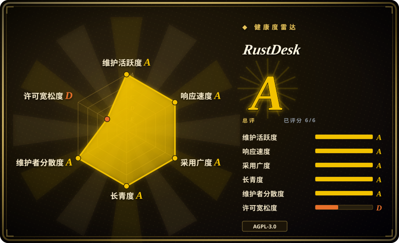
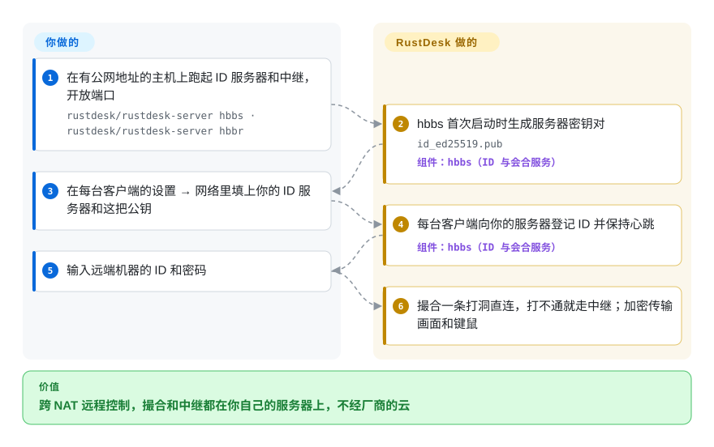

# RustDesk

你要从别处接管爸妈的电脑或办公室的一台工作站，熟悉的办法要么是商业软件——每次会话都经它的云撮合，要么是在路由器上把 VNC 端口映射出去——默认不加密，谁扫到都能来敲门。RustDesk 是一个远程桌面应用，它的两个小服务（按 ID 找机器的、转发流量的）都能自己部署，撮合连接的那一方就归你了。

## 何时使用

你负责照看几台不在你眼前的机器：家里人的笔记本、小办公室的几台 Windows 台式机、公司桌子底下的一台 Linux。眼下的做法是电话里让对方念 TeamViewer 的代码，或者在路由器上开 5900 端口、指望 VNC 密码扛得住。你想要 TeamViewer、AnyDesk 那种“输个 ID 就看到屏幕”的体验，能穿过 NAT，手机也能用，但撮合服务器放在你自己的一台 5 美元 VPS 上。你在每台机器上装 RustDesk 客户端，在 VPS 上用 Docker 跑起 `hbbs` 和 `hbbr`，把服务器地址和公钥往每台客户端里填一次；此后每次会话都由你的服务器撮合——网络允许就点对点直连，不允许就走你的中继。

和商业软件的决定性区别是：会合与中继服务器由谁来跑；和 VNC/RDP 的决定性区别是：RustDesk 自己做 NAT 穿透和端到端加密，被控端的路由器上什么都不用暴露。如果你还要网页管理后台、集中的地址簿、单点登录或审计日志，那是 RustDesk Server Pro，一个付费的闭源产品——开源服务端只管 ID 和中继。

## 怎么用起来

每个 RustDesk 客户端都有一个数字 ID，它向 ID 服务器（`hbbs`）登记这个 ID，并通过 UDP 发小心跳，让服务器知道它在哪儿。你拨一个 ID 时，`hbbs` 充当媒人：把双方的公网地址告诉彼此，让它们尝试“打洞”——两边同时朝对方发包，各自的 NAT 路由器都以为对方的流量是回包，于是放行。打不通（严格的公司防火墙、对称型 NAT）就改走中继（`hbbr`）。画面、键鼠、剪贴板和文件传输都用 libsodium 密钥做端到端加密；服务器的公钥（`id_ed25519.pub`，首次启动时生成）就是你要填进客户端的那把，客户端从此只信任你的服务器。**发现、NAT 穿透、中继兜底和加密都由 RustDesk 完成；你负责跑这两个守护进程、开放端口、把每台客户端配置一次。**不配置的话，客户端用的是 RustDesk 官方的公共服务器。

<!-- flow-steps:begin (generated from flows/rustdesk.json by tools/flow_card.py — do not edit) -->

流程文字版

1. **你**：在有公网地址的主机上跑起 ID 服务器和中继，开放端口 — `rustdesk/rustdesk-server hbbs · rustdesk/rustdesk-server hbbr`
2. **RustDesk**：hbbs 首次启动时生成服务器密钥对 — `id_ed25519.pub` — 组件：`hbbs（ID 与会合服务）`
3. **你**：在每台客户端的设置 → 网络里填上你的 ID 服务器和这把公钥
4. **RustDesk**：每台客户端向你的服务器登记 ID 并保持心跳 — 组件：`hbbs（ID 与会合服务）`
5. **你**：输入远端机器的 ID 和密码
6. **RustDesk**：撮合一条打洞直连，打不通就走中继；加密传输画面和键鼠

**价值**：跨 NAT 远程控制，撮合和中继都在你自己的服务器上，不经厂商的云

<!-- flow-steps:end -->

## 何时不用

- **需要集中管理**——网页管理后台、同步的地址簿、用户和分组权限、OIDC/LDAP/2FA 登录、连接与文件传输审计日志、预置好配置的品牌客户端。开源服务端只有 `hbbs` + `hbbr`，这些功能在 RustDesk Server Pro 里（付费，非仓库）。想要自托管又开源，改用 [MeshCentral](https://github.com/Ylianst/MeshCentral)（未收录），一个带代理程序的网页版远程管理服务器。
- **要串流游戏或高帧率视频**——改用 [Sunshine](https://github.com/LizardByte/Sunshine) 搭配 [Moonlight](https://github.com/moonlight-stream/moonlight-qt)（未收录），它们围绕硬件编码的低延迟串流设计，而不是通用远程协助。
- **所有机器都在一个局域网里，或已经在你自己的 VPN 后面**——NAT 穿透是 RustDesk 带来的主要价值；在局域网内或 WireGuard 上，用 Windows 自带的 RDP，或者 [TigerVNC](https://github.com/TigerVNC/tigervnc)（未收录）这样的 VNC 服务端，到处都有标准客户端可连。
- **被控端是跑 Wayland 的 Linux 桌面**——Wayland 支持还在一个版本一个版本地修（1.5.0 的更新日志里有 Wayland 输入修复；截至 2026-10-08，标题带“Wayland”的未关闭 issue 约二十多个）。GNOME 上跑 Wayland 的话，先试桌面自带的 RDP 服务。[推断]
- **你会修改它并作为服务提供给别人**——客户端和开源服务端都是 AGPL-3.0，改过的版本经网络提供给别人用就得公开源码。要做闭源产品，MeshCentral（Apache-2.0）是宽松许可的底子。
- **需要厂商合同、SLA 或合规文件**——开源版只有社区支持；去买 Server Pro、TeamViewer 或 AnyDesk。

## 横向对比

| 替代品 | 是否收录 | 我们的评价 | 取舍 |
| --- | --- | --- | --- |
| TeamViewer | 非仓库 | 你这边没人能维护服务器、又需要厂商支持，选 TeamViewer；更在意撮合服务器归自己、不想按席位付费，选 RustDesk。 | 零基础设施，管理和支持成熟；闭源，商用要付费，每次会话都经厂商的云撮合。 |
| AnyDesk | 非仓库 | 想要一个有厂商兜底的轻量商业客户端，AnyDesk 是同类替代；一旦你想把 ID/中继服务器放到自己的 VPS 上，RustDesk 胜出。 | 闭源、云端撮合、商用需授权；什么都不用托管，但免费版里没有任何能审计或搬到内网的东西。 |
| [MeshCentral](https://github.com/Ylianst/MeshCentral) | 未收录 | 管一批设备、需要开源的网页控制台、设备分组和权限，选 MeshCentral；要的是跨手机和桌面“输 ID 就连”的远程协助，选 RustDesk。 | Apache-2.0 的网页版远程管理，带代理程序；部署更重、以浏览器为中心，客户端体验不如 RustDesk 原生。 |
| [Sunshine](https://github.com/LizardByte/Sunshine) + [Moonlight](https://github.com/moonlight-stream/moonlight-qt) | 未收录 | 从一台有 GPU 的机器串流游戏或高帧率画面，选 Sunshine + Moonlight；日常远程协助、传文件、无人值守访问，选 RustDesk。 | 硬件编码、延迟极低；没有 ID/中继服务，连通性（局域网、VPN 或端口映射）要你自己解决。 |
| [TigerVNC](https://github.com/TigerVNC/tigervnc) | 未收录 | 在局域网或 VPN 内、需要任意 VNC 查看器都能连，选 TigerVNC；机器散在你管不了的 NAT 后面，选 RustDesk。 | 标准 RFB 协议，客户端随处可得，GPL-2.0；没有 NAT 穿透和 ID 服务，远程访问得靠 VPN 或暴露端口。 |

## 技术栈

- **Rust**——客户端核心（屏幕采集、键鼠、编解码、网络），异步 I/O 用 Tokio，消息格式用 protobuf。
- **Flutter / Dart**——当前的桌面和移动端界面（经 `flutter_rust_bridge` 调用 Rust）；旧的 Sciter 界面已弃用。
- **libsodium（`sodiumoxide`）**——连接加密；WebSocket 传输用 TLS（rustls/native-tls）；1.5.0 新增了 WebRTC 传输。
- **编解码**——经 vcpkg 引入 libvpx（VP8/VP9）、AV1（aom）和 Opus 音频，条件允许时用硬件编解码。
- **服务端**——`rustdesk-server`（Rust，AGPL-3.0）：`hbbs` 和 `hbbr` 两个守护进程，以二进制和 `rustdesk/rustdesk-server` Docker 镜像发布。

## 依赖

- **客户端**：Windows、macOS、Linux（deb、rpm、Flatpak、AppImage）、Android 和 iOS 版本，另有网页客户端；不需要额外安装运行时。
- **自托管服务端（可选）**：任意一台有公网 IP 或域名的小型 Linux/Windows 主机或 NAS，跑 `hbbs` 和 `hbbr`（文档默认用 Docker 加主机网络）。不需要准备数据库。
- **端口**：核心服务要 `21115`–`21117` TCP 和 `21116` UDP；只有提供网页客户端时才需要 `21118`/`21119` TCP。`21114` 是 Pro 的网页控制台。
- **不自建服务器时**：客户端退回使用 RustDesk 官方的公共 ID/中继服务器。

## 运维难度

客户端**低**，自托管服务端**低到中**。两个容器加一条防火墙规则就能跑起来，但有几处会咬人：`21116` 必须 TCP 和 UDP 都开；放在家庭网络里的服务器，常常要处理 NAT 回环，局域网内部才能连上它；如果开放网页客户端端口，`hbbs`/`hbbr` 会信任这两个 WebSocket 端口上的 `X-Forwarded-For` 头，所以文档要求放在反向代理后面，否则就用防火墙挡住。开源服务端发版很慢（1.1.14 在 2025-01，1.1.15 在 2026-01，1.1.16 在 2026-07），客户端却每月一版，客户端更新说明要求时记得升级服务端。开源版批量部署得手动来（复制配置字符串，或用 `--config` 命令行参数）；定制客户端生成器只有 Pro 才有。

## 健康度与可持续性

- **维护活跃度——非常活跃**。维护活跃度 Grade A：最近 13 周中 13 周有提交；2026-06-02 到 2026-09-30 之间发布了客户端 1.4.7 到 1.5.0。
- **响应速度**。响应速度 Grade A：基于 18 个 qualifying issues/PRs，中位首次响应时间 4.4 小时。
- **治理——创始人主导，背后有公司**。治理集中度 Grade A：过去 12 个月 140 位活跃维护者，第一贡献者占比 25.5%，前三贡献者占比 56.2%。仓库挂在个人账号（`rustdesk`，即创始人兼提交最多的人）下，路线图由出售 Server Pro 的团队决定——典型的 open-core 模式，管理类功能进付费服务端，不进开源版。[推断]
- **年龄与 Lindy**。长青度 Grade A：创建于 2020-09，已 2201 天，仍每月发版——对远程桌面工具来说是扎实的 Lindy 先验。
- **采用度**。采用广度 Grade A，依据是 Homebrew 安装量和约 7500 万次发布页下载；GitHub 星标约 12.5 万（2026-10）。F-Droid、Flathub 和 App Store 上也都有。
- **风险信号**。许可证风险 Grade D：客户端和服务端都是 AGPL-3.0，没有改许可证的历史。README 开头就是一段防滥用声明：远程协助工具是电话诈骗的常用抓手，部分安全软件和应用商店会对这类工具格外警惕。

## 存疑（未验证）

- [未验证] 星标和下载量是 2026-10-08 GitHub 上的数字，含自动化下载，只说明量级，不代表活跃用户数。
- [推断] open-core 的判断（管理功能留给付费的 Server Pro）来自官方文档里开源版与 Pro 版的对比页；定价和功能划分会随时间变化。
- [推断] Wayland 的成熟度是从更新日志里的修复和未关闭 issue 数推断的，没有在具体合成器上实测；请在你的发行版上自测。
- [未验证] 打洞成功率取决于双方的 NAT 类型；会话多常退回中继没有测过。
- [未验证] 加密方面的描述（基于 libsodium 的端到端加密、客户端固定信任服务器公钥）来自依赖清单和文档，不是代码审计结论。
- [推断] “部分安全软件会标记远程协助工具”是对这一类软件的普遍认识，不是针对 RustDesk 实测的比例。
