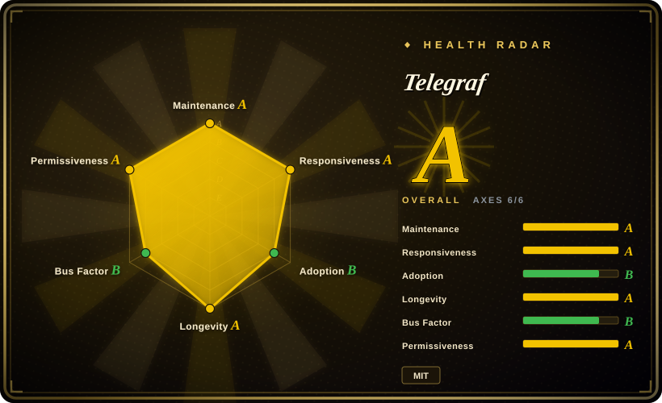
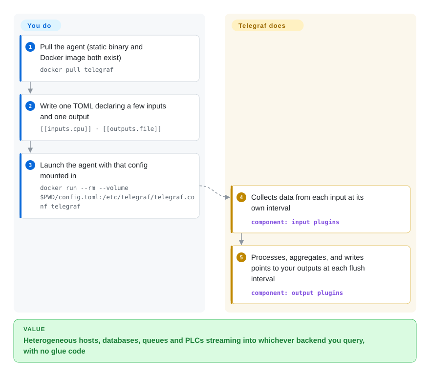

# Telegraf

A single-binary, plugin-driven agent that collects, processes, aggregates and writes metrics, logs and arbitrary data — 300+ input/output/processor/aggregator plugins wired together by one TOML file.

## When to use

You're an SRE or platform engineer standing up monitoring for a fleet of hosts, containers, and a few odd appliances — some Linux boxes, a Postgres replica, a Kafka cluster, a couple of Modbus/OPC UA PLCs on the factory floor, and Windows servers spitting out event logs. You don't want a different shipper for each source, and you don't want to write glue code to reshape every payload before it lands in your time-series store. You drop one Telegraf binary on each node, write a TOML file that lists a handful of `[[inputs.*]]` blocks and one or more `[[outputs.*]]`, and the same agent scrapes the host, tails the logs, polls the PLCs, and fans the metrics out to InfluxDB, Prometheus, Kafka, or a cloud sink — with `[[processors.*]]` in the middle to rename, filter, or enrich tags. Because it compiles to a static binary with no runtime dependencies, deployment is `scp` + a systemd unit, not a language runtime and a dependency tree.

You also reach for it when your sources are heterogeneous and you want collection config to live in version control rather than in code. Need SNMP from switches, JSON from an internal HTTP endpoint, and Docker stats on the same host? That's three `[[inputs]]` stanzas, not three agents. The plugin set spans system metrics, message queues (AMQP/Kafka/MQTT), industrial protocols (Modbus/OPC UA), SQL, cloud services, and parsers/serializers (JSON, CSV, Grok, Prometheus, XPath), so Telegraf is most valuable as the universal *collection and routing* layer in front of whatever backend you actually query.

## How it works

Telegraf is one static Go binary plus one TOML file. At startup it reads the config, instantiates only the plugins you declared, and runs three kinds of loops: each `[[inputs.*]]` either polls its source on its own `interval` (CPU stats, an SNMP walk, a SQL query) or listens for pushes (a Tail on a log file, an HTTP listener); collected points all share one common metric model (name, tags, fields, timestamp); `[[processors.*]]` reshape points in flight and `[[aggregators.*]]` combine windows of them; then `[[outputs.*]]` write the batches to your backends on each `flush interval`. The handoff is narrow and deliberate: you declare what to collect, reshape, and where to send — the agent handles scheduling, batching, buffering, and retrying between them. Parsers and serializers plug into individual plugins so the same agent can read Prometheus text and write it as JSON lines, no glue code. What stays yours: running the destination backend, and keeping the config (per plugin options, tag shapes) in sync across your fleet.

<!-- flow-steps:begin (generated from flows/telegraf.json by tools/flow_card.py — do not edit) -->

Text version of the flow

1. **You**: Pull the agent (static binary and Docker image both exist) — `docker pull telegraf`
2. **You**: Write one TOML declaring a few inputs and one output — `[[inputs.cpu]] · [[outputs.file]]`
3. **You**: Launch the agent with that config mounted in — `docker run --rm --volume $PWD/config.toml:/etc/telegraf/telegraf.conf telegraf`
4. **Telegraf**: Collects data from each input at its own interval — component: `input plugins`
5. **Telegraf**: Processes, aggregates, and writes points to your outputs at each flush interval — component: `output plugins`

**Value**: Heterogeneous hosts, databases, queues and PLCs streaming into whichever backend you query, with no glue code

<!-- flow-steps:end -->

## When NOT to use

- **You only ever talk to one source and one sink.** If you just need node metrics into Prometheus, a purpose-built exporter (node_exporter) is lighter and one less moving part than a general agent.
- **You want storage, dashboards, or alerting.** Telegraf is a *collector/router only* — it has no UI, no query engine, no alerting. You still need a backend (InfluxDB, Prometheus, etc.) and a visualization/alert layer (Grafana, Alertmanager).
- **You need rich distributed tracing / spans.** It is metrics-and-logs oriented; for OpenTelemetry traces and span pipelines the OTel Collector is the better-fit router.
- **Plugin gaps or stale forks.** With 300+ plugins, maturity is uneven — a niche plugin may lag the protocol it wraps or carry open bugs; verify the specific plugin you depend on, don't assume parity across all of them. [未验证]
- **High-cardinality / very high-throughput aggregation in-agent.** Heavy aggregation, dedup, or cardinality control is often better pushed to the backend or a stream processor; Telegraf's in-process aggregators are intentionally simple.
- **Ecosystem lock-in concerns.** It is open-source MIT and vendor-neutral on outputs, but it is a single-vendor (InfluxData) project; if that company's roadmap worries you, weigh the OTel Collector's broader governance.

## Comparison

| Alternative | In index | Our verdict | Tradeoff |
|---|---|---|---|
| Prometheus + node_exporter | 未收录 | Choose Prometheus + node_exporter when you need pull-based scraping with its own TSDB and query language. | Pull-based scraping with its own TSDB and query language; great for cloud-native metrics, but exporters are per-concern and it isn't a general push collector for logs/industrial protocols. |
| [OpenTelemetry Collector](../../observability/opentelemetry-collector.md) | ✅ | Choose OpenTelemetry Collector when you need vendor-neutral routing for metrics, traces, and logs. | Vendor-neutral, CNCF-governed router for metrics **and** traces/logs with broad receiver/exporter set; heavier config model, stronger tracing story, overlapping metrics scope. |
| Fluent Bit / Fluentd | 未收录 | Choose Fluent Bit or Fluentd when logs and events are the primary payload. | Log-and-event shippers first (Fluent Bit is also a tiny C binary); narrower metrics surface than Telegraf's 300+ plugins. |
| Vector (Datadog) | 未收录 | Choose Vector when you need a Rust observability pipeline with strong transform DSL support. | Rust observability pipeline (logs/metrics) with strong transform DSL (VRL); comparable single-binary routing, smaller plugin catalog for exotic inputs. |
| collectd | 未收录 | Choose collectd when you need an old, lightweight C metrics daemon and accept its aging ecosystem. | Old, lightweight C metrics daemon; mature but a smaller, aging plugin ecosystem and weaker modern integrations. |
| [CyberChef](../data-tools/cyberchef.md) | ✅ | Choose CyberChef when you need browser-based one-off data transformation, not a collection agent. | Browser-based one-off data transformation toolkit; not a long-running collection agent — different job entirely. |

## Tech stack

- **Language:** Go (compiles to a single static binary, no runtime deps).
- **Configuration:** TOML — `[[inputs.*]]`, `[[outputs.*]]`, `[[processors.*]]`, `[[aggregators.*]]`, plus parser/serializer config per plugin.
- **Plugin model:** four plugin classes (input, processor, aggregator, output) sharing a common metric model, with pluggable parsers (JSON, CSV, Grok, Prometheus, XPath, …) and serializers.
- **Protocols/integrations:** system stats, SNMP, Modbus, OPC UA, AMQP/Kafka/MQTT, SQL, HTTP, Docker, Windows Event Log, cloud-provider inputs, gNMI listener (added v1.39.0), and many more.

## Dependencies

- **Runtime:** none beyond the single binary — that's the headline. No language runtime, no external services required by Telegraf itself.
- **Backend (yours to run):** a destination is required to be useful — InfluxDB, Prometheus-remote-write target, Kafka, a SQL DB, or a cloud sink, depending on your `[[outputs]]`.
- **Build:** a Go toolchain to compile from source; `go.mod` pins `go 1.27.0` as of 2026-09 (it moves with each release line).
- **Install paths:** prebuilt static binaries, Docker images, and RPM/DEB packages are published.

## Ops difficulty

**Low-to-medium.** The happy path is genuinely easy: one binary, one TOML file, a systemd unit (or the official Docker image), and `telegraf --test` to dry-run a config before shipping it. There's no datastore or clustering to operate for the agent itself. Difficulty climbs with scale and breadth: managing config across a large fleet (you'll want a config-management or templating layer), tuning batching/buffering/flush intervals to avoid dropping metrics under backpressure, controlling tag cardinality before it overwhelms your backend, and debugging an individual flaky plugin against the real device/service it talks to. The agent is one piece — the *backend* you point it at is usually the harder thing to run.

## Health & viability

- **Responsiveness**: Grade A — median first-response time 41.2 hours across 34 qualifying issues/PRs.
- **Maintenance (2026-09).** Default branch pushed 2026-09-25; v1.40.0 shipped 2026-09-07 with v1.40.1 (bugfix) on 2026-09-21 — the project ships on a steady minor-release cadence, **active**, not coasting. Not archived. [推断]
- **Governance / backing.** A single-vendor project: InfluxData drives the roadmap, with MIT licensing and vendor-neutral outputs. That's a bus-factor consideration — outputs stay open, but direction follows one company's priorities (contrast the CNCF-governed OTel Collector). Mitigating: the README credits a community of over 1,200 contributors, and most plugins were community-contributed. [推断]
- **Age & Lindy verdict.** ~11 years old (created 2015-04) and **still actively shipping** ⇒ a **strong Lindy** signal; this is a mature, long-proven collector, not a hyped newcomer. [推断]
- **Adoption.** Broad real-world use across the InfluxDB ecosystem (Docker Hub official image, ~3.9k dependent Go repos per the health scorer) and a very large plugin catalog (README's own "over 300 plugins"); the ~420 open issues (GitHub API, 2026-09) are consistent with a large surface, not a red flag on their own. [推断]
- **Risk flags.** Single-vendor stewardship is the main one — no relicense history found, but if InfluxData's roadmap concerns you, the OTel Collector is the governance-diversified alternative. [推断]

## Caveats (unverified)

- [未验证] v1.40.1 released 2026-09-21; ~17.8k GitHub stars and 420 open issues as of 2026-09 (GitHub API) — star counts are unreliable and date-sensitive, treat as indicative only.
- [未验证] "300+ plugins" is the project's own framing from the README; the exact count and the maturity of any specific plugin shift release-to-release — verify the plugin you depend on against the current repo.
- [推断] Per-plugin behavior, performance, and bug status vary widely across the 300+ catalog; "uneven maturity" is an inference from the breadth of the plugin set, not a measured claim about any one plugin.
