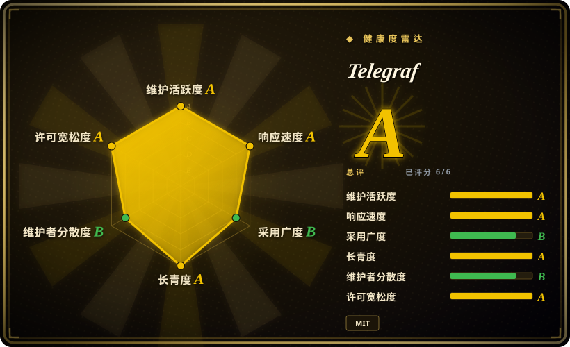
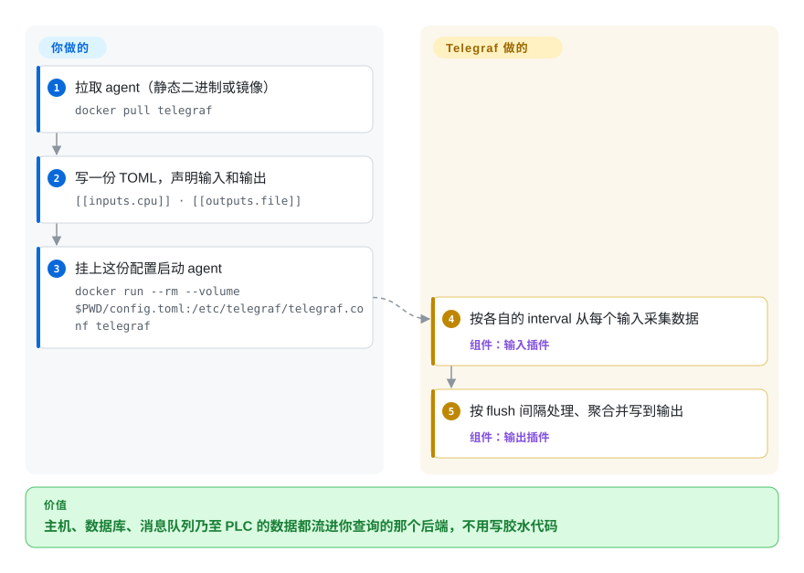

# Telegraf

单二进制、插件驱动的采集 agent，负责收集、处理、聚合并写出指标、日志和任意数据——300+ 个输入/输出/处理/聚合插件，全部由一个 TOML 文件接线串起来。

## 何时使用

你是 SRE 或平台工程师，要给一片混杂的机器搭监控——若干台 Linux、一个 Postgres 从库、一个 Kafka 集群、车间里几台跑 Modbus/OPC UA 的 PLC，还有一堆往外吐事件日志的 Windows 服务器。你不想为每种来源各装一个采集器，也不想为了把每种 payload 塞进时序库而写一堆胶水代码。你在每个节点上放一个 Telegraf 二进制，写一份 TOML——里面列几个 `[[inputs.*]]` 块和一个或多个 `[[outputs.*]]`——同一个 agent 就把主机指标抓了、日志 tail 了、PLC 轮询了，再把指标扇出到 InfluxDB、Prometheus、Kafka 或某个云端 sink；中间还能用 `[[processors.*]]` 改名、过滤、给 tag 加料。因为它编译成无外部依赖的静态二进制，部署就是 `scp` + 一个 systemd unit，而不是先装语言运行时再拉一棵依赖树。

当你的来源异构、又希望采集配置进版本库而非藏在代码里时，你也会选它。要同时从交换机抓 SNMP、从内部 HTTP 端点取 JSON、在同一台机上拿 Docker stats？那是三个 `[[inputs]]` 段落，不是三个 agent。插件集覆盖系统指标、消息队列（AMQP/Kafka/MQTT）、工业协议（Modbus/OPC UA）、SQL、云服务，以及解析/序列化（JSON、CSV、Grok、Prometheus、XPath），所以 Telegraf 最大的价值在于：它是你真正用来查询的那个后端前面那层通用的*采集与路由*层。

## 怎么用起来

Telegraf 就是一个静态 Go 二进制加一份 TOML 文件。启动时它读取配置，只实例化你声明的那些插件，然后跑三类循环：每个 `[[inputs.*]]` 要么按自己的 `interval` 主动去取（CPU 状态、一次 SNMP 遍历、一条 SQL 查询），要么被动接收推送（`tail` 一个日志文件、一个 HTTP 监听）；采到的数据点共享同一套指标模型（名称、tag、字段、时间戳）；`[[processors.*]]` 在处理途中改造数据点，`[[aggregators.*]]` 把一段时间窗内的数据点合并；最后 `[[outputs.*]]` 在每个 `flush interval` 把批量结果写到你的后端。交接面窄而明确：你声明采什么、怎么改造、发到哪里——调度、批量、缓冲、重试都由 agent 承担。parser 和 serializer 挂在具体插件上，同一个 agent 可以读 Prometheus 文本、写成 JSON 行，不用写胶水代码。仍然归你的部分是：把你指向的那个后端跑起来，并让配置（各插件选项、tag 形状）在整个机群里保持同步。

<!-- flow-steps:begin (generated from flows/telegraf.json by tools/flow_card.py — do not edit) -->

流程文字版

1. **你**：拉取 agent（静态二进制或镜像） — `docker pull telegraf`
2. **你**：写一份 TOML，声明输入和输出 — `[[inputs.cpu]] · [[outputs.file]]`
3. **你**：挂上这份配置启动 agent — `docker run --rm --volume $PWD/config.toml:/etc/telegraf/telegraf.conf telegraf`
4. **Telegraf**：按各自的 interval 从每个输入采集数据 — 组件：`输入插件`
5. **Telegraf**：按 flush 间隔处理、聚合并写到输出 — 组件：`输出插件`

**价值**：主机、数据库、消息队列乃至 PLC 的数据都流进你查询的那个后端，不用写胶水代码

<!-- flow-steps:end -->

## 何时不用

- **你永远只对一个来源、一个 sink。** 如果你只需要把节点指标送进 Prometheus，专用 exporter（node_exporter）更轻，比通用 agent 少一个活动部件。
- **你想要存储、看板或告警。** Telegraf *只是采集器/路由器*——没有 UI、没有查询引擎、没有告警。你仍需后端（InfluxDB、Prometheus 等）和可视化/告警层（Grafana、Alertmanager）。
- **你需要完整的分布式追踪 / span。** 它面向指标和日志；若要 OpenTelemetry traces 和 span 管线，OTel Collector 才是更合适的路由器。
- **插件缺口或停更分叉。** 300+ 插件意味着成熟度参差——某个冷门插件可能落后于它封装的协议或带着未修的 bug；请核实你实际依赖的那个插件，别假设全集等质。[未验证]
- **在 agent 内做高基数 / 超高吞吐聚合。** 重度聚合、去重、基数控制通常更适合下推到后端或流处理器；Telegraf 进程内的聚合器有意做得很简单。
- **担心生态绑定。** 它是 MIT 开源、输出端中立，但仍是单一厂商（InfluxData）主导的项目；若你担心这家公司的路线图，可权衡 OTel Collector 更宽的治理结构。

## 横向对比

| 替代品 | 是否收录 | 我们的评价 | 取舍 |
|---|---|---|---|
| Prometheus + node_exporter | 未收录 | 需要拉模式抓取、自带 TSDB 和查询语言时，选 Prometheus + node_exporter。 | 拉模式抓取，自带 TSDB 和查询语言；云原生指标极强，但 exporter 各管一摊，不是面向日志/工业协议的通用推送采集器。 |
| [OpenTelemetry Collector](../../observability/opentelemetry-collector.zh.md) | ✅ | 需要厂商中立地路由 metrics、traces 和 logs 时，选 OpenTelemetry Collector。 | 厂商中立、CNCF 治理，路由指标**与** traces/logs，receiver/exporter 生态广；配置模型更重，追踪能力更强，指标范围有重叠。 |
| Fluent Bit / Fluentd | 未收录 | 首要载荷是日志与事件时，选 Fluent Bit 或 Fluentd。 | 首先是日志与事件 shipper（Fluent Bit 也是极小的 C 二进制）；指标面比 Telegraf 的 300+ 插件窄。 |
| Vector(Datadog) | 未收录 | 需要 Rust 可观测性管线和强变换 DSL 时，选 Vector。 | Rust 写的可观测性管线（日志/指标），变换 DSL（VRL）很强；同为单二进制路由，对冷门输入的插件目录更小。 |
| collectd | 未收录 | 需要老牌轻量 C 指标守护进程且接受偏老生态时，选 collectd。 | 老牌轻量 C 指标守护进程；成熟但插件生态更小、偏老，现代集成较弱。 |
| [CyberChef](../data-tools/cyberchef.zh.md) | ✅ | 需要浏览器里做一次性数据变换，而不是常驻采集 agent 时，选 CyberChef。 | 浏览器里做一次性数据变换的工具箱；不是常驻采集 agent——完全不同的活。 |

## 技术栈

- **语言：** Go（编译成单一静态二进制，无运行时依赖）。
- **配置：** TOML——`[[inputs.*]]`、`[[outputs.*]]`、`[[processors.*]]`、`[[aggregators.*]]`，外加每个插件各自的 parser/serializer 配置。
- **插件模型：** 四类插件（输入、处理、聚合、输出）共享一套指标模型，搭配可插拔 parser（JSON、CSV、Grok、Prometheus、XPath……）与 serializer。
- **协议/集成：** 系统统计、SNMP、Modbus、OPC UA、AMQP/Kafka/MQTT、SQL、HTTP、Docker、Windows 事件日志、各云厂商输入、gNMI listener（v1.39.0 新增）等等。

## 依赖

- **运行时：** 除了那个单一二进制，没别的——这是卖点。Telegraf 自身不需要语言运行时，也不需要任何外部服务。
- **后端（你自己跑）:** 要发挥作用必须有个目的地——InfluxDB、Prometheus remote-write 目标、Kafka、SQL 库或云端 sink，取决于你的 `[[outputs]]`。
- **构建：** 从源码编译需要 Go 工具链；截至 2026-09，`go.mod` 钉在 `go 1.27.0`（每条发布线都会移动）。
- **安装路径：** 官方提供预编译静态二进制、Docker 镜像，以及 RPM/DEB 包。

## 运维难度

**低到中。** 顺路径确实简单：一个二进制、一份 TOML、一个 systemd unit（或官方 Docker 镜像），用 `telegraf --test` 在上线前 dry-run 一份配置。agent 本身没有数据存储或集群要运维。难度随规模和广度上升：在大规模机群里管配置（你会想要配置管理或模板层）、调 batching/buffering/flush 间隔以免背压时丢指标、在 tag 基数压垮后端前控制它，以及对着某个抽风插件实际连的设备/服务去排查它。agent 只是其中一块——你指向的那个*后端*通常才是更难跑的东西。

## 健康度与可持续性

- **响应速度**：Grade A——中位首次响应时间 41.2 小时，基于 34 个 qualifying issues/PRs。
- **维护（2026-09）。** 默认分支最后 push 于 2026-09-25；v1.40.0 发布于 2026-09-07，bugfix 版 v1.40.1 于 2026-09-21 跟上——项目按稳定的小版本节奏发布，处于**活跃**而非吃老本。未归档。[推断]
- **治理 / 背书。** 单一厂商项目：由 InfluxData 主导路线图，采用 MIT 许可、输出端中立。这是个 bus-factor 考量——输出保持开放，但方向跟随一家公司的优先级（对照 CNCF 治理的 OTel Collector）。缓解项：README 自称有超过 1,200 名社区贡献者，多数插件本就由社区贡献。[推断]
- **年龄与 Lindy 判断。** 约 11 年（2015-04 创建）且**仍在活跃发布**⇒ **强 Lindy** 信号；这是一个成熟、久经验证的采集器，而非被炒作的新秀。[推断]
- **采用度。** 在 InfluxDB 生态里有广泛的真实使用（Docker Hub 官方镜像；健康度评分器记录约 3.9k 个依赖它的 Go 仓库），加上极大的插件目录（README 自称“over 300 plugins”）；约 420 个 open issue（GitHub API，2026-09）与如此大的面相符，单看并非红旗。[推断]
- **风险标记。** 单一厂商主导是主要一项——未发现 relicense 历史，但若你担心 InfluxData 的路线图，OTel Collector 是治理更分散的替代品。[推断]

## 存疑（未验证）

- [未验证] v1.40.1 于 2026-09-21 发布；截至 2026-09 约 17.8k GitHub star、420 个 open issue（GitHub API）——star 数不可靠且对时间敏感，仅供参考。
- [未验证] “300+ 插件”是项目 README 自己的表述；确切数量和任一具体插件的成熟度随版本变动——依赖某插件前请对照当前仓库核实。
- [推断] 在 300+ 目录里，各插件的行为、性能和 bug 状况差异很大；“成熟度参差”是从插件集广度做出的推断，而非对某个具体插件的实测结论。
