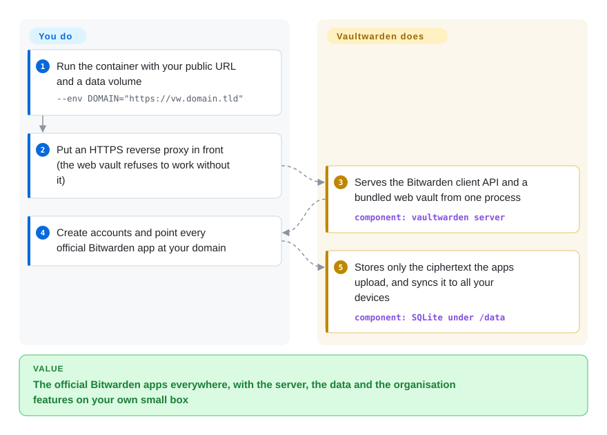

# Vaultwarden

You want your family or small team on Bitwarden's apps, but with the vault on your own server — and the official self-hosted Bitwarden is a stack of .NET containers plus a SQL Server database, too heavy for a Raspberry Pi or a $5 VPS, with org features behind a paid licence. Vaultwarden reimplements the server side of Bitwarden as one small Rust process with SQLite, and the official apps sync against it unchanged.

## When to use

You run a homelab or a small VPS and you're the one who set up everyone's passwords. You like Bitwarden's apps — browser extension, phone autofill, desktop app — but not the idea of the family's vault living on someone else's servers, and the official self-hosted install wants a couple of gigabytes of RAM for its containers and a licence file before you can share a "Family" collection. You start one `vaultwarden/server` container with a data volume, put it behind the reverse proxy you already run, and switch every Bitwarden app to "self-hosted" with your URL. Shared organisations, collections, Send, emergency access and 2FA work without a licence, and the whole thing idles in tens of megabytes.

The deciding tradeoff against the official server is footprint and unlocked features versus vendor backing: Vaultwarden is an unofficial reimplementation, so you trade Bitwarden's support, audits and day-one client compatibility for a server that fits on anything. Against KeePassXC you are choosing a synced client-server vault over a file you sync yourself.

## How it works

Bitwarden apps don't care whose server they talk to, as long as it speaks the same HTTP API. Vaultwarden is a from-scratch Rust implementation of that API (on the Rocket web framework), plus a lightly patched copy of Bitwarden's web vault bundled in the container. Encryption happens in the apps: each item is encrypted with a key derived from your master password before it is uploaded, so the server stores and syncs ciphertext it cannot read — SQLite under `/data` by default, MySQL or PostgreSQL if you set `DATABASE_URL`. **Vaultwarden does the API, the web vault, organisations, 2FA checks, live-sync over WebSocket and the admin page; you supply HTTPS, backups, upgrades and, if you want them, SMTP and mobile push.** The web vault only works over HTTPS, because browsers expose the Web Crypto API it needs only to secure pages. Mobile push notifications go through Bitwarden's own push relay, for which you request an installation ID and key from Bitwarden.

<!-- flow-steps:begin (generated from flows/vaultwarden.json by tools/flow_card.py — do not edit) -->

Text version of the flow

1. **You**: Run the container with your public URL and a data volume — `--env DOMAIN="https://vw.domain.tld"`
2. **You**: Put an HTTPS reverse proxy in front (the web vault refuses to work without it)
3. **Vaultwarden**: Serves the Bitwarden client API and a bundled web vault from one process — component: `vaultwarden server`
4. **You**: Create accounts and point every official Bitwarden app at your domain
5. **Vaultwarden**: Stores only the ciphertext the apps upload, and syncs it to all your devices — component: `SQLite under /data`

**Value**: The official Bitwarden apps everywhere, with the server, the data and the organisation features on your own small box

<!-- flow-steps:end -->

## When NOT to use

- **You cannot upgrade the server promptly.** Bitwarden's apps auto-update and the API moves with them: Vaultwarden 1.37.0 (2026-07-24) was required for clients 2026.7.0 and later, and the same release fixed nine medium-severity security advisories. If nobody will update the container within days of a client or security release, use the official Bitwarden cloud, where the server keeps pace for you.
- **You need vendor support, audits or compliance paperwork.** Vaultwarden is unaffiliated with Bitwarden, Inc.; its README tells you not to use Bitwarden's support channels at all. For a contract, third-party audits and certifications, use the official [Bitwarden server](https://github.com/bitwarden/server) (not indexed) self-hosted with a licence, or Bitwarden's cloud.
- **You need SAML SSO or SCIM provisioning.** SSO arrived in 1.35.0, but only via OpenID Connect; neither SAML nor SCIM appears in the README's feature list. For SAML/SCIM-driven enterprise identity, use official Bitwarden Enterprise. [推断]
- **A vault outage is unacceptable.** It is a single process with a local database by default and no built-in clustering or failover; the apps keep an offline copy, but nobody can save changes while it is down. Use Bitwarden's cloud, or the official server on infrastructure you already run highly available.
- **You don't want a server at all.** Use [KeePassXC](https://github.com/keepassxreboot/keepassxc) (not indexed): a local encrypted database file you sync with whatever you already use, no network service to secure.
- **The main job is team credential sharing with per-item permissions.** Use [Passbolt](https://github.com/passbolt/passbolt_api) (not indexed), which is built around OpenPGP-based sharing between team members rather than personal vaults.

## Comparison

| Alternative | In index | Our verdict | Tradeoff |
|---|---|---|---|
| [Bitwarden server](https://github.com/bitwarden/server) | not indexed | When you need vendor support, audits, SAML/SCIM and same-day client compatibility, run the official server (or the cloud); pick Vaultwarden when a light self-hosted server with org features unlocked matters more than vendor backing. | Official, audited, supported; a heavier multi-container .NET deployment, and paid features gated by a licence file. AGPL-3.0 core plus source-available Bitwarden-licensed modules. |
| [KeePassXC](https://github.com/keepassxreboot/keepassxc) | not indexed | When one person wants a password database with no server to secure, pick KeePassXC; pick Vaultwarden when several people need live sync, sharing and phone autofill from one service. | No network attack surface and no upgrades to chase; syncing, sharing and mobile apps are left to third-party tools and file sync. |
| [Passbolt](https://github.com/passbolt/passbolt_api) | not indexed | For a team whose main need is sharing credentials with per-item permissions, pick Passbolt; pick Vaultwarden for personal and family vaults that also share a few collections. | Team-first OpenPGP sharing model, AGPL-3.0, PHP stack with a database; fewer and less polished end-user apps than the Bitwarden ecosystem. |
| 1Password | not a repo | When you want a managed, closed-source product with support and no server, pick 1Password; pick Vaultwarden when owning the server and the data is the requirement. | Polished apps and vendor support for a subscription; your vault lives in the vendor's cloud and the code cannot be inspected. |

## Tech stack

- **Rust** — Rocket 0.5 web framework with WebSocket support (`rocket_ws`), Diesel ORM, Argon2 for admin-token hashing.
- **Database** — SQLite (default, `sqlite://data/db.sqlite3`), MySQL/MariaDB or PostgreSQL via `DATABASE_URL`.
- **Auth** — TOTP, email codes, FIDO2/WebAuthn (`webauthn-rs`), YubiKey OTP, Duo; OpenID Connect SSO (`openidconnect`).
- **Storage** — attachments and Sends on the local filesystem through OpenDAL; S3 parameters supported since 1.37.0.
- **Web vault** — Bitwarden's web client, rebuilt with small patches in the separate `bw_web_builds` repo and shipped in the image.

## Dependencies

- **Runtime:** Docker/Podman (images on ghcr.io, docker.io and quay.io) or a self-built binary; any small Linux host, ARM boards included.
- **HTTPS:** a reverse proxy or Rocket's own TLS — mandatory for the web vault.
- **Persistent storage:** the `/data` volume (database, attachments and server keys); optional external MySQL/PostgreSQL.
- **Optional:** SMTP for invitations, email 2FA and notifications; an installation ID/key from Bitwarden to enable mobile push through its relay.

## Ops difficulty

**Low to medium.** Starting it is one `docker run`; doing it safely is the work. Disable open sign-ups once your users exist (`SIGNUPS_ALLOWED` defaults to true, so anyone who can reach the URL can register), protect the `/admin` page with an Argon2-hashed `ADMIN_TOKEN` or leave it disabled, back up `/data` (database plus attachments) on a schedule, and keep up with releases — the client-compatibility and security points above mean "set and forget" is the main operational risk. A personal or family instance needs minutes a month; a company instance needs the same patch discipline as any internet-facing auth service.

## Health & viability

- **Maintenance — active, with a steady release train.** Maintenance Grade A: commits in 10 of the last 13 weeks; five releases from 1.37.0 (2026-07-24) to 1.37.4 (2026-10-05).
- **Responsiveness.** Responsiveness Grade A: median first response 0.7 hours across 25 qualifying issues/PRs.
- **Governance — personal repo, small active core.** Governance Grade A: top-1 contributor share 30.3% and top-3 63% across 26 active maintainers in the last 12 months. The repo is under its founder's personal account (`dani-garcia`), but the README describes maintainers setting direction together, and recent releases are led by several regulars (`BlackDex`, `Timshel`, `stefan0xC`). One active maintainer is employed by Bitwarden and contributes on their own time, per the README.
- **Age & Lindy.** Longevity Grade A: created 2018-02 (as bitwarden_rs, renamed in 2021), 3154 days old and still releasing monthly — a strong Lindy prior for a self-hosted service.
- **Adoption — high, but not where the scorer looks.** Adoption Grade D reflects crates.io (2,839 downloads last month, no dependent repositories), which is not how anyone installs it; real usage is container pulls from three registries. About 68.7k GitHub stars (2026-10).
- **Risk flags.** Risk/License Grade D: AGPL-3.0, no relicense history. The structural risk is dependency on Bitwarden: Bitwarden's client changes set the upgrade pace, and its trademark already forced the 2021 rename.

## Caveats (unverified)

- [未验证] Memory footprint ("tens of megabytes") and the official stack's resource needs are typical figures from self-hosting practice, not measured for this page.
- [推断] Missing SAML/SCIM is inferred from their absence in the README feature list and release notes (OIDC SSO is present since 1.35.0); check the wiki before ruling it out.
- [未验证] The nine 1.37.0 advisories were private and pending CVE assignment at release time; their exploitability was not assessed.
- [未验证] Whether the official Bitwarden server's lighter single-container deployment narrows the footprint gap was not re-checked for this page.
- [推断] The "real usage is container pulls" reading rests on the README's registry badges and docs, not on pull numbers fetched today.
- [未验证] The claim that apps keep an offline copy during a server outage depends on Bitwarden client behaviour, which Vaultwarden does not control.
