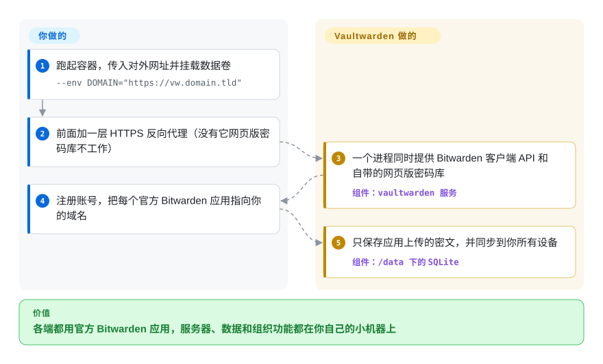

# Vaultwarden

你想让家人或小团队都用 Bitwarden 的应用，但密码库要放在自己的服务器上——而官方自托管版是一摞 .NET 容器加一个 SQL Server 数据库，树莓派和 5 美元 VPS 都扛不动，组织功能还要付费许可证。Vaultwarden 用一个小小的 Rust 进程加 SQLite 重写了 Bitwarden 的服务端，官方应用不用改就能和它同步。

## 何时使用

你有一台家用服务器或一台小 VPS，全家的密码也是你张罗的。你喜欢 Bitwarden 的应用——浏览器扩展、手机自动填充、桌面端——但不喜欢全家的密码库放在别人的服务器上；官方自托管版的容器要吃掉好几 GB 内存，想共享一个“家庭”集合还得先导入许可证文件。你起一个挂了数据卷的 `vaultwarden/server` 容器，放到你已有的反向代理后面，把每个 Bitwarden 应用切到“自托管”并填上你的网址。共享组织、集合、Send、紧急访问、两步验证都不需要许可证，整个服务空闲时只占几十 MB。

和官方服务端比，决定性的取舍是：占用小、功能不设门槛，对上厂商兜底。Vaultwarden 是非官方的重新实现，你放弃了 Bitwarden 的支持、审计和新版客户端首日兼容，换来一个哪儿都能跑的服务端。和 KeePassXC 比，你选的是带同步的客户端—服务端密码库，而不是一个要自己想办法同步的文件。

## 怎么用起来

Bitwarden 应用不在乎对面是谁家的服务器，只要说的是同一套 HTTP API。Vaultwarden 就是用 Rust（基于 Rocket Web 框架）从头实现的这套 API，外加一份打了小补丁、随容器分发的 Bitwarden 网页版密码库。加密发生在应用里：每个条目上传前都用由主密码派生的密钥加密，所以服务器保存和同步的是它自己读不懂的密文——默认存在 `/data` 下的 SQLite 里，设置 `DATABASE_URL` 也可以用 MySQL 或 PostgreSQL。**API、网页版密码库、组织、两步验证校验、经 WebSocket 的实时同步和管理页面由 Vaultwarden 负责；HTTPS、备份、升级，以及（需要的话）SMTP 和移动端推送由你负责。**网页版密码库只能在 HTTPS 下工作，因为它依赖的 Web Crypto API 浏览器只在安全页面里开放。移动端推送通知要经 Bitwarden 自己的推送中继，为此你得向 Bitwarden 申请一个安装 ID 和密钥。

<!-- flow-steps:begin (generated from flows/vaultwarden.json by tools/flow_card.py — do not edit) -->

流程文字版

1. **你**：跑起容器，传入对外网址并挂载数据卷 — `--env DOMAIN="https://vw.domain.tld"`
2. **你**：前面加一层 HTTPS 反向代理（没有它网页版密码库不工作）
3. **Vaultwarden**：一个进程同时提供 Bitwarden 客户端 API 和自带的网页版密码库 — 组件：`vaultwarden 服务`
4. **你**：注册账号，把每个官方 Bitwarden 应用指向你的域名
5. **Vaultwarden**：只保存应用上传的密文，并同步到你所有设备 — 组件：`/data 下的 SQLite`

**价值**：各端都用官方 Bitwarden 应用，服务器、数据和组织功能都在你自己的小机器上

<!-- flow-steps:end -->

## 何时不用

- **你没法及时升级服务端**——Bitwarden 应用会自动更新，API 跟着变：Vaultwarden 1.37.0（2026-07-24）是 2026.7.0 及以后客户端的必需版本，同一版还修了九个中危安全通告。如果没人会在客户端或安全更新发布后几天内升级容器，就用官方 Bitwarden 云服务，服务端由他们跟进。
- **需要厂商支持、审计或合规文件**——Vaultwarden 与 Bitwarden 公司无关，README 明说出了问题不要去找 Bitwarden 的支持渠道。要合同、第三方审计和认证，用官方 [Bitwarden server](https://github.com/bitwarden/server)（未收录）配许可证自托管，或者用 Bitwarden 的云服务。
- **需要 SAML 单点登录或 SCIM 用户同步**——SSO 从 1.35.0 开始支持，但只走 OpenID Connect；README 的功能列表里既没有 SAML 也没有 SCIM。靠 SAML/SCIM 管企业身份的，用官方 Bitwarden 企业版。[推断]
- **密码库停机不可接受**——默认是单进程加本地数据库，没有内置集群或故障切换；应用手里有离线副本，但服务挂掉期间谁都存不了修改。用 Bitwarden 云服务，或者把官方服务端放在你已经做了高可用的基础设施上。
- **压根不想要服务器**——用 [KeePassXC](https://github.com/keepassxreboot/keepassxc)（未收录）：一个本地加密数据库文件，用你现有的同步方式同步，没有需要加固的网络服务。
- **主要需求是团队按条目权限共享凭据**——用 [Passbolt](https://github.com/passbolt/passbolt_api)（未收录），它围绕成员之间基于 OpenPGP 的共享设计，而不是个人密码库。

## 横向对比

| 替代品 | 是否收录 | 我们的评价 | 取舍 |
|---|---|---|---|
| [Bitwarden server](https://github.com/bitwarden/server) | 未收录 | 需要厂商支持、审计、SAML/SCIM 和新客户端当天兼容，就跑官方服务端（或用云服务）；更看重一个轻量、组织功能不设门槛的自托管服务端而非厂商兜底，选 Vaultwarden。 | 官方、有审计、有支持；部署是更重的多容器 .NET，付费功能靠许可证文件解锁。核心 AGPL-3.0，另有源码可见的 Bitwarden 许可模块。 |
| [KeePassXC](https://github.com/keepassxreboot/keepassxc) | 未收录 | 一个人用、不想加固任何服务器，选 KeePassXC；几个人需要从同一个服务获得实时同步、共享和手机自动填充，选 Vaultwarden。 | 没有网络攻击面，也没有要追的升级；同步、共享和手机端交给第三方工具和文件同步。 |
| [Passbolt](https://github.com/passbolt/passbolt_api) | 未收录 | 团队的主要需求是按条目权限共享凭据，选 Passbolt；个人和家庭密码库、顺带共享几个集合，选 Vaultwarden。 | 以团队为先的 OpenPGP 共享模型，AGPL-3.0，PHP 加数据库；终端用户应用比 Bitwarden 生态少，也没那么打磨。 |
| 1Password | 非仓库 | 想要一个有支持、不用自己管服务器的托管闭源产品，选 1Password；要求服务器和数据都归自己，选 Vaultwarden。 | 应用精致、厂商支持，按订阅付费；密码库在厂商云上，代码无法审查。 |

## 技术栈

- **Rust**——Rocket 0.5 Web 框架，带 WebSocket 支持（`rocket_ws`），Diesel ORM，管理令牌用 Argon2 哈希。
- **数据库**——SQLite（默认，`sqlite://data/db.sqlite3`），也可经 `DATABASE_URL` 用 MySQL/MariaDB 或 PostgreSQL。
- **认证**——TOTP、邮件验证码、FIDO2/WebAuthn（`webauthn-rs`）、YubiKey OTP、Duo；OpenID Connect 单点登录（`openidconnect`）。
- **存储**——附件和 Send 经 OpenDAL 存本地文件系统；1.37.0 起支持 S3 参数。
- **网页版密码库**——Bitwarden 的网页客户端，在独立仓库 `bw_web_builds` 里打小补丁后重新构建，打进镜像。

## 依赖

- **运行环境**：Docker/Podman（镜像发布在 ghcr.io、docker.io 和 quay.io）或自行编译的二进制；任意一台小 Linux 主机都行，ARM 开发板也可以。
- **HTTPS**：反向代理或 Rocket 自带的 TLS——网页版密码库必需。
- **持久化存储**：`/data` 卷（数据库、附件和服务器密钥）；可选外部 MySQL/PostgreSQL。
- **可选**：SMTP（邀请、邮件两步验证和通知）；向 Bitwarden 申请的安装 ID 和密钥，用于经其中继开启移动端推送。

## 运维难度

**低到中**。跑起来只要一条 `docker run`，跑得安全才是功夫：用户都注册好后关掉开放注册（`SIGNUPS_ALLOWED` 默认是 true，谁能访问到网址谁就能注册）；用 Argon2 哈希过的 `ADMIN_TOKEN` 保护 `/admin` 页面，或者干脆不启用；定期备份 `/data`（数据库加附件）；跟上版本——上面说的客户端兼容和安全修复意味着“装完就不管”才是最大的运维风险。个人或家庭实例每月花几分钟；公司实例要拿出和任何对公网的认证服务一样的打补丁纪律。

## 健康度与可持续性

- **维护活跃度——活跃，发版节奏稳定**。维护活跃度 Grade A：最近 13 周中 10 周有提交；从 1.37.0（2026-07-24）到 1.37.4（2026-10-05）连发五个版本。
- **响应速度**。响应速度 Grade A：基于 25 个 qualifying issues/PRs，中位首次响应时间 0.7 小时。
- **治理——个人仓库，活跃核心不大**。治理集中度 Grade A：过去 12 个月 26 位活跃维护者，第一贡献者占比 30.3%，前三贡献者占比 63%。仓库挂在创始人的个人账号（`dani-garcia`）下，但 README 说方向由维护者们共同决定，最近的版本由几位常客（`BlackDex`、`Timshel`、`stefan0xC`）主导。按 README 的说法，有一位活跃维护者受雇于 Bitwarden，用业余时间贡献。
- **年龄与 Lindy**。长青度 Grade A：创建于 2018-02（原名 bitwarden_rs，2021 年改名），已 3154 天，仍每月发版——对自托管服务来说是很强的 Lindy 先验。
- **采用度——很高，但不在评分器看的地方**。采用广度 Grade D 反映的是 crates.io（上月下载 2,839 次，没有依赖它的仓库），而没人这样安装它；真实使用量在三个镜像仓库的容器拉取里。GitHub 星标约 6.87 万（2026-10）。
- **风险信号**。许可证风险 Grade D：AGPL-3.0，没有改许可证的历史。结构性风险在于依赖 Bitwarden：Bitwarden 客户端的变化决定了你的升级节奏，其商标也已经逼它在 2021 年改过一次名。

## 存疑（未验证）

- [未验证] 内存占用（“几十 MB”）和官方栈的资源需求是自托管实践中的常见数字，本页没有实测。
- [推断] 缺少 SAML/SCIM 是根据 README 功能列表和更新日志里没有它们推断的（OIDC 单点登录自 1.35.0 起已有）；排除前请查 wiki。
- [未验证] 1.37.0 的九个安全通告在发布时尚未公开、等待分配 CVE；其可利用性没有评估。
- [未验证] 官方 Bitwarden 服务端更轻量的单容器部署能把占用差距缩小多少，本页没有重新核实。
- [推断] “真实使用量在容器拉取里”依据的是 README 的镜像仓库徽章和文档，不是今天拉取的数字。
- [未验证] 服务端停机期间应用仍有离线副本，取决于 Bitwarden 客户端的行为，不由 Vaultwarden 控制。
