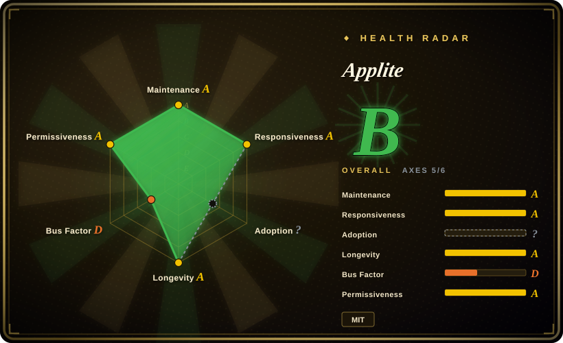
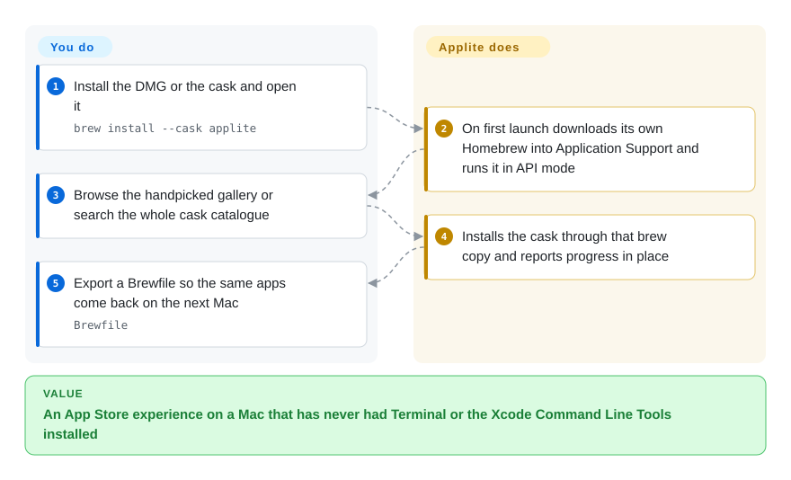

# Applite

A macOS "App Store" for the apps Homebrew Cask installs — it brings its own Homebrew, needs no Terminal or Command Line Tools, and deliberately manages casks only, never formulae.

## When to use

You are setting up a Mac for someone who should never have to open Terminal: a family member, a designer, a new hire on their first day. The machine may not even have the Xcode Command Line Tools, which is where every other Homebrew GUI stops — they all assume a working `brew` already exists, and getting one is exactly the terminal step you are trying to avoid. Applite sidesteps that: on first launch it downloads a Homebrew tarball into its own Application Support directory and runs it from there, so the app itself is the first thing you install, not the last. What the user then sees is a familiar shape — a gallery of apps with real icons, categories, a search box, one-click install and update — and the underlying package manager is never mentioned.

Pick Applite over the other Homebrew front ends when the audience is non-technical and the job is *apps*, not packages. The deciding tradeoffs are two: it can stand alone on a machine that has never had a terminal, and it deliberately refuses to manage formulae or services — so it will not try to be a general Homebrew console, and you should not expect one. [BrewUI](brewui.md) is the mirrored choice: official and transparent, but it assumes Homebrew is already there.

## How it works

Applite is a thin, opinionated layer over a Homebrew installation that it will create for you if you do not have one. On first launch `HomebrewBootstrap` either validates an existing `brew` — you can point it at any prefix in Settings — or downloads a Homebrew tarball into the app's own Application Support directory and drives it in API mode behind a git shim; from then on, installs, updates and uninstalls run through that binary exactly as the command line would run them. The catalogue is a local SQLite database (GRDB, WAL mode) synced from the Homebrew JSON API, with an FTS5 index and BM25 ranking for full-catalogue search; loading is two-stage, so the SQLite side paints the UI immediately while `brew list --cask` and `brew outdated --cask` fill in installed and outdated state afterwards. Identity is the `fullToken` everywhere, because two taps can each ship a `firefox`. You own browsing and the click; Applite owns the Homebrew installation, the catalogue, the search index and the progress reporting.

<!-- flow-steps:begin (generated from flows/applite.json by tools/flow_card.py — do not edit) -->

Text version of the flow

1. **You**: Install the DMG or the cask and open it — `brew install --cask applite`
2. **Applite**: On first launch downloads its own Homebrew into Application Support and runs it in API mode
3. **You**: Browse the handpicked gallery or search the whole cask catalogue
4. **Applite**: Installs the cask through that brew copy and reports progress in place
5. **You**: Export a Brewfile so the same apps come back on the next Mac — `Brewfile`

**Value**: An App Store experience on a Mac that has never had Terminal or the Xcode Command Line Tools installed

<!-- flow-steps:end -->

## When NOT to use

- **You need to install command-line formulae, not just apps.** Applite is casks-only by design and has no formula surface at all. Use [BrewUI](brewui.md) or [Cork](cork.md), or just use `brew` directly.
- **You want to see what Homebrew is actually doing.** There is no console and no command transcript; the app abstracts the CLI away, which is the point but also the limit. Use [BrewUI](brewui.md) when transparency is the reason you want a GUI, or [CaskHub](caskhub.md) for native password prompts and richer catalogue metadata.
- **You need services, taps as a first-class object, tagging, or Brewfile-driven infrastructure automation at fleet scale.** Applite reads casks from custom taps and round-trips a Brewfile, but it is not a Homebrew administration console. Use [Cork](cork.md) for services and tap management.
- **Your policy forbids a GUI shipping its own package manager.** Applite's self-contained Homebrew is its headline feature and also its biggest governance question: you now have a second Homebrew tree the app owns, outside whatever your fleet manages. `[推断]` Use [BrewUI](brewui.md), [CaskHub](caskhub.md) or [Cork](cork.md) if the machine's Homebrew must stay the single one you already control.
- **You need a corporate support contract or multiple maintainers.** Applite is a single-person project and its README says so plainly. Use [Cork](cork.md) (commercial licence with a company behind it) when you need someone to hold accountable.
- **You are below macOS 14.** The cask is `depends_on macos: :sonoma`. Use [CaskHub](caskhub.md) on 15.6+, and on older systems accept that none of these GUI front ends apply.
- **Tests and code review must be visible to your security team.** Applite's README discloses AI-assisted development from v1.4 for refactoring and small-to-medium features. That disclosure is unusually candid, but if your process requires a human-authorship policy it rules Applite out. `[推断]`

## Comparison

| Alternative | In index | Our verdict | Tradeoff |
|---|---|---|---|
| [BrewUI](brewui.md) | ✅ | When the machine already has Homebrew and you want the official front end with every command visible, pick BrewUI; when it does not, pick Applite. | Applite gains a self-installing Homebrew, macOS 14 support and MIT terms; it pays with casks-only scope and no console. BrewUI gains formulae plus casks and full transparency; it pays with a macOS 26 floor and a Homebrew prerequisite it will not fulfil for you. |
| [CaskHub](caskhub.md) | ✅ | When the catalogue experience and install reach matter most, pick CaskHub; when the machine may have no Homebrew at all, pick Applite. | CaskHub gains the strongest recent install numbers and richer browsing with no self-managed brew tree; it pays with Sentry/TelemetryDeck telemetry and no bundled Homebrew. Applite gains no-terminal bootstrap and no telemetry; it pays with a smaller catalogue surface. |
| [Cork](cork.md) | ✅ | When you need the full Homebrew surface — services, taps, tagging, menu-bar updates — pick Cork; when you need a free, no-terminal app store for casks, pick Applite. | Cork gains features brew itself lacks and macOS 14 support; it pays with a 25 € licence for the prebuilt and a source-available licence. Applite gains zero cost, MIT reuse and a no-terminal install; it pays with cask-only scope. |
| [Cakebrew](cakebrew.md) | ✅ | Pick Cakebrew only as a historical reference; for any live use pick Applite, because Cakebrew's default branch has not moved since 2021. | Cakebrew gains a longer history and tap management; it pays with abandonment, a README install command that does not resolve, and no modern macOS guarantees. Applite is the inverse: current, maintained, narrower. |

## Tech stack

- **Language / UI:** Swift and SwiftUI targeting macOS 14, so `@Observable` and `NavigationSplitView` are available without back-deployment shims; no Combine.
- **Database:** GRDB.swift over SQLite in WAL mode at `~/Library/Application Support/Applite/casks.sqlite`, with an FTS5 virtual table over casks and BM25 ranking for search.
- **Architecture:** `@Observable @MainActor` view models with a get-or-create `CaskViewModelRegistry` keyed on `fullToken`; a `CaskManager` coordinator owning a data loader, the registry and a brew service; DTOs decode the Homebrew API and analytics JSON.
- **Brew integration:** the app's Homebrew copy (or your own prefix) invoked as a subprocess, with custom-tap metadata read through a bundled `brew ruby` script; there is no library-level dependency on Homebrew internals.
- **Catalogue sync:** Homebrew Cask API `formulae.brew.sh/api/cask.json` plus the install-analytics endpoint.
- **Packaging:** Xcode project using file-system synchronized groups, so the on-disk folder structure *is* the project structure.

## Dependencies

- **OS:** macOS 14 or later; universal binary (Apple Silicon and Intel).
- **Homebrew:** optional. Applite either uses your existing installation (any prefix, set in Settings) or downloads and manages its own.
- **Runtime services:** none — no daemon, no helper, no background agent.
- **Network:** the Homebrew JSON API and whatever Homebrew fetches for installs. HTTP/HTTPS/SOCKS5 proxy support is built in.
- **Telemetry:** none, and no account.
- **Sandbox:** not sandboxed; the only entitlement in the repo's entitlements file is `com.apple.security.cs.disable-library-validation`.

## Ops difficulty

**Low.** Install the DMG or the cask, open it, click. There is no service to supervise, no config file to own, and no Homebrew prerequisite to satisfy on a clean machine — the app bootstraps one. The costs that remain are conceptual rather than operational: a second Homebrew tree now exists that you did not provision (unless you point Applite at your own prefix), version and trust behaviour of that copy is the app's business rather than yours, and the cask upgrade path is via Sparkle-style in-app updates rather than something you script. For a single user's Mac this is close to zero effort; for a fleet with configuration management it is a deliberate exception you have to document.

## Health & viability

- **Maintenance — active as of 2026-09-20.** Repo created 2023-08-03; last commit 2026-09-12; 12 releases with v1.4.2 on 2026-09-05; releases have not been monthly but the project has never gone dormant. Not archived.
- **Governance / bus factor — one person, stated openly.** 22 contributors, but `milanvarady` accounts for roughly 409 of the tracked contributions and describes Applite as a side project with limited time. That is the central risk: no foundation, no company, no co-maintainer of comparable weight.
- **Backing & longevity — independent, three years in, still shipping.** Not foundation- or vendor-backed, but the age plus continued activity is the shape the Lindy prior rewards: the alternative outcome here is a slower release cycle, not a vanishing project. The README says the realistic alternative to AI-assisted development is "a much slower release cycle or no releases at all".
- **Adoption & ecosystem — the widest reach of the Homebrew GUIs.** ~7.1k stars, 179 forks and ~357k total release-asset downloads, with 727 cask installs in the 30 days to 2026-09-20 (cask rank ~254). 68 pull requests landed with 0 open.
- **Responsiveness — 87 issues filed, 9 open**, which on a three-year-old single-maintainer project reads as a backlog that is being worked rather than ignored.
- **Risk flags — none on licensing; two on process.** MIT with no relicense history and no open-core gating. The flags are the bus factor above and the disclosed AI-assisted development, which some organisations treat as a review requirement.
- **The adoption axis is `?` (`no_package_structural`).** A cask-distributed app exposes no package-registry structure for that axis, so the download and cask-install figures above stand in for it; `?` is unobtainable, not a low grade.

## Caveats (unverified)

- `[未验证]` **The self-contained Homebrew's long-term behaviour.** Its README states the tarball is downloaded into Application Support and run in API mode behind a git shim; how that copy is upgraded, and what happens when it drifts from the user's own Homebrew, is not documented here and was not reproduced.
- `[推断]` **A second, app-owned Homebrew tree is a governance question for managed fleets.** The mechanism (a tarball in Application Support) is documented; the compliance consequence is inference, not something the project asserts.
- `[未验证]` **The trust-bypass detail.** Applite's own notes say the custom-tap metadata script no-ops `Homebrew::Trust.require_trusted_cask!` for metadata reads while real installs still honour trust. The behaviour is claimed in the repository's notes for the script; it was not reproduced here.
- `[未验证]` **AI-assisted development scope.** The README says the core predates AI involvement and that AI is used for refactoring and small-to-medium features, with architecture, review and merge decisions made by the maintainer. That is self-reported.
- `[推断]` **Bus factor is the binding constraint.** Inferred from contribution concentration plus the maintainer's own "side project, limited time" framing; GitHub metrics cannot show how much unreviewed debt sits behind it.
- `[未验证]` **Sandbox status.** Concluded "not sandboxed" from reading `Applite/Applite.entitlements`, which contains only `com.apple.security.cs.disable-library-validation`; the distributed binary was not inspected.
- `[未验证]` **Localisation count and proxy support** (seven languages, HTTP/HTTPS/SOCKS5) are README claims, not independently exercised.
