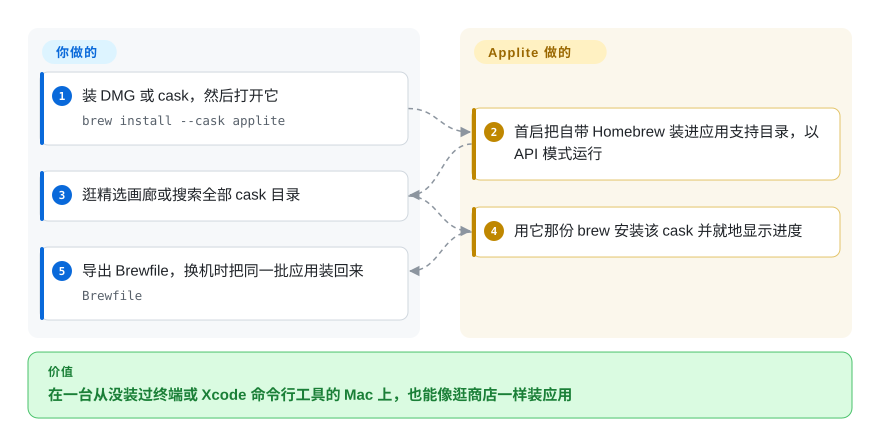

# Applite

macOS 上的「应用商店」，装的是 Homebrew Cask 里的应用——它自带一份 Homebrew，不需要终端和命令行工具，并且刻意只管 cask，绝不碰 formula。

## 何时使用

你在给一个**永远不该打开终端**的人配置 Mac：家人、设计师、第一天上班的新同事。这台机器甚至可能没装 Xcode 命令行工具——而这正是其他所有 Homebrew 图形前端的止步之处：它们都假定已经有一个能用的 `brew`，而弄出这个 `brew` 恰恰就是你想避开的那一步终端操作。Applite 绕开了它：首次启动时把一份 Homebrew tarball 下到自己的 Application Support 目录并从那里运行，所以你装的第一件东西就是这个应用，而不是最后一件。用户随后看到的是一个熟悉的样子——带真实图标的画廊、分类、搜索框、一键安装与更新——而底层包管理器根本不会被提起。

当受众是非技术用户、要办的事是装**应用**而不是管包时，在几个 Homebrew 前端里选 Applite。决定性的取舍有两条：它能在一台从未有过终端的机器上独立站住，而且它刻意拒绝管理 formula 与 services——所以它不会假装自己是通用 Homebrew 控制台，你也不该期待一个。 [BrewUI](brewui.zh.md) 是镜像的另一端：官方、透明，但假定 Homebrew 已经在那里。

## 怎么用起来

Applite 是薄薄一层、有明确主见的外壳，底下那份 Homebrew 你若没有它就替你建。首次启动时 `HomebrewBootstrap` 要么校验已有的 `brew`（你可以在设置里把它指向任意 prefix），要么把一份 Homebrew tarball 下到应用自己的 Application Support 目录，并在一个 git shim 后面以 API 模式驱动它；此后安装、更新、卸载都通过那个二进制执行，与命令行执行别无二致。目录是一份本地 SQLite 数据库（GRDB，WAL 模式），从 Homebrew JSON API 同步，带 FTS5 索引与 BM25 排序用于全目录搜索；加载分两段，SQLite 一侧先把界面画出来，`brew list --cask` 与 `brew outdated --cask` 之后再把已安装与已过期状态填上去。全链路的身份标识都是 `fullToken`，因为两个 tap 可以各有一个 `firefox`。浏览与点击是你的；Homebrew 的安装、目录、搜索索引与进度上报是 Applite 的。

<!-- flow-steps:begin (generated from flows/applite.json by tools/flow_card.py — do not edit) -->

流程文字版

1. **你**：装 DMG 或 cask，然后打开它 — `brew install --cask applite`
2. **Applite**：首启把自带 Homebrew 装进应用支持目录，以 API 模式运行
3. **你**：逛精选画廊或搜索全部 cask 目录
4. **Applite**：用它那份 brew 安装该 cask 并就地显示进度
5. **你**：导出 Brewfile，换机时把同一批应用装回来 — `Brewfile`

**价值**：在一台从没装过终端或 Xcode 命令行工具的 Mac 上，也能像逛商店一样装应用

<!-- flow-steps:end -->

## 何时不用

- **你要装命令行 formula，而不只是应用。** Applite 按设计只支持 cask，完全没有 formula 操作面。改用 [BrewUI](brewui.zh.md) 或 [Cork](cork.zh.md)，或者直接用 `brew`。
- **你想看见 Homebrew 实际在做什么。** 这里没有控制台、没有命令记录；应用把 CLI 抽象掉了，这既是它的意义也是它的上限。当你想要 GUI 的理由正是透明度时用 [BrewUI](brewui.zh.md)；想要原生密码框与更丰富的目录元数据则用 [CaskHub](caskhub.zh.md)。
- **你需要 services、作为一等对象的 tap、标签，或在机群规模上由 Brewfile 驱动的基建自动化。** Applite 能读自定义 tap 的 cask，也能往返 Brewfile，但它不是 Homebrew 管理控制台。要 services 与 tap 管理用 [Cork](cork.zh.md)。
- **你的合规政策不允许图形应用自带包管理器。** Applite 的自带 Homebrew 既是它的头号卖点，也是它最大的治理疑问：现在多了一份由应用自己拥有、不受你机群既有管理覆盖的 Homebrew 树。`[推断]` 如果这台机器的 Homebrew 必须保持你已有的那一份，用 [BrewUI](brewui.zh.md)、[CaskHub](caskhub.zh.md) 或 [Cork](cork.zh.md)。
- **你需要企业支持合同或多个维护者。** Applite 是单人项目，它的 README 也明说了这一点。需要有人能担责时用 [Cork](cork.zh.md)（商业授权，背后有公司）。
- **你的系统低于 macOS 14。** cask 是 `depends_on macos: :sonoma`。在 15.6+ 上用 [CaskHub](caskhub.zh.md)；更老的系统上要接受这些图形前端都不适用。
- **测试与代码评审必须对安全团队可见。** Applite 的 README 披露自 v1.4 起在重构与中小型功能上使用 AI 辅助开发。这份披露坦率得少见，但如果你的流程要求人类作者政策，Applite 就出局。`[推断]`

## 横向对比

| 替代品 | 是否收录 | 我们的评价 | 取舍 |
|---|---|---|---|
| [BrewUI](brewui.zh.md) | ✅ | 当机器上已有 Homebrew、且你要官方前端并把每条命令摊开看时，选 BrewUI；当机器上没有时，选 Applite。 | Applite 拿到的是自带 Homebrew、macOS 14 支持和 MIT 条款；付出的是只支持 cask、没有控制台。BrewUI 拿到的是 formula 与 cask 全覆盖和完全透明；付出的是 macOS 26 门槛，以及一个它不会替你满足的 Homebrew 前置条件。 |
| [CaskHub](caskhub.zh.md) | ✅ | 当目录浏览体验与安装触达最重要时，选 CaskHub；当机器上可能根本没有 Homebrew 时，选 Applite。 | CaskHub 拿到的是最强的近期安装数据和更丰富的浏览，且不引入自管的 brew 树；付出的是 Sentry 与 TelemetryDeck 遥测、以及没有自带 Homebrew。Applite 拿到的是无终端启动与零遥测；付出的是更小的目录操作面。 |
| [Cork](cork.zh.md) | ✅ | 当你需要完整的 Homebrew 操作面——services、tap、标签、菜单栏更新——时选 Cork；当你需要一个免费、无需终端的 cask 应用商店时选 Applite。 | Cork 拿到的是 brew 本身都没有的功能和 macOS 14 支持；付出的是预编译版 25€ 授权和 source-available 许可。Applite 拿到的是零成本、MIT 复用和无终端安装；付出的是只支持 cask。 |
| [Cakebrew](cakebrew.zh.md) | ✅ | 只把 Cakebrew 当历史参考；任何实际使用都选 Applite，因为 Cakebrew 的主分支自 2021 年起就没动过。 | Cakebrew 拿到的是更长的历史和 tap 管理；付出的是废弃、README 里无法解析的安装命令，以及对现代 macOS 没有任何保证。Applite 是它的反面：当下、在维护、更窄。 |

## 技术栈

- **语言与界面：** Swift 与 SwiftUI，目标 macOS 14，因此不靠回部署垫片就能用 `@Observable` 与 `NavigationSplitView`；不使用 Combine。
- **数据库：** GRDB.swift 操作 WAL 模式的 SQLite，位于 `~/Library/Application Support/Applite/casks.sqlite`，casks 上有 FTS5 虚表，搜索用 BM25 排序。
- **架构：** `@Observable @MainActor` 视图模型，配一个以 `fullToken` 为键、get-or-create 的 `CaskViewModelRegistry`；`CaskManager` 作为协调者持有数据加载器、注册表与 brew 服务；DTO 负责解码 Homebrew API 与分析 JSON。
- **接 brew 的方式：** 把应用那份 Homebrew（或你自己的 prefix）作为子进程调用，自定义 tap 的元数据通过内置的 `brew ruby` 脚本读取；不在库层面依赖 Homebrew 内部实现。
- **目录同步：** Homebrew Cask API 的 `formulae.brew.sh/api/cask.json`，外加安装分析端点。
- **工程组织：** Xcode 工程使用文件系统同步分组，磁盘上的目录结构**就是**工程结构。

## 依赖

- **系统：** macOS 14 或更新；通用二进制（Apple Silicon 与 Intel）。
- **Homebrew：** 可选。Applite 要么用你已有的安装（任意 prefix，在设置里指定），要么自己下载并管理一份。
- **运行时服务：** 无——没有守护进程、没有 helper、没有后台 agent。
- **网络：** Homebrew JSON API，以及 Homebrew 自己去拉取的内容。内置 HTTP/HTTPS/SOCKS5 代理支持。
- **遥测：** 无，也没有账号。
- **沙箱：** 不沙箱；仓库的 entitlements 文件里唯一的权限是 `com.apple.security.cs.disable-library-validation`。

## 运维难度

**低。** 装 DMG 或 cask，打开，点。没有要盯的服务、没有要维护的配置文件，干净机器上也没有 Homebrew 前置条件要满足——应用会自己引导出一份。剩下的成本是概念性的而非运维性的：除非你把 Applite 指向自己的 prefix，否则现在多了一份不是你准备的 Homebrew 树；那份副本的版本与信任行为归应用管而不归你管；升级走的是应用内自动更新，而不是你能脚本化的路径。对单个用户的 Mac 来说这近乎零成本；对使用配置管理的机群来说，这是一处你必须记录在案的刻意例外。

## 健康度与可持续性

- **维护活跃度——截至 2026-09-20 活跃。** 仓库创建于 2023-08-03；最后提交 2026-09-12；12 个 release，最新 v1.4.2 发布于 2026-09-05；发版不按月，但项目从未休眠。未归档。
- **维护者分散度——一个人，且公开承认。** 22 位贡献者，但 `milanvarady` 约占已统计贡献中的 409 次，并自述 Applite 是一个时间有限的副业。这是核心风险：没有基金会、没有公司、也没有分量相当的共同维护者。
- **背书与长青度——独立项目，三年，仍在发版。** 没有基金会或厂商背书，但「年龄 + 持续活跃」正是 Lindy 先验奖励的形态：这里最坏的结果是发版变慢，而不是项目消失。README 说得很直白，AI 辅助开发的实际替代品是「慢得多的发版周期，或者干脆没有版本」。
- **采用与生态——几个 Homebrew GUI 里触达最广。** 约 7.1k star、179 fork、累计 release 资产下载约 357k；截至 2026-09-20 的近 30 天 cask 安装 727 次（cask 榜约第 254）。已合并 68 个 PR，0 个待处理。
- **响应速度——累计 87 个 issue、9 个未关闭**，在一个三年历史的单人项目上，这读起来像是有人在推进的积压，而不是被无视的积压。
- **风险标记——许可上无，流程上有两处。** MIT，没有改许可史，也没有 open-core 功能阉割。标记是上面的 bus factor，以及已披露的 AI 辅助开发——有些组织会把它当作一项评审要求。
- **采用广度轴为 `?`（`no_package_structural`）。** 靠 cask 分发的应用不暴露包注册表结构给该轴读取，所以上面的下载量与 cask 安装量是它的替代证据；`?` 表示拿不到信号，不是低分。

## 存疑（未验证）

- `[未验证]` **自带 Homebrew 的长期行为。** README 说 tarball 下到 Application Support 并在 git shim 后面以 API 模式运行；这份副本如何升级、以及它与用户自己的 Homebrew 出现版本漂移时会发生什么，文档没有写，这里也没有复现。
- `[推断]` **多出一份由应用拥有的 Homebrew 树，对受管机群是治理问题。** 机制（Application Support 里的 tarball）有文档；合规后果是推断，不是项目自己的主张。
- `[未验证]` **绕过信任检查的细节。** Applite 自己关于该脚本的说明称，读元数据时会把 `Homebrew::Trust.require_trusted_cask!` 置空，而真正的安装仍然遵守 trust。这是仓库内注释中的说法，这里没有复现。
- `[未验证]` **AI 辅助开发的范围。** README 称核心代码早于 AI 参与，AI 用于重构与中小型功能，架构、评审与是否合并由维护者决定。这是自述。
- `[推断]` **bus factor 是这里的硬约束。** 由贡献集中度加上维护者自述「副业、时间有限」推断而来；GitHub 指标看不出背后压着多少未经评审的债。
- `[未验证]` **沙箱状态。** 「不沙箱」的结论来自阅读 `Applite/Applite.entitlements`，其中只有 `com.apple.security.cs.disable-library-validation`；没有检查分发出去的二进制本身。
- `[未验证]` **语言数量与代理支持**（七种语言、HTTP/HTTPS/SOCKS5）是 README 的说法，没有实际验证。
