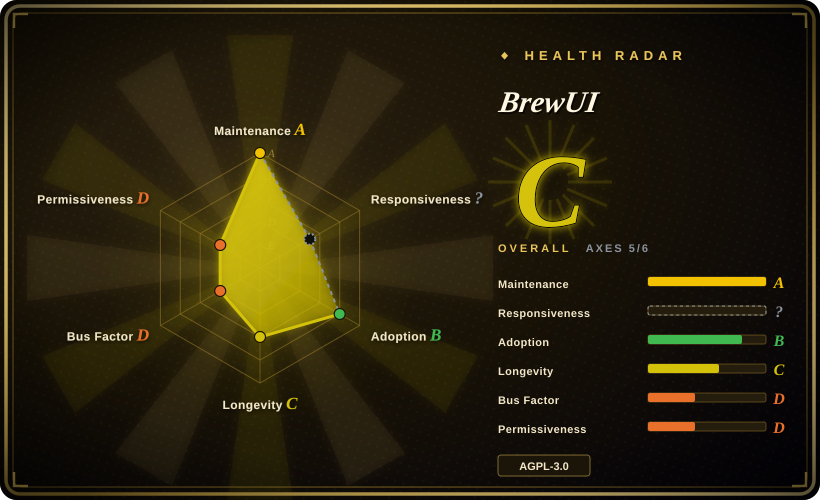
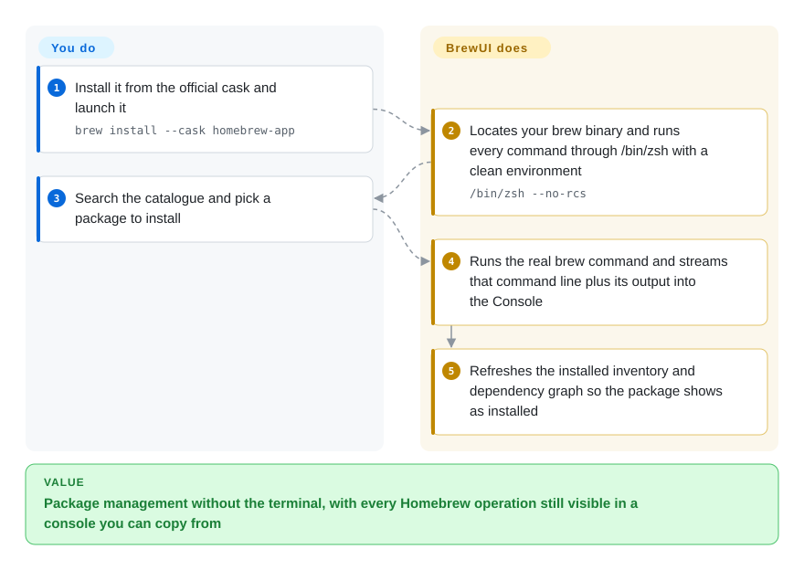

# BrewUI

Homebrew's own macOS GUI: a SwiftUI front end that drives your real `brew` binary and shows every command plus its streamed output in a console you can copy from — but it needs macOS 26 and will not manage taps or custom prefixes.

## When to use

You keep Homebrew as the source of truth on a Mac, and the person who actually has to keep packages current is not comfortable in a terminal — or you are comfortable in one but are tired of explaining what a formula is. You want a window that lists what is installed and what is outdated, installs and upgrades in one click, and — this is the part that decides it — never hides what it did. Every operation ends with the literal `brew install …` command line and its streamed output visible in a Console you can select and copy, so a failure hit in the GUI can be reproduced verbatim in a shell.

Choose BrewUI over the other Homebrew front ends when you specifically want the *official* one: it treats the installed `brew` as the only source of truth, refuses to touch Homebrew's internals, and ships from the same org that owns the CLI. The deciding tradeoff against Applite, CaskHub, Cork and Cakebrew is provenance-and-transparency over reach: BrewUI is the only one published by Homebrew itself and the only one that shows you the underlying commands, and it is also the only one that refuses to launch below macOS 26.

## How it works

BrewUI is a SwiftUI shell over the `brew` binary you already have — it neither bundles a package manager nor reimplements one. At startup it locates `brew` (preferring `/opt/homebrew/bin/brew`, then `/usr/local/bin/brew`) and runs every command through `/bin/zsh` with `--no-rcs --no-global-rcs` and a stripped `PATH`; that is why your shell aliases and exported variables do not configure the app, and why Homebrew options have to live in a `brew.env` file instead. Reads Homebrew can answer cheaply (installed inventory, doctor output, `brew config`) go through the CLI, while the browse-and-search catalogue comes from the `formulae.brew.sh` JSON API with ETag caching. All mutating work funnels through one actor, `SerialBrewCommandCenter`, which serialises operations, coalesces duplicates and publishes an output stream. You own the choice of package and the decision to upgrade; BrewUI owns locating the binary, keeping the environment clean, running the operation, and refreshing the inventory and dependency graph afterwards.

<!-- flow-steps:begin (generated from flows/brewui.json by tools/flow_card.py — do not edit) -->

Text version of the flow

1. **You**: Install it from the official cask and launch it — `brew install --cask homebrew-app`
2. **BrewUI**: Locates your brew binary and runs every command through /bin/zsh with a clean environment — `/bin/zsh --no-rcs`
3. **You**: Search the catalogue and pick a package to install
4. **BrewUI**: Runs the real brew command and streams that command line plus its output into the Console
5. **BrewUI**: Refreshes the installed inventory and dependency graph so the package shows as installed

**Value**: Package management without the terminal, with every Homebrew operation still visible in a console you can copy from

<!-- flow-steps:end -->

## When NOT to use

- **You are on macOS 25 or earlier.** `Package.swift` declares `.macOS("26.0")`, the Xcode project targets 26.2, and the cask is `depends_on macos: :tahoe` — and that has held since v0.1.0, so there is no build for older systems. Use [Applite](applite.md) (macOS 14+), [CaskHub](caskhub.md) (macOS 15.6+) or [Cork](cork.md) (macOS 14+) instead.
- **You need to manage taps, services, or a non-default Homebrew prefix.** BrewUI's own architecture document lists "No custom prefix or custom-tap management initially" as a product constraint. Use [Cork](cork.md) for taps and services, or [Applite](applite.md) if casks are all you need and you want to point it at any prefix.
- **You want to move a machine's package list in and out as a file.** BrewUI has no Brewfile import or export. Use [Applite](applite.md) (with a per-app selection sheet) or [Cork](cork.md) instead.
- **The user is on a brand-new Mac that has never had a terminal.** BrewUI requires Homebrew to be installed already, which on a clean machine means opening Terminal and installing the Xcode Command Line Tools first. Use [Applite](applite.md), which fetches its own Homebrew on first launch, or [CaskHub](caskhub.md), which walks the user through installing Homebrew.
- **You need to fork it and ship a modified build.** BrewUI is AGPL-3.0 including the network-use clause, so the terms travel with any distributed derivative. Use [Applite](applite.md) (MIT) when permissive reuse is the deciding factor.
- **You want a battle-tested app you can freeze for years.** BrewUI is roughly six months old and pre-1.0, with open crash and install-failure reports in its issue tracker. Use [Cork](cork.md) for a longer track record, or decide that the brew CLI itself is enough.
- **You only ever install command-line formulae and never want a GUI.** Use Homebrew directly; a GUI adds an install surface without removing the terminal from your workflow. `[推断]`

## Comparison

| Alternative | In index | Our verdict | Tradeoff |
|---|---|---|---|
| [Applite](applite.md) | ✅ | When the user cannot be assumed to have a terminal at all, pick Applite; pick BrewUI when you want the official front end and every underlying command shown. | Applite gains a self-installing Homebrew, macOS 14 support, Brewfile round-tripping and a permissive MIT licence; it pays with casks-only scope and no visibility into what brew is doing. BrewUI gains formulae plus casks, official backing and a transparent console; it pays with a macOS 26 floor and no file-based export. |
| [CaskHub](caskhub.md) | ✅ | When the job is browsing and installing *apps* on macOS 15.6+ with an App Store feel, pick CaskHub; when formulae matter too, or you need to see the commands, pick BrewUI. | CaskHub gains the widest recent install reach of the five and richer catalogue browsing; it pays with cask-only scope and Sentry/TelemetryDeck telemetry. BrewUI gains formulae and a no-telemetry console; it pays with a newer, thinner browse experience and the macOS 26 floor. |
| [Cork](cork.md) | ✅ | When you want the fullest Homebrew surface — taps, services, tagging, menu-bar updates — pick Cork; when you want it free and official, pick BrewUI. | Cork gains features Homebrew itself lacks and macOS 14 support; it pays with a 25 € licence for the prebuilt and a restrictive source-available licence. BrewUI gains zero-cost official distribution and AGPL source you may actually reuse; it pays with a much narrower feature set. |
| [Cakebrew](cakebrew.md) | ✅ | Pick Cakebrew only as a reference for what a first-generation Homebrew GUI looked like; for any live use pick BrewUI, because Cakebrew's default branch has not moved since 2021. | Cakebrew gains a long history and tap management in a smaller Objective-C codebase; it pays with five years without a release, a broken install command in its README, and no arm64-era guarantees. BrewUI pays for its recency with a macOS 26 floor and pre-1.0 churn. |

## Tech stack

- **Language:** Swift 6.2 in Swift 6 language mode with strict concurrency (`defaultIsolation` / `@MainActor` / actors) on every target.
- **UI:** SwiftUI, with AppKit bridges only where SwiftUI cannot meet a requirement; a documented design system (colour tokens, type scale, spacing, motion) lives in `AGENTS.md`.
- **Packaging:** a Swift package named `BrewKit` with 21 targets following Clean Architecture plus MVVM (`View → ViewModel → Repository or Interactor → Services → brew CLI or JSON API`). Features do not import sibling features; the shell composes them through `BrewAppEnvironment`.
- **External dependency:** exactly one — `swift-subprocess` pinned to `1.0.0`, needed because a controlling-terminal pty requires `setsid()` between fork and exec, which `Foundation.Process` cannot express.
- **Data sources:** the `brew` CLI (inventory, doctor, config) and the Homebrew JSON API at `formulae.brew.sh` (catalogue, analytics).
- **Storage:** namespaced under `sh.brew.app/` — rebuildable catalogue/analytics in `~/Library/Caches`, pending crash reports in `~/Library/Application Support`, transcripts in `~/Library/Logs`.
- **Tooling:** SwiftFormat and SwiftLint pinned through Mint, a project-specific `BrewUILint` (SwiftSyntax) rule set, and Periphery with a baseline for dead-code gating.

## Dependencies

- **OS:** macOS 26 or later. Nothing else is supported.
- **Homebrew:** must already be installed and on a default prefix (`/opt/homebrew` or `/usr/local`) — BrewUI locates it and degrades gracefully when it is missing, but it will not install it for you.
- **Runtime:** `/bin/zsh`, invoked with `--no-rcs --no-global-rcs`; no daemon, no background service, no helper agent. The one auxiliary process is the self-upgrade helper, which runs only during an app upgrade.
- **Network:** `formulae.brew.sh` (and whatever Homebrew itself fetches). No account, no telemetry, no hosted backend.
- **Coexistence:** the app's own `homebrew-app` cask is excluded from its package lists, counts and bulk upgrades so it does not try to upgrade itself through the normal path.

## Ops difficulty

**Low to run, medium to build.** Using it is a cask install and one app window — no service, no config file, no database. Two things cost real attention. First, configuration is deliberately *not* your shell: aliases and exported variables are ignored, and options must be written as literal `NAME=value` lines into `~/.homebrew/brew.env` or an installation/system `brew.env`, followed by a relaunch. Second, building from source needs Xcode 26, the `./scripts/bootstrap` flow (Mint, SwiftFormat/SwiftLint, git hooks) and an Apple Team ID in `Configurations/Signing.local.xcconfig`; the deterministic UI test suite also needs Accessibility and Automation permissions and an unlocked screen.

## Health & viability

- **Maintenance — very active as of 2026-09-20.** Repo created 2026-03-02; last commit 2026-09-18; 12 releases with v0.4.3 on 2026-09-17; weekly commit counts over the last five recorded weeks were 27 / 19 / 42 / 78 / 52. Not archived.
- **Governance / bus factor — one dominant author inside a strong org.** 14 contributors, but `graeme` accounts for about 835 of ~1,118 commit contributions, with `MikeMcQuaid` and the project's own bot far behind. Authority sits with one person; the counterweight is that the project lives in the Homebrew org rather than under a personal account.
- **Backing & longevity — official but very young.** Homebrew published it, which is the strongest possible provenance for a Homebrew front end. Age is the weak axis: ~6.5 months as of 2026-09 and a v0.x version line, so the Lindy prior does not apply yet in either direction.
- **Adoption & ecosystem — fast downloads, small install base, high merge rate.** ~67.8k total release-asset downloads and 747 cask installs in the 30 days to 2026-09-20 (cask rank ~248, 0.06% share), against 2,113 stars and 57 forks. 193 pull requests have landed with only 6 open, which reads as an unusually responsive review pipeline for a repo this young.
- **Risk flags — AGPL-3.0 and a hard OS floor.** The network-use clause matters to anyone redistributing a modified build. The macOS 26 requirement is a deliberate product constraint (documented, not accidental) but it is the single biggest practical limitation. Open reports at verification time included a crash report and a cask install that fails because `sudo` cannot prompt for a password.
- **Two axes render as `?` on the radar, and both reasons are structural.** Adoption is `no_package_structural` — an app that ships through a cask has no package registry for that axis to read, so the download and cask-install numbers above are the substitute evidence, not a score. Responsiveness is `no_window_signal`: no qualifying first-response window was found in the sampled 90 days on a repo this young. `?` means unobtainable, never a low grade.

## Caveats (unverified)

- `[未验证]` **Stability at this age.** Only ~6.5 months and a v0.4.x line of history exist as of 2026-09; the maintenance record that Lindy reasoning needs is not there yet.
- `[未验证]` **App signing and notarization** are asserted by the release workflow (Developer ID, `notarize: true`, hardened runtime, a CI check for a timestamp in the signature). The signed artifact itself was not independently inspected here.
- `[未验证]` **The claim that BrewUI is unsandboxed** comes from its own architecture document stating it is unsandboxed with Homebrew installed separately; no entitlements file was found in the repository tree to confirm or contradict it.
- `[推断]` **The 193-merged-PR figure reflects an unusually responsive pipeline**; GitHub metadata cannot separate that from a burst of same-author automation.
- `[未验证]` **`brew.env` configuration is asserted to work exactly as documented.** The three-file precedence order and `HOMEBREW_SYSTEM_ENV_TAKES_PRIORITY` behaviour come from the project's own documentation and Homebrew's man page, not from a reproduction here.
- `[推断]` **"No custom prefix or custom-tap management initially" may already be stale** — the word "initially" invites future change, and the design system already ships a Tap SF Symbol. Check the live repo before relying on the absence.
- `[未验证]` **Dependency counts and file/LOC figures** (239 production Swift files, ~21.3k production LOC, ~23.5k test LOC, 1,150 test functions) were counted from a shallow clone of the default branch on 2026-09-20 and will drift.
