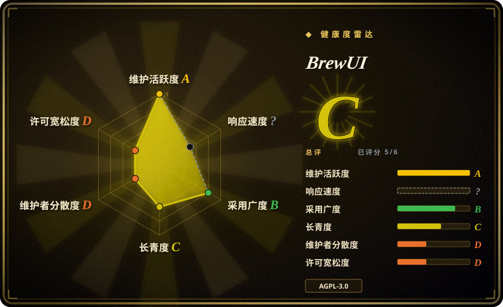
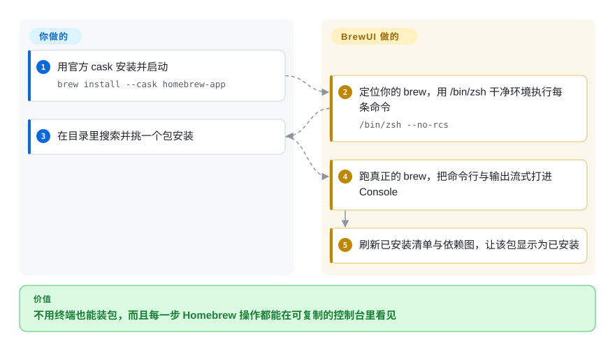

# BrewUI

Homebrew 官方的 macOS 图形前端：一个 SwiftUI 外壳，驱动你机器上真正的 `brew`，并把每条命令连同流式输出显示在可复制的控制台里——但它要求 macOS 26，而且不管理 tap 与自定义 prefix。

## 何时使用

你把 Homebrew 当作 Mac 上唯一的事实源，而真正需要定期更新软件包的那个人不习惯终端——或者你习惯终端，只是不想再解释 formula 是什么。你想要一个窗口：列出已装了什么、哪些过期，一键安装与升级，而且——这一点决定了选型——绝不隐藏自己做了什么。每次操作的最后，都有一条原样的 `brew install …` 命令和它的流式输出留在可选中、可复制的 Console 里，所以在图形界面里撞到的失败，能在 shell 里一字不差地复现。

在几个 Homebrew 前端里选 BrewUI，是因为你要的正是**官方那个**：它把已安装的 `brew` 当作唯一事实源，不碰 Homebrew 内部，且由同一个拥有 CLI 的组织发布。对 Applite、CaskHub、Cork、Cakebrew 的决定性取舍是「出身与透明」对「覆盖面」：BrewUI 是唯一由 Homebrew 官方发布的，也是唯一会把底层命令摊开给你看的，同时也是唯一在 macOS 26 以下根本不启动的。

## 怎么用起来

BrewUI 是你已有 `brew` 之上的一层 SwiftUI 外壳——它既不自带包管理器，也不重新实现一个。启动时它先定位 `brew`（优先 `/opt/homebrew/bin/brew`，其次是 `/usr/local/bin/brew`），之后每条命令都通过 `/bin/zsh` 加 `--no-rcs --no-global-rcs` 和一个被清空的 `PATH` 执行；这就是为什么你的 shell alias 和导出变量配置不了它、Homebrew 选项只能写进 `brew.env` 的原因。Homebrew 能廉价回答的读取（已安装清单、doctor 输出、`brew config`）走 CLI，而浏览与搜索用的目录来自 `formulae.brew.sh` 的 JSON API，带 ETag 缓存。所有会改动系统的操作都汇入同一个 actor（`SerialBrewCommandCenter`），由它串行化、按操作 ID 去重并发布输出流。你负责挑要装什么、决定要不要升级；BrewUI 负责定位二进制、保持环境干净、执行操作，以及事后刷新清单与依赖图。

<!-- flow-steps:begin (generated from flows/brewui.json by tools/flow_card.py — do not edit) -->

流程文字版

1. **你**：用官方 cask 安装并启动 — `brew install --cask homebrew-app`
2. **BrewUI**：定位你的 brew，用 /bin/zsh 干净环境执行每条命令 — `/bin/zsh --no-rcs`
3. **你**：在目录里搜索并挑一个包安装
4. **BrewUI**：跑真正的 brew，把命令行与输出流式打进 Console
5. **BrewUI**：刷新已安装清单与依赖图，让该包显示为已安装

**价值**：不用终端也能装包，而且每一步 Homebrew 操作都能在可复制的控制台里看见

<!-- flow-steps:end -->

## 何时不用

- **你的系统是 macOS 25 或更早。** `Package.swift` 里写的是 `.macOS("26.0")`，Xcode 工程部署目标是 26.2，cask 是 `depends_on macos: :tahoe`，而且从 v0.1.0 起就是这样，所以旧系统上没有任何可用构建。改用 [Applite](applite.zh.md)（macOS 14+）、[CaskHub](caskhub.zh.md)（macOS 15.6+）或 [Cork](cork.zh.md)（macOS 14+）。
- **你要管理 tap、services，或者非默认 prefix。** BrewUI 自己的架构文档把「不管理自定义 prefix 与自定义 tap」列为产品约束。要管 tap 和 services 用 [Cork](cork.zh.md)；只要 cask、又想指向任意 prefix，用 [Applite](applite.zh.md)。
- **你要把一台机器的包清单当成文件导出导入。** BrewUI 没有 Brewfile 导入导出。用 [Applite](applite.zh.md)（带逐 App 勾选）或 [Cork](cork.zh.md)。
- **用户拿到的是一台从没开过终端的新 Mac。** BrewUI 要求 Homebrew 已经装好，而干净机器上这第一步就意味着开终端装 Xcode 命令行工具。用首启自带 Homebrew 的 [Applite](applite.zh.md)，或会引导用户安装 Homebrew 的 [CaskHub](caskhub.zh.md)。
- **你打算 fork 之后分发改造版。** BrewUI 是 AGPL-3.0，含网络使用条款，条款会随任何被分发的衍生品一起走。把宽松复用当作决定因素时应改用 [Applite](applite.zh.md)（MIT）。
- **你要一个能冻结多年、经过时间检验的应用。** BrewUI 只有约六个月历史且未到 1.0，问题列表里已有崩溃与安装失败的报告。要更长的履历用 [Cork](cork.zh.md)，或者判断 brew CLI 本身已经够用。
- **你只装命令行 formula、根本不想要图形界面。** 直接用 Homebrew 即可；多一层 GUI 只增加安装面，并不会把终端从你的工作流里去掉。`[推断]`

## 横向对比

| 替代品 | 是否收录 | 我们的评价 | 取舍 |
|---|---|---|---|
| [Applite](applite.zh.md) | ✅ | 当完全不能假设用户有终端时，选 Applite；当你要官方前端、并且要把底层每条命令摊开看时，选 BrewUI。 | Applite 拿到的是自带 Homebrew、macOS 14 支持、Brewfile 往返和 MIT 宽松许可；付出的是只支持 cask、且看不到 brew 在做什么。BrewUI 拿到的是 formula 与 cask 都覆盖、官方出品和透明控制台；付出的是 macOS 26 门槛和没有文件级导出。 |
| [CaskHub](caskhub.zh.md) | ✅ | 当任务是在 macOS 15.6+ 上浏览并安装**应用**、且想要应用商店的感觉时，选 CaskHub；当 formula 也在范围内、或你需要看见命令时，选 BrewUI。 | CaskHub 拿到的是五者中近期安装触达最广、目录浏览最丰富；付出的是只支持 cask 以及 Sentry 与 TelemetryDeck 遥测。BrewUI 拿到的是 formula 支持和无遥测控制台；付出的是更薄弱的浏览体验与 macOS 26 门槛。 |
| [Cork](cork.zh.md) | ✅ | 当你想要最完整的 Homebrew 操作面——tap、services、标签、菜单栏更新——时选 Cork；想要免费且官方时选 BrewUI。 | Cork 拿到的是 Homebrew 本身都没有的功能和 macOS 14 支持；付出的是预编译版 25€ 授权和一份限制性的 source-available 许可。BrewUI 拿到的是零成本官方分发和一份你真能复用的 AGPL 源码；付出的是功能面窄得多。 |
| [Cakebrew](cakebrew.zh.md) | ✅ | 只把 Cakebrew 当作「第一代 Homebrew GUI 长什么样」的参考资料；任何实际使用都选 BrewUI，因为 Cakebrew 的主分支自 2021 年起就没动过。 | Cakebrew 拿到的是长历史和更小的 Objective-C 代码库里的 tap 管理；付出的是五年没有发版、README 里的安装命令是坏的、以及没有 arm64 时代的任何保证。BrewUI 为它的年轻付出的代价是 macOS 26 门槛和 1.0 之前的变动。 |

## 技术栈

- **语言：** Swift 6.2，Swift 6 语言模式，所有 target 都开启严格并发（`defaultIsolation` / `@MainActor` / actor）。
- **界面：** SwiftUI，仅在 SwiftUI 满足不了需求时桥接 AppKit；一套成体系的设计系统（颜色 token、字号阶、间距、动效）写在 `AGENTS.md` 里。
- **组织：** 一个名为 `BrewKit` 的 Swift 包，21 个 target，按 Clean Architecture 加 MVVM 组织（`View → ViewModel → Repository 或 Interactor → Services → brew CLI 或 JSON API`）。Feature 之间禁止互相 import，由外壳通过 `BrewAppEnvironment` 组合。
- **外部依赖：** 只有一个——`swift-subprocess`，锁定 `1.0.0`。原因是控制终端的 pty 需要在 fork 与 exec 之间调用 `setsid()`，而 `Foundation.Process` 表达不了。
- **数据源：** `brew` CLI（已安装清单、doctor、config）与 `formulae.brew.sh` 上的 Homebrew JSON API（目录、分析数据）。
- **存储：** 统一命名空间 `sh.brew.app/`——可重建的目录与分析数据在 `~/Library/Caches`，待上报的崩溃报告在 `~/Library/Application Support`，会话记录在 `~/Library/Logs`。
- **工具链：** 通过 Mint 锁定 SwiftFormat 与 SwiftLint，自研 `BrewUILint`（基于 SwiftSyntax）规则集，以及带 baseline 的 Periphery 死代码门。

## 依赖

- **系统：** macOS 26 或更新。其他版本一律不支持。
- **Homebrew：** 必须已安装，且位于默认 prefix（`/opt/homebrew` 或 `/usr/local`）——BrewUI 会定位它、缺失时优雅降级，但不会替你安装。
- **运行时：** `/bin/zsh`，以 `--no-rcs --no-global-rcs` 调用；没有守护进程、没有后台服务、没有常驻 helper。唯一的辅助进程是自升级助手，只在应用升级期间运行。
- **网络：** `formulae.brew.sh`（以及 Homebrew 自己会拉取的内容）。没有账号、没有遥测、没有托管后端。
- **共存：** 应用自己的 `homebrew-app` cask 被排除在包列表、计数和批量升级之外，以免它通过常规路径升级自己。

## 运维难度

**用起来低，从源码构建中等。** 使用就是装一个 cask、开一个窗口——没有服务、没有配置文件、没有数据库。真正要花心思的有两处。第一，配置刻意**不走**你的 shell：alias 与导出变量一律被忽略，选项必须以字面 `NAME=value` 写进 `~/.homebrew/brew.env` 或安装级／系统级 `brew.env`，然后重启应用。第二，从源码构建需要 Xcode 26、`./scripts/bootstrap` 流程（Mint、SwiftFormat/SwiftLint、git hooks），以及在 `Configurations/Signing.local.xcconfig` 里填 Apple Team ID；确定性 UI 测试套件还需要辅助功能与自动化权限，并要求屏幕保持解锁。

## 健康度与可持续性

- **维护活跃度——截至 2026-09-20 非常活跃。** 仓库创建于 2026-03-02；最后提交 2026-09-18；12 个 release，最新 v0.4.3 发布于 2026-09-17；最近五个统计周提交数为 27／19／42／78／52。未归档。
- **维护者分散度——强组织里一个人主导。** 共 14 位贡献者，但 `graeme` 约占 1,118 次提交贡献中的 835 次，`MikeMcQuaid` 与项目自己的 bot 远远落后。话语权集中在一个人身上；对冲因素是项目挂在 Homebrew 组织下，而不是个人账号下。
- **背书与长青度——官方背书，但非常年轻。** 由 Homebrew 亲自发布，对 Homebrew 前端来说这是可能的最强出处。弱在年龄：截至 2026-09 约 6.5 个月、版本停在 v0.x，所以 Lindy 先验在两个方向上都还用不上。
- **采用与生态——下载增长快、安装基数小、合并率高。** 累计 release 资产下载约 67.8k，截至 2026-09-20 的近 30 天 cask 安装 747 次（cask 榜约第 248，份额 0.06%），对应 2,113 star、57 fork。已合并 193 个 PR、仅 6 个待处理，对这个年龄的仓库来说算异常顺畅的评审管线。
- **风险标记——AGPL-3.0 与硬性系统门槛。** 网络使用条款对任何再分发改造版的人都有约束。macOS 26 要求是刻意的产品约束（有文档记录、并非疏漏），但它是最实际的限制。核实时的未关闭报告里已有一条崩溃报告，以及一条因 `sudo` 无法弹出密码提示而失败的 cask 安装。
- **雷达上有两个轴渲染为 `?`，两个原因都是结构性的。** 采用广度是 `no_package_structural`——靠 cask 分发的应用没有包注册表可供该轴读取，所以上面的下载量与 cask 安装量是替代证据，而不是分数。响应速度是 `no_window_signal`：在这么年轻的仓库上，抽样的 90 天里没有找到合格的首次响应窗口。`?` 表示拿不到信号，永远不等于低分。

## 存疑（未验证）

- `[未验证]` **这个年龄下的稳定性。** 截至 2026-09 只有约 6.5 个月、一条 v0.4.x 的版本线；Lindy 推理所需的维护记录还不存在。
- `[未验证]` **签名与公证**由发布工作流自我声明（Developer ID、`notarize: true`、强化运行时、CI 检查签名里带时间戳）。这里没有独立检查签名产物本身。
- `[未验证]` **「BrewUI 不沙箱」这一说法**来自其架构文档自述「unsandboxed, with Homebrew installed separately」；仓库树里没有找到 entitlements 文件来证实或推翻。
- `[推断]` **193 个已合并 PR 反映的是异常顺畅的评审管线**；GitHub 元数据无法把它与「同一作者的一批自动化提交」区分开。
- `[未验证]` **`brew.env` 的配置行为如其文档所述。** 三层文件优先级与 `HOMEBREW_SYSTEM_ENV_TAKES_PRIORITY` 的语义来自项目文档与 Homebrew man page，这里没有实际复现。
- `[推断]` **「暂不管理自定义 prefix 与 tap」可能已经过时**——「initially」暗示未来会变，而且设计系统里已经有 Tap 的 SF Symbol。依赖这个「没有」之前请先查实时仓库。
- `[未验证]` **依赖数量与文件／行数**（生产树 239 个 Swift 文件、约 21.3k 行生产代码、约 23.5k 行测试代码、1,150 个测试函数）是 2026-09-20 从默认分支浅克隆里数出来的，会随时间变化。
