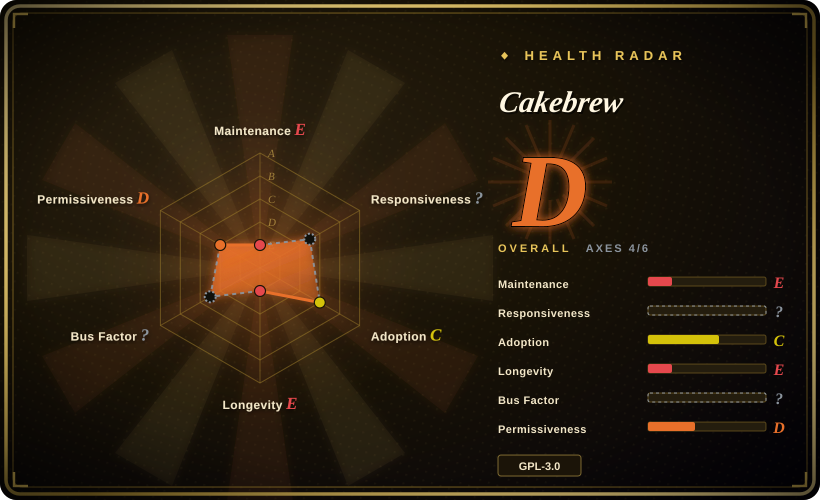
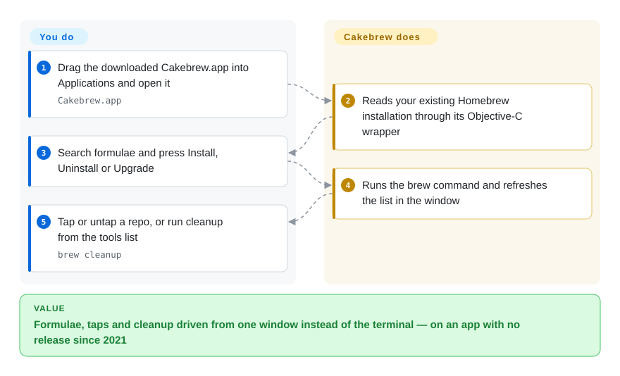

# Cakebrew

The 2014-era Homebrew GUI for managing formulae, taps and cleanup from a window — still the most-forked name in the niche, and effectively unmaintained since March 2021.

## When to use

The honest trigger scenario is narrow: you already run Cakebrew on an older Intel Mac and it still does what you need, or you need a **reference implementation** of a minimal Homebrew front end — how little it takes to wrap `brew` in a window, how tap management was modelled before SwiftUI existed, what a formulae-first UI looked like in the Objective-C era. It is a small, readable codebase (31 contributors, one dominant author, one release in its GitHub history) and it covers search, install, uninstall, upgrade, tap/untap, `brew` update and the cleanup tool.

If you are choosing a Homebrew GUI **today**, Cakebrew is not the answer, and the deciding reason is not taste: its default branch has not received a commit since 2021-03-06, its only GitHub release is v1.3 from 2021-03-12, and the install command printed in its own README no longer resolves. Reach for [Applite](applite.md), [BrewUI](brewui.md), [CaskHub](caskhub.md) or [Cork](cork.md) instead, and treat this page as a pattern source.

## How it works

Cakebrew is a Cocoa/AppKit application that shells out to the Homebrew you already have. It wraps the `brew` executable through an Objective-C interface layer, presents formulae in a sidebar-and-list window, and runs the install, uninstall, upgrade, tap/untap, update and cleanup operations as subprocesses, refreshing the list afterwards. There is no bundled package manager, no catalogue API and no service: the app is a thin controller over the CLI, and the entire value proposition is that the CLI is driven from buttons rather than typed. Sparkle handles app updates from the vendor's own site, and the interface is localised into English, Portuguese, German and Simplified Chinese. You own every decision; Cakebrew owns the window, the subprocess calls and the list refresh.

<!-- flow-steps:begin (generated from flows/cakebrew.json by tools/flow_card.py — do not edit) -->

Text version of the flow

1. **You**: Drag the downloaded Cakebrew.app into Applications and open it — `Cakebrew.app`
2. **Cakebrew**: Reads your existing Homebrew installation through its Objective-C wrapper
3. **You**: Search formulae and press Install, Uninstall or Upgrade
4. **Cakebrew**: Runs the brew command and refreshes the list in the window
5. **You**: Tap or untap a repo, or run cleanup from the tools list — `brew cleanup`

**Value**: Formulae, taps and cleanup driven from one window instead of the terminal — on an app with no release since 2021

<!-- flow-steps:end -->

## When NOT to use

- **Any new macOS deployment, especially on Apple Silicon.** The project's deployment targets are 10.10 and 10.15, the last commit is from 2021-03-06, and there is no release since v1.3 in March 2021. Its own issue tracker contains a 2024 issue literally asking "Is this repo maintained?". Use [BrewUI](brewui.md), [Applite](applite.md), [CaskHub](caskhub.md) or [Cork](cork.md) — all four are active.
- **You want to install it with Homebrew.** The README tells you `brew install cakebrew --cask`, but **no such cask exists**; the name in the official cask registry that matches is `cakebrewjs`, an unrelated SourceForge Electron app that Homebrew disabled on 2026-09-01 because it fails the Gatekeeper check. Use [BrewUI](brewui.md) or [CaskHub](caskhub.md) when you want a cask-installable GUI, or [Cork](cork.md) for a paid-but-supported one.
- **You need casks, not just formulae.** Cakebrew's documented scope is formulae; if the job is installing macOS applications, use [Applite](applite.md) or [CaskHub](caskhub.md), which are built around casks.
- **You need services management, tagging, menu-bar updates or dependency views.** None of these are in Cakebrew's documented feature set; [Cork](cork.md) exists largely because it has them.
- **You need to see the exact command being run, or to copy it.** Cakebrew shows a window, not a transcript. Use [BrewUI](brewui.md) when transparency is the requirement.
- **You need a security or dependency update.** With no commits in over five years, a vulnerability in its Sparkle-era update path or in its Objective-C dependencies will not be fixed upstream. Use any maintained alternative.
- **You want arm64-native behaviour you can rely on.** Support for modern Apple Silicon macOS is not something the repository asserts; treat any successful run as unsupported. `[未验证]`

## Comparison

| Alternative | In index | Our verdict | Tradeoff |
|---|---|---|---|
| [BrewUI](brewui.md) | ✅ | Choose BrewUI for any live use: it is official, shows every command, and covers formulae and casks; choose Cakebrew only if you specifically need a 2021-era Objective-C reference to read. | BrewUI gains active maintenance, a transparent console and a signed/notarised release pipeline; it pays with a macOS 26 floor and a pre-1.0 feature set. Cakebrew gains a small, long-lived codebase with tap management; it pays with five years without a release. |
| [Applite](applite.md) | ✅ | Choose Applite when a non-technical user needs to install apps with no terminal at all; Cakebrew cannot serve that user, because it needs Homebrew installed and manages formulae. | Applite gains self-installing Homebrew, an app-store metaphor and macOS 14 support; it pays with cask-only scope. Cakebrew gains formula and tap management; it pays with abandonment and no cask to install it from. |
| [CaskHub](caskhub.md) | ✅ | Choose CaskHub for browsing and installing macOS apps on macOS 15.6+; choose Cakebrew only as a historical artefact. | CaskHub gains a current catalogue pipeline and the strongest recent install numbers; it pays with cask-only scope and telemetry. Cakebrew has no telemetry, but that is a side effect of being frozen rather than a design win. |
| [Cork](cork.md) | ✅ | Choose Cork when you need the fullest Homebrew surface and will pay for the prebuilt; Cakebrew's tap management is the only feature where they overlap. | Cork gains services, tagging, menu-bar updates and active development on macOS 14+; it pays with a 25 € licence and a restrictive source-available licence. Cakebrew's GPL-3.0 is more permissive but its code has not moved since 2021. |

## Tech stack

- **Language / UI:** Objective-C with AppKit (Cocoa), not Swift and not SwiftUI.
- **Homebrew integration:** a thin Objective-C wrapper that invokes the installed `brew` executable and parses its output.
- **Updates:** Sparkle, fetching from the project's own website rather than a package manager.
- **CI:** a Travis CI badge in the README; Travis no longer offers this service, so that pipeline cannot be running as configured. `[推断]`
- **Localisation:** English, Portuguese, German and Simplified Chinese.

## Dependencies

- **OS:** deployment targets of macOS 10.10 and 10.15 across the project; no arm64-era guarantee is documented.
- **Homebrew:** must already be installed; there is no bootstrap path.
- **Runtime services:** none — no daemon, no helper.
- **Distribution:** direct download from cakebrew.com. There is no Homebrew cask, so there is no cask-managed install or upgrade path.
- **Build:** Xcode with the project's Objective-C sources; the README's contributor notes are from the Big Sur era and assume that toolchain.

## Ops difficulty

**Low to run, high to justify.** The app is a single window over the local `brew`; nothing to deploy, nothing to supervise. The operational problem is not effort but risk: an unmaintained, code-signed-for-2021 app that shells out to a package manager whose own output format has changed repeatedly since. There is no cask, so upgrades are manual downloads from a website; the site still advertises version 1.2.3 while the GitHub release is v1.3, which makes "which build am I actually running" a real question. If it breaks, no one upstream is going to fix it.

## Health & viability

- **Maintenance — effectively abandoned as of 2026-09-20.** Default-branch HEAD is 2021-03-06; `stable` is 2021-03-04; the only GitHub release is v1.3, published 2021-03-12. That is over five years of silence. The repository's `pushed_at` (2024-01-07) is later, but it reflects a push to a non-default branch and not a commit on `main`.
- **Governance / bus factor — one author, no successor.** 31 contributors total, but `brunophilipe` accounts for roughly 423 of the tracked contributions; no co-maintainer or org has taken over.
- **Backing & longevity — the cautionary case for age alone.** Created 2014-04-02 — 4553 days, about 12.5 years, as of 2026-09 — so it is the oldest project in this category and it has the star count to show for it (~5.0k). Under an age × still-active reading, none of that translates into a bet you should take: age without activity is exactly the combination the Lindy prior is meant to discount.
- **Adoption & ecosystem — legacy footprint, no distribution channel.** 257 forks and 189 issues filed over twelve years, with 64 still open. There is no cask, so there is no measurable current install base at all.
- **Responsiveness — 64 of 189 issues open, including the maintenance question itself.** A 2024-10 issue titled "Is this repo maintained?" and a 2025-01 issue reporting that Homebrew installation does not work remain open as of 2026-09-20.
- **Risk flags — no cask, stale install instructions, defunct CI.** The README's install command is wrong, the project still describes "OS X", and its CI badge points at a service that no longer exists. GPL-3.0 is the one clean signal here.
- **Three axes are `?`, and each reason is structural rather than a hidden low score.** Responsiveness is `no_traffic` (no qualifying first-response activity in the window), adoption is `no_package_structural` (no registry for a cask-less app), and governance is `unattributable` (no attributable recent commit window on a dormant default branch). The grades that actually carry the verdict here are the `E` on maintenance and longevity, both of which line up with the 2021 default-branch HEAD.

## Caveats (unverified)

- `[未验证]` **Whether Cakebrew runs at all on current macOS, and on Apple Silicon.** No reproduction was attempted; the deployment targets are 10.10/10.15 and the last commit predates Apple Silicon. Treat any successful run as unsupported.
- `[未验证]` **The app is not notarised or is otherwise blocked by Gatekeeper.** Not tested; the download comes from the vendor's website rather than a cask, and no notarisation evidence was found.
- `[推断]` **Travis CI can no longer be running as configured**, inferred from the badge in the README and the service's discontinuation; the badge is not proof either way.
- `[未验证]` **"No cask exists"** is established only against the official `formulae.brew.sh/api/cask.json` snapshot read on 2026-09-20. A third-party tap could carry one; the official channel does not.
- `[未验证]` **Whether Cakebrew supports casks.** Its README and features describe formulae; absence from the documented feature list is not proof the code has no cask path.
- `[推断]` **`pushed_at` of 2024-01-07 indicates a non-default-branch push**, inferred from the default branch's HEAD date of 2021-03-06 plus the branch list (six branches, all with older heads). The specific 2024 ref was not identified.
- `[未验证]` **Issue and PR counts** (189 issues / 64 open, 78 PRs / 5 open) are GitHub search counts as of 2026-09-20 and include bot traffic.
