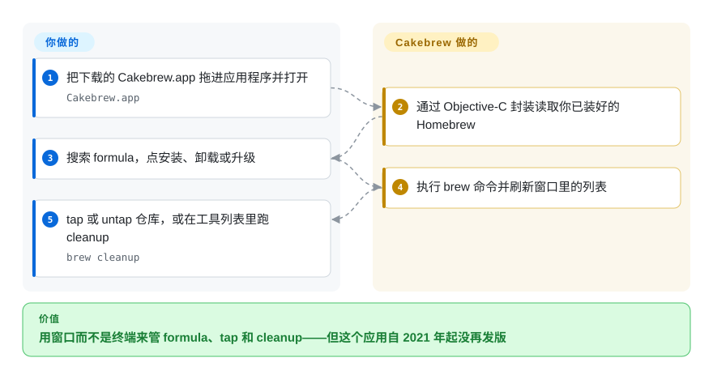

# Cakebrew

2014 年那代的 Homebrew 图形前端：用窗口管理 formula、tap 与 cleanup——至今仍是这个细分领域被 fork 最多的名字，而它自 2021 年 3 月起实际上已无人维护。

## 何时使用

诚实地说，触发场景很窄：你已经在某台较老的 Intel Mac 上跑着 Cakebrew，它仍然够用；或者你需要一份**极简 Homebrew 前端的参考实现**——把 `brew` 包进一个窗口需要多少东西、SwiftUI 出现之前 tap 管理是怎么建模的、Objective-C 时代以 formula 为中心的界面长什么样。它的代码库小且可读（31 位贡献者、一位主导作者、GitHub 历史里只有一个 release），功能覆盖搜索、安装、卸载、升级、tap／untap、`brew` update 与 cleanup 工具。

如果你是在**今天**挑一个 Homebrew 图形前端，Cakebrew 不是答案，而决定性的原因不是口味：它的主分支自 2021-03-06 起没有新提交，唯一的 GitHub release 是 2021-03-12 的 v1.3，而它自己 README 里印着的安装命令已经无法解析。请改用 [Applite](applite.zh.md)、[BrewUI](brewui.zh.md)、[CaskHub](caskhub.zh.md) 或 [Cork](cork.zh.md)，并把本页当作设计参考。

## 怎么用起来

Cakebrew 是一个 Cocoa／AppKit 应用，调用你已装好的 Homebrew。它通过一层 Objective-C 接口封装 `brew` 可执行文件，用侧边栏加列表的窗口展示 formula，把安装、卸载、升级、tap／untap、update 与 cleanup 作为子进程执行，随后刷新列表。它不自带包管理器、没有目录 API、没有服务：整个应用是 CLI 之上的一层薄控制器，全部价值主张就是把「用键盘敲」换成「用按钮点」。应用更新由 Sparkle 从厂商自己的网站拉取，界面支持英语、葡萄牙语、德语与简体中文。每个决定都是你的；窗口、子进程调用与列表刷新是 Cakebrew 的。

<!-- flow-steps:begin (generated from flows/cakebrew.json by tools/flow_card.py — do not edit) -->

流程文字版

1. **你**：把下载的 Cakebrew.app 拖进应用程序并打开 — `Cakebrew.app`
2. **Cakebrew**：通过 Objective-C 封装读取你已装好的 Homebrew
3. **你**：搜索 formula，点安装、卸载或升级
4. **Cakebrew**：执行 brew 命令并刷新窗口里的列表
5. **你**：tap 或 untap 仓库，或在工具列表里跑 cleanup — `brew cleanup`

**价值**：用窗口而不是终端来管 formula、tap 和 cleanup——但这个应用自 2021 年起没再发版

<!-- flow-steps:end -->

## 何时不用

- **任何新的 macOS 部署，尤其是 Apple Silicon。** 工程的部署目标是 10.10 与 10.15，最后一次提交在 2021-03-06，自 2021 年 3 月的 v1.3 之后没有 release。它自己的 issue 列表里有一条 2024 年的问题，标题直接就是「这仓库还维护吗」。请用 [BrewUI](brewui.zh.md)、[Applite](applite.zh.md)、[CaskHub](caskhub.zh.md) 或 [Cork](cork.zh.md)——这四个都在活跃开发。
- **你想用 Homebrew 安装它。** README 让你执行 `brew install cakebrew --cask`，但**这个 cask 根本不存在**；官方 cask 注册表里名字能匹配上的是 `cakebrewjs`，一个无关的 SourceForge Electron 应用，Homebrew 已于 2026-09-01 因它通不过 Gatekeeper 检查而将其禁用。想要能通过 cask 安装的图形界面就用 [BrewUI](brewui.zh.md) 或 [CaskHub](caskhub.zh.md)；想要付费但有支持的就用 [Cork](cork.zh.md)。
- **你需要装的是 cask，而不只是 formula。** Cakebrew 的文档范围是 formula；如果任务是安装 macOS 应用，用 [Applite](applite.zh.md) 或 [CaskHub](caskhub.zh.md)，它们本来就是围绕 cask 设计的。
- **你需要 services 管理、标签、菜单栏更新或依赖视图。** 这些都不在 Cakebrew 的文档功能里；[Cork](cork.zh.md) 很大程度上正是因为拥有它们而存在。
- **你需要看见并复制正在执行的那条命令。** Cakebrew 给的是一个窗口，不是命令记录。透明度是硬需求时用 [BrewUI](brewui.zh.md)。
- **你需要安全修复或依赖更新。** 五年多没有提交意味着：它的 Sparkle 时代更新路径或 Objective-C 依赖里出现漏洞，上游不会修。请改用任一在维护的替代品。
- **你要能依赖的 arm64 原生行为。** 仓库并没有声明支持现代 Apple Silicon 上的 macOS；就算跑起来了也应当视为不受支持。`[未验证]`

## 横向对比

| 替代品 | 是否收录 | 我们的评价 | 取舍 |
|---|---|---|---|
| [BrewUI](brewui.zh.md) | ✅ | 任何实际使用都选 BrewUI：官方出品、展示每条命令、formula 与 cask 都覆盖；只有当你要读一份 2021 年代的 Objective-C 参考实现时才选 Cakebrew。 | BrewUI 拿到的是活跃维护、透明控制台和签名公证的发布流水线；付出的是 macOS 26 门槛和 1.0 之前的功能集。Cakebrew 拿到的是小而长命的代码库和 tap 管理；付出的是五年没有再发版。 |
| [Applite](applite.zh.md) | ✅ | 当非技术用户需要在完全没有终端的情况下装应用时选 Applite；Cakebrew 服务不了这类用户，因为它要求 Homebrew 已装好，而且管的是 formula。 | Applite 拿到的是自带 Homebrew、应用商店式心智和 macOS 14 支持；付出的是只支持 cask。Cakebrew 拿到的是 formula 与 tap 管理；付出的是被废弃、以及没有可用来安装它的 cask。 |
| [CaskHub](caskhub.zh.md) | ✅ | 在 macOS 15.6+ 上浏览并安装 macOS 应用时选 CaskHub；Cakebrew 只作为历史物件看待。 | CaskHub 拿到的是当下的目录管线和最强的近期安装数据；付出的是只支持 cask 与遥测。Cakebrew 没有遥测，但那是被冻结的副作用，不是设计上的胜利。 |
| [Cork](cork.zh.md) | ✅ | 当你需要最完整的 Homebrew 操作面、且愿意为预编译版付费时选 Cork；两者唯一重叠的功能是 tap 管理。 | Cork 拿到的是 services、标签、菜单栏更新，以及在 macOS 14+ 上的活跃开发；付出的是 25€ 授权和限制性的 source-available 许可。Cakebrew 的 GPL-3.0 更宽松，但代码自 2021 年起没动过。 |

## 技术栈

- **语言与界面：** Objective-C 加 AppKit（Cocoa），不是 Swift，也不是 SwiftUI。
- **接 Homebrew 的方式：** 一层薄 Objective-C 封装，调用已安装的 `brew` 可执行文件并解析其输出。
- **更新机制：** Sparkle，从项目自己的网站拉取，而不是走任何包管理器。
- **CI：** README 里挂着一个 Travis CI 徽章；Travis 已不再提供该服务，所以这条流水线不可能按原配置在跑。`[推断]`
- **本地化：** 英语、葡萄牙语、德语、简体中文。

## 依赖

- **系统：** 工程内混用 macOS 10.10 与 10.15 两个部署目标；没有文档化的 arm64 时代保证。
- **Homebrew：** 必须已安装；没有引导安装的路径。
- **运行时服务：** 无——没有守护进程、没有 helper。
- **分发：** 从 cakebrew.com 直接下载。没有 Homebrew cask，因此也没有由 cask 管理的安装与升级路径。
- **构建：** 用 Xcode 编译其 Objective-C 源码；README 里给贡献者的说明停留在 Big Sur 时代，并假定那套工具链。

## 运维难度

**用起来低，要说服自己用它则很难。** 应用只是本地 `brew` 之上的一扇窗口；没有东西要部署，也没有东西要盯。问题不在工作量而在风险：一个 2021 年签名的、未维护的应用，去调用一个其输出格式此后已多次变化的包管理器。没有 cask，升级只能从网站手动下载；而网站至今仍写着版本 1.2.3，GitHub release 却是 v1.3，于是「我到底在跑哪个构建」变成一个真实的问题。一旦坏掉，上游不会有人修。

## 健康度与可持续性

- **维护活跃度——截至 2026-09-20 实际已废弃。** 主分支 HEAD 是 2021-03-06；`stable` 是 2021-03-04；唯一的 GitHub release 是 2021-03-12 的 v1.3。五年多毫无动静。仓库的 `pushed_at`（2024-01-07）更晚，但那反映的是推送到非默认分支，而不是 `main` 上的提交。
- **维护者分散度——一位作者，没有继任者。** 共 31 位贡献者，但 `brunophilipe` 约占已统计贡献中的 423 次；没有共同维护者或组织接手。
- **背书与长青度——「只有年龄」的反面教材。** 创建于 2014-04-02，到 2026-09 已 4553 天、约 12.5 年，是这个类目里最老的项目，star 数也反映了这一点（约 5.0k）。按「年龄 × 仍活跃」来读，这些都不构成你该下注的理由：有年龄、没活跃，恰恰是 Lindy 先验要打折的组合。
- **采用与生态——存量足迹，没有分发渠道。** 十二年累积 257 个 fork、189 条 issue，其中 64 条仍未关闭。没有 cask，因此也没有任何可测量的当下安装基数。
- **响应速度——189 条 issue 中 64 条未关闭，包括那条关于是否维护的问题本身。** 一条 2024-10 的「这仓库还维护吗」，以及一条 2025-01 报告「无法通过 Homebrew 安装」的 issue，截至 2026-09-20 都还开着。
- **风险标记——没有 cask、安装说明失效、CI 已停服。** README 的安装命令是错的，项目仍在用「OS X」这一称呼，CI 徽章指向一个已不存在的服务。这里唯一干净的信号是 GPL-3.0。
- **有三个轴是 `?`，每个原因都是结构性的，而不是被藏起来的低分。** 响应速度是 `no_traffic`（窗口内没有合格的首次响应活动），采用广度是 `no_package_structural`（一个没有 cask 的应用没有注册表可读），维护者分散度是 `unattributable`（休眠的默认分支上没有可归属的近期提交窗口）。真正支撑本页裁决的档位是维护活跃度与长青度上的 `E`，两者都与 2021 年的主分支 HEAD 一致。

## 存疑（未验证）

- `[未验证]` **Cakebrew 在当代 macOS 与 Apple Silicon 上能否运行。** 没有做复现；部署目标是 10.10／10.15，最后一次提交早于 Apple Silicon。就算跑起来也应视为不受支持。
- `[未验证]` **该应用未公证或被 Gatekeeper 拦下。** 没有实测；下载来自厂商网站而非 cask，也没有找到公证证据。
- `[推断]` **Travis CI 不可能按原配置继续运行**，依据是 README 上的徽章与该服务的停运；徽章本身不构成任一方向的证明。
- `[未验证]` **「没有 cask」** 只针对 2026-09-20 读取的官方 `formulae.brew.sh/api/cask.json` 快照成立。第三方 tap 里可能有一个；官方渠道没有。
- `[未验证]` **Cakebrew 是否支持 cask。** 它的 README 与功能列表说的都是 formula；功能列表里没有，并不等于代码里没有 cask 路径。
- `[推断]` **`pushed_at` 为 2024-01-07 意味着一次非默认分支推送**，依据是默认分支 HEAD 停在 2021-03-06，加上分支列表（六个分支，HEAD 都更早）。那个 2024 年的具体 ref 没有查明。
- `[未验证]` **issue 与 PR 计数**（189 条 issue／64 条未关闭，78 个 PR／5 个待处理）是 2026-09-20 的 GitHub 搜索计数，含 bot 流量。
