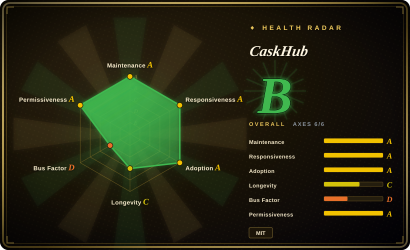
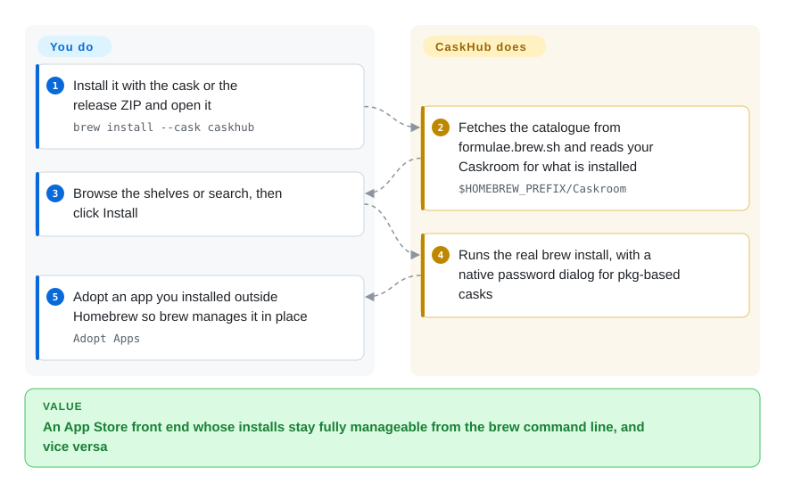

# CaskHub

A free, MIT-licensed App Store front end for Homebrew Cask with the richest catalogue browsing of the macOS GUIs — popularity charts, categories, real app icons — at the cost of cask-only scope and built-in telemetry.

## When to use

You want the *browsing* experience, not just the install button. You are on macOS 15.6 or later, the job is installing and updating Mac applications, and you want to be able to discover things: shelves organised by category, a top-100 chart ranked by actual install popularity, a 30/90/365-day analytics window, a "recently added" feed, a rotating hero pick. You also want the annoying parts handled — a native password dialog for pkg-based casks that would otherwise drop you into a terminal prompt, update detection smart enough to skip self-updating apps and version-suffix noise, and the ability to "adopt" an app you installed from a downloaded DMG so `brew` manages it from then on without moving it.

Pick CaskHub over [Applite](applite.md) when you want a deeper catalogue surface and are willing to accept telemetry; pick it over [Cork](cork.md) when you want free and cask-only rather than paid and broad. Its decisive characteristic is that it splits the work: browsing comes from the public Homebrew API and a bundled offline snapshot, installed-state detection reads your Caskroom directly without shelling out, and only the operations that change state go through your real `brew` — which is why anything it installs stays fully manageable from the command line, and vice versa. The cost of that convenience is the telemetry stack in the shipped build.

## How it works

CaskHub talks to Homebrew at three levels rather than treating it as one black box. The browse side is pure data: the catalogue and install analytics come from the public Homebrew API at `formulae.brew.sh`, and extras — categories, first-seen dates, original app icons — arrive pre-computed from a companion pipeline (CaskFlow) via GitHub Releases, with a snapshot bundled into the app so browsing never blocks on the network. The installed side does not ask brew at all: it reads install receipts directly out of `$HOMEBREW_PREFIX/Caskroom`, which is fast and shell-free. Only the third level shells out: installs, updates and uninstalls run through your real `brew` binary, so the result is identical to what you would have got by typing the command. You own what to browse and what to click, plus the optional "Adopt" action that brings a non-Homebrew app under brew management in place; CaskHub owns the catalogue pipeline, the icon cache, the Caskroom read, the progress state and the update heuristics.

<!-- flow-steps:begin (generated from flows/caskhub.json by tools/flow_card.py — do not edit) -->

Text version of the flow

1. **You**: Install it with the cask or the release ZIP and open it — `brew install --cask caskhub`
2. **CaskHub**: Fetches the catalogue from formulae.brew.sh and reads your Caskroom for what is installed — `$HOMEBREW_PREFIX/Caskroom`
3. **You**: Browse the shelves or search, then click Install
4. **CaskHub**: Runs the real brew install, with a native password dialog for pkg-based casks
5. **You**: Adopt an app you installed outside Homebrew so brew manages it in place — `Adopt Apps`

**Value**: An App Store front end whose installs stay fully manageable from the brew command line, and vice versa

<!-- flow-steps:end -->

## When NOT to use

- **You need to manage formulae.** CaskHub is casks only — no `brew install ripgrep`, no services, no `brew cleanup`. Use [BrewUI](brewui.md) or [Cork](cork.md).
- **Telemetry is a blocker.** The shipped app bundles Sentry (crash reporting and usage metrics) and TelemetryDeck (session and acquisition analytics). Use [Applite](applite.md) or [Cork](cork.md), both of which advertise no telemetry, or [BrewUI](brewui.md).
- **You are below macOS 15.6.** The README badge and the cask's `depends_on macos: :sequoia` both point at 15.6/minimum 15. Use [Applite](applite.md) or [Cork](cork.md) on macOS 14, or [BrewUI](brewui.md) — but note that one wants macOS 26.
- **You need a project with a maintenance record.** CaskHub was created 2026-02-06 and is at v0.8.x; it has three contributors in total, one of whom wrote essentially all of it. Use [Cork](cork.md) (2022) or [Applite](applite.md) (2023) when age and continuity matter.
- **You want to build and ship it under different terms or embed it.** It is MIT and therefore genuinely reusable — that is not the objection; the objection is that there is no release history or governance to lean on. `[推断]` If you need an org behind the code, use [BrewUI](brewui.md).
- **The user has no Homebrew and cannot install it.** CaskHub offers guided setup with custom installation paths, but it does not fetch Homebrew for you the way [Applite](applite.md) does.
- **You want to see the exact commands being run.** There is no command transcript; use [BrewUI](brewui.md) instead.
- **You need the catalogue to be authoritative on first launch offline for a long-lived install.** Browsing works offline from the bundled snapshot, but any snapshot ages; the project runs a release-freshness check in CI precisely because this data goes stale. `[推断]`

## Comparison

| Alternative | In index | Our verdict | Tradeoff |
|---|---|---|---|
| [Applite](applite.md) | ✅ | When the machine may have no Homebrew at all, pick Applite; when it does and you want the richest catalogue browsing, pick CaskHub. | CaskHub gains the strongest recent install numbers, offline browsing and no self-managed brew tree; it pays with Sentry/TelemetryDeck telemetry. Applite gains no-terminal bootstrap and zero telemetry; it pays with a thinner browse surface and a second Homebrew tree. |
| [BrewUI](brewui.md) | ✅ | When formulae are in scope or you need every command visible, pick BrewUI; when the job is macOS apps and you want charts and categories, pick CaskHub. | CaskHub gains macOS 15.6 support, popular charts and Adopt; it pays with cask-only scope and telemetry. BrewUI gains formula coverage, official provenance and a transparent console; it pays with a macOS 26 floor. |
| [Cork](cork.md) | ✅ | When you need services, taps or menu-bar updates and will pay, pick Cork; when you need a free cask store with rich discovery, pick CaskHub. | CaskHub gains free MIT distribution and the deepest cask-catalogue presentation; it pays with cask-only scope. Cork gains feature depth and no telemetry; it pays with 25 € and a restrictive licence. |
| [Cakebrew](cakebrew.md) | ✅ | Choose Cakebrew only as a historical reference; CaskHub occupies the "browse and install apps" slot in the current generation. | CaskHub gains active development and a maintained catalogue pipeline; it pays with a short history and telemetry. Cakebrew gains age and GPL-3.0; it pays with five years without a release and no working install command. |

## Tech stack

- **Language / UI:** Swift and SwiftUI, using `@Observable` view models with `@MainActor` isolation and MVVM.
- **Networking:** a protocol-based layer (`BrewAPIClientProtocol`, `NetworkServiceProtocol`) with dependency injection throughout, plus two-tier icon caching (memory and disk) and HTTP-header-based download-size resolution.
- **Data sources:** the public Homebrew API (`/api/cask.json` and install analytics) for the catalogue, and `$HOMEBREW_PREFIX/Caskroom` receipts for installed-state detection.
- **Companion pipeline:** CaskFlow, a separate repository, generates categories, first-seen dates and original app icons and publishes them as GitHub Releases; a bundled snapshot ships inside the app.
- **Dependencies:** three focused packages — Sparkle (app updates), Sentry (crash reporting and usage metrics) and TelemetryDeck (session and acquisition analytics).
- **Testing / CI:** XCTest on pull requests to `master` and `develop` and on pushes to `develop`, coverage reported to Codecov, static analysis by Codacy, plus a release-freshness check on PRs to `master` that verifies the bundled category data matches the latest CaskFlow release.

## Dependencies

- **OS:** macOS 15.6 or later.
- **Homebrew:** required for installing, updating and uninstalling; browsing works without it. Guided setup covers missing Homebrew, custom installation paths, and picking the native prefix on Apple Silicon or Intel.
- **Runtime services:** none — no daemon, no helper; updates are handled by Sparkle in-app.
- **Network:** `formulae.brew.sh`, the CaskFlow release assets, and whatever Homebrew fetches. Browsing has an offline fallback via the bundled snapshot.
- **Telemetry:** Sentry and TelemetryDeck are compiled into the shipped app.

## Ops difficulty

**Low.** Install from the cask or a release ZIP, open it, browse. There is no service and no database to own; the catalogue is either fetched or served from the bundled snapshot, and the app updates itself through Sparkle. The only operational facts are a hard macOS 15.6 floor and the telemetry stack, which is a policy question rather than an effort question: on a managed device you need to know that a crash/usage reporter and a session-analytics SDK are present before you install it. For a single personal Mac it is effectively zero-maintenance.

## Health & viability

- **Maintenance — active as of 2026-09-20.** Repo created 2026-02-06; last commit 2026-09-10; `pushed_at` 2026-09-20; 20 releases with 0.8.2 on 2026-09-07 and a steady cadence of 0.8.x releases through August–September 2026. Not archived.
- **Governance / bus factor — very thin.** Three contributors total: `alielsokary` with roughly 665 tracked contributions, and two others with 2 and 1. This is a solo project with a CI pipeline, not a team.
- **Backing & longevity — independent, less than a year old, no foundation.** No vendor or foundation; the author is a `User` account. Under a Lindy reading the star count (~1.3k) and the install numbers are attention, not survival.
- **Adoption & ecosystem — the strongest recent install reach of the five.** 2,942 cask installs in the 30 days to 2026-09-20, ranked around 75th overall with a 0.24% share, against ~1.3k stars and 55 forks. The distribution is overwhelmingly through the official cask.
- **Responsiveness — 46 issues filed, 15 open, 0 open pull requests**, which on a seven-month-old solo project is a manageable backlog.
- **Risk flags — telemetry, youth, and a data pipeline you do not control.** Sentry and TelemetryDeck ship in the binary; the categories and icons depend on CaskFlow release assets, so a failure there degrades browsing metadata rather than installs. MIT licence, no relicense history, no open-core gating.
- **The adoption axis is `A`, scored from the Homebrew signal rather than a package registry.** No package registry exists for a cask-distributed app, so the measured cask-install and download figures above are the evidence the radar encodes through the Homebrew tier; `A` reflects real cask-install reach, not an unobtainable `?`.

## Caveats (unverified)

- `[未验证]` **What Sentry and TelemetryDeck actually transmit.** The README names both and describes their roles (crash reporting and usage metrics; session and acquisition analytics); no network capture or privacy-manifest inspection was performed here.
- `[未验证]` **Whether an opt-out for telemetry exists** is not stated in the sources read.
- `[推断]` **The bundled offline snapshot ages.** Browsing is documented to work offline from the snapshot, and the project's own CI runs a release-freshness check against the latest CaskFlow release — both point at staleness being a known concern, but the practical staleness window is not documented.
- `[未验证]` **CaskFlow was not assessed as a project.** It is a companion pipeline in a separate repository; its maintenance state, licence and reliability are outside what was read here for CaskHub.
- `[未验证]` **"Installs stay fully compatible with the command line"** is the README's claim and follows from using your real `brew` binary; it was not exercised.
- `[未验证]` **macOS 15.6 as the real floor.** The README badge says 15.6 and the cask's `depends_on macos: :sequoia` implies 15; the exact cut-off was not verified against the build settings.
- `[未验证]` **Issue, PR and contributor counts** are GitHub figures as of 2026-09-20.
- `[推断]` **The install lead over the other four is real adoption, not a measurement artefact.** The cask count is measured; attributing it to product quality rather than to a launch spike or bot traffic is inference.
