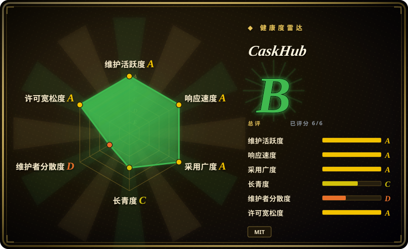
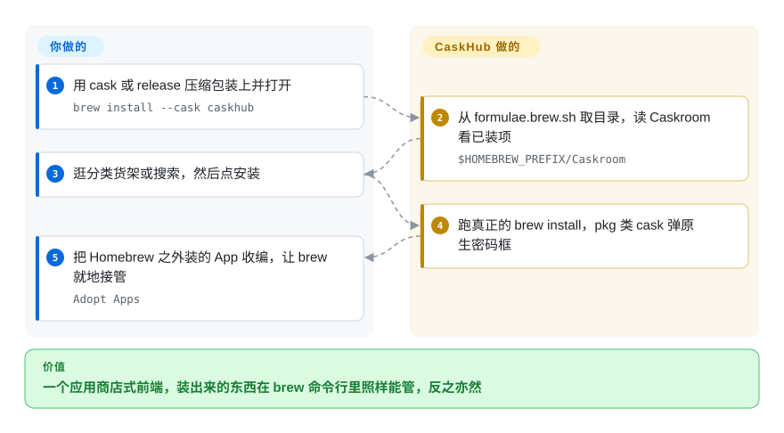

# CaskHub

一个免费、MIT 许可的 Homebrew Cask「应用商店」前端，目录浏览在这批 macOS 图形前端里最丰富——热度榜、分类、真实应用图标——代价是只管 cask，且内置遥测。

## 何时使用

你要的是**逛**的体验，而不只是一个安装按钮。你在 macOS 15.6 或更新版本上，任务是装和更新 Mac 应用，而且你希望能发现新东西：按分类组织的货架、按真实安装热度排的前 100 榜、30／90／365 天的分析窗口、「最近新增」流、以及一个轮换的主推位。你也希望那些烦人的部分被处理掉——对基于 pkg 的 cask 弹出原生密码框，而不是把你甩回终端提示符；更新检测聪明到能跳过自我更新的应用和版本后缀噪声；以及能把从 DMG 装来的应用「收编」进 brew，原位接管、不搬家。

当你想要更深的目录操作面、并且能接受遥测时，选 CaskHub 而不是 [Applite](applite.zh.md)；当你想要免费且只管 cask、而不是付费且面面俱到时，选它而不是 [Cork](cork.zh.md)。它决定性的特征是分工：浏览来自公开的 Homebrew API 加一份内置离线快照，已安装状态直接读你的 Caskroom 而不调用外部命令，只有会改变状态的操作才走你真正的 `brew`——所以它装出来的东西在命令行里照样完全可管，反之亦然。这份便利的代价，是发布出去的应用里那套遥测。

## 怎么用起来

CaskHub 把 Homebrew 分成三层来对话，而不是当成一个黑箱。浏览那一侧是纯数据：目录与安装分析来自 `formulae.brew.sh` 上的公开 Homebrew API，附加信息——分类、首次出现日期、原始应用图标——由一条伴生流水线（CaskFlow）预先算好，经 GitHub Releases 送达，同时把一份快照打进应用内，让浏览永不阻塞在网络请求上。已安装那一侧根本不问 brew：直接从 `$HOMEBREW_PREFIX/Caskroom` 读安装回执，既快又不用起进程。只有第三层才调用外部命令：安装、更新、卸载都走你真正的 `brew` 二进制，所以结果和你手敲那条命令完全相同。逛什么、点什么由你决定，可选的「Adopt」操作也由你发起，把非 Homebrew 安装的应用原位纳入 brew 管理；目录流水线、图标缓存、Caskroom 读取、进度状态与更新判定则由 CaskHub 负责。

<!-- flow-steps:begin (generated from flows/caskhub.json by tools/flow_card.py — do not edit) -->

流程文字版

1. **你**：用 cask 或 release 压缩包装上并打开 — `brew install --cask caskhub`
2. **CaskHub**：从 formulae.brew.sh 取目录，读 Caskroom 看已装项 — `$HOMEBREW_PREFIX/Caskroom`
3. **你**：逛分类货架或搜索，然后点安装
4. **CaskHub**：跑真正的 brew install，pkg 类 cask 弹原生密码框
5. **你**：把 Homebrew 之外装的 App 收编，让 brew 就地接管 — `Adopt Apps`

**价值**：一个应用商店式前端，装出来的东西在 brew 命令行里照样能管，反之亦然

<!-- flow-steps:end -->

## 何时不用

- **你要管理 formula。** CaskHub 只支持 cask——没有 `brew install ripgrep`、没有 services、没有 `brew cleanup`。用 [BrewUI](brewui.zh.md) 或 [Cork](cork.zh.md)。
- **遥测是硬性障碍。** 发布版内置了 Sentry（崩溃上报与使用指标）和 TelemetryDeck（会话与获取分析）。用宣称无遥测的 [Applite](applite.zh.md) 或 [Cork](cork.zh.md)，或 [BrewUI](brewui.zh.md)。
- **你的系统低于 macOS 15.6。** README 徽章与 cask 的 `depends_on macos: :sequoia` 都指向 15.6／最低 15。在 macOS 14 上用 [Applite](applite.zh.md) 或 [Cork](cork.zh.md)，或用 [BrewUI](brewui.zh.md)——但注意那个要 macOS 26。
- **你需要一个有维护履历的项目。** CaskHub 创建于 2026-02-06，版本还在 v0.8.x；总共三位贡献者，其中一位写了几乎全部代码。年龄与连续性重要时用 [Cork](cork.zh.md)（2022）或 [Applite](applite.zh.md)（2023）。
- **你想用别的条款构建并分发，或把它嵌进别的东西。** 它是 MIT，确实可以复用——问题不在这里；问题是没有任何发布历史或治理结构可以依靠。`[推断]` 如果你需要代码背后有一个组织，用 [BrewUI](brewui.zh.md)。
- **用户没有 Homebrew 也没法自己装。** CaskHub 提供带自定义安装路径的引导式安装，但它不会像 [Applite](applite.zh.md) 那样替你把 Homebrew 拉下来。
- **你想看见实际执行的命令。** 这里没有命令记录；改用 [BrewUI](brewui.zh.md)。
- **你需要一份装好之后长期离线也可信的目录。** 靠内置快照能离线浏览，但任何快照都会变旧；项目在 CI 里专门跑发布新鲜度检查，正是因为这份数据会过期。`[推断]`

## 横向对比

| 替代品 | 是否收录 | 我们的评价 | 取舍 |
|---|---|---|---|
| [Applite](applite.zh.md) | ✅ | 机器上可能根本没有 Homebrew 时选 Applite；已经有了、而你想要最丰富的目录浏览时选 CaskHub。 | CaskHub 拿到的是最强的近期安装数据、离线浏览和不引入自管 brew 树；付出的是 Sentry 与 TelemetryDeck 遥测。Applite 拿到的是无终端启动与零遥测；付出的是更薄的浏览面和一份额外的 Homebrew 树。 |
| [BrewUI](brewui.zh.md) | ✅ | formula 在范围内、或你需要看见每条命令时选 BrewUI；任务就是装 macOS 应用、你还想要榜单和分类时选 CaskHub。 | CaskHub 拿到的是 macOS 15.6 支持、热度榜和 Adopt；付出的是只支持 cask 与遥测。BrewUI 拿到的是 formula 覆盖、官方出身和透明控制台；付出的是 macOS 26 门槛。 |
| [Cork](cork.zh.md) | ✅ | 需要 services、tap 或菜单栏更新且愿意付费时选 Cork；需要免费且发现体验丰富的 cask 商店时选 CaskHub。 | CaskHub 拿到的是免费 MIT 分发与最深的 cask 目录呈现；付出的是只支持 cask。Cork 拿到的是功能深度与零遥测；付出的是 25€ 和限制性许可。 |
| [Cakebrew](cakebrew.zh.md) | ✅ | 只把 Cakebrew 当历史参考；「浏览并安装应用」这个位置在当代由 CaskHub 占据。 | CaskHub 拿到的是活跃开发和持续维护的目录流水线；付出的是短暂的历史与遥测。Cakebrew 拿到的是年龄和 GPL-3.0；付出的是五年没发版和一条无效的安装命令。 |

## 技术栈

- **语言与界面：** Swift 加 SwiftUI，使用 `@Observable` 视图模型与 `@MainActor` 隔离，MVVM 结构。
- **网络层：** 协议化的网络层（`BrewAPIClientProtocol`、`NetworkServiceProtocol`），全程依赖注入；两级图标缓存（内存加磁盘），并用 HTTP 头解析下载体积。
- **数据源：** 公开的 Homebrew API（`/api/cask.json` 与安装分析）提供目录，`$HOMEBREW_PREFIX/Caskroom` 的安装回执提供已安装状态。
- **伴生流水线：** CaskFlow 是另一个独立仓库，负责生成分类、首次出现日期与原始应用图标，并以 GitHub Releases 发布；应用内置一份快照。
- **依赖：** 三个聚焦的包——Sparkle（应用更新）、Sentry（崩溃上报与使用指标）、TelemetryDeck（会话与获取分析）。
- **测试与 CI：** 对 `master` 与 `develop` 的 PR、以及推送到 `develop` 时跑 XCTest，覆盖率上报 Codecov，静态分析用 Codacy；对 `master` 的 PR 还有一项发布新鲜度检查，确认内置分类数据与最新的 CaskFlow release 一致。

## 依赖

- **系统：** macOS 15.6 或更新。
- **Homebrew：** 安装、更新、卸载都需要它；只浏览不需要。引导式安装覆盖 Homebrew 缺失、自定义安装路径，以及在 Apple Silicon 或 Intel 上挑正确的 prefix。
- **运行时服务：** 无——没有守护进程、没有 helper；更新由 Sparkle 在应用内完成。
- **网络：** `formulae.brew.sh`、CaskFlow 的 release 资产，以及 Homebrew 自己拉取的内容。浏览有内置快照作为离线回退。
- **遥测：** Sentry 与 TelemetryDeck 被编译进发布版应用。

## 运维难度

**低。** 装 cask 或 release 压缩包，打开，逛。没有要维护的服务或数据库；目录要么联网拉、要么用内置快照，应用通过 Sparkle 自我更新。仅有两个运维事实：硬性的 macOS 15.6 门槛，以及那套遥测——后者是政策问题而不是工作量问题：在受管设备上，你得先知道有一个崩溃／使用上报器和一个会话分析 SDK 在里面，再决定装不装。对单台个人 Mac 来说，维护成本基本为零。

## 健康度与可持续性

- **维护活跃度——截至 2026-09-20 活跃。** 仓库创建于 2026-02-06；最后提交 2026-09-10；`pushed_at` 2026-09-20；20 个 release，最新 0.8.2 发布于 2026-09-07，2026 年 8 至 9 月保持着稳定的 0.8.x 节奏。未归档。
- **维护者分散度——非常薄。** 总共三位贡献者：`alielsokary` 约 665 次已统计贡献，另外两位分别是 2 次和 1 次。这是一个带 CI 流水线的单人项目，不是团队。
- **背书与长青度——独立项目、不满一年、没有基金会。** 没有厂商也没有基金会；作者是个人账号。按 Lindy 读法，约 1.3k 的 star 和那些安装量是关注度，不是存活证明。
- **采用与生态——五者中近期安装触达最强。** 截至 2026-09-20 的近 30 天 cask 安装 2,942 次，整体排名约第 75、份额 0.24%，对应约 1.3k star 与 55 fork。分发几乎完全走官方 cask。
- **响应速度——累计 46 条 issue、15 条未关闭、0 个待处理 PR**，对一个七个月大的单人项目来说是可消化的积压。
- **风险标记——遥测、年轻、以及一条你不掌控的数据管线。** Sentry 与 TelemetryDeck 在二进制里；分类与图标依赖 CaskFlow 的 release 资产，那一边出问题会削弱浏览元数据而不是安装本身。MIT 许可，没有改许可史，没有 open-core 阉割。
- **采用广度轴为 `?`（`no_package_structural`）。** 靠 cask 分发的应用不存在包注册表，所以上面的 cask 安装量与下载量是雷达无法编码的证据；`?` 表示拿不到信号，不是低分。

## 存疑（未验证）

- `[未验证]` **Sentry 与 TelemetryDeck 实际传输什么。** README 点名了两者并说明各自职责（崩溃上报与使用指标；会话与获取分析）；这里没有做网络抓包或隐私清单审查。
- `[未验证]` **是否存在遥测关闭开关**，在所读材料中没有说明。
- `[推断]` **内置离线快照会变旧。** 文档称浏览可离线依赖快照，且项目自己的 CI 会针对最新 CaskFlow release 跑新鲜度检查——两者都指向「过期」是被知晓的问题，但实际可接受的过期窗口没有文档。
- `[未验证]` **没有把 CaskFlow 当作一个项目评估。** 它是另一个仓库里的伴生流水线；它的维护状态、许可与可靠性不在本次阅读 CaskHub 的范围内。
- `[未验证]` **「装出来的东西与命令行完全兼容」** 是 README 的说法，逻辑上来自使用你真正的 `brew` 二进制；没有实际验证。
- `[未验证]` **macOS 15.6 是否是真实门槛。** README 徽章写 15.6，cask 的 `depends_on macos: :sequoia` 指向 15；确切的分界没有对照构建设置核实。
- `[未验证]` **issue、PR 与贡献者计数**是 2026-09-20 的 GitHub 数字。
- `[推断]` **安装量领先其余四个是真实采用，而非度量假象。** cask 计数是实测的；把它归因于产品质量、而不是发布初期的冲量或 bot 流量，属于推断。
