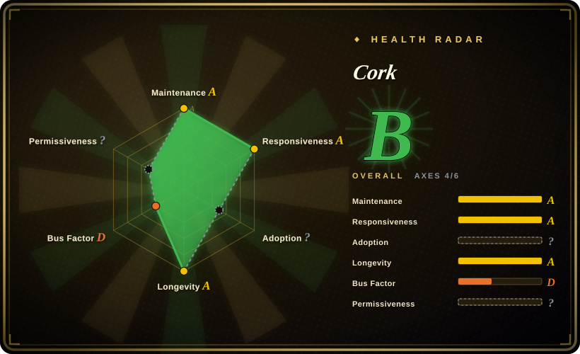
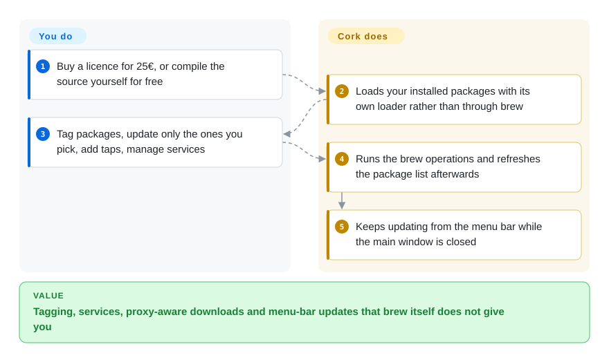

# Cork

A fast SwiftUI Homebrew GUI with the broadest feature set of the macOS front ends — services, tagging, menu-bar updates, tap management and faster package listings — sold as a 25 € prebuilt or compiled for free under a restrictive source-available licence.

## When to use

You are the power user in the house: you live in `brew` daily, you have more than a hundred packages, and the gaps in the CLI genuinely annoy you. You want to know which packages you installed on purpose versus which arrived as dependencies (and you have found `brew leaves` unreliable), you want to see what a package is a dependency *of*, you want to update three chosen packages rather than everything, and you want the outdated list to sit in the menu bar so updating happens without opening a window at all. Add services management that is one click instead of a `brew services` incantation, tags you can attach to packages so you can find your own groupings, and a package list that loads roughly ten times faster than reading Homebrew's own — and you have the case for Cork.

Pick Cork over the other Homebrew front ends when feature depth is the deciding axis and you are willing to pay or to compile it yourself. Its two structural differences are a licence that is *not* open source (the prebuilt costs 25 €, and the source is published for inspection and contribution, not for reuse) and an explicit no-AI policy on every line of code and documentation. The deciding tradeoff against [BrewUI](brewui.md) is depth-and-availability against price-and-transparency: Cork does more, runs on macOS 14, and costs money; BrewUI is official, free, and shows you the commands.

## How it works

Cork is a SwiftUI application that talks to the Homebrew on your machine, but its selling point is that it does not wait for Homebrew to tell it things. It keeps its own package loading path — the README claims it is around ten times faster than Homebrew's implementation — and it maintains dependency and "leaves" relationships itself rather than shelling out to `brew leaves`, which is why it can show you what a package is a dependency of and which packages you installed deliberately. Operations that change state (install, uninstall, upgrade, tap, service control, maintenance) are still Homebrew's job, executed through the local `brew`; Cork adds the layers around it: a menu-bar agent that updates packages without the main window open, respect for the system proxy, cache clearing, and tags stored alongside the packages they mark. You decide what to install, update or control; Cork owns the fast inventory view, the relationship graph, the menu-bar loop and the presentation of every operation.

<!-- flow-steps:begin (generated from flows/cork.json by tools/flow_card.py — do not edit) -->

Text version of the flow

1. **You**: Buy a licence for 25€, or compile the source yourself for free
2. **Cork**: Loads your installed packages with its own loader rather than through brew
3. **You**: Tag packages, update only the ones you pick, add taps, manage services
4. **Cork**: Runs the brew operations and refreshes the package list afterwards
5. **Cork**: Keeps updating from the menu bar while the main window is closed

**Value**: Tagging, services, proxy-aware downloads and menu-bar updates that brew itself does not give you

<!-- flow-steps:end -->

## When NOT to use

- **You need to reuse, fork or redistribute the code.** Cork's licence is a Commons Clause-based provisional licence that forbids building competing products, reselling, compiling for anyone but yourself, and distributing on a mass scale. Use [Applite](applite.md) (MIT) or [BrewUI](brewui.md) (AGPL-3.0) when licence terms decide the choice — and note that even AGPL is more permissive than what Cork grants.
- **You need this deployed across a team without a per-seat purchase.** The prebuilt comes from a paid tap. Use [BrewUI](brewui.md) or [CaskHub](caskhub.md) if procurement is a blocker; the equivalent of `brew install --cask cork` is a 25 € licence.
- **You want the officially backed front end.** Cork is one person's company product (`RIKIDAR, računalniške storitve, d.o.o.`). Use [BrewUI](brewui.md) when provenance is the deciding factor.
- **You only install macOS applications and want an App Store experience.** Cork covers formulae, casks, services and taps, which is more surface than a non-technical user needs. Use [Applite](applite.md) or [CaskHub](caskhub.md) instead.
- **You want the machine to have a bootstrap path when Homebrew is missing.** Cork assumes Homebrew is already installed. Use [Applite](applite.md) (self-installing Homebrew) or [CaskHub](caskhub.md) (guided setup).
- **You need a large contributor community to draw on.** `buresdv` accounts for the overwhelming majority of contributions; translators and a handful of contributors cover the rest. Use [BrewUI](brewui.md) if an org-backed pipeline matters more than feature depth.
- **You are below macOS 14.** The cask is `depends_on macos: :sonoma` and the project's deployment target is 14.0. There is no older build.

## Comparison

| Alternative | In index | Our verdict | Tradeoff |
|---|---|---|---|
| [BrewUI](brewui.md) | ✅ | Choose Cork when you need the deepest Homebrew surface and will pay for it; choose BrewUI when you want the official, free, transparent front end and can live on macOS 26. | Cork gains services, tagging, menu-bar updates, proxy awareness and macOS 14 support; it pays with a 25 € licence and no reuse rights. BrewUI gains zero cost, official provenance and a visible command console; it pays with a narrower feature set and a macOS 26 floor. |
| [Applite](applite.md) | ✅ | Choose Applite when the audience is non-technical and casks are enough; choose Cork when the user is a developer running formulae and services. | Applite gains a self-installing Homebrew and MIT terms; it pays with cask-only scope and no services. Cork gains formula and service management plus faster listings; it pays with cost and a restrictive licence. |
| [CaskHub](caskhub.md) | ✅ | Choose CaskHub for a free App Store experience on macOS 15.6+ with the widest recent install reach; choose Cork when formulae or services are in scope. | CaskHub gains free MIT distribution, richer catalogue browsing and no bundled brew tree; it pays with telemetry and cask-only scope. Cork gains depth and no telemetry; it pays with 25 € and a source-available licence. |
| [Cakebrew](cakebrew.md) | ✅ | Choose Cakebrew only as a historical reference; Cork is what that design became once someone kept working on it. | Cork gains active development, services, tagging and a paid support path; it pays with a licence that forbids reuse and a price tag. Cakebrew's GPL-3.0 is freer but its default branch has not moved since 2021. |

## Tech stack

- **Language / UI:** Swift with SwiftUI; the project is generated with Tuist and the deployment target is `.macOS("14.0.0")`.
- **Homebrew integration:** the local `brew` executable for state-changing operations, plus Cork's own loader and relationship graph for inventory, dependency and "leaves" views.
- **Auxiliary pieces:** a menu-bar component for updating without the main window, a helpers target, and a `.gitmodules`-based setup for vendored dependencies.
- **Project tooling:** Tuist plus mise alongside a SwiftLint configuration; translation is managed through Crowdin.
- **Privacy:** a `PrivacyInfo.xcprivacy` manifest ships with the app; the project advertises no telemetry and no AI involvement in its code or documentation.

## Dependencies

- **OS:** macOS 14 or later for the app (the cask is `depends_on macos: :sonoma`); compiling from source additionally wants macOS Ventura or newer, Xcode 16 or newer, Git and Homebrew.
- **Homebrew:** must already be installed; Cork has no bootstrap path of its own.
- **Licence:** the prebuilt requires a 25 € purchase (which the vendor says covers all future versions), or a free self-compiled build; the app contains a licence check with a documented bypass for self-compiled builds.
- **Runtime services:** a menu-bar component, which runs while the app is closed if you use that feature.
- **Network:** the vendor's tap for prebuilt updates; whatever Homebrew fetches otherwise. The README notes Cork respects the system proxy.

## Ops difficulty

**Low.** Installation is either `brew install --cask cork` (prebuilt, licensed) or a documented source build. There is no server, no database and no daemon you must keep alive; the menu-bar updater is optional. The two operational facts worth knowing are commercial and legal rather than technical: the prebuilt is a paid artefact, and the licence governs what you may do with the source. For an individual on a Mac this is about as heavy as any GUI here; for a team, the purchase and the licence review add real process.

## Health & viability

- **Maintenance — active as of 2026-09-20.** Repo created 2022-07-03; last commit 2026-09-15; `pushed_at` 2026-09-20; 35 releases with v2.0.2 on 2026-09-14 and a major v2 line shipped in August 2026. Not archived.
- **Governance / bus factor — a company of one.** `buresdv` accounts for roughly 1,887 of the tracked contributions, with the next contributors far behind (110, 48, 28). The licence names `RIKIDAR, računalniške storitve, d.o.o.` as the rights holder, so there is at least a legal entity rather than only a personal account.
- **Backing & longevity — four years, paid, still shipping, no foundation.** Money changes the Lindy reading: a paid product with a price on the prebuilt has an incentive to keep releasing, and it has. It also means the project's survival is a business decision rather than a community one.
- **Adoption & ecosystem — a paid app with a deliberately smaller install base.** ~4.7k stars and 276 forks; 241 cask installs in the 30 days to 2026-09-20, ranked around 518 — an order of magnitude below the free alternatives, which is the expected shape for a paid app rather than a signal about quality.
- **Responsiveness — 348 issues filed, 48 open**, on a project that has shipped two major versions this year.
- **Risk flags — the licence is the flag.** A Commons Clause-based provisional licence is explicitly not open source: it forbids competing products, resale, compiling for others and mass distribution, and the repository is described as "source available for individual inspection". It also carries a no-AI development policy, which is a positive signal for some evaluators and irrelevant to others.
- **Two axes are `?` rather than graded.** Adoption is `no_package_structural`, as for any cask-distributed app. The licence axis is `license_unparsed` because GitHub reports `NOASSERTION` and the licence is not an SPDX id — a Commons Clause-based provisional licence sits deliberately outside the taxonomy, and that un-classifiability is itself the finding rather than a scorer failure.

## Caveats (unverified)

- `[未验证]` **The "ten times faster package listing" claim** comes from Cork's own README and was not benchmarked here.
- `[未验证]` **Price and licence terms are as read on 2026-09-20.** The 25 € figure, the "all future versions" promise and the exact permissions come from the vendor's README and `LICENSE.md`; they can change, and the licence is explicitly described as provisional.
- `[推断]` **The paid model explains the lower cask install count.** The number is measured; attributing it to price rather than to quality is inference.
- `[未验证]` **Whether Cork still requires a licence check for the prebuilt**, and how the self-compiled bypass works, is described in the README's acknowledgements rather than verified.
- `[未验证]` **No telemetry.** The project ships a `PrivacyInfo.xcprivacy` manifest and advertises no telemetry, and no analytics SDK appears in the dependency pins; the distributed binary was not inspected.
- `[推断]` **The menu-bar updater keeps working when the app is closed** — inferred from the README's feature list ("updating packages from the Menu Bar without having Cork open"), not reproduced.
- `[未验证]` **Whether services, tagging and dependency views cover formulae and casks equally** is not stated in the sources read; check the live app before assuming casks are included.
- `[未验证]` **Issue and PR figures** (348 issues / 48 open, 7 open PRs) are GitHub counts as of 2026-09-20.
