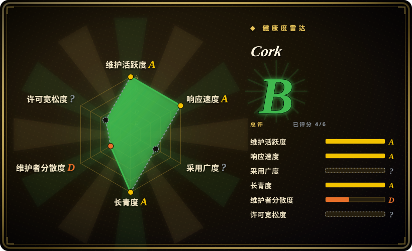
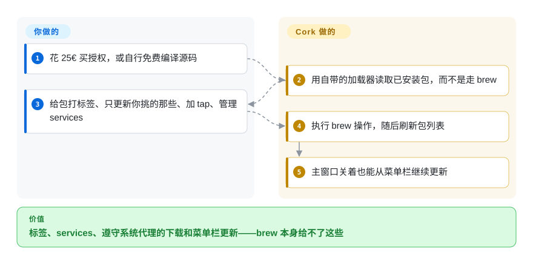

# Cork

一个用 SwiftUI 写的、速度快的 Homebrew 图形前端，功能面在 macOS 这类前端里最宽——services、标签、菜单栏更新、tap 管理、更快的包列表——以 25€ 的预编译版出售，或在限制性的 source-available 许可下自行编译免费使用。

## 何时使用

你是家里那个重度用户：每天都在 `brew` 里过日子，装了一百多个包，CLI 的缺口真的让你烦。你想分清哪些包是你主动装的、哪些是作为依赖被带进来的（而且你已经发现 `brew leaves` 不太可靠），你想看到某个包被谁依赖，你想只更新挑出来的三个包而不是全部，你希望过期列表就待在菜单栏上，不开窗口也能完成更新。再加上一键管理 services 而不是念 `brew services` 的咒语、能给包打标签形成自己的分组、以及比读 Homebrew 自己那份快约十倍的包列表——这就是选 Cork 的理由。

当**功能深度**是决定轴、并且你愿意付钱或自己编译时，在这几个 Homebrew 前端里选 Cork。它的两个结构性差异是：许可是**非开源**的（预编译版 25€，源码公开是为了让人审阅和贡献，不是为了复用），以及一份明确的「不用 AI」政策，覆盖每一行代码和文档。对 [BrewUI](brewui.zh.md) 的决定性取舍是「深度与可用性」对「价格与透明」：Cork 做得更多、能在 macOS 14 上跑、但要花钱；BrewUI 官方、免费、把命令摊开给你看。

## 怎么用起来

Cork 是一个和你机器上 Homebrew 对话的 SwiftUI 应用，但它的卖点在于不等 Homebrew 来告诉它事情。它维护自己的一套包加载路径（README 称比 Homebrew 的实现快约十倍），并且自己维护依赖关系与「哪些是主动安装」的判断，而不是去调用 `brew leaves`——这就是它能告诉你某个包被谁依赖、以及哪些包是你主动装的原因。会改变系统状态的操作（安装、卸载、升级、tap、service 控制、维护）仍然交给 Homebrew，通过本地 `brew` 执行；Cork 补的是外面那些层：一个不需要打开主窗口就能更新包的菜单栏组件、对系统代理的遵守、缓存清理，以及跟着被标记包一起保存的标签。装什么、更新什么、控制什么由你决定；快速的清单视图、关系图、菜单栏循环和每次操作的呈现由 Cork 负责。

<!-- flow-steps:begin (generated from flows/cork.json by tools/flow_card.py — do not edit) -->

流程文字版

1. **你**：花 25€ 买授权，或自行免费编译源码
2. **Cork**：用自带的加载器读取已安装包，而不是走 brew
3. **你**：给包打标签、只更新你挑的那些、加 tap、管理 services
4. **Cork**：执行 brew 操作，随后刷新包列表
5. **Cork**：主窗口关着也能从菜单栏继续更新

**价值**：标签、services、遵守系统代理的下载和菜单栏更新——brew 本身给不了这些

<!-- flow-steps:end -->

## 何时不用

- **你需要复用、fork 或再分发这份代码。** Cork 的许可是基于 Commons Clause 的临时许可，禁止做竞品、转售、为他人编译、以及大规模分发。当许可条款决定选型时，用 [Applite](applite.zh.md)（MIT）或 [BrewUI](brewui.zh.md)（AGPL-3.0）——注意即便 AGPL 也比 Cork 给出的授权更宽松。
- **你需要在一个团队里铺开而不按席位付费。** 预编译版来自付费 tap。采购是障碍时用 [BrewUI](brewui.zh.md) 或 [CaskHub](caskhub.zh.md)；这里 `brew install --cask cork` 的等价物是一份 25€ 的授权。
- **你要官方背书的前端。** Cork 是一个人的公司产品（`RIKIDAR, računalniške storitve, d.o.o.`）。当出身是决定因素时用 [BrewUI](brewui.zh.md)。
- **你只装 macOS 应用、只想要应用商店式的体验。** Cork 覆盖 formula、cask、services 与 tap，对非技术用户来说操作面过大。改用 [Applite](applite.zh.md) 或 [CaskHub](caskhub.zh.md)。
- **你希望在 Homebrew 缺失时机器有引导安装的路径。** Cork 假定 Homebrew 已经装好。用 [Applite](applite.zh.md)（自带 Homebrew）或 [CaskHub](caskhub.zh.md)（引导式安装）。
- **你需要一个庞大的贡献者社区可以依靠。** `buresdv` 占了绝大部分贡献；翻译者与少数几位贡献者覆盖其余部分。组织级流水线比功能深度更重要时用 [BrewUI](brewui.zh.md)。
- **你的系统低于 macOS 14。** cask 是 `depends_on macos: :sonoma`，工程的部署目标是 14.0。没有更老的构建。

## 横向对比

| 替代品 | 是否收录 | 我们的评价 | 取舍 |
|---|---|---|---|
| [BrewUI](brewui.zh.md) | ✅ | 当你需要最深的 Homebrew 操作面且愿意付费时选 Cork；当你想要官方、免费、透明的前端、且能在 macOS 26 上过活时选 BrewUI。 | Cork 拿到的是 services、标签、菜单栏更新、代理感知和 macOS 14 支持；付出的是 25€ 授权与不可复用的权利。BrewUI 拿到的是零成本、官方出身和可见的命令控制台；付出的是更窄的功能集与 macOS 26 门槛。 |
| [Applite](applite.zh.md) | ✅ | 当受众是非技术用户、cask 已够用时选 Applite；当用户是跑 formula 和 services 的开发者时选 Cork。 | Applite 拿到的是自带 Homebrew 与 MIT 条款；付出的是只支持 cask、没有 services。Cork 拿到的是 formula 与 service 管理和更快的列表；付出的是价格和限制性许可。 |
| [CaskHub](caskhub.zh.md) | ✅ | 在 macOS 15.6+ 上要免费的应用商店体验、且看重最广的近期安装触达时选 CaskHub；当 formula 或 services 在范围内时选 Cork。 | CaskHub 拿到的是免费 MIT 分发、更丰富的目录浏览、以及不引入自管 brew 树；付出的是遥测和只支持 cask。Cork 拿到的是深度和零遥测；付出的是 25€ 与 source-available 许可。 |
| [Cakebrew](cakebrew.zh.md) | ✅ | 只把 Cakebrew 当历史参考；Cork 正是那套设计在有人持续投入之后长成的样子。 | Cork 拿到的是活跃开发、services、标签和付费支持路径；付出的是禁止复用的许可与价格。Cakebrew 的 GPL-3.0 更自由，但它的主分支自 2021 年起没动过。 |

## 技术栈

- **语言与界面：** Swift 加 SwiftUI；工程由 Tuist 生成，部署目标是 `.macOS("14.0.0")`。
- **接 Homebrew 的方式：** 改状态的操作走本地 `brew` 可执行文件；已安装清单、依赖关系与「主动安装」视图走 Cork 自己的加载器与关系图。
- **辅助组件：** 一个可在不开主窗口时更新包的菜单栏组件、一个 helpers target，以及基于 `.gitmodules` 的 vendored 依赖安排。
- **工程工具链：** Tuist 加 mise，另有 SwiftLint 配置；翻译通过 Crowdin 管理。
- **隐私：** 应用内附 `PrivacyInfo.xcprivacy` 清单；项目宣称无遥测，且代码与文档均无 AI 参与。

## 依赖

- **系统：** 应用要求 macOS 14 或更新（cask 是 `depends_on macos: :sonoma`）；从源码编译还要求 macOS Ventura 或更新、Xcode 16 或更新、Git 与 Homebrew。
- **Homebrew：** 必须已安装；Cork 自己没有引导安装路径。
- **授权：** 预编译版需要花 25€ 购买（厂商称覆盖未来所有版本），或使用免费的自编译构建；应用内含许可校验，并对自编译构建有文档化的绕过方式。
- **运行时服务：** 一个菜单栏组件；使用该功能时它在应用关闭后仍在运行。
- **网络：** 预编译版更新走厂商的 tap；其余由 Homebrew 自己拉取。README 称 Cork 遵守系统代理。

## 运维难度

**低。** 安装要么 `brew install --cask cork`（预编译、需授权），要么按文档自行编译。没有服务器、没有数据库、没有必须常驻的守护进程；菜单栏更新器是可选的。真正需要知道的两件事是商业与法律层面的，而不是技术层面的：预编译版是付费产物，许可是决定你能否动这份源码的东西。对单个 Mac 用户来说，它和义务任何同类 GUI 差不多；对团队来说，采购与许可评审会带来实打实的流程成本。

## 健康度与可持续性

- **维护活跃度——截至 2026-09-20 活跃。** 仓库创建于 2022-07-03；最后提交 2026-09-15；`pushed_at` 2026-09-20；35 个 release，最新 v2.0.2 发布于 2026-09-14，并且 2026 年 8 月刚发了 v2 大版本线。未归档。
- **维护者分散度——一个人的公司。** `buresdv` 约占已统计贡献中的 1,887 次，后面几位（110、48、28）差距很大。许可里写明的权利方是 `RIKIDAR, računalniške storitve, d.o.o.`，所以至少有一个法律实体，而不只是个人账号。
- **背书与长青度——四年、付费、仍在发版、没有基金会。** 收费会改变 Lindy 的读法：一个把价格写在预编译版上的产品，有动力持续发版，而它也确实在发。这也意味着它的存续是商业决策，而不是社区决策。
- **采用与生态——付费应用、刻意更小的安装基数。** 约 4.7k star、276 fork；截至 2026-09-20 的近 30 天 cask 安装 241 次，排名约 518——比免费的几个低一个数量级，这是付费应用应有的形态，而不是质量信号。
- **响应速度——累计 348 条 issue、48 条未关闭**，而项目今年已经发了两个大版本。
- **风险标记——许可本身就是风险标记。** 基于 Commons Clause 的临时许可明确不是开源：禁止做竞品、转售、为他人编译、大规模分发，仓库被描述为「源码可供个人审阅」。它还带有一条「开发不使用 AI」的政策，对某些评估者是加分项，对另一些人则无关。
- **有两个轴是 `?` 而不是评了分。** 采用广度是 `no_package_structural`，与任何靠 cask 分发的应用一样。许可轴是 `license_unparsed`，因为 GitHub 报的是 `NOASSERTION`，而这份许可不是一个 SPDX id——基于 Commons Clause 的临时许可刻意处在分类体系之外，这种「不可归类」本身就是要报告的发现，而不是评分器出错。

## 存疑（未验证）

- `[未验证]` **「包列表快约十倍」** 来自 Cork 自己的 README，这里没有做基准测试。
- `[未验证]` **价格与许可条款以 2026-09-20 读到的为准。** 25€、覆盖未来所有版本的承诺、以及具体允许的行为都来自厂商 README 与 `LICENSE.md`；它们可能改变，而且这份许可被明确描述为临时性的。
- `[推断]` **付费模式解释了更低的 cask 安装量。** 数字是实测的；把它归因于价格而非质量属于推断。
- `[未验证]` **预编译版是否仍需要许可校验**、以及自编译绕过具体如何实现，来自 README 的致谢段落，未经验证。
- `[未验证]` **无遥测。** 项目内附 `PrivacyInfo.xcprivacy` 清单并宣称无遥测，依赖锁定里也没有出现分析 SDK；但没有检查分发出去的二进制本身。
- `[推断]` **应用关闭后菜单栏更新器仍持续工作**——由 README 功能列表（「updating packages from the Menu Bar without having Cork open」）推断，未复现。
- `[未验证]` **services、标签与依赖视图是否对 formula 与 cask 一视同仁**，在所读材料中没有说明；假定 cask 也被覆盖之前请先查实际应用。
- `[未验证]` **issue 与 PR 数字**（348 条 issue／48 条未关闭，7 个待处理 PR）是 2026-09-20 的 GitHub 计数。
