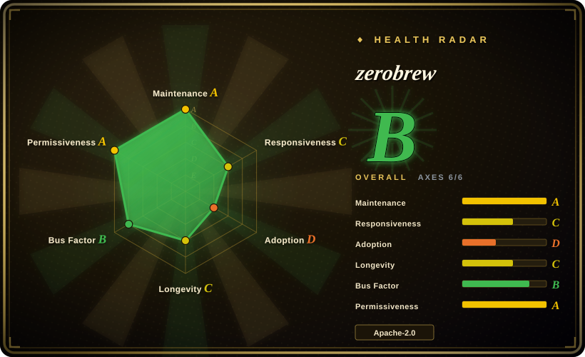
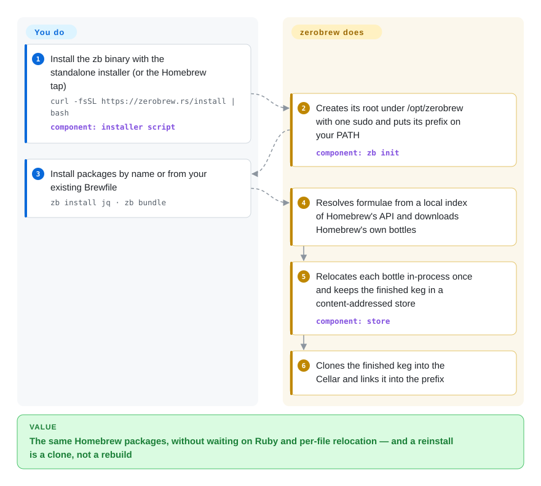

# zerobrew

`brew install node` on a fresh Mac spends half a minute evaluating Ruby, unpacking, and rewriting and re-signing binaries one at a time — and reinstalling it after an uninstall pays nearly all of that again. zerobrew installs the very same Homebrew bottles with a Rust client that rewrites each one once into its own store and afterwards just clones the finished copy into place.

## When to use

You are a developer on an Apple Silicon Mac (or a Linux box) whose machine setup is a Brewfile of command-line tools, and you rebuild environments often: a new laptop, a CI image, a throwaway VM, a teammate's onboarding script. `brew bundle` on that file takes minutes, most of it after the downloads finish — Homebrew's own breakdown in zerobrew's 2026-10-08 benchmark shows `node` at 29.3 s cold and still 28.2 s warm, because the slow part is per-file relocation, not the network. You want those minutes back without changing what gets installed.

Reach for zerobrew when the packages must stay *exactly Homebrew's* — same formulae from homebrew-core, same bottles from Homebrew's build farm, a CI job that compares the resulting prefix byte for byte with brew's — and only the install engine changes. That is the deciding tradeoff against its substitutes: Nix or pkgx give you reproducibility or run-without-installing but swap the whole package universe; nanobrew chases the same speed and adds native casks and `.deb` installs, but natively covers only the top 100 formulae and hands the rest to a Homebrew fallback. zerobrew keeps the Homebrew catalogue and reports 6.6x faster cold / 68x faster warm over 100 packages on its own benchmark, at the price of being an experimental second client you run beside `brew`, not instead of it.

## How it works

zerobrew is a client, not a distribution: it reads Homebrew's formula metadata (a local index of Homebrew's bulk API file, refreshed at most every ten minutes) and downloads the bottles — Homebrew's prebuilt binary tarballs — from the same registry `brew` uses. What it changes is everything after the download. Each bottle is unpacked and *relocated* in-process — the hardcoded `/opt/homebrew` paths inside binaries are rewritten to zerobrew's own prefix (`/opt/zerobrew` on macOS) without spawning `otool`/`install_name_tool` per library — and the finished result is stored once in a content-addressed store, a folder where each package version lives under the hash of its contents. Installing then means cloning that finished copy into the Cellar (an APFS clonefile on macOS, hardlinks or copies elsewhere) and symlinking it into the prefix, which is why a reinstall is milliseconds: think of keeping a fully assembled piece of furniture in the warehouse instead of flat-packed boxes. You choose packages and keep a Brewfile; zerobrew owns the prefix, the store, the SQLite state database and the shell `PATH` line `zb init` writes. Bottles that do not exist fall back to a source build that runs Homebrew's Ruby formula DSL through a shim, which needs a system `ruby`.

<!-- flow-steps:begin (generated from flows/zerobrew.json by tools/flow_card.py — do not edit) -->

Text version of the flow

1. **You**: Install the zb binary with the standalone installer (or the Homebrew tap) — `curl -fsSL https://zerobrew.rs/install | bash` — component: `installer script`
2. **zerobrew**: Creates its root under /opt/zerobrew with one sudo and puts its prefix on your PATH — component: `zb init`
3. **You**: Install packages by name or from your existing Brewfile — `zb install jq · zb bundle`
4. **zerobrew**: Resolves formulae from a local index of Homebrew's API and downloads Homebrew's own bottles
5. **zerobrew**: Relocates each bottle in-process once and keeps the finished keg in a content-addressed store — component: `store`
6. **zerobrew**: Clones the finished keg into the Cellar and links it into the prefix

**Value**: The same Homebrew packages, without waiting on Ruby and per-file relocation — and a reinstall is a clone, not a rebuild

<!-- flow-steps:end -->

## When NOT to use

- **You want one package manager for everything, GUI apps included.** zerobrew installs casks only when they ship a `binary` artifact; an `.app` cask such as a browser or Ghostty is rejected ("only casks with 'binary' artifacts are currently supported"), and `zb migrate` explicitly leaves casks behind. Keep Homebrew for casks (or a GUI such as [Applite](../package-manager-gui/applite.md)), or look at nanobrew, which installs the top 100 casks natively.
- **Your formulae depend on `post_install` steps.** As of v0.4.0 zerobrew does not run them (README; open issue #438). `ca-certificates` rebuilding its certificate bundle, `fontconfig` cache generation and similar steps are skipped, so a package can install and still misbehave. Use Homebrew for those formulae until #438 lands.
- **You want to replace Homebrew outright on a machine people depend on.** The project's own README calls it experimental and advises running it *alongside* Homebrew, not purging brew. For a single supported package manager on a fleet, use Homebrew itself; for reproducible, rollback-able environments use Nix.
- **Several users share the Mac.** Everything lives under `/opt/zerobrew`, `zb init` uses `sudo mkdir` and `sudo chown -R` to give that tree to one user, and multi-user setup is an open issue since 2026-01 (#82). Keep Homebrew there, or use pkgx, which runs tools per invocation without a shared prefix.
- **You build packages from source or rely on formula options.** Source builds go through a Ruby shim derived from Homebrew and need a system `ruby`; open issues report `openssl@3` and `sketchybar` builds failing with Ruby `NameError`s (#404, #348). Use Homebrew's own `brew install --build-from-source` when building is the point.
- **Your supply-chain policy forbids unverified `curl | bash`.** The standalone installer downloads the `zb` binary from the latest GitHub release without a checksum or signature check, and the source-build shim needed a checksum fix as recently as v0.3.2 (CVE-2026-53970). Install through the Homebrew tap (`brew install zerobrewhq/zerobrew/zerobrew`) or build from source if you need a reviewable path.
- **You need disk efficiency more than install speed.** Warm installs are fast precisely because zerobrew keeps both the downloaded bottle and the unpacked, relocated keg in its store after an uninstall; the README says so and disk measurement is an open issue (#440). Run `zb gc` regularly, or stay on Homebrew on small disks.

## Comparison

| Alternative | In index | Our verdict | Tradeoff |
|---|---|---|---|
| Homebrew (`Homebrew/brew`) | not indexed | When you need the complete, supported Homebrew surface — casks, `post_install`, services, build options, multi-user installs — pick Homebrew; pick zerobrew only as a faster second client for the CLI formulae you reinstall often. | Not added in this tab batch. Homebrew gains a 17-year track record, every cask and post-install hook, and is the source zerobrew depends on anyway; it pays with Ruby start-up and per-file relocation that make `node` take ~28 s even warm. zerobrew gains 6.6x/68x on its own benchmark; it pays with experimental status, no post-install, binary-only casks and a separate prefix. |
| nanobrew (`justrach/nanobrew`) | not indexed | When native installs of popular casks or `.deb` packages in Docker matter, pick nanobrew; when you want every bottled Homebrew formula relocated by one engine, with a CI parity check against brew's prefix, pick zerobrew. | Not added in this tab batch. nanobrew gains a 1.2 MB Zig binary, native top-100 casks and an apt-get replacement mode; it pays with a narrower native path (top 100 formulae, "verified Homebrew fallback" for the rest) and benchmarks that zerobrew's README disputes as timing already-installed no-ops. zerobrew gains whole-catalogue bottle relocation; it pays with casks limited to binary artifacts. |
| pkgx (`pkgxdev/pkgx`) | not indexed | When you want to run a tool or a specific version on demand without installing anything system-wide, pick pkgx; when you want Homebrew's formulae installed and linked into a persistent prefix, pick zerobrew. | Not added in this tab batch. pkgx gains per-command, per-version execution and a ~5-year-old Rust codebase; it pays with its own pantry instead of Homebrew's catalogue, so package coverage and versions differ. zerobrew's `zbx` covers the run-without-linking case only for Homebrew formulae. |
| Nix (`NixOS/nix`) | not indexed | When reproducibility, rollbacks and per-project environments matter more than keeping Homebrew's package set, pick Nix; when you just want today's `brew install` to be faster, pick zerobrew. | Not added in this tab batch. Nix gains a content-addressed store with real reproducibility and a GitHub history back to 2012; it pays with a steep language and a different package universe (nixpkgs). zerobrew borrows the content-addressed-store idea but not the purity guarantees — it installs whatever bottle Homebrew published. |
| MacPorts (`macports/macports-base`) | not indexed | When you want a long-lived, source-first ports system independent of Homebrew's build farm, pick MacPorts; when your team already standardises on Homebrew formulae and Brewfiles, pick zerobrew. | Not added in this tab batch. MacPorts gains independence from Homebrew and a separate `/opt/local` tree with long history; it pays with a different catalogue and slower source-heavy installs. zerobrew keeps Brewfiles working (`zb bundle`) but is only as available as Homebrew's bottles. |

## Tech stack

- **Language:** Rust (edition 2024, MSRV 1.96), a three-crate workspace: `zb_core` (formula types, dependency resolution, build planning), `zb_io` (network, store, extraction, relocation, linking, installer) and `zb_cli` (the `zb` and `zbx` binaries).
- **Async + parallelism:** `tokio` for downloads (one kept-alive `reqwest` connection pool over HTTP/2 with `rustls`), `rayon` for parallel extraction and relocation while downloads continue.
- **Binary rewriting:** in-process Mach-O load-command rewriting on macOS (`object`, `arwen` crates) and ELF patching on Linux, plus text/PHAR placeholder replacement; batched `codesign` instead of per-file spawns.
- **Archives:** `flate2` (zlib-rs), `xz2`, `zstd`, `tar`, `zip`.
- **State:** `rusqlite` (bundled SQLite) with versioned schema migrations; a content-addressed blob store keyed by SHA-256.
- **Source-build path:** a Ruby shim (`zb_io/src/build/shim.rb`) derived from Homebrew and carried under Homebrew's BSD-2-Clause licence.
- **Testing:** unit and integration tests plus GitHub Actions workflows for lint, tests, a Homebrew-compat check, a byte-for-byte parity harness against brew, and nightly timing gates.

## Dependencies

- **OS:** macOS (Apple Silicon or Intel) or Linux (x86_64 or arm64); prebuilt release binaries exist for those four targets. On Intel Macs, bottles pinned to `/usr/local` are built from source instead.
- **Upstream services:** Homebrew's formula API and Homebrew's bottle registry (GHCR) — zerobrew compiles nothing and maintains no formulae; if Homebrew's infrastructure is unreachable, so is zerobrew. `HOMEBREW_BOTTLE_MIRRORS` is honoured as a download fallback.
- **Filesystem:** a root at `/opt/zerobrew` on macOS (chosen to fit the 13-character Mach-O path limit; `sudo` once to create and chown it) or `$XDG_DATA_HOME/zerobrew` on Linux; APFS for clone-based installs on macOS.
- **Optional:** a system `ruby` for source builds; `curl` and `git` for the standalone installer; Homebrew itself only for `zb migrate` and the tap install path.
- **No daemon:** zerobrew is a CLI; nothing runs in the background.

## Ops difficulty

**Low to start, medium to live with.** Installing is one `curl | bash` or one tap install, and `zb init` writes the `PATH` line for you. The ongoing cost is running two package managers: zerobrew's prefix (`/opt/zerobrew/prefix`) and Homebrew's (`/opt/homebrew`) sit side by side, so which `jq` wins depends on `PATH` order, and a package installed by one is invisible to the other. You also own the gaps — re-running skipped `post_install` effects by hand when a formula needs them, keeping casks in Homebrew, pruning the store with `zb gc` because it deliberately keeps unpacked kegs — and you should read the CHANGELOG before upgrading, since minor releases still change install semantics (v0.4.0 stopped `zb install` from upgrading already-installed dependencies). `zb doctor --repair` exists for state drift.

## Health & viability

- **Maintenance — bursty but currently very active (as of 2026-10-09).** 11 releases from v0.1.x (2026-02) to v0.4.0 (2026-10-08), with four releases in the last ten days; 93 commits in the last 90 days. The record is uneven: between v0.3.2 (2026-06-12) and v0.3.3 (2026-09-29) only about ten commits landed, so treat the current pace as a burst, not a steady cadence.
- **Governance / bus factor — concentrating on one maintainer.** 36 contributors in total; over twelve months the top contributor holds about half the commits and the top three about 80% (the radar's governance B), but recently `cachebag` wrote 87 of the last 93 commits and is the only public member of the `zerobrewhq` org, which was created on 2026-10-01 when the repo moved from `lucasgelfond/zerobrew` (the original author's account; old links redirect). No foundation or company backing is stated.
- **Backing & longevity — too young for Lindy.** About 8.5 months old as of 2026-10; the Lindy prior offers no support yet. The project's existence is also structurally tied to Homebrew's build farm and API, which it consumes but does not control — the README is explicit that zerobrew is "basically nothing without" them.
- **Adoption — loud stars, quieter usage signals.** ~8.1k stars and 186 forks against ~23.3k total release-asset downloads (as of 2026-10-09); a star curve that steep on a nine-month-old CLI is a hype signal, not proof of production use. Issues are engaged — 167 opened, 124 closed — but first responses are slow: the radar measured a median of roughly 40 days to first response on a small sample of four recent issues.
- **Risk flags.** Permissive dual licence (Apache-2.0 OR MIT) with the Homebrew-derived shim correctly kept under its BSD-2-Clause file; one published CVE (CVE-2026-53970, source-build shim checksum, fixed in v0.3.2); `curl | bash` installer without checksum verification; self-described experimental status.

## Caveats (unverified)

- `[未验证]` **The 6.6x cold / 68x warm figures** are the project's own benchmark (2026-10-08, one M3 Pro MacBook, ~318 Mbit/s); the logs are committed under `results/`, but the run was not reproduced here, and Homebrew ran `post_install` steps zerobrew skips, which flatters zerobrew on 13 of the 100 formulae.
- `[推断]` **The "byte for byte" parity claim** covers only the fixed formula set in the parity workflow, not the whole catalogue; packages outside it may differ from a brew install.
- `[未验证]` **Linux maturity.** Release binaries exist for Linux x64/arm64 and the CHANGELOG lists Linux fixes, but an open "Failed to patch ELF" issue (#346) and a "Lower glibc version" request (#334) suggest Linux coverage trails macOS; not tested here.
- `[推断]` **Bus-factor reading** rests on commit authorship and org membership as of 2026-10-09; private org members or non-commit maintainers would not appear.
- `[未验证]` **The installer lacks integrity checks** was read from `install.sh` on `main` (no `sha256`/`shasum`/`checksum` strings); release assets were not inspected for signatures.
- `[未验证]` **nanobrew's benchmark dispute** (timing already-installed no-ops) is zerobrew's own characterisation of a competitor; nanobrew's README reports different numbers and was not re-measured here.
- `[未验证]` **The license files carry template placeholders** (`Copyright <YEAR> <COPYRIGHT HOLDER>` in LICENSE-MIT.md, the Apache appendix template in LICENSE-APACHE.md); the grant is still the standard dual licence, but no named copyright holder is recorded.
