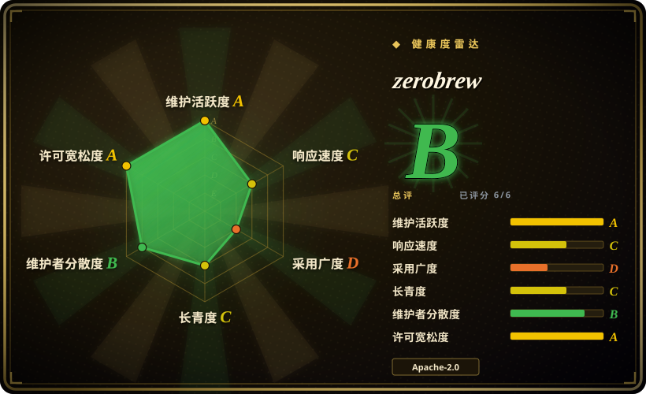
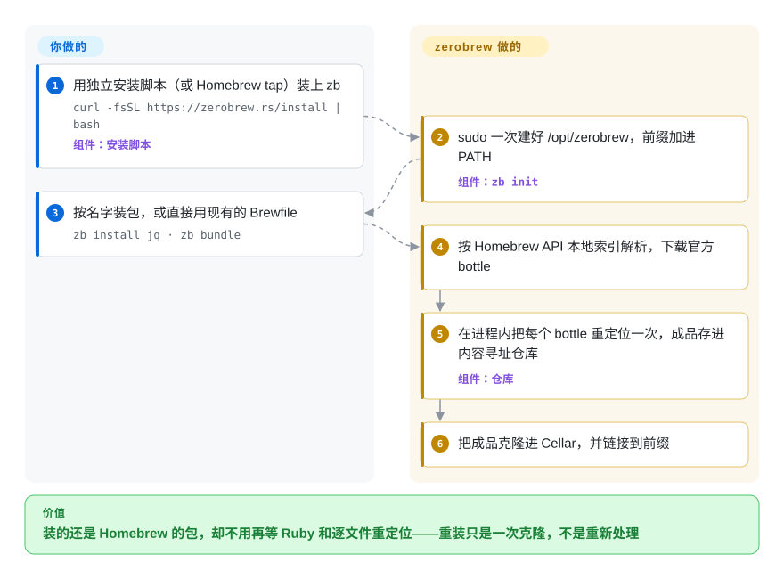

# zerobrew

在新 Mac 上 `brew install node`，半分钟花在跑 Ruby、解包、逐个改写并重新签名二进制上；卸掉再装一遍，这些活几乎要重做一遍。zerobrew 装的还是同一批 Homebrew 预编译包，只是换成一个 Rust 客户端：每个包只改写一次、放进自己的仓库，以后安装就是把成品克隆到位。

## 何时使用

你是一名用 Apple Silicon Mac（或 Linux）的开发者，机器配置就是一份写满命令行工具的 Brewfile，而且你经常重建环境：换新笔记本、做 CI 镜像、开一次性虚拟机、给新同事跑入职脚本。对这份文件跑 `brew bundle` 要好几分钟，而且大头花在下载完成之后——zerobrew 2026-10-08 的基准里，Homebrew 装 `node` 冷启动 29.3 秒、缓存命中后仍要 28.2 秒，因为慢的是逐文件改路径，不是网络。你想把这几分钟要回来，又不想改变装进来的东西。

当包必须**原样是 Homebrew 的**——同样来自 homebrew-core 的 formula、同样来自 Homebrew 构建农场的预编译包（bottle），CI 里还有一个任务把安装结果和 brew 的逐字节比对——只想换掉安装引擎时，就该想到 zerobrew。这正是它和替代品之间的取舍：Nix、pkgx 给你可复现或免安装运行，但整个包宇宙都换了；nanobrew 追求同样的速度，还原生支持 cask 和 `.deb`，但原生路径只覆盖最热门的 100 个 formula，其余交给 Homebrew 兜底。zerobrew 保留 Homebrew 的全部目录，按它自己的基准在 100 个包上冷装快 6.6 倍、缓存命中后快 68 倍；代价是它是一个实验性的第二客户端，要和 `brew` 并排用，而不是取代它。

## 怎么用起来

zerobrew 是客户端，不是发行版：它读取 Homebrew 的 formula 元数据（Homebrew 批量 API 文件在本地建的索引，最多每十分钟刷新一次），从 `brew` 用的同一个仓库下载 bottle——Homebrew 预先编译好的二进制压缩包。它改的是下载之后的所有步骤。每个 bottle 在进程内解包并**重定位**——把二进制里写死的 `/opt/homebrew` 路径改成 zerobrew 自己的前缀（macOS 上是 `/opt/zerobrew`），不再为每个库各起一次 `otool`／`install_name_tool`——然后把成品只存一次，放进内容寻址仓库：一个按内容哈希给每个包版本命名的目录。之后的安装就是把成品克隆进 Cellar（macOS 上用 APFS clonefile，其他系统用硬链接或复制），再软链接进前缀，所以重装只要几毫秒。打个比方：仓库里存的是组装好的家具，而不是一箱箱待拼的板材。你负责挑包、维护 Brewfile；zerobrew 负责前缀、仓库、SQLite 状态库，以及 `zb init` 写进 shell 的 `PATH` 那一行。没有 bottle 的包会退回源码构建，通过一个垫片（shim）执行 Homebrew 的 Ruby formula 描述，这需要系统里有 `ruby`。

<!-- flow-steps:begin (generated from flows/zerobrew.json by tools/flow_card.py — do not edit) -->

流程文字版

1. **你**：用独立安装脚本（或 Homebrew tap）装上 zb — `curl -fsSL https://zerobrew.rs/install | bash` — 组件：`安装脚本`
2. **zerobrew**：sudo 一次建好 /opt/zerobrew，前缀加进 PATH — 组件：`zb init`
3. **你**：按名字装包，或直接用现有的 Brewfile — `zb install jq · zb bundle`
4. **zerobrew**：按 Homebrew API 本地索引解析，下载官方 bottle
5. **zerobrew**：在进程内把每个 bottle 重定位一次，成品存进内容寻址仓库 — 组件：`仓库`
6. **zerobrew**：把成品克隆进 Cellar，并链接到前缀

**价值**：装的还是 Homebrew 的包，却不用再等 Ruby 和逐文件重定位——重装只是一次克隆，不是重新处理

<!-- flow-steps:end -->

## 何时不用

- **你想用一个包管理器管所有东西，包括图形应用。** zerobrew 只安装带 `binary` 产物的 cask；浏览器、Ghostty 这类 `.app` cask 会被拒绝（报错原文是“only casks with 'binary' artifacts are currently supported”），`zb migrate` 也明确不迁移 cask。cask 继续交给 Homebrew（或 [Applite](../package-manager-gui/applite.zh.md) 这类图形前端），或者看看 nanobrew，它能原生安装最热门的 100 个 cask。
- **你的 formula 依赖 `post_install` 步骤。** 截至 v0.4.0，zerobrew 不执行这些步骤（README；未关闭的 issue #438）。`ca-certificates` 重建证书包、`fontconfig` 生成缓存之类都会被跳过，包装上了也可能工作不正常。这类 formula 在 #438 落地前继续用 Homebrew。
- **你想在别人依赖的机器上彻底替换 Homebrew。** 项目 README 自称实验性，建议和 Homebrew **并排**运行，不要卸掉 brew。需要一个有支持的统一包管理器，就用 Homebrew 本身；需要可复现、可回滚的环境，就用 Nix。
- **一台 Mac 有多个用户。** 所有东西都在 `/opt/zerobrew` 下，`zb init` 用 `sudo mkdir` 和 `sudo chown -R` 把这棵目录交给单个用户，多用户支持从 2026-01 起一直是未关闭的 issue（#82）。这种机器继续用 Homebrew，或者用 pkgx——它按次运行工具，不需要共享前缀。
- **你要从源码构建，或依赖 formula 选项。** 源码构建走一个从 Homebrew 派生的 Ruby 垫片，需要系统 `ruby`；有未关闭的 issue 报告 `openssl@3` 和 `sketchybar` 构建时抛 Ruby `NameError`（#404、#348）。构建本身就是目的时，用 Homebrew 自己的 `brew install --build-from-source`。
- **你的供应链策略不允许未经校验的 `curl | bash`。** 独立安装脚本从最新 GitHub release 下载 `zb` 二进制，不做校验和或签名检查；源码构建垫片直到 v0.3.2 才补上校验和（CVE-2026-53970）。需要可审查的安装路径，就走 Homebrew tap（`brew install zerobrewhq/zerobrew/zerobrew`）或从源码构建。
- **你更在意磁盘而不是安装速度。** 缓存命中快，恰恰是因为卸载后 zerobrew 仍在仓库里同时保留下载的 bottle 和解包、重定位好的成品；README 自己说了这一点，磁盘占用测量还是未关闭的 issue（#440）。要么定期跑 `zb gc`，要么在小磁盘机器上继续用 Homebrew。

## 横向对比

| 替代品 | 是否收录 | 我们的评价 | 取舍 |
|---|---|---|---|
| Homebrew（`Homebrew/brew`） | 未收录 | 需要完整、受支持的 Homebrew 能力——cask、`post_install`、services、构建选项、多用户安装——选 Homebrew；只有把它当作常重装的命令行 formula 的更快第二客户端时才选 zerobrew。 | 本批次未收录。Homebrew 有 17 年历史、全部 cask 和 post-install 钩子，而且本来就是 zerobrew 依赖的源头；代价是 Ruby 启动和逐文件重定位，让 `node` 即使缓存命中也要约 28 秒。zerobrew 在自家基准上快 6.6 倍／68 倍；代价是实验性状态、不跑 post-install、cask 只限二进制产物，以及一套独立的前缀。 |
| nanobrew（`justrach/nanobrew`） | 未收录 | 原生安装热门 cask、或在 Docker 里替代 apt 装 `.deb` 更重要时，选 nanobrew；想让同一个引擎重定位所有有 bottle 的 Homebrew formula、并在 CI 里和 brew 的前缀做对比时，选 zerobrew。 | 本批次未收录。nanobrew 换来 1.2 MB 的 Zig 单文件、原生 top-100 cask 和 apt-get 替代模式；代价是原生路径更窄（top 100 formula，其余走“经过校验的 Homebrew 兜底”），且其基准被 zerobrew README 质疑为在给已安装包的空操作计时。zerobrew 换来全目录的 bottle 重定位；代价是 cask 只限二进制产物。 |
| pkgx（`pkgxdev/pkgx`） | 未收录 | 想按需运行某个工具或某个版本、又不想往系统里装任何东西，选 pkgx；想把 Homebrew 的 formula 装进一个持久前缀并链接好，选 zerobrew。 | 本批次未收录。pkgx 换来按命令、按版本运行，以及一个约 5 年的 Rust 代码库；代价是用它自己的包目录（pantry）而不是 Homebrew 的，包覆盖面和版本都不同。zerobrew 的 `zbx` 只对 Homebrew formula 提供“运行但不链接”。 |
| Nix（`NixOS/nix`） | 未收录 | 可复现、可回滚、按项目隔离环境比保留 Homebrew 的包集合更重要时，选 Nix；只想让今天的 `brew install` 快一点，选 zerobrew。 | 本批次未收录。Nix 换来真正可复现的内容寻址仓库，GitHub 历史可追到 2012 年；代价是陡峭的语言和另一套包宇宙（nixpkgs）。zerobrew 借了内容寻址仓库的思路，但没有纯函数式保证——Homebrew 发布什么 bottle，它就装什么。 |
| MacPorts（`macports/macports-base`） | 未收录 | 想要一个不依赖 Homebrew 构建农场、长期存在、以源码为先的 ports 系统，选 MacPorts；团队已经统一用 Homebrew formula 和 Brewfile，选 zerobrew。 | 本批次未收录。MacPorts 换来独立于 Homebrew、单独的 `/opt/local` 目录树和较长历史；代价是另一套包目录，以及偏源码、更慢的安装。zerobrew 让 Brewfile 继续可用（`zb bundle`），但可用性完全取决于 Homebrew 的 bottle。 |

## 技术栈

- **语言：** Rust（edition 2024，最低 Rust 1.96），三个 crate 的 workspace：`zb_core`（formula 类型、依赖解析、构建规划）、`zb_io`（网络、仓库、解包、重定位、链接、安装器）、`zb_cli`（`zb` 和 `zbx` 两个二进制）。
- **异步与并行：** 下载用 `tokio`（一个长连接复用的 `reqwest` 连接池，走 HTTP/2 和 `rustls`），解包与重定位用 `rayon`，在下载进行的同时并行处理。
- **二进制改写：** macOS 上在进程内改写 Mach-O 加载命令（`object`、`arwen` crate），Linux 上修补 ELF，另有文本／PHAR 占位符替换；`codesign` 批量执行而不是逐文件起进程。
- **压缩格式：** `flate2`（zlib-rs）、`xz2`、`zstd`、`tar`、`zip`。
- **状态：** `rusqlite`（内置 SQLite），带版本化的 schema 迁移；按 SHA-256 寻址的 blob 仓库。
- **源码构建路径：** 一个 Ruby 垫片（`zb_io/src/build/shim.rb`），从 Homebrew 派生，沿用 Homebrew 的 BSD-2-Clause 许可。
- **测试：** 单元与集成测试，外加 GitHub Actions 工作流：lint、测试、Homebrew 兼容检查、与 brew 逐字节对比的一致性测试，以及每晚的耗时门禁。

## 依赖

- **操作系统：** macOS（Apple Silicon 或 Intel）或 Linux（x86_64 或 arm64）；这四个目标都有预编译 release。Intel Mac 上写死 `/usr/local` 的 bottle 会改为源码构建。
- **上游服务：** Homebrew 的 formula API 和 bottle 仓库（GHCR）——zerobrew 不编译任何东西，也不维护 formula；Homebrew 的基础设施不可达，zerobrew 也就不可用。下载失败时会回退到 `HOMEBREW_BOTTLE_MIRRORS`。
- **文件系统：** macOS 上根目录是 `/opt/zerobrew`（为了满足 Mach-O 13 字符路径限制；创建并 chown 时需要一次 `sudo`），Linux 上是 `$XDG_DATA_HOME/zerobrew`；macOS 上的克隆式安装依赖 APFS。
- **可选：** 源码构建需要系统 `ruby`；独立安装脚本需要 `curl` 和 `git`；只有 `zb migrate` 和走 tap 安装才需要 Homebrew 本身。
- **没有常驻进程：** zerobrew 是命令行工具，后台不跑任何东西。

## 运维难度

**上手低，长期用中等。** 安装就是一次 `curl | bash` 或一次 tap 安装，`zb init` 替你写好 `PATH`。长期成本来自同时跑两个包管理器：zerobrew 的前缀（`/opt/zerobrew/prefix`）和 Homebrew 的（`/opt/homebrew`）并排存在，哪个 `jq` 生效取决于 `PATH` 顺序，一边装的包另一边看不见。缺口也归你：formula 需要时手动补上被跳过的 `post_install` 效果、cask 留在 Homebrew、因为仓库刻意保留解包后的成品而要用 `zb gc` 清理；升级前要读 CHANGELOG，因为小版本仍在改安装语义（v0.4.0 起 `zb install` 不再顺带升级已安装的依赖）。状态出偏差时有 `zb doctor --repair`。

## 健康度与可持续性

- **维护——一阵一阵，但眼下非常活跃（截至 2026-10-09）。** 从 v0.1.x（2026-02）到 v0.4.0（2026-10-08）共 11 个 release，最近十天就发了四个；近 90 天 93 个提交。节奏并不均匀：v0.3.2（2026-06-12）到 v0.3.3（2026-09-29）之间只有约十个提交，所以把当前节奏看作一次爆发，而不是稳定的频率。
- **治理与巴士因子——正在向一位维护者集中。** 总共 36 位贡献者；按十二个月算，头号贡献者约占一半提交、前三位约占 80%（雷达治理轴为 B），但最近 93 个提交里 `cachebag` 写了 87 个，而且他是 `zerobrewhq` 组织唯一的公开成员；这个组织 2026-10-01 才创建，仓库是从原作者个人账号下的 `lucasgelfond/zerobrew` 迁过来的（旧链接会重定向）。没有声明任何基金会或公司支持。
- **背书与寿命——太年轻，Lindy 先验用不上。** 截至 2026-10 约 8.5 个月，Lindy 先验还给不出任何支持。项目的存在本身也在结构上绑定 Homebrew 的构建农场和 API：它消费它们，却控制不了它们——README 明说没有这些，zerobrew“basically nothing”。
- **采用——星标很响，使用信号偏弱。** 约 8.1k 星、186 个 fork，而 release 资产总下载约 2.33 万次（截至 2026-10-09）；一个九个月大的命令行工具星标曲线这么陡，是热度信号，不是生产使用的证据。issue 互动活跃——共开 167 个，已关 124 个——但首次回复偏慢：雷达在最近四个 issue 的小样本上测得首次回复中位数约 40 天。
- **风险信号。** 宽松双许可（Apache-2.0 OR MIT），从 Homebrew 派生的垫片正确保留了 BSD-2-Clause 许可文件；一个公开 CVE（CVE-2026-53970，源码构建垫片的校验和问题，v0.3.2 修复）；安装脚本 `curl | bash` 且不校验；项目自称实验性。

## 存疑（未验证）

- `[未验证]` **6.6 倍冷装／68 倍缓存命中的数字**来自项目自己的基准（2026-10-08，一台 M3 Pro MacBook，约 318 Mbit/s）；日志已提交在 `results/` 下，但这里没有复现，而且 Homebrew 在 100 个 formula 中的 13 个上执行了 zerobrew 跳过的 `post_install`，对 zerobrew 有利。
- `[推断]` **“逐字节一致”的说法**只覆盖一致性工作流里那组固定的 formula，不是整个目录；其他包的安装结果可能和 brew 不同。
- `[未验证]` **Linux 成熟度。** Linux x64／arm64 有 release 二进制，CHANGELOG 也列了 Linux 修复，但未关闭的“Failed to patch ELF”（#346）和“Lower glibc version”（#334）说明 Linux 覆盖落后于 macOS；这里没有实测。
- `[推断]` **巴士因子判断**依据的是截至 2026-10-09 的提交作者和组织成员；私有成员或不提交代码的维护者看不到。
- `[未验证]` **“安装脚本不做完整性校验”**是读 `main` 上 `install.sh` 得出的（没有 `sha256`、`shasum`、`checksum` 字样）；没有检查 release 资产是否另有签名。
- `[未验证]` **对 nanobrew 基准的质疑**（给已安装包的空操作计时）是 zerobrew 对竞品的描述；nanobrew 的 README 给出不同数字，这里没有重测。
- `[未验证]` **许可文件带模板占位符**（LICENSE-MIT.md 里是 `Copyright <YEAR> <COPYRIGHT HOLDER>`，LICENSE-APACHE.md 附录是模板）；授权本身仍是标准双许可，但没有写明著作权人。
