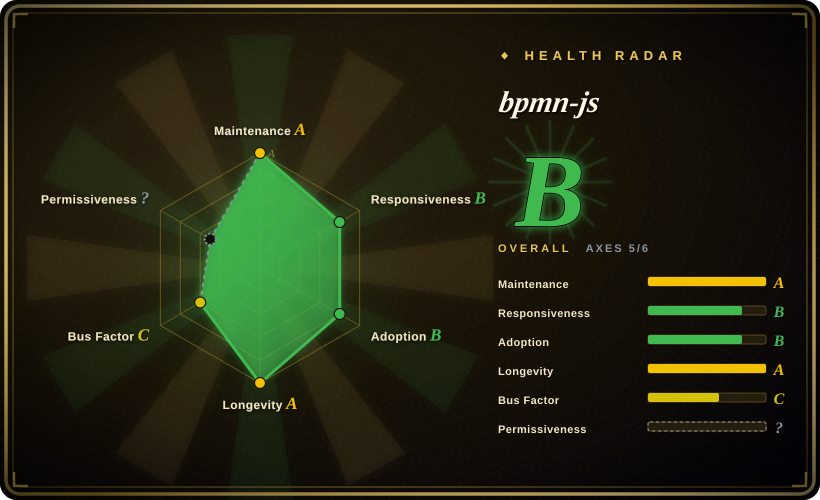
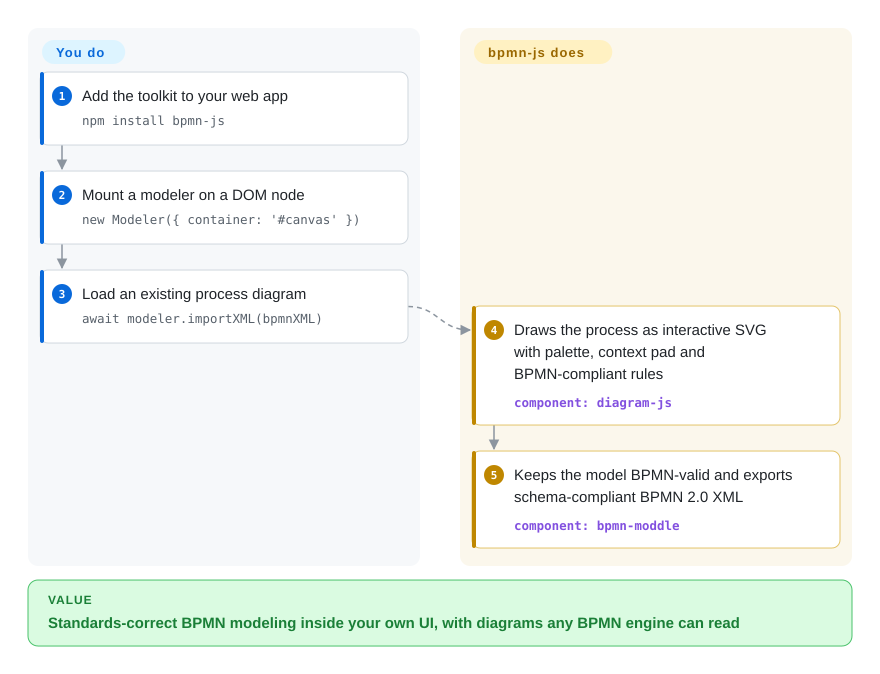

# bpmn-js

A BPMN 2.0 rendering and modeling toolkit for the browser — import BPMN XML, display it as an interactive diagram, and edit it, built by the bpmn.io team at Camunda.

## When to use

You're building a workflow or process-automation product and your users — business analysts, not developers — need to design and review BPMN process diagrams inside your web app. You don't want to ship them a desktop tool or reinvent a diagram editor; you want the official, standards-correct BPMN canvas embedded in your UI. You `npm install bpmn-js`, mount a `BpmnModeler` (or the lighter `BpmnViewer` for read-only display) onto a `
`, feed it BPMN 2.0 XML, and the user gets palette-driven drag-and-drop modeling — tasks, gateways, events, pools — with the diagram serialized back to standard BPMN XML you can persist or hand to a process engine (Camunda or any BPMN-compliant engine). Because it reads and writes canonical BPMN XML via `bpmn-moddle`, the diagrams interoperate with the wider BPMN tooling ecosystem rather than locking you into a proprietary format.

You reach for the **viewer** build when you only need to render existing diagrams (dashboards, audit views, docs), and the **modeler** build when users author or edit them. It's the de-facto open BPMN canvas for the web.

## How it works

BPMN 2.0 is the OMG standard notation for business-process flowcharts — tasks, gateways, events — stored as XML. bpmn-js is a pure client-side library that turns that XML into an interactive canvas. On import, `bpmn-moddle` parses the BPMN document into a JavaScript object tree (it encapsulates the BPMN meta-model, so the library *knows* what each shape means, not just how it looks); `diagram-js` — the generic diagram engine underneath — draws the tree as SVG and supplies the interaction kit: palette, context pad, undo/redo. While the user models, `BpmnRules` — the rule module defined against the OMG BPMN 2.0 standard — rejects modeling operations that would violate the spec, and every accepted edit updates the object tree, which is exported back as schema-compliant BPMN XML that any BPMN-compliant engine or modeler can consume. What ships vs what stays yours: the rendering, rules, and serialization are all built in; the bundling into your app, persisting the XML, optional add-ons (properties panel, custom modules), and honoring the bpmn.io watermark license term are yours. `Viewer`, `NavigatedViewer`, and `Modeler` are the same core bundled with different feature sets.

<!-- flow-steps:begin (generated from flows/bpmn-js.json by tools/flow_card.py — do not edit) -->

Text version of the flow

1. **You**: Add the toolkit to your web app — `npm install bpmn-js`
2. **You**: Mount a modeler on a DOM node — `new Modeler({ container: '#canvas' })`
3. **You**: Load an existing process diagram — `await modeler.importXML(bpmnXML)`
4. **bpmn-js**: Draws the process as interactive SVG with palette, context pad and BPMN-compliant rules — component: `diagram-js`
5. **bpmn-js**: Keeps the model BPMN-valid and exports schema-compliant BPMN 2.0 XML — component: `bpmn-moddle`

**Value**: Standards-correct BPMN modeling inside your own UI, with diagrams any BPMN engine can read

<!-- flow-steps:end -->

## When NOT to use

- **You don't actually need the BPMN standard.** If you just want generic boxes-and-arrows or a quick text-to-diagram render, bpmn-js is heavy and BPMN-specific — Mermaid or flowchart.js are far lighter for non-standardized flowcharts.
- **You need a process *engine*, not a canvas.** bpmn-js renders and edits diagrams; it does not execute processes. Execution requires a separate BPMN engine (Camunda 7/8, Zeebe, Flowable, etc.).
- **The watermark clause is a problem.** The license requires the bpmn.io watermark/attribution link in rendered diagrams to stay visible and unaltered — this is **not plain MIT**; removing it violates the license (clause re-read verbatim from `LICENSE`, 2026-09-28). Verify the terms before white-labeling.
- **You want DMN, forms, or other notations.** bpmn-js is BPMN only; DMN needs `dmn-js`, forms need `form-js` — sibling projects, separate installs.
- **You need it outside a browser DOM.** It is browser/DOM-oriented (built on `diagram-js`); headless/server-side rendering is not its target.

## Comparison

| Alternative | In index | Our verdict | Tradeoff |
|---|---|---|---|
| [flowchart.js](flowchart-js.md) | ✅ | Pick flowchart.js when you only need a tiny text-DSL-to-SVG renderer for simple non-standard flowcharts. | Tiny text-DSL-to-SVG flowchart renderer; great for simple non-standard flowcharts, but no BPMN semantics, no interactive editing, far smaller scope. |
| [Mermaid](mermaid.md) | ✅ | Pick Mermaid when Markdown-native text diagrams matter more than true BPMN 2.0 modeling. | Broad text-to-diagram tool (including a basic BPMN-ish flow), Markdown-native; not a true BPMN 2.0 modeler and not interactive editing. |
| dmn-js / form-js (bpmn.io) | 未收录 | Pick these sibling bpmn.io libraries when the notation is DMN decision tables or forms rather than BPMN process models. | Sibling libraries for DMN decision tables and forms; same team and architecture, but different notations — complementary, not substitutes. |
| jBPM / Flowable web modelers | 未收录 | Pick engine-bundled modelers when tight coupling to a Java process engine is the point. | Engine-bundled BPMN modelers tied to a specific Java process engine; integrated execution but heavier and less embeddable as a standalone JS canvas. |
| GoJS / mxGraph (draw.io) | 未收录 | Pick a generic diagramming canvas only when you are prepared to implement BPMN correctness yourself. | General commercial/open diagramming canvases you'd build BPMN on top of yourself; more generic, but you implement BPMN correctness, which bpmn-js gives for free. |

## Tech stack

- **Language:** JavaScript (browser, ES modules; distributed via npm and prebuilt bundles).
- **Core architecture:** built on **diagram-js** (the generic diagram rendering/editing engine, same team) and **bpmn-moddle** (reads/writes BPMN 2.0 XML in the browser).
- **Rendering:** SVG (via `tiny-svg`); utilities `min-dash` / `min-dom`, direct-editing and `ids` helpers — a small, in-house dependency set, no large external framework.
- **Builds:** separate **Viewer** (render-only) and **Modeler** (editable) distributions.

## Dependencies

- **Runtime:** a browser/DOM. Pure client-side library — no backend, datastore, or service required to render/edit.
- **npm deps:** `diagram-js`, `bpmn-moddle`, `diagram-js-direct-editing`, `ids`, `inherits-browser`, `min-dash`, `min-dom`, `tiny-svg` — all maintained by the same org.
- **For execution (not bundled):** a BPMN process engine if you want to actually *run* the modeled processes — that's separate infrastructure you provide.

## Ops difficulty

**Low (as a library).** It's a front-end dependency: install, mount, feed XML. Nothing to deploy or operate server-side; persistence of the BPMN XML is your app's concern. The real complexity is *integration* — wiring custom palette entries, property panels (`bpmn-js-properties-panel`), and validating/round-tripping XML against your target engine's BPMN dialect — plus respecting the watermark/attribution license term in production builds. There is no datastore, clustering, or runtime to maintain for bpmn-js itself.

## Health & viability

- **Responsiveness**: Grade B — median first-response time 2.8 hours across 3 qualifying issues/PRs.
- **Maintenance (2026-09).** Default branch pushed 2026-09-25; latest release v18.30.1 (2026-09-24) on a steady, frequent release cadence (~97 releases in the GitHub releases list as of 2026-09-28). Clearly **active**, not coasting; not archived. [推断]
- **Governance / backing.** Maintained by the **bpmn.io team at Camunda** (an established workflow-automation vendor; the site footer states "built and maintained by Camunda and contributors", 2026-09) — a multi-maintainer org-backed project (nikku, philippfromme, barmac, marstamm…), so bus factor is healthy. Direction follows Camunda's commercial interests, the main governance caveat. [推断]
- **Age & Lindy verdict.** Created 2014-03, ~12.5 years old and **still actively shipping** — a **strong Lindy** signal; the canonical, long-proven open BPMN web canvas, not a newcomer. [推断]
- **Adoption.** The de-facto standard for embedding BPMN in web apps (~9.7k stars, ~1.5k forks, 909,779 npm downloads/month per the health scorer, 2026-09); large ecosystem of plugins (properties panel, lint, color-picker) and sibling notations (dmn-js, form-js). Strong, well-documented. [推断]
- **Risk flags.** The **custom license** (MIT text plus a mandatory, non-removable bpmn.io watermark/attribution clause — re-read verbatim from `LICENSE` 2026-09-28) is the headline flag; GitHub still reports it as `NOASSERTION` (repo API, 2026-09-28). Vendor-steered roadmap (Camunda) is secondary.

## Caveats (unverified)

- [未验证] ~9.7k stars / ~1.5k forks and v18.30.1 as of 2026-09 (GitHub API, 2026-09-28); counts are date-sensitive — indicative only.
- [推断] The `LICENSE` text (Camunda Services GmbH, 2014-present; watermark source "MUST NOT be removed or changed", must "stay fully visible and not visually overlapped") was read verbatim on 2026-09-28, but I am not counsel — confirm the exact obligations for your use, especially white-labeling.
- [推断] "Active / multi-maintainer / healthy bus factor" is inferred from commit recency, release cadence, and the contributor list, not a published governance doc.
- [未验证] The npm dependency list is read from the repo's `package.json` at one point in time and shifts across releases — verify against the version you install.
- [未验证] Camunda backing and the broader bpmn.io ecosystem (dmn-js, form-js, properties-panel) are stated from public project knowledge, not independently audited here.
