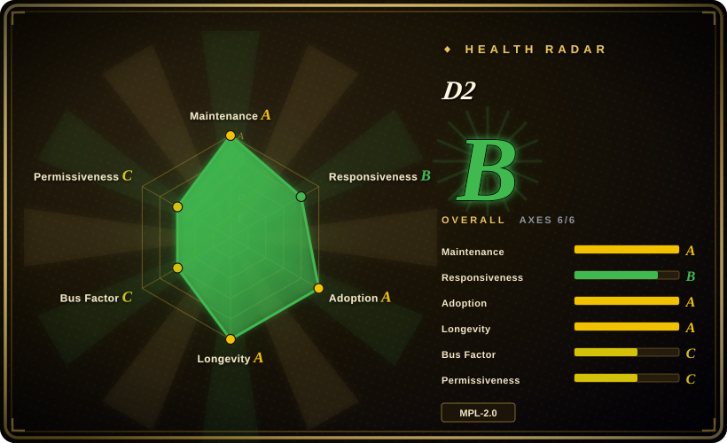
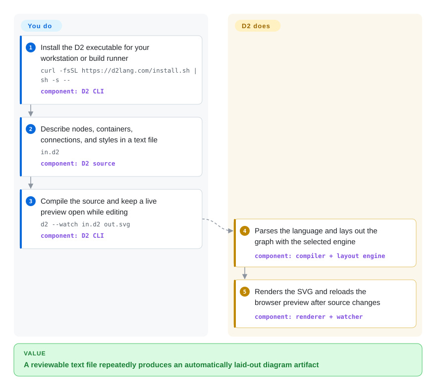

# D2

A declarative diagram scripting language and CLI that compiles text files into automatically laid-out SVG, PNG, PDF, GIF, or PPTX diagrams.

## When to use

You maintain architecture diagrams beside code and want reviewers to inspect meaningful text changes, but Mermaid's host-platform reach matters less than stronger control over layout engines, styling, reusable imports, and export formats. Choose D2 when a dedicated compiler in CI is acceptable and you want one concise language for software architecture, sequence, grid, and node-link diagrams without manually positioning every shape.

The deciding tradeoff is control versus ubiquity: D2 bundles multiple layout engines and produces several artifact formats from the same source, while Mermaid is rendered natively by more documentation hosts and draw.io gives a human direct canvas control.

## How it works

You write nodes, containers, connections, styles, and optional layout settings in a `.d2` text file, then invoke the `d2` executable with an input and output path. D2 parses and compiles the language, selects its bundled Dagro, ELK, or TALA layout engine, lays out the graph, and renders the requested file type. In watch mode it opens a browser preview and recompiles as the source changes. You own the diagram model, source review, and build integration; D2 owns parsing, automatic layout, rendering, and live reload.

<!-- flow-steps:begin (generated from flows/d2.json by tools/flow_card.py — do not edit) -->

Text version of the flow

1. **You**: Install the D2 executable for your workstation or build runner — `curl -fsSL https://d2lang.com/install.sh | sh -s --` — component: `D2 CLI`
2. **You**: Describe nodes, containers, connections, and styles in a text file — `in.d2` — component: `D2 source`
3. **You**: Compile the source and keep a live preview open while editing — `d2 --watch in.d2 out.svg` — component: `D2 CLI`
4. **D2**: Parses the language and lays out the graph with the selected engine — component: `compiler + layout engine`
5. **D2**: Renders the SVG and reloads the browser preview after source changes — component: `renderer + watcher`

**Value**: A reviewable text file repeatedly produces an automatically laid-out diagram artifact

<!-- flow-steps:end -->

## When NOT to use

- **Your documentation host must render diagrams without a build step or plugin.** Choose [Mermaid](mermaid.md), because GitHub and many documentation systems understand Mermaid blocks directly, whereas D2 normally needs its CLI or an integration to produce an artifact.
- **You need strict, broad UML notation rather than a general diagram language.** Choose PlantUML, because its UML-focused catalog and conventions are a closer fit than mapping every notation into D2 shapes.
- **You need mature low-level control over large graph layout algorithms and DOT interoperability.** Choose Graphviz, because D2 prioritizes a higher-level diagram language and themed rendering over Graphviz's long-established graph-layout surface.
- **A non-technical collaborator must drag, resize, and route objects by hand.** Choose [draw.io](drawio.md), because D2 source is text and its layout is compiler-controlled rather than a WYSIWYG canvas.
- **You cannot accept file-level copyleft obligations for modified D2 source files you distribute.** Choose an MIT-licensed option such as [Mermaid](mermaid.md); MPL-2.0 permits a larger work under other terms, but covered source files and modifications must remain available under MPL-2.0 when distributed.

## Comparison

| Alternative | In index | Our verdict | Tradeoff |
|---|---|---|---|
| [Mermaid](mermaid.md) | ✅ | Choose D2 when layout-engine selection, richer styling, and compiler-driven multi-format export outweigh native Markdown-host rendering; choose Mermaid when a fenced block must render across common code and docs platforms. | D2 gives a more programmable standalone compiler and multiple bundled layouts; Mermaid removes more installation and publishing friction. |
| Graphviz | 未收录 | Choose Graphviz when DOT compatibility and mature graph-layout primitives are the core requirement; choose D2 when authors need a higher-level language, themes, and architecture-oriented diagrams from one CLI. | Graphviz exposes lower-level graph and layout controls with decades of ecosystem history; D2 adds a friendlier diagram model and presentation layer. |
| [PlantUML](plantuml.md) | ✅ | Choose PlantUML when standardized UML breadth and its established server/Java ecosystem decide the choice; choose D2 when a native Go CLI, general architecture diagrams, and selectable layouts matter more. | PlantUML covers more formal notations; D2 is less UML-specific and packages modern layout and export choices into one executable. |
| [draw.io](drawio.md) | ✅ | Choose draw.io when a person must place and adjust every object visually; choose D2 when diagrams should be generated, reviewed, and rebuilt from concise source in CI. | draw.io maximizes direct visual control and shape libraries; D2 gives cleaner source diffs and repeatable compilation but cedes exact placement to layout engines. |

## Tech stack

- **Implementation:** Go 1.27 module, with the CLI entry point and compiler, parser, renderers, layouts, and language-tooling helpers in the same repository.
- **Language pipeline:** D2 source is parsed into an AST and intermediate representation, compiled into a diagram model, laid out, then rendered.
- **Layouts:** bundled native Go implementations include Dagro for layered layouts, `elk-go` for directed node-link diagrams and ports, and TALA for software-architecture diagrams; sequence diagrams and grids have specialized layouts.
- **Rendering:** exports SVG, PNG, GIF, PDF, and PPTX; the repository also contains Go library APIs and a `d2lsp` package used by editor clients.

## Dependencies

- **Normal CLI use:** a D2 release binary and local files; the README states that rendering can run entirely server-side and does not require a browser.
- **Source installation:** Go 1.27 according to the current `go.mod`; `go install github.com/d2lang/d2@latest` omits the manpage included in release installs.
- **Layout/runtime services:** no database or long-running service is required. Dagro, ELK, TALA, fonts, and rendering dependencies ship with or are linked into the tool.
- **Editor integration:** VS Code, Vim, Obsidian, and other integrations are separate repositories or plugins. The main repository provides `d2lsp` helper functions, not a documented standalone language-server daemon.

## Ops difficulty

**Low.** For local or CI rendering, install one executable, keep `.d2` source in version control, and compile artifacts; there is no datastore or server to operate. Teams still need to pin the D2 version and layout engine if visual diffs must stay stable, decide whether generated assets are committed, and provide an editor plugin separately if IDE features are required. Watch-mode browser preview is optional and not part of headless rendering. [推断]

## Health & viability

- **Maintenance: Grade A.** The last commit was 2 days old at scoring time, with activity in 8 of the previous 13 weeks; v0.9.0 was released on 2026-09-07.
- **Responsiveness: Grade B.** The scorer measured a 404.3-hour median first response across 8 qualifying issues.
- **Adoption: unscored.** Registry candidates did not clear the scorer's noise filter. Separately, GitHub reported 25,481 stars and 751 forks on 2026-09-22, and the README names users including Sourcegraph, Temporal, Tauri, JetBrains IntelliJ, and LocalStack.
- **Longevity: Grade A.** The repository was 1,477 days old with a 2-day-old commit; active development after four years is a positive but shorter Lindy signal than Graphviz or PlantUML. [推断]
- **Governance: Grade C.** The 12-month measurement found 2 active maintainers, with 99.5% of measured contributions from the top contributor; the `d2lang` organization owns the repository, but current work is highly concentrated.
- **Risk / license: Grade C.** MPL-2.0 is file-level copyleft: covered source files and modifications remain under MPL when distributed, while separate files in a Larger Work may use other terms. The current README presents D2, all three bundled layout engines including TALA, and plugins without mentioning a paid or separately licensed product.

## Caveats (unverified)

- [推断] “Low” operations difficulty is an architectural judgment from the single-binary, no-service execution model, not a measured operational study.
- [推断] The Lindy verdict combines a four-year repository age with current release and commit activity; it is a selection prior, not a prediction of future maintenance.
- [推断] Version pinning is recommended to control visual diffs because renderer and layout changes can alter generated output; this page did not compare artifacts across releases.
