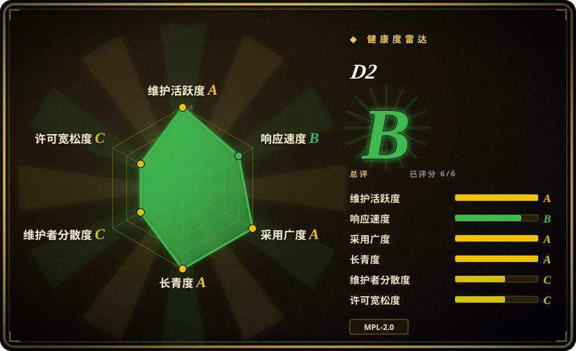
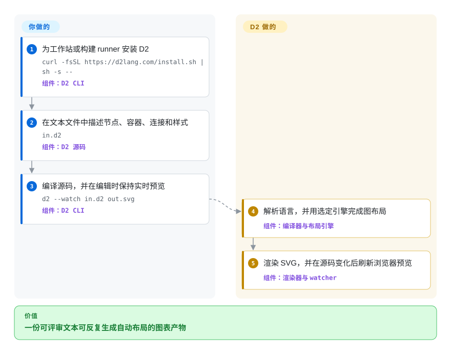

# D2

一种声明式图表脚本语言与 CLI，可把文本文件编译成自动布局的 SVG、PNG、PDF、GIF 或 PPTX 图表。

## 何时使用

你把架构图与代码放在一起维护，希望评审者能查看有意义的文本改动；相比 Mermaid 的宿主平台普及度，你更看重布局引擎选择、样式、可复用导入和导出格式控制。如果可以在 CI 中运行专用编译器，又想用一套简洁语言表达软件架构图、时序图、网格图和节点连线图，而不是手工放置每个图形，就选 D2。

决定性取舍是控制力与普及度：D2 内置多种布局引擎，能从同一份源码产出多种文件；Mermaid 被更多文档宿主直接渲染，draw.io 则让人直接控制画布。

## 怎么用起来

你在 `.d2` 文本文件中编写节点、容器、连接、样式和可选布局设置，再用 `d2` 可执行文件指定输入与输出路径。D2 解析并编译语言，选择内置的 Dagro、ELK 或 TALA 布局引擎，完成图布局并渲染目标文件。使用 watch 模式时，它会打开浏览器预览，并在源码变化后重新编译。图表模型、源码评审和构建集成由你负责；解析、自动布局、渲染与实时刷新由 D2 负责。

<!-- flow-steps:begin (generated from flows/d2.json by tools/flow_card.py — do not edit) -->

流程文字版

1. **你**：为工作站或构建 runner 安装 D2 — `curl -fsSL https://d2lang.com/install.sh | sh -s --` — 组件：`D2 CLI`
2. **你**：在文本文件中描述节点、容器、连接和样式 — `in.d2` — 组件：`D2 源码`
3. **你**：编译源码，并在编辑时保持实时预览 — `d2 --watch in.d2 out.svg` — 组件：`D2 CLI`
4. **D2**：解析语言，并用选定引擎完成图布局 — 组件：`编译器与布局引擎`
5. **D2**：渲染 SVG，并在源码变化后刷新浏览器预览 — 组件：`渲染器与 watcher`

**价值**：一份可评审文本可反复生成自动布局的图表产物

<!-- flow-steps:end -->

## 何时不用

- **文档宿主必须在没有构建步骤或插件时直接渲染图表。** 选 [Mermaid](mermaid.zh.md)，因为 GitHub 和许多文档系统能直接识别 Mermaid 代码块，而 D2 通常需要 CLI 或集成来生成产物。
- **你需要严格且广泛的 UML 记法，而非通用图表语言。** 选 PlantUML，因为它以 UML 为中心的图表目录与惯例，比把每种记法映射成 D2 图形更贴合需求。
- **你需要成熟的底层大型图布局控制与 DOT 互操作。** 选 Graphviz，因为 D2 更重视高层图表语言和主题渲染，而 Graphviz 提供历史更久的图布局表面。
- **非技术协作者必须手工拖动、缩放和布线。** 选 [draw.io](drawio.zh.md)，因为 D2 的源文件是文本，布局由编译器控制，并非所见即所得画布。
- **你不能接受分发已修改 D2 源文件时承担文件级 copyleft 义务。** 选采用 MIT 许可证的 [Mermaid](mermaid.zh.md)；MPL-2.0 允许 Larger Work 使用其他条款，但分发时，受覆盖的源文件及其修改必须继续以 MPL-2.0 提供。

## 横向对比

| 替代品 | 是否收录 | 我们的评价 | 取舍 |
|---|---|---|---|
| [Mermaid](mermaid.zh.md) | ✅ | 如果布局引擎选择、更丰富的样式和编译器驱动的多格式导出，比 Markdown 宿主直接渲染更重要，选 D2；如果代码块必须在常见代码与文档平台直接显示，选 Mermaid。 | D2 提供更可编程的独立编译器和多种内置布局；Mermaid 减少更多安装与发布摩擦。 |
| Graphviz | 未收录 | 如果 DOT 兼容和成熟的图布局原语是核心要求，选 Graphviz；如果作者需要更高层的语言、主题和由一个 CLI 生成的架构图，选 D2。 | Graphviz 以数十年生态积累提供更底层的图与布局控制；D2 增加更友好的图表模型与展示层。 |
| [PlantUML](plantuml.zh.md) | ✅ | 如果标准 UML 覆盖广度及其成熟的服务端或 Java 生态决定选择，选 PlantUML；如果原生 Go CLI、通用架构图和可选布局更重要，选 D2。 | PlantUML 覆盖更多正式记法；D2 不局限于 UML，并把现代布局与导出选择装进一个可执行文件。 |
| [draw.io](drawio.zh.md) | ✅ | 如果人必须可视化放置并调整每个对象，选 draw.io；如果图表应从简洁源码在 CI 中生成、评审和重建，选 D2。 | draw.io 最大化直接视觉控制与图形库；D2 提供更干净的源码 diff 和可重复编译，但把精确位置交给布局引擎。 |

## 技术栈

- **实现：** Go 1.27 module；CLI 入口、编译器、parser、renderer、layout 和语言工具 helper 位于同一仓库。
- **语言管线：** D2 源码先解析成 AST 和中间表示，再编译成图表模型，完成布局后渲染。
- **布局：** 内置的原生 Go 实现包括用于分层布局的 Dagro、用于带方向节点连线图与 port 的 `elk-go`，以及用于软件架构图的 TALA；时序图和网格图另有专用布局。
- **渲染：** 可导出 SVG、PNG、GIF、PDF 与 PPTX；仓库还包含 Go library API，以及供编辑器 client 使用的 `d2lsp` package。

## 依赖

- **普通 CLI 使用：** D2 release binary 与本地文件；README 明确说明渲染可以完全在服务端运行，不需要浏览器。
- **源码安装：** 当前 `go.mod` 要求 Go 1.27；`go install github.com/d2lang/d2@latest` 不会安装 release 包含的 manpage。
- **布局与运行时服务：** 不需要数据库或常驻服务。Dagro、ELK、TALA、字体与渲染依赖随工具提供或链接进工具。
- **编辑器集成：** VS Code、Vim、Obsidian 等集成位于独立仓库或插件中。主仓库提供 `d2lsp` helper function，并未文档化一个独立运行的 language-server daemon。

## 运维难度

**低。** 本地或 CI 渲染只需安装一个可执行文件，把 `.d2` 源码放入版本控制并编译产物；没有数据存储或服务需要运维。如果视觉 diff 必须稳定，团队仍需固定 D2 版本与布局引擎，决定是否提交生成产物；需要 IDE 功能时还要另装编辑器插件。watch 模式的浏览器预览是可选项，不属于 headless 渲染依赖。[推断]

## 健康度与可持续性

- **维护：Grade A。** 评分时最近一次提交距今 2 天，过去 13 周中有 8 周活跃；v0.9.0 发布于 2026-09-07。
- **响应速度：Grade B。** 评分器基于 8 个 qualifying issue，测得首次响应时间中位数为 404.3 小时。
- **采用广度：未评分。** Registry 候选未通过评分器的噪声过滤。作为独立事实，GitHub 在 2026-09-22 报告 25,481 个 star 与 751 个 fork；README 列出的使用项目包括 Sourcegraph、Temporal、Tauri、JetBrains IntelliJ 与 LocalStack。
- **长青度：Grade A。** 评分时仓库已创建 1,477 天，最近提交距今 2 天；四年后仍活跃开发是正面信号，但 Lindy 积累短于 Graphviz 或 PlantUML。[推断]
- **治理：Grade C。** 过去 12 个月测得 2 名活跃维护者，头部一人占所测贡献的 99.5%；仓库归属 `d2lang` 组织，但当前工作高度集中。
- **风险与许可证：Grade C。** MPL-2.0 是文件级 copyleft；分发时，受覆盖的源文件及其修改继续使用 MPL，Larger Work 中的独立文件可以采用其他条款。当前 README 展示 D2、包括 TALA 在内的三种内置布局引擎和插件，没有提到付费或单独授权的产品。

## 存疑（未验证）

- [推断]“低”运维难度来自单一 binary、无需服务的架构判断，并非实测运维研究。
- [推断] Lindy 判断结合了四年仓库年龄、当前 release 与提交活动；它是选型先验，不是对未来维护的预测。
- [推断] 建议固定版本来控制视觉 diff，因为 renderer 与 layout 变更可能改变生成输出；本页未逐版本比较产物。
