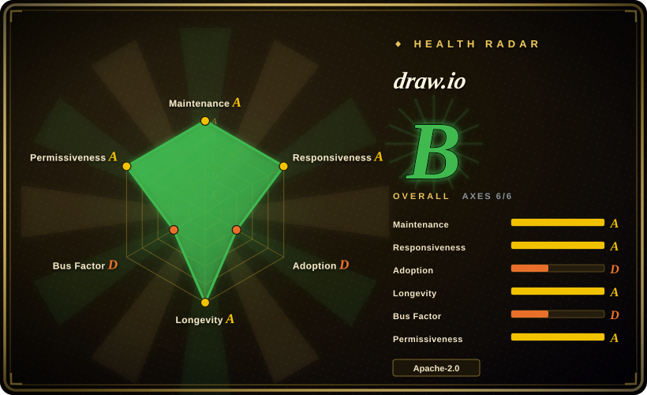
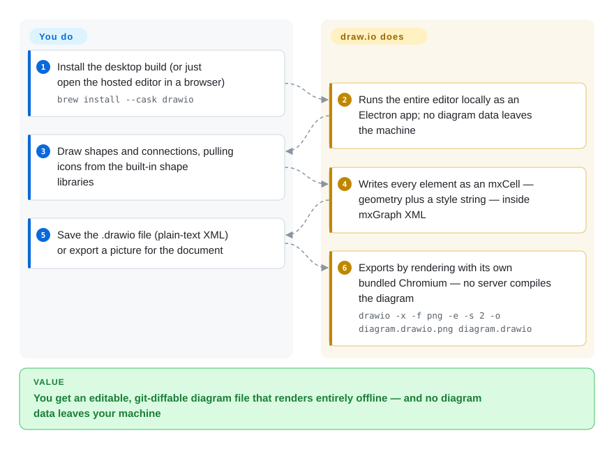

# draw.io

A full WYSIWYG diagramming application whose files are plain-text XML — a canvas you can use fully offline, and a file format you can diff in git.

## When to use

You need a diagram canvas, not a diagram syntax. The picture has to place a box exactly where you want it, use the official AWS/Azure/GCP/UML/BPMN shape libraries rather than approximated boxes, and end up as a file a colleague can open, nudge and send back. That is the job draw.io does: you draw, it serialises. Choose it over Excalidraw when structure and shape fidelity matter more than a sketch aesthetic, and over Mermaid when the deliverable is a hand-tuned picture rather than diffable text.

The deciding tradeoff is that draw.io keeps both halves: the file is plain XML (`mxfile` / `mxGraphModel` / `mxCell`, each element carrying geometry plus a `style` string), so it can be diffed in git and written or patched by tooling without the GUI — while still being a WYSIWYG document. Add that the app is designed to run entirely offline, and it becomes the natural substrate for agent workflows that generate and re-sync diagrams: the indexed [drawio-skill](../agent-skills/design/drawio-skill.md) targets exactly this file format.

## How it works

draw.io is a client-side JavaScript editor — the XML element names (`mxfile`, `mxGraphModel`, `mxCell`) come from mxGraph, the client-side diagramming library whose repo (`jgraph/mxgraph`) has been archived since 2020. It ships as a hosted web app and as an Electron desktop build, and the desktop repo vendors the editor itself as a git submodule, so both are the same code. Everything you draw becomes an `mxCell` carrying geometry plus a `style` string that encodes the whole appearance — that string is the closest thing it has to a "language", and it is a data format, not a scripting language. You supply the drawing and the layout decisions; the editor supplies rendering, shape resolution and serialisation, and the desktop build supplies export by running its own bundled Chromium locally. Nothing is compiled or rendered on a server: the vendor states the desktop app is designed to be completely isolated from the internet apart from its update check, and that no diagram data is ever sent externally. The practical consequence for automation is worth stating plainly — reading and patching the file is cheap and text-based, while the export path is a heavyweight Electron binary rather than a small CLI.

<!-- flow-steps:begin (generated from flows/drawio.json by tools/flow_card.py — do not edit) -->

Text version of the flow

1. **You**: Install the desktop build (or just open the hosted editor in a browser) — `brew install --cask drawio`
2. **draw.io**: Runs the entire editor locally as an Electron app; no diagram data leaves the machine
3. **You**: Draw shapes and connections, pulling icons from the built-in shape libraries
4. **draw.io**: Writes every element as an mxCell — geometry plus a style string — inside mxGraph XML
5. **You**: Save the .drawio file (plain-text XML) or export a picture for the document
6. **draw.io**: Exports by rendering with its own bundled Chromium — no server compiles the diagram — `drawio -x -f png -e -s 2 -o diagram.drawio.png diagram.drawio`

**Value**: You get an editable, git-diffable diagram file that renders entirely offline — and no diagram data leaves your machine

<!-- flow-steps:end -->

## When NOT to use

- **You need diagrams as plain text that a human or agent authors directly.** Use [Mermaid](mermaid.md) instead: draw.io's XML is diffable, but nobody hand-writes `mxCell` by hand, and there is no text syntax to generate. Mermaid trades layout control for that portability.
- **You want a casual, hand-drawn sketch.** Use [Excalidraw](excalidraw.md) instead — the informal look is the product there, while draw.io's structured canvas and shape libraries push you toward a formal diagram.
- **You need real-time multi-user collaboration in the open-source version.** The vendor README states draw.io "does not support real-time collaborative editing in this version"; for encrypted real-time whiteboarding use [Excalidraw](excalidraw.md), or draw.io's integrated commercial products.
- **You need to edit SVG artwork.** The vendor says explicitly that draw.io "is not an SVG editor" and that SVG export is for embedding in web pages, not for editing elsewhere — use a dedicated vector editor (Inkscape, Figma) for that job; vector art tools are a different product category and outside this index's scope.
- **You want to embed a diagram editor in your own web app.** Use [bpmn-js](bpmn-js.md) when the target is standards-correct BPMN 2.0 inside your app (mind its watermark licence term), or Excalidraw's npm component when you need an embeddable general canvas; draw.io is primarily an application, not a library you drop in.
- **You need influence over the roadmap or a guaranteed upstream fix.** The vendor README says "We do not accept pull requests. The project is developed entirely by the core team" — if your fix has to land upstream rather than in a fork, prefer a project that takes community contributions.

## Comparison

| Alternative | In index | Our verdict | Tradeoff |
|---|---|---|---|
| [Excalidraw](excalidraw.md) | ✅ | Choose draw.io when the diagram must be precise, shape-accurate and hand-off-ready; choose Excalidraw when you want an informal collaborative sketch and real-time multi-user editing. | Excalidraw wins on friction and live collaboration; draw.io wins on shape fidelity, offline desktop use and a diffable text file. |
| [Mermaid](mermaid.md) | ✅ | Choose Mermaid when the diagram should live in the repository as text and render inside Markdown; choose draw.io when placement itself carries meaning and a human will adjust it. | Mermaid is portable, reviewable and zero-install; draw.io trades that for pixel-level layout control and a real editor. |
| [bpmn-js](bpmn-js.md) | ✅ | Choose bpmn-js when you must embed a BPMN 2.0 modeller inside a web application; choose draw.io when a person needs a general-purpose diagramming application. | bpmn-js is a library scoped to one standard and carries a watermark licence term; draw.io is a broader application covering UML/BPMN/network/cloud shapes. |
| [drawio-skill](../agent-skills/design/drawio-skill.md) | ✅ | These are complements, not rivals: let the skill generate or re-sync the `.drawio` from a source of truth, then open it in draw.io for the last 10% of layout. | The skill adds extraction, provenance and incremental sync but needs Python and (for exports) this application; the editor needs a human hand. |

## Tech stack

- **Language:** JavaScript, client-side. The editor renders in the browser canvas; the desktop build wraps the same editor in Electron.
- **File format:** mxGraph XML — `mxfile` → `diagram` → `mxGraphModel` → `root` → `mxCell`, each cell carrying `mxGeometry` plus a semicolon-separated `style` string. Plain text, no binary container.
- **Repo topology:** `jgraph/drawio` is the editor source; `jgraph/drawio-desktop` is the Electron build and vendors the editor as the `drawio` git submodule.
- **Backend:** none required to draw. The vendor also runs a production deployment at `app.diagrams.net`; integrations with external storage (Google Drive, OneDrive, GitHub) are optional and off by default.
- **Assets:** the app bundles icon sets and stencil libraries (cloud vendors, UML, BPMN, network) — these carry an extra licence restriction, see the risk flags below.

## Dependencies

- **For drawing:** a modern browser (hosted app) or the desktop build. On macOS/Linux, `brew install --cask drawio` installs both the app and a `drawio` command wrapper.
- **For export/automation:** the desktop build is the CLI — export runs the whole Electron app, so there is no lightweight headless renderer. The editor repo alone cannot export.
- **Runtime services:** none. No database, no server, no account. The only network call the desktop app makes on its own is its update check.
- **Tooling around the format:** anything that reads or patches the XML needs no draw.io installation at all — that is how text-based generators and diff tools work against it.

## Ops difficulty

**Low** for the editor use case: install, draw, export, done; nothing to operate and nothing leaves the machine. **Low–medium** if you want deterministic exports in CI or a script: you are invoking an Electron application from a headless shell, and that path needs environment work — the drawio-skill project documents wrapping it in `xvfb-run -a` on Linux, moving `--no-sandbox` to the end of the argument list, adding `--disable-gpu` on servers without a GPU, and setting `HOME=/tmp`. Budget for that fiddling before promising automated renders. **Medium** if you self-host the web editor, which means static hosting plus decisions about where files live. [推断]

## Health & viability

- **Maintenance (checked 2026-09-21):** actively developed — the editor repo was pushed 2026-09-16 (release v31.4.6, same day) and the desktop repo 2026-09-18 (latest release v31.4.5, 2026-09-08). The desktop repo has at least 100 releases.
- **Governance & bus factor — the decisive signal.** Source-open but *closed development*: the vendor README states "We do not accept pull requests. The project is developed entirely by the core team." The public editor repo reflects that (3 contributors, 115 commits on `dev`) while the desktop repo carries the real history (16 contributors, 1,252 commits, one account at 926). So the usual "many contributors" health signal is absent by design, and there is no community-backup path: if the vendor stops, you fork or migrate.
- **Backing & longevity:** owned jointly by draw.io Ltd (formerly JGraph) and draw.io AG, with commercial Atlassian integrations funding the work; the GitHub org dates from 2012, the editor repo from 2016 and the desktop repo from 2017. Roughly a decade of continuous activity is a strong Lindy prior for both the application and the file format.
- **Adoption:** the desktop build carries ~63.2k stars and the vendor runs a hosted deployment at `app.diagrams.net`; the format is a de facto interchange target — the indexed [drawio-skill](../agent-skills/design/drawio-skill.md) is built entirely around generating and syncing it. Read the radar's adoption axis with care: it is scored from an npm package named `drawio-offline`, an unofficial repackaging, so that axis understates the real distribution (GitHub releases plus Homebrew/Flathub/Snap packages and the hosted app).
- **Responsiveness:** issues are answered quickly — the radar scores this axis high — while pull requests are refused outright by policy, so a fast response here means triage, not fixes landing.
- **Risk flags:** the source is Apache-2.0, but the icon sets, stencil libraries and diagram templates carry an additional restriction — they may not be used as software assets in, distributed with, or incorporated into Atlassian products or Atlassian-marketplace offerings without written permission (end-user diagram output is explicitly exempt, and the vendor makes no copyright claim on diagrams you create). Third-party JavaScript is Apache-2.0-compatible with no GPL/AGPL, per the vendor. The desktop app's update check can be disabled with `DRAWIO_DISABLE_UPDATE=true` or `--disable-update`.

## Caveats (unverified)

- [未验证] The export CLI flag form is documented here from the drawio-skill project's skill file, not from the vendor: `jgraph/drawio-desktop`'s own `doc/` folder holds only building and release notes, and I did not find official CLI documentation in the repo. Verify `drawio --help` against your installed version.
- [未验证] Release counts are paginated API reads: 100 for the desktop repo is the page cap (so it is a floor) and 30 for the editor repo; the true totals are higher.
- [未验证] Star counts (8,261 for the editor repo and 63,218 for the desktop repo on 2026-09-21) are GitHub metadata and date-sensitive.
- [推断] The editor repo's 3-contributor / 115-commit shape is explained by the vendor's "core team only" policy plus the desktop repo holding the development history; whether the public editor repo is a filtered export of an internal repository is not stated explicitly.
- [未验证] The headless-export workarounds (xvfb, `--no-sandbox` placement, `--disable-gpu`, `HOME=/tmp`) come from the drawio-skill project's troubleshooting notes rather than the vendor, and I could not reproduce them here — no draw.io binary is installed on this machine, so the export path is unexercised.
- [推断] The extra icon/stencil licence restriction may matter to any tool that redistributes draw.io's shape or icon libraries; whether a derived index of style strings and titles counts as a "derivative" under that clause is a legal question I cannot answer.
- [未验证] Collaboration availability across the different draw.io distributions (desktop, hosted deployment, commercial Atlassian products) is not spelled out in the README beyond "does not support real-time collaborative editing in this version".
- [推断] The `adoption` axis in the frontmatter is a measurement artifact rather than a signal about draw.io: it is scored from the npm package `drawio-offline`, an unofficial repackaging whose registry entry (created 2021-06-02, maintainer unrelated to JGraph, latest 14.6.12 while draw.io is at 31.x on 2026-09-21) merely declares `jgraph/drawio` as its repository. draw.io does not ship as an npm package.
