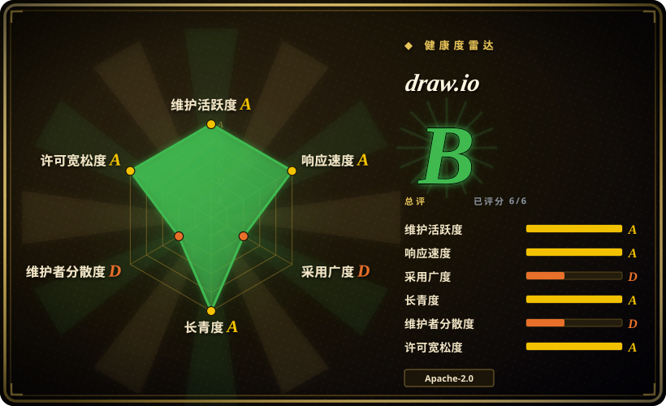
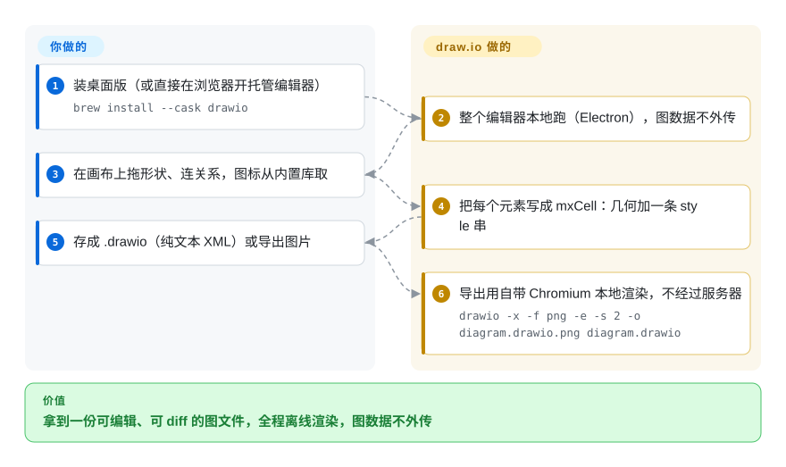

# draw.io

一个完整的所见即所得绘图应用，而它的文件就是纯文本 XML——一块可以完全离线使用的画布，外加一个能进 git diff 的文件格式。

## 何时使用

你要的是一块画布，不是一套图语法：框必须落在你指定的位置，用的是官方 AWS／Azure／GCP／UML／BPMN 形状库而不是近似的方块，最后产物是一份同事能打开、能挪两下、能改回来的文件。这就是 draw.io 干的活——你负责画，它负责序列化。当结构与形状还原度比「手绘感」更重要时选它而不选 Excalidraw；当交付物是一张手工调过的图而不是可 diff 的文本时选它而不选 Mermaid。

决定性取舍是它把两半都留住了：文件是纯 XML（`mxfile` / `mxGraphModel` / `mxCell`，每个元素带几何信息加一条 `style` 串），所以能进 git diff、能让工具在不打开 GUI 的情况下生成和打补丁；同时它又确实是一份所见即所得文档。再加上它被设计成完全离线运行，于是它自然成了「agent 生成图、再反复同步」这类工作流的承载介质：本索引收录的 [drawio-skill](../agent-skills/design/drawio-skill.zh.md) 正是围绕这个文件格式做的。

## 怎么用起来

draw.io 是一个客户端 JavaScript 编辑器——XML 元素名（`mxfile`、`mxGraphModel`、`mxCell`）来自 mxGraph，那个客户端绘图库的仓库（`jgraph/mxgraph`）自 2020 年起已归档。它以托管网页版和 Electron 桌面版两种形态分发，而桌面仓把编辑器本身作为 git submodule 装了进来，所以两边是同一份代码。你画的每个元素都会变成一个 `mxCell`，携带几何信息加一条编码了全部外观的 `style` 串——这条串最接近它所谓的「语言」，而它是数据格式，不是脚本语言。你出的是画和版式决定；编辑器出的是渲染、形状解析与序列化，桌面版再出导出——用自带的那份 Chromium 在本地跑。没有任何东西在服务器上编译或渲染：官方明确说桌面版被设计成与互联网完全隔离（只有更新检查除外），并且不会把图数据外发。对自动化来说有个结论值得直说——**读和改这个文件很便宜、纯文本**，而导出这条链是一个很重的 Electron 二进制，不是一个小 CLI。

<!-- flow-steps:begin (generated from flows/drawio.json by tools/flow_card.py — do not edit) -->

流程文字版

1. **你**：装桌面版（或直接在浏览器开托管编辑器） — `brew install --cask drawio`
2. **draw.io**：整个编辑器本地跑（Electron），图数据不外传
3. **你**：在画布上拖形状、连关系，图标从内置库取
4. **draw.io**：把每个元素写成 mxCell：几何加一条 style 串
5. **你**：存成 .drawio（纯文本 XML）或导出图片
6. **draw.io**：导出用自带 Chromium 本地渲染，不经过服务器 — `drawio -x -f png -e -s 2 -o diagram.drawio.png diagram.drawio`

**价值**：拿到一份可编辑、可 diff 的图文件，全程离线渲染，图数据不外传

<!-- flow-steps:end -->

## 何时不用

- **需要的是人能直接写、agent 能直接生成的纯文本图。** 用 [Mermaid](mermaid.zh.md)：draw.io 的 XML 虽然可 diff，但没人会手写 `mxCell`，也没有可生成的文本语法。Mermaid 拿版式控制权换来了这份可移植性。
- **要的是随手的手绘草图。** 用 [Excalidraw](excalidraw.zh.md)——那种非正式观感本身就是它的产品，而 draw.io 的结构化画布与形状库会把你推向正式图表。
- **需要在开源版本里做实时多人在线协作。** 官方 README 写明 draw.io「does not support real-time collaborative editing in this version」；要端到端加密的实时白板就用 [Excalidraw](excalidraw.zh.md)，或者用 draw.io 的商业集成产品。
- **需要编辑 SVG 图形。** 官方明说 draw.io「is not an SVG editor」，SVG 导出是给网页内嵌用的、不是给别的工具二次编辑用的——这类活请用专门的矢量编辑器（Inkscape、Figma）；矢量绘图工具是另一个产品类别，不在本索引收录范围内。
- **要把图表编辑器嵌进自己的 web 应用。** 目标是在自家应用里做符合标准的 BPMN 2.0，就用 [bpmn-js](bpmn-js.zh.md)（注意它的水印许可条款）；要一个可嵌入的通用画布，用 Excalidraw 的 npm 组件；draw.io 主要是应用，不是能直接嵌的库。
- **需要影响路线图，或者要一个「上游一定修」的承诺。** 官方 README 写着「We do not accept pull requests. The project is developed entirely by the core team」——如果你的修复必须落在上游而不是自己的 fork 里，请优先选接受社区贡献的项目。

## 横向对比

| 替代品 | 是否收录 | 我们的评价 | 取舍 |
|---|---|---|---|
| [Excalidraw](excalidraw.zh.md) | ✅ | 图要精确、形状要准、还要能交给别人改时选 draw.io；要非正式的协作草图加实时多人编辑时选 Excalidraw。 | Excalidraw 胜在低摩擦和实时协作；draw.io 胜在形状还原度、桌面离线使用和一份可 diff 的文本文件。 |
| [Mermaid](mermaid.zh.md) | ✅ | 图应该以文本形式留在仓库里、并在 Markdown 内渲染时选 Mermaid；摆放位置本身承载信息、且会有人去手工调整时选 draw.io。 | Mermaid 可移植、可评审、零安装；draw.io 拿这些换像素级版式控制和一个真正的编辑器。 |
| [bpmn-js](bpmn-js.zh.md) | ✅ | 必须把 BPMN 2.0 建模器嵌进 web 应用时选 bpmn-js；人需要的是一个通用绘图应用时选 draw.io。 | bpmn-js 是一个只做一个标准的库，且带水印许可条款；draw.io 是覆盖面更广的应用，UML／BPMN／网络／云形状都能画。 |
| [drawio-skill](../agent-skills/design/drawio-skill.zh.md) | ✅ | 两者是互补不是竞争：让 skill 从事实源生成或重新同步 `.drawio`，再用 draw.io 打开收最后那一成版式。 | skill 补的是抽取、provenance 和增量同步，但需要 Python、导出还要这个应用；编辑器则需要人的手。 |

## 技术栈

- **语言**：JavaScript，客户端执行。编辑器在浏览器画布上渲染；桌面版把同一份编辑器包在 Electron 里。
- **文件格式**：mxGraph XML——`mxfile` → `diagram` → `mxGraphModel` → `root` → `mxCell`，每个 cell 带 `mxGeometry` 加一条分号分隔的 `style` 串。纯文本，没有二进制容器。
- **仓库拓扑**：`jgraph/drawio` 是编辑器源码；`jgraph/drawio-desktop` 是 Electron 构建，并把编辑器作为 `drawio` submodule 装进来。
- **后端**：画图不需要任何后端。官方另外在 `app.diagrams.net` 跑了一份生产部署；与外部存储（Google Drive、OneDrive、GitHub）的集成是可选的、默认关闭。
- **资源**：应用内置图标集与 stencil 库（云厂商、UML、BPMN、网络）——这些带一条额外的许可限制，见下面的风险信号。

## 依赖

- **画图**：现代浏览器（托管版）或桌面版。macOS／Linux 上 `brew install --cask drawio` 会同时装应用和一个 `drawio` 命令包装器。
- **导出／自动化**：CLI 就是桌面版——导出会拉起整个 Electron 应用，没有轻量的无头渲染器。只有编辑器仓库是导不出的。
- **运行时服务**：没有。不需要数据库、服务器、账号。桌面版自己发起的唯一网络请求是更新检查。
- **围绕格式的工具链**：任何读或改这份 XML 的工具都不需要装 draw.io——文本型生成器和 diff 工具就是这么做的。

## 运维难度

编辑器场景是**低**：装上、画、导出，没有要运维的东西，也没有数据外流。想在 CI 或脚本里做确定性导出则是**低到中**：你是在无头 shell 里调一个 Electron 应用，这条路径需要补环境——drawio-skill 项目记录的做法是 Linux 上用 `xvfb-run -a` 包一层、把 `--no-sandbox` 挪到参数末尾、无 GPU 的服务器加 `--disable-gpu`、并把 `HOME` 设成 `/tmp`。在承诺「自动出图」之前先给这些折腾留出预算。自建 web 编辑器就是**中**：等于做静态托管，外加决定文件存哪。[推断]

## 健康度与可持续性

- **维护（核对于 2026-09-21）**：活跃开发中——编辑器仓 2026-09-16 有推送（同日发布 v31.4.6），桌面仓 2026-09-18 有推送（最新 release v31.4.5，2026-09-08）。桌面仓至少有 100 个 release。
- **治理与巴士系数——决定性信号。** 源码开放，但**开发是封闭的**：官方 README 明确「We do not accept pull requests. The project is developed entirely by the core team」。公开的编辑器仓正反映了这点（3 位贡献者、`dev` 分支 115 次提交），而真正的开发历史在桌面仓（16 位贡献者、1,252 次提交，其中单个账号 926 次）。所以「贡献者众多」这个常见健康信号在这里是**设计上缺席**的，也没有社区兜底路径：发布方一旦停手，你要么 fork 要么迁移。
- **背书与寿命**：由 draw.io Ltd（原 JGraph）与 draw.io AG 共同拥有，商业的 Atlassian 集成在供养这份工作；GitHub 组织建于 2012 年，编辑器仓 2016 年、桌面仓 2017 年。约十年的持续活跃，对应用和文件格式都是很强的 Lindy 先验。
- **采用度**：桌面版约 6.32 万星，官方在 `app.diagrams.net` 跑着一份托管部署；这个格式是事实上的互通目标——本索引收录的 [drawio-skill](../agent-skills/design/drawio-skill.zh.md) 就是完全围绕生成与同步它来做的。但雷达上这一轴要谨慎读：它是按 npm 包 `drawio-offline`（第三方重打包）算出来的，所以这一轴低估了真实分发面（GitHub release 加上 Homebrew／Flathub／Snap 包和托管版）。
- **响应性**：issue 回得很快——雷达给这一轴打了高分——而 pull request 则被政策直接拒收，所以这里的「响应快」指分诊，不指修复能落地。
- **风险信号**：源码是 Apache-2.0，但**图标集、stencil 库和图表模板另有一条附加限制**——未经书面许可，不得作为软件资产用于、随附于或并入 Atlassian 产品及 Atlassian 市场／插件生态的产品（终端用户产出的图明确豁免；官方也声明不对你用本软件创建的图主张版权）。第三方 JavaScript 与 Apache-2.0 兼容、无 GPL／AGPL（官方说法）。桌面版的更新检查可用 `DRAWIO_DISABLE_UPDATE=true` 或 `--disable-update` 关掉。

## 存疑（未验证）

- [未验证] 导出 CLI 的参数写法在本页来自 drawio-skill 项目的 skill 文件，而不是来自官方：`jgraph/drawio-desktop` 自己的 `doc/` 里只有构建与发布说明，我在仓库里没找到官方 CLI 文档。请用你装的那一版的 `drawio --help` 核对。
- [未验证] release 数量是分页 API 读取：桌面仓的 100 是分页上限（所以只是下限），编辑器仓是 30，真实总数更高。
- [未验证] 星数（2026-09-21 编辑器仓 8,261、桌面仓 63,218）来自 GitHub 元数据，且随时间变化。
- [推断] 编辑器仓 3 位贡献者、115 次提交的形态，可由官方的「只由核心团队开发」政策加上「开发历史在桌面仓」解释；至于公开的编辑器仓是否为内部仓库的过滤导出，官方没有明说。
- [未验证] 无头导出的那些补丁（xvfb、`--no-sandbox` 的位置、`--disable-gpu`、`HOME=/tmp`）来自 drawio-skill 项目的排错笔记而非官方，我也无法在此复现——本机没装 draw.io 二进制，所以导出这条链未经实测。
- [推断] 那条图标／stencil 附加许可限制，可能影响任何再分发 draw.io 形状库或图标库的工具；而「一个由 style 串与标题派生出来的索引」是否构成该条款下的衍生作品，是法律问题，我无法回答。
- [未验证] 不同分发形态（桌面版、托管部署、商业 Atlassian 产品）各自的协作能力，README 除了「does not support real-time collaborative editing in this version」之外没有细说。
- [推断] frontmatter 里的「采用度」轴是测量产物，而不是关于 draw.io 的信号：它是按 npm 包 `drawio-offline`（第三方重打包，registry 记录创建于 2021-06-02、维护者与 JGraph 无关、最新版 14.6.12，而 draw.io 在 2026-09-21 已是 31.x）算的，那个包只是把 `jgraph/drawio` 声明成自己的仓库。draw.io 本身不以 npm 包分发。
