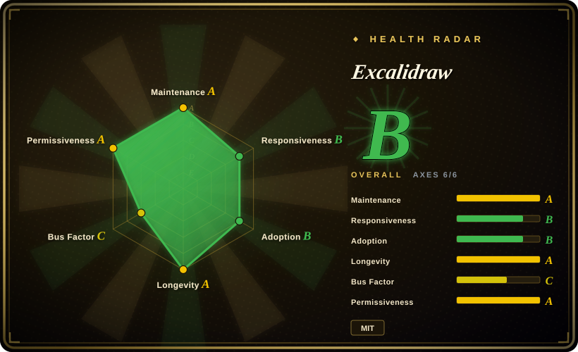
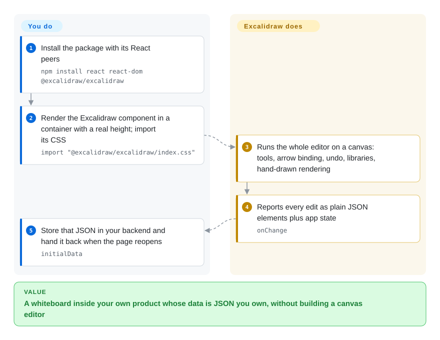

# Excalidraw

Sketching an architecture idea in a formal diagram tool means twenty minutes of snapping boxes to a grid, and then the meeting argues about colours instead of the design. Excalidraw is a whiteboard that draws everything in a deliberately rough, hand-drawn style, in the browser at excalidraw.com or as a React component inside your own app, so a two-minute sketch looks like the draft it is.

## When to use

You're an engineer about to explain a design in a call, or writing a design doc that needs one picture of "request goes here, then here". Opening draw.io means picking shape libraries and aligning connectors; Mermaid means writing `A --> B` and accepting whatever layout it produces. You open excalidraw.com, drag out boxes and arrows (arrows stay attached when you move a box), and paste the PNG or SVG into the doc, or share a live session where everyone draws at once. The rough look tells readers "this is a sketch" and keeps the review on the idea.

The second trigger is product work: you're building a docs site, a learning app or an internal tool and need a whiteboard *inside* it. Instead of writing a canvas editor, you add the MIT-licensed `@excalidraw/excalidraw` React component, which brings the whole editor, and you store its scene as JSON in your own backend. Pick it over [draw.io](drawio.md) when informality and a small embeddable component matter more than formal shape libraries; pick it over tldraw when you need a permissive licence with no production licence key.

## How it works

A drawing is a list of JSON elements — rectangle, ellipse, arrow, text, image — each with position, style and, for arrows, which shapes it is bound to. The editor renders them onto an HTML canvas through rough.js, a library that adds small random wobble to every stroke so lines look hand-drawn; the "sloppiness" setting turns that down to near-straight lines. **As a library, Excalidraw gives you the entire editor — tools, selection, undo, shape libraries, i18n, export — and you decide where the scene lives:** you read changes from `onChange`, save the JSON, pass it back as `initialData`, and call `exportToSvg` or `exportToBlob` when you need an image. Real-time collaboration, shareable links and end-to-end encryption are features of the excalidraw.com app (whose source is in the same repo), not of the npm component. Self-hosting those means running the app plus a WebSocket room server and a Firebase-style storage backend.

<!-- flow-steps:begin (generated from flows/excalidraw.json by tools/flow_card.py — do not edit) -->

Text version of the flow

1. **You**: Install the package with its React peers — `npm install react react-dom @excalidraw/excalidraw`
2. **You**: Render the Excalidraw component in a container with a real height; import its CSS — `import "@excalidraw/excalidraw/index.css"`
3. **Excalidraw**: Runs the whole editor on a canvas: tools, arrow binding, undo, libraries, hand-drawn rendering
4. **Excalidraw**: Reports every edit as plain JSON elements plus app state — `onChange`
5. **You**: Store that JSON in your backend and hand it back when the page reopens — `initialData`

**Value**: A whiteboard inside your own product whose data is JSON you own, without building a canvas editor

<!-- flow-steps:end -->

## When NOT to use

- **Diagrams should live as text in Git and render in Markdown.** A `.excalidraw` file is JSON full of coordinates and random seeds, so diffs are unreadable. Use [Mermaid](mermaid.md), [PlantUML](plantuml.md) or [D2](d2.md); if you start in Mermaid and want to hand-edit later, the [mermaid-to-excalidraw](https://github.com/excalidraw/mermaid-to-excalidraw) converter (not indexed) bridges one way.
- **You need formal notation or automatic layout.** No BPMN/UML semantics and no auto-layout: use [bpmn-js](bpmn-js.md) for executable process models, [draw.io](drawio.md) for precise shape libraries and layout, or a text tool for layout from structure.
- **You want collaboration inside your embedded editor without building it.** The npm package has no multiplayer. The open-source path is self-hosting the excalidraw.com app plus [excalidraw-room](https://github.com/excalidraw/excalidraw-room) (not indexed), whose last push was 2024-07, plus Firebase-style storage. If you need a maintained multiplayer canvas SDK and accept its licence terms, evaluate [tldraw](https://github.com/tldraw/tldraw) (not indexed), which requires a licence key in production.
- **You need UI design, prototyping or design handoff.** Excalidraw has no components, auto-layout frames or inspect mode; use [Penpot](../design-editors/penpot.md) (open source) or Figma.
- **The embed must run fully offline.** By default the component fetches its fonts from a CDN; in air-gapped deployments you must copy the font files into your static assets and set `window.EXCALIDRAW_ASSET_PATH`, or text renders in a fallback font.

## Comparison

| Alternative | In index | Our verdict | Tradeoff |
| --- | --- | --- | --- |
| [Mermaid](mermaid.md) | ✅ | When the diagram belongs next to code, reviewed in pull requests and rendered by GitHub or your docs site, pick Mermaid; pick Excalidraw when a person is sketching freehand and the layout is part of the message. | Plain text, diffable and auto-laid-out; you give up control over placement and the informal look. |
| [draw.io](drawio.md) | ✅ | For precise diagrams with large shape libraries (network, cloud, UML) that must look formal, pick draw.io; pick Excalidraw for quick, deliberately rough sketches and a lighter embeddable component. | Huge stencil sets, layers and exact alignment; heavier editor, Apache-2.0 but not designed as a React drop-in. |
| [D2](d2.md) | ✅ | When you want diagrams compiled from text with real layout engines and themes, pick D2; pick Excalidraw when the picture is drawn by hand rather than generated from a model. | Declarative source and good automatic layout (it even offers a sketch theme); no freehand editing or live whiteboard. |
| [tldraw](https://github.com/tldraw/tldraw) | not indexed | When you are building a product on an extensible canvas SDK with multiplayer sync and custom shapes, and can accept a licence key for production, pick tldraw; pick Excalidraw for an MIT-licensed whiteboard you can embed and ship without a vendor agreement. | Richer SDK and first-party sync tooling; source-available licence with production restrictions instead of MIT. |
| [Penpot](../design-editors/penpot.md) | ✅ | For UI design, prototypes and developer handoff in open source, pick Penpot; pick Excalidraw for low-fidelity whiteboarding where precision would slow you down. | Full design tool with components and flex layout; a server deployment and a learning curve that a whiteboard does not need. |

## Tech stack

- **TypeScript + React** — the editor is a React component (`@excalidraw/excalidraw`, React 17, 18 or 19 as peer dependency).
- **HTML Canvas + rough.js** — rendering and the hand-drawn stroke style; SVG and PNG export through `exportToSvg` / `exportToBlob`.
- **Vite** — builds the excalidraw.com app (`excalidraw-app/`), a PWA that works offline.
- **Collaboration (app only)** — Socket.IO room server (`excalidraw-room`), Firebase for scene and file persistence, client-side end-to-end encryption.
- **Format** — `.excalidraw` JSON; libraries as `.excalidrawlib`.

## Dependencies

- **Embedding:** React and React DOM, a bundler, the package's CSS, and a container with non-zero height; in Next.js or other SSR frameworks, client-only rendering (`"use client"` plus `dynamic(..., { ssr: false })`).
- **Fonts:** fetched from a CDN at runtime unless you self-host them and set `window.EXCALIDRAW_ASSET_PATH`.
- **Persistence:** none built in for the component — your backend stores the JSON.
- **Self-hosting the full app with collaboration:** a WebSocket room server, a Firebase project (or a replacement you wire in), and, for share links, a JSON storage backend; the production build points at excalidraw.com's services by default.

## Ops difficulty

**Low** to use excalidraw.com. **Low to medium** to embed: the two most common integration failures — missing CSS and a zero-height parent — are documented, but the stable npm release is infrequent (0.18.0 in 2025-03, 0.18.1 in 2026-04) while fixes land continuously on the `@next` tag, so you either wait about a year for a stable bump or pin a snapshot build; 0.18 also changed import paths. **Medium to high** to self-host the collaborative app: you rebuild it with your own environment variables, run the room server, provide Firebase-compatible storage, and maintain all three yourself.

## Health & viability

- **Maintenance — active.** Maintenance Grade A: commits in 12 of the last 13 weeks, last commit 1 day ago. Stable npm releases are rare even so (see Ops difficulty).
- **Responsiveness — slower than before.** Responsiveness Grade B (down from A at the 2026-09-22 scoring): median first response 52.5 hours across 36 qualifying issues/PRs. Expect a couple of days for a first reply, not hours.
- **Governance — concentrated in a small core.** Governance Grade C (down from B): top-1 contributor share 62.9% and top-3 90.5% among 13 active maintainers in the last 12 months. The repo is owned by the `excalidraw` organisation and funded through Excalidraw+ (a paid hosted product) and Open Collective, but day-to-day work rests on very few people; that concentration is the main viability risk, not inactivity.
- **Age & Lindy.** Longevity Grade A: created 2020-01, 2471 days old and still active — a good Lindy prior.
- **Adoption — broad.** Adoption Grade B: 2,399,436 npm downloads last month for `@excalidraw/excalidraw` and 523 dependent repositories; integrations listed in the README include Notion, Replit, CodeSandbox and an Obsidian plugin. About 134k GitHub stars (2026-10).
- **Risk flags.** Risk/License Grade A: MIT, no relicense history. The open-core edge is Excalidraw+, which keeps team workspaces and some features in the hosted product.

## Caveats (unverified)

- [未验证] Star and download counts are from GitHub and npm on 2026-10-08 and drift daily.
- [推断] "Stable npm releases are rare" is read from the GitHub release list and npm dist-tags (`latest` 0.18.1, frequent `next` builds); the team may treat `next` as production-ready.
- [未验证] The self-hosted collaboration setup (room server plus Firebase plus JSON backend) is read from the app's `.env.production` and repo layout; there is no official self-hosting guide for it.
- [未验证] Which features Excalidraw+ reserves for paying users changes over time and was not re-checked here.
- [推断] Large canvases with thousands of elements may slow down in the browser; test with your expected scene size.
- [未验证] tldraw's production licence-key requirement is from its LICENSE.md on 2026-10-08; check current terms before deciding.
