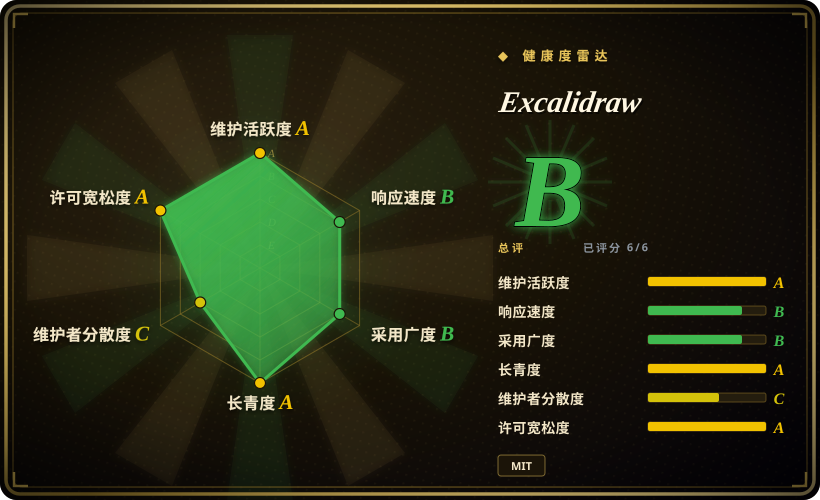
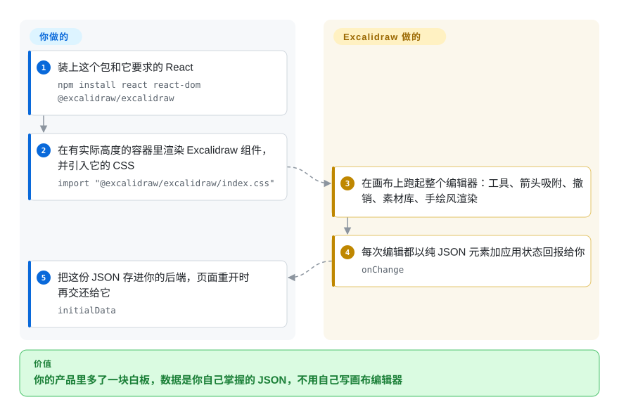

# Excalidraw

在正式的画图工具里勾一个架构想法，要花二十分钟把方框对齐网格，结果会上大家争的是配色而不是设计。Excalidraw 是一块白板，所有东西都故意画成粗糙的手绘风，在浏览器里打开 excalidraw.com 就能用，也能作为 React 组件嵌进你自己的应用，两分钟的草图看上去就是草稿该有的样子。

## 何时使用

你是一名工程师，马上要在会上讲一个设计，或者正在写设计文档，需要一张“请求先到这儿、再到那儿”的图。打开 draw.io 得先挑形状库、对齐连线；用 Mermaid 得写 `A --> B`，布局排成什么样就只能认了。你打开 excalidraw.com，拖出几个方框和箭头（挪动方框时箭头会跟着吸附），把 PNG 或 SVG 贴进文档，或者开一个实时会话让大家一起画。粗糙的笔触告诉读者“这是草图”，评审就停留在想法本身。

第二种触发场景是做产品：你在做文档站、学习类应用或内部工具，需要在产品*里面*放一块白板。与其自己写画布编辑器，不如装上 MIT 许可的 `@excalidraw/excalidraw` React 组件，整个编辑器随之而来，画面以 JSON 形式存进你自己的后端。比起 [draw.io](drawio.zh.md)，在随意感和组件轻量更重要时选它；比起 tldraw，在你需要宽松许可、生产环境不想要许可证密钥时选它。

## 怎么用起来

一张图就是一组 JSON 元素——矩形、椭圆、箭头、文字、图片——每个元素带位置、样式，箭头还记着它吸附在哪些形状上。编辑器用 rough.js 把它们画到 HTML 画布上；rough.js 给每一笔加一点随机抖动，让线条看起来像手画的，“潦草度”设置可以把抖动调到接近直线。**作为库，Excalidraw 把整个编辑器都给你——工具、选择、撤销、素材库、多语言、导出——画面存在哪儿由你决定**：从 `onChange` 读取变化，保存 JSON，再通过 `initialData` 交还给它；需要图片时调用 `exportToSvg` 或 `exportToBlob`。实时协作、分享链接和端到端加密是 excalidraw.com 这个应用（源码在同一个仓库里）的功能，不是 npm 组件的功能。要自托管这些，就得跑这个应用，外加一个 WebSocket 房间服务和一个 Firebase 式的存储后端。

<!-- flow-steps:begin (generated from flows/excalidraw.json by tools/flow_card.py — do not edit) -->

流程文字版

1. **你**：装上这个包和它要求的 React — `npm install react react-dom @excalidraw/excalidraw`
2. **你**：在有实际高度的容器里渲染 Excalidraw 组件，并引入它的 CSS — `import "@excalidraw/excalidraw/index.css"`
3. **Excalidraw**：在画布上跑起整个编辑器：工具、箭头吸附、撤销、素材库、手绘风渲染
4. **Excalidraw**：每次编辑都以纯 JSON 元素加应用状态回报给你 — `onChange`
5. **你**：把这份 JSON 存进你的后端，页面重开时再交还给它 — `initialData`

**价值**：你的产品里多了一块白板，数据是你自己掌握的 JSON，不用自己写画布编辑器

<!-- flow-steps:end -->

## 何时不用

- **图要以文本形式进 Git、在 Markdown 里渲染**——`.excalidraw` 文件是满是坐标和随机种子的 JSON，diff 没法读。用 [Mermaid](mermaid.zh.md)、[PlantUML](plantuml.zh.md) 或 [D2](d2.zh.md)；如果先用 Mermaid 写、之后想手工调整，[mermaid-to-excalidraw](https://github.com/excalidraw/mermaid-to-excalidraw)（未收录）转换器能单向搭桥。
- **需要规范的建模符号或自动布局**——没有 BPMN/UML 语义，也没有自动布局：可执行的流程模型用 [bpmn-js](bpmn-js.zh.md)，要精确的形状库和排版用 [draw.io](drawio.zh.md)，要从结构自动出布局就用文本类工具。
- **想在嵌入的编辑器里直接有协作、又不想自己做**——npm 包不带多人协作。开源路线是自托管 excalidraw.com 应用，加上最后一次推送停在 2024-07 的 [excalidraw-room](https://github.com/excalidraw/excalidraw-room)（未收录），再加 Firebase 式存储。如果你需要一个仍在维护的多人画布 SDK、也能接受它的许可条款，评估 [tldraw](https://github.com/tldraw/tldraw)（未收录），它在生产环境需要许可证密钥。
- **需要 UI 设计、原型或设计交付**——Excalidraw 没有组件、自动布局框架和标注检查模式；用 [Penpot](../design-editors/penpot.zh.md)（开源）或 Figma。
- **嵌入的编辑器必须完全离线运行**——组件默认从 CDN 拉字体；在隔离网络里部署，得把字体文件拷进你的静态资源目录并设置 `window.EXCALIDRAW_ASSET_PATH`，否则文字会用回退字体渲染。

## 横向对比

| 替代品 | 是否收录 | 我们的评价 | 取舍 |
| --- | --- | --- | --- |
| [Mermaid](mermaid.zh.md) | 已收录 | 图要跟代码放在一起、在 PR 里评审、由 GitHub 或文档站渲染，选 Mermaid；是人在徒手画、布局本身就是要传达的信息，选 Excalidraw。 | 纯文本、可 diff、自动布局；代价是放弃对位置的控制和随意的手绘感。 |
| [draw.io](drawio.zh.md) | 已收录 | 要精确、正式的图，靠大型形状库（网络、云、UML），选 draw.io；要快速、故意粗糙的草图和更轻的可嵌入组件，选 Excalidraw。 | 海量图形模板、图层和精确对齐；编辑器更重，Apache-2.0，但不是按 React 即插即用组件设计的。 |
| [D2](d2.zh.md) | 已收录 | 想从文本编译出图、用真正的布局引擎和主题，选 D2；图是手画出来的而不是从模型生成的，选 Excalidraw。 | 声明式源码，自动布局好（甚至有手绘风格的 sketch 模式）；不能徒手编辑，也没有实时白板。 |
| [tldraw](https://github.com/tldraw/tldraw) | 未收录 | 你要在一个可扩展的画布 SDK 上做产品，需要多人同步和自定义形状，且能接受生产环境的许可证密钥，选 tldraw；要一块 MIT 许可、不用和厂商签协议就能嵌入发布的白板，选 Excalidraw。 | SDK 更丰富，官方提供同步方案；许可是带生产限制的源码可见许可，而不是 MIT。 |
| [Penpot](../design-editors/penpot.zh.md) | 已收录 | 要开源的 UI 设计、原型和开发交付，选 Penpot；做低保真白板、精确反而拖慢你时，选 Excalidraw。 | 完整的设计工具，有组件和弹性布局；需要部署服务端，学习曲线也是白板用不着的。 |

## 技术栈

- **TypeScript + React**——编辑器是一个 React 组件（`@excalidraw/excalidraw`，对等依赖 React 17、18 或 19）。
- **HTML Canvas + rough.js**——渲染和手绘笔触；SVG、PNG 导出走 `exportToSvg` / `exportToBlob`。
- **Vite**——构建 excalidraw.com 应用（`excalidraw-app/`），一个能离线使用的 PWA。
- **协作（仅应用）**——Socket.IO 房间服务（`excalidraw-room`），Firebase 负责画面和文件持久化，客户端端到端加密。
- **格式**——`.excalidraw` JSON；素材库是 `.excalidrawlib`。

## 依赖

- **嵌入时**：React 和 React DOM、一个打包工具、包自带的 CSS，以及高度不为零的容器；在 Next.js 等服务端渲染框架里要只在客户端渲染（`"use client"` 加 `dynamic(..., { ssr: false })`）。
- **字体**：运行时从 CDN 拉取，除非你自托管并设置 `window.EXCALIDRAW_ASSET_PATH`。
- **持久化**：组件本身不带——JSON 由你的后端保存。
- **自托管带协作的完整应用**：一个 WebSocket 房间服务、一个 Firebase 项目（或你自己接上的替代品），分享链接还需要一个 JSON 存储后端；生产构建默认指向 excalidraw.com 的服务。

## 运维难度

直接用 excalidraw.com：**低**。嵌入：**低到中**——两个最常见的集成故障（忘了引 CSS、父容器高度为零）文档里都写了，但 npm 稳定版很少发（0.18.0 在 2025-03，0.18.1 在 2026-04），修复持续落在 `@next` 标签上，所以你要么等大约一年才升一次稳定版，要么锁定某个快照构建；0.18 还改了导入路径。自托管协作版应用：**中到高**——要用你自己的环境变量重新构建应用、跑房间服务、提供兼容 Firebase 的存储，三样都得自己维护。

## 健康度与可持续性

- **维护活跃度——活跃**。维护活跃度 Grade A：最近 13 周中 12 周有提交，最后提交距今 1 天。即便如此，npm 稳定版依然很少（见运维难度）。
- **响应速度——比以前慢**。响应速度 Grade B（此前 2026-09-22 的评分为 A）：基于 36 个 qualifying issues/PRs，中位首次响应时间 52.5 小时。首次回复要按两天左右预期，而不是几小时。
- **治理——集中在很小的核心**。治理集中度 Grade C（此前为 B）：过去 12 个月 13 位活跃维护者，第一贡献者占比 62.9%，前三贡献者占比 90.5%。仓库归 `excalidraw` 组织所有，资金来自付费托管产品 Excalidraw+ 和 Open Collective，但日常工作压在极少数人身上；主要的可持续性风险是这种集中，而不是不活跃。
- **年龄与 Lindy**。长青度 Grade A：创建于 2020-01，已 2471 天，仍然活跃——不错的 Lindy 先验。
- **采用度——广泛**。采用广度 Grade B：`@excalidraw/excalidraw` 上月 npm 下载量 2,399,436 次，523 个依赖仓库；README 列出的集成方有 Notion、Replit、CodeSandbox 和一个 Obsidian 插件。GitHub 星标约 13.4 万（2026-10）。
- **风险信号**。许可证风险 Grade A：MIT，没有改许可证的历史。open-core 的边界在 Excalidraw+：团队工作区和部分功能留在托管产品里。

## 存疑（未验证）

- [未验证] 星标和下载量取自 2026-10-08 的 GitHub 和 npm，每天都在变。
- [推断] “npm 稳定版很少发”是从 GitHub 发布列表和 npm dist-tags（`latest` 为 0.18.1，`next` 构建频繁）读出来的；团队也许把 `next` 视为可用于生产。
- [未验证] 自托管协作的组成（房间服务、Firebase、JSON 后端）是从应用的 `.env.production` 和仓库结构读出来的，官方没有对应的自托管指南。
- [未验证] Excalidraw+ 把哪些功能留给付费用户会随时间变化，本页没有重新核实。
- [推断] 上千个元素的大画布在浏览器里可能变慢；请按你预期的画面规模实测。
- [未验证] tldraw 生产环境需要许可证密钥，依据是 2026-10-08 它的 LICENSE.md；决定前请查最新条款。
