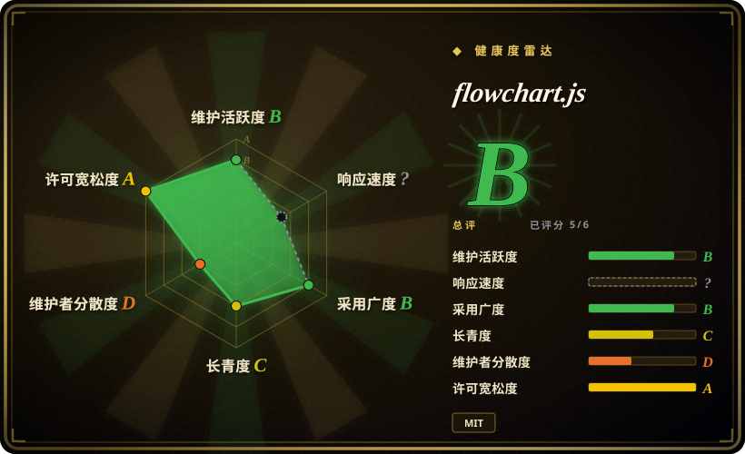
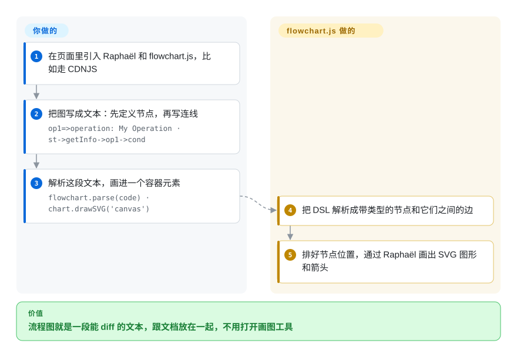

# flowchart.js

一个很小的 JavaScript 库，把一段小型文本 DSL 在浏览器里渲染成 SVG 流程图——把节点和连线写成文本，得到一张画好的图。

## 何时使用

你是前端开发，要给一个内部文档站或 wiki 加一个“流程”视图，希望用户（或你自己）能把流程图写成纯文本、和正文放在一起——可在 git 里 diff、不用画图工具就能改。你不想嵌入一个笨重的图编辑器，也不想发一个 canvas 应用；你只需要几个判断框和箭头被干净地画出来。你引入 flowchart.js（外加 Raphael.js），写一小段像 `st=>start: Begin` / `op=>operation: Do work` / `cond=>condition: OK?` 加上连线，调 `flowchart.parse(text).drawSVG('diagram')`，库就完成布局并画出 SVG。因为节点和连线是分开定义的，你可以复用节点、用 `flowstate` 修饰符给它们设样式，还能把节点链接到外部 URL。

当图*简单且不多*时它很合适——上手流程、某段脚本的控制流、一个审批流程——而且你看重“文本即事实源”胜过视觉精度或交互性。

## 怎么用起来

flowchart.js 是你在自己页面里调用的两段式流水线。**图由你写成文本**：每个节点一行（`id=>type: label`，type 从一组固定形状里选——start、end、operation、condition、input/output、subroutine、parallel），然后是几行连线（`a->b`、`cond(yes)->c`）。**剩下的它来做**：`flowchart.parse()` 把文本变成节点和边组成的图，`drawSVG()` 排好节点位置，通过 Raphaël 画进你页面上的一个元素里（Raphaël 是一个较老的 JavaScript 库，封装了浏览器的矢量图格式 SVG）。节点定义和连线是分开写的，所以改流程走向只是改箭头，不用重画方框。整个过程不需要服务端——两个 script 标签加一段字符串。

<!-- flow-steps:begin (generated from flows/flowchart-js.json by tools/flow_card.py — do not edit) -->

流程文字版

1. **你**：在页面里引入 Raphaël 和 flowchart.js，比如走 CDNJS
2. **你**：把图写成文本：先定义节点，再写连线 — `op1=>operation: My Operation · st->getInfo->op1->cond`
3. **你**：解析这段文本，画进一个容器元素 — `flowchart.parse(code) · chart.drawSVG('canvas')`
4. **flowchart.js**：把 DSL 解析成带类型的节点和它们之间的边
5. **flowchart.js**：排好节点位置，通过 Raphaël 画出 SVG 图形和箭头

**价值**：流程图就是一段能 diff 的文本，跟文档放在一起，不用打开画图工具

<!-- flow-steps:end -->

## 何时不用

- **你想要交互式编辑，而不只是渲染。** flowchart.js 是从文本*画*出一张图；它不是建模器——不能拖拽编辑、没有实时 canvas。要那个，请用一个完整的编辑器库。
- **你需要丰富的现代图类型或主题。** 它狭义上只是个流程图渲染器，节点词汇固定（约 9 种元素类型），样式停留在 Raphael 时代。要 sequence/class/gantt/state 图以及 Markdown 原生嵌入，Mermaid 是更广、维护更活跃的选择。
- **你不想依赖 Raphael.js。** 渲染需要 Raphael，一个本身实际处于维护模式的较老 SVG 库——你会继承这个传递性的寿命风险。[推断]
- **复杂或大型图。** 布局很基础；稠密图、大量交叉，或一个节点超过三条并行路径都不是它的强项（文档上限为 3 条并行路径）。
- **你需要 DSL 灵活性。** 语法为避免解析冲突禁用了若干符号（`=>`、`->`、`:>`、`|`、`@>`、`:$`），这会约束标签和内容。

## 横向对比

| 替代品 | 是否收录 | 我们的评价 | 取舍 |
|---|---|---|---|
| [Mermaid](mermaid.zh.md) | ✅ | 需要广泛的 Markdown 原生文本图，而不只是流程图时，选 Mermaid。 | 范围广得多（flowchart、sequence、class、state、gantt、ER……），Markdown 原生，开发与主题化都活跃；更重、有自己的语法，但已是当下文本转图的事实标准。 |
| [bpmn-js](bpmn-js.zh.md) | ✅ | 需要浏览器内完整 BPMN 2.0 建模和交互编辑时，选 bpmn-js。 | 浏览器内完整的 BPMN 2.0 建模 + 交互式编辑；一个基于标准的流程建模器，而非轻量文本转 SVG 渲染器——范围与体积都大得多。 |
| Graphviz / Viz.js | 未收录 | 任意节点-连线图的强自动布局比流程图语义更重要时，选 Graphviz/Viz.js。 | DOT 语言，对任意节点-连线图有强自动布局；布局引擎更好，但流程图语义和样式更弱。 |
| [PlantUML](plantuml.zh.md) | ✅ | DSL 必须覆盖多种 UML 和流程图，且可以接受服务端/Java 渲染时，选 PlantUML。 | 覆盖多种 UML + 流程图类型的文本 DSL，通常服务端/Java 渲染；图目录更丰富，但不是浏览器原生的 JS 库。 |

## 技术栈

- **语言：** JavaScript（浏览器为先；也可经 `diagrams` CLI 包使用）。
- **渲染：** Raphael.js——一个 SVG 抽象库——做实际绘制；flowchart.js 解析 DSL 并在其上计算布局。
- **DSL：** 一种按行的文本格式，把节点*定义*（`id=>type: text`）与*连线*（`a->b`）分开，可选 `flowstate` 样式和 URL 链接。
- **分发：** npm 包，以及供 `<script>` 直接引入的 CDNJS 构建。

## 依赖

- **运行时：** Raphael.js（必需）外加一个供渲染的 DOM/浏览器。无后端、无数据存储。
- **构建/安装：** 经 npm 或 CDN `<script>` 标签提供；浏览器路径无需服务端渲染。
- **无外部服务**——一切都在客户端运行。

## 运维难度

**低。** 这是个客户端渲染库：引入两个脚本（Raphael + flowchart.js），给它一个容器元素和一段文本字符串，它就画。除了把 JS 服务出去，没什么要部署或运维。唯一真正的“运维”顾虑是钉死 flowchart.js 与 Raphael 的兼容版本，并接受 Raphael 自身的维护状态作为传递依赖。

## 健康度与可持续性

- **响应速度**：无法计算——no_traffic。
- **维护（2026-10）。** 最近一次代码发布是 v1.18.0（2023-12-08）；之后的两次提交（2025-04、2026-01-15）都是“update site”，雷达的维护轴能保持 B 靠的就是它们。仓库**未归档**，但库本身**自 2023 年起就在吃老本**，open issue 数（约 104）相对活跃度也偏多。[推断]
- **治理 / bus factor。** **单一维护者**项目（adrai），外加贡献者长尾；bus factor 实际为一。约 8.7k star 是有力的采用证明，但不保证持续支持。[推断]
- **年龄与 Lindy 判断。** 2013-07 创建，约 13 年，至今仍被安装和托管（未归档，文档站 2026 年还在更新）——**强 Lindy** 信号：它远比多数同代项目活得久，仍是一个小而稳定的工具。这里的年龄是真正的加分项。[推断]
- **采用度。** 在文档站和教程里广泛嵌入（约 8.7k star、约 1.2k fork）；即便 Mermaid 主导了更大的品类，这个轻量、文本为先的小生态仍让它保持相关性。[未验证]
- **风险标记。** MIT（干净）。主要标记：单一维护者 + 慢节奏，以及对 Raphael.js（一个老化的 SVG 库）的传递依赖——都是寿命层面的考量，而非即时阻断项。[推断]

## 存疑（未验证）

- [未验证] 截至 2026-06 约 8.7k star / 约 1.2k fork、版本 v1.18.0；计数对时间敏感——仅供参考。
- [推断] “Raphael.js 实际处于维护模式”是对一个传递依赖的推断，而非已核实的上游状态——若你看重寿命，请核查 Raphael 当前状况。
- [推断] “自 2023 年起吃老本”是从 tag 日期和 v1.18.0 之后的提交说明（全是“update site”）推断的，而非来自声明的支持政策。
- [未验证] 节点类型数（约 9）与 3 条并行路径上限取自 README——请对照当前语法文档核实。
- [未验证] 对比行（Mermaid、Graphviz、PlantUML）描述的是来自公开认知的一般能力，而非对 flowchart.js 的逐特性实测。
