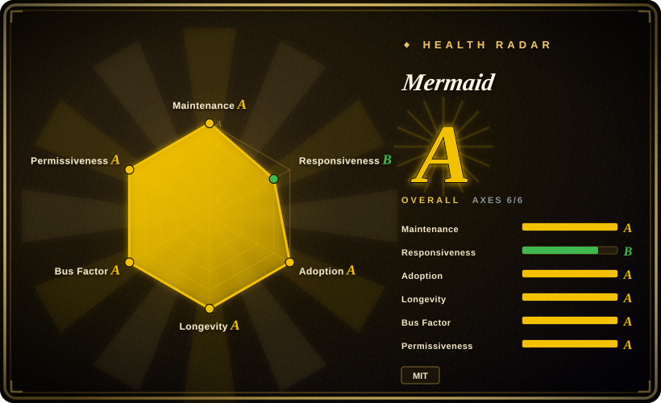
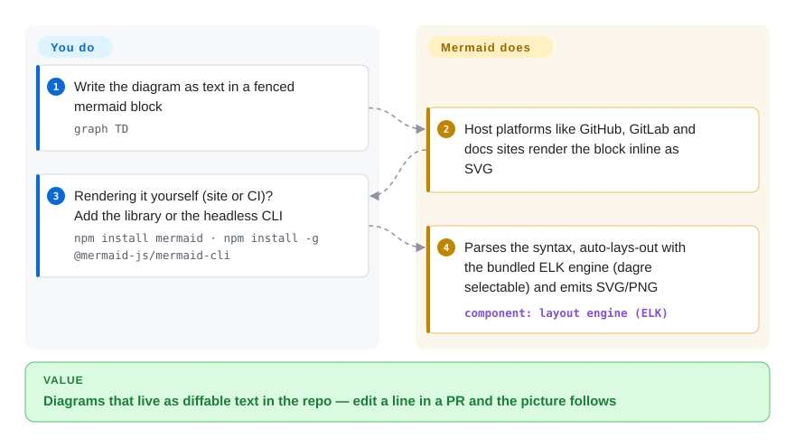

# Mermaid

A JavaScript/TypeScript library that renders diagrams from a Markdown-like text syntax — flowcharts, sequence, gantt, class, ER, state, git-graph, pie, mindmap and more — so diagrams live as plain text in version control instead of as binary image files.



## When to use

You're an engineer who keeps writing architecture docs and runbooks in Markdown, and the diagrams keep rotting: someone drew the flow in draw.io a year ago, exported a PNG, and now the PNG is wrong but nobody has the source file. You want the picture to live *in* the doc, diff in a pull request, and re-render automatically. You write a fenced ` ```mermaid ` block with a few lines of `graph TD; A-->B`, push it, and GitHub, GitLab, your docs site (Docusaurus, MkDocs, Obsidian), and your IDE preview all render it inline — no binary asset, no external editor, no broken export. When the flow changes you edit text and the diagram follows; reviewers see the diff of the *diagram*, not a swapped-out image.

You also reach for it when you're an agent or a tool generating diagrams programmatically: the input is text you can template and emit, so producing a sequence diagram or an ER schema from code or from an LLM is just string assembly, then `mermaid.render()` in a browser/headless context (or `mmdc` from `@mermaid-js/mermaid-cli`) to get SVG/PNG. It's the de-facto text-to-diagram format precisely because so many host platforms already understand the fenced block — you target Mermaid and inherit GitHub/GitLab/Notion-style rendering for free.

## How it works

Mermaid is a parser plus layout-and-draw modules that run inside a JavaScript environment. You write one of its per-diagram text syntaxes (`graph TD`, `sequenceDiagram`, `erDiagram`, …); the parser turns that text into a graph model — nodes and edges — a layout engine computes where everything goes, and the renderer draws it as SVG via D3. Since v12.0.0 (2026-09) the bundled **ELK** engine is the default layout for flowchart/state/class/ER diagrams (the previous dagre layout stays selectable via `layout: dagre`), so you never place anything by hand. What Mermaid does for you: parse, lay out, draw, and re-draw on every render. What stays yours: *where* rendering happens — most teams do nothing at all and let their host platform (GitHub, GitLab, Docusaurus, Obsidian…) render the fenced block; if you render yourself, you add `npm install mermaid`, call `mermaid.initialize()` on a page containing `<pre class="mermaid">` blocks, or run `mmdc -i input.mmd -o output.svg` from the headless CLI in CI.



<!-- flow-steps:begin (generated from flows/mermaid.json by tools/flow_card.py — do not edit) -->
<details>
<summary>Text version of the flow</summary>

1. **You**: Write the diagram as text in a fenced mermaid block — `graph TD`
2. **Mermaid**: Host platforms like GitHub, GitLab and docs sites render the block inline as SVG
3. **You**: Rendering it yourself (site or CI)? Add the library or the headless CLI — `npm install mermaid · npm install -g @mermaid-js/mermaid-cli`
4. **Mermaid**: Parses the syntax, auto-lays-out with the bundled ELK engine (dagre selectable) and emits SVG/PNG — component: `layout engine (ELK)`

**Value**: Diagrams that live as diffable text in the repo — edit a line in a PR and the picture follows

</details>
<!-- flow-steps:end -->

## When NOT to use

- **You need pixel-precise or hand-tuned layouts.** Mermaid auto-lays-out via its layout engine; you do not place nodes by hand. When the exact position, spacing, or routing matters, a manual canvas (draw.io/diagrams.net, Excalidraw) or a layout language you can steer (Graphviz/DOT, D2) gives control Mermaid intentionally withholds.
- **Large or dense graphs.** Auto-layout quality and rendering performance degrade as node/edge count grows; big flowcharts come out tangled or unreadable. v12.0.0 (2026-09) made the stronger ELK engine the bundled *default* layout — a real improvement for gnarly graphs — but at genuinely large scale Graphviz (with its mature layout algorithms) is still the one to reach for. Render your biggest real diagram before standardizing. [推断]
- **It runs JavaScript in the renderer.** Mermaid executes in the browser/JS runtime and historically has had XSS surface; rendering *untrusted* diagram text means you must set `securityLevel` (`strict`/`sandbox`) appropriately and accept that some interactive features get disabled. Don't render attacker-controlled Mermaid with `securityLevel: 'loose'`.
- **You want a WYSIWYG drawing tool.** There is no drag-and-drop canvas — you edit text. Non-technical stakeholders who expect to push boxes around will not be happy; give them draw.io or Excalidraw.
- **Diagram types it does poorly or doesn't cover.** Highly custom/freeform diagrams, precise UML beyond the supported subset, or very specific notations may be better served by PlantUML (broader/stricter UML) or a general drawing tool. Verify your specific diagram type renders acceptably before standardizing on it. [推断]

## Comparison

| Alternative | In index | Our verdict | Tradeoff |
|---|---|---|---|
| Graphviz / DOT | 未收录 | Pick Graphviz when mature graph layout algorithms for large or dense graphs matter more than Markdown-native rendering. | Mature, scriptable graph **layout** engine with strong algorithms for large/dense graphs; produces excellent auto-layout but DOT is lower-level and not natively rendered inline by docs platforms the way Mermaid is. |
| [PlantUML](plantuml.md) | ✅ | Pick PlantUML when you need broader, stricter UML coverage and can accept Java/server rendering. | Broader and stricter UML coverage (and more diagram types); typically needs a Java runtime/server to render, vs Mermaid's pure-JS in-browser rendering and ubiquitous host support. |
| [D2](d2.md) | ✅ | Pick D2 when its newer language and layout-engine choices matter more than Mermaid's host-platform ubiquity. | Newer text-to-diagram language (Go) with multiple layout engines (incl. ELK/dagre) and a focus on cleaner layouts; smaller install base and far less built-in host-platform rendering than Mermaid. |
| draw.io (diagrams.net) | 未收录 | Pick draw.io when you need a full WYSIWYG canvas editor rather than version-control-friendly diagram source. | Full WYSIWYG canvas editor — pixel control and rich shapes — but diagrams are stored as XML/binary, not diffable plain text, and not auto-rendered from a fenced code block. |
| [Excalidraw](excalidraw.md) | ✅ | Pick Excalidraw when hand-drawn whiteboarding and collaboration matter more than text-to-diagram syntax. | Hand-drawn-style WYSIWYG whiteboard; great for sketches and collaboration, not a text-to-diagram syntax and not version-control-diffable as source. |
| [flowchart.js](flowchart-js.md) | ✅ | Pick flowchart.js only when you need a narrow flowchart-only JS library. | Narrow JS library for flowcharts only; Mermaid covers far more diagram types and has vastly larger ecosystem/host support. |

## Tech stack

- **Language:** TypeScript (with substantial JavaScript), distributed as an npm package and via CDN (jsDelivr); also packaged as `@mermaid-js/mermaid-cli` (`mmdc`) for headless rendering.
- **Rendering:** browser/DOM — produces SVG. Uses **D3.js** for SVG manipulation. Layout is per-diagram: since v12.0.0 the **ELK** engine ships bundled and is the default for flowchart/state/class/ER/requirement/use-case diagrams; **dagre** remains selectable (`layout: dagre`), and mindmap still uses cose-bilkent by default.
- **Baseline (v12.0.0+):** ES2024, Safari 17.4+, Node 22.12+ — a breaking raise over the 11.x line (release notes, 2026-09-10).
- **Syntax:** a Markdown-inspired DSL per diagram type (`graph`/`flowchart`, `sequenceDiagram`, `classDiagram`, `erDiagram`, `stateDiagram`, `gantt`, `gitGraph`, `pie`, `mindmap`, `journey`, C4, use-case, …; the list keeps growing — see the docs sidebar).
- **Config/security:** runtime config object including `securityLevel` (`strict` / `loose` / `antiscript` / `sandbox`) controlling script execution and sandboxed-iframe rendering. [未验证]

## Dependencies

- **Runtime:** a JavaScript environment with a DOM. In production that's the user's browser (or a host platform — GitHub/GitLab/Notion/Docusaurus/MkDocs/Obsidian — that bundles it). For server-side/CLI rendering it needs a headless browser: `@mermaid-js/mermaid-cli` 12.0.0 declares `puppeteer` as a **peer** dependency (install it yourself, or point it at an existing Chromium).
- **Library deps:** pulls in D3 and dagre (and their transitive deps) as an npm dependency; nothing to operate as a service.
- **Install paths:** `npm i mermaid`, CDN `<script>` from jsDelivr, or `npm i -g @mermaid-js/mermaid-cli` for `mmdc`.
- **No backend/datastore:** it is a client-side rendering library, not a service.

## Ops difficulty

**Low** for the common case: there is nothing to deploy or operate — you drop a fenced block into a platform that already renders Mermaid, or add the npm/CDN script to a page. "Ops" only appears when you render *yourself*: server-side/headless rendering via `mermaid-cli` drags in a Chromium/Puppeteer dependency, which is the usual source of CI breakage, sandbox/permission issues, and image size bloat. The other real concern is **security**, not uptime: if you ever render untrusted diagram text, getting `securityLevel` right (and keeping the library patched against XSS advisories) is the maintenance burden. Upgrades are the thing to watch: v12.0.0 was a breaking *visual* release — existing flowchart/state/class diagrams re-laid-out and recolored when the default switched from dagre to ELK and to the new default theme; to freeze the old look you pin `layout: dagre`, `theme: default` and `look: classic`, and you diff your rendered diagrams on every major bump.

## Health & viability

- **Responsiveness**: Grade B — median first-response time 60.2 hours across 14 qualifying issues/PRs.
- **Maintenance (2026-09).** Last pushed 2026-09-21; the flagship `mermaid@12.0.0` release landed 2026-09-10 after a fast 11.16→11.17 cadence — **actively** maintained, not archived.
- **Governance / bus factor.** Owned by the `mermaid-js` GitHub org (a multi-maintainer community project, not a lone-maintainer repo), which lowers bus-factor risk versus a single-author library. No single corporate owner. [推断]
- **Age & Lindy verdict.** ~12 years old (created 2014-11) and still active ⇒ a **strong Lindy** signal; it's the de-facto text-to-diagram standard, embedded by GitHub/GitLab/Notion/Docusaurus/Obsidian. [推断]
- **Adoption & ecosystem.** Very large adoption — ~90k stars (gh api, 2026-09-28) and 56,895,053 npm downloads in the last month (registry snapshot in the frontmatter), plus first-class rendering baked into major platforms — makes it the safe default for diagram-as-code.
- **Risk flags.** No relicense (MIT) and no commercial open-core split found; the standing concerns are **security** — it runs JS in the renderer and has historically had XSS surface, so `securityLevel` must be set when rendering untrusted input — and **major-version churn**: v12 switched the default layout engine and theme in one release, so teams with golden rendered files face re-baselining. The ~1.8k open issues are typical for a project of this reach, not a health flag.

## Caveats (unverified)

- [未验证] Layout/rendering internals for the *less common* diagram types (which engine renders pie, gantt, gitGraph, mindmap per default in v12) are summarized from the v12.0.0 release notes, which cover flowchart/state/class/ER/mindmap explicitly; confirm the engine for your specific diagram type against current docs.
- [未验证] `securityLevel` values and their precise effects (script execution, sandboxed iframe, disabled interactivity) are summarized from the docs; verify the current option set and defaults for your version before rendering untrusted input.
- [推断] Performance/quality degradation on large or dense graphs is a general property of auto-layout, not a measured benchmark of this library; test your largest real diagram before committing.
- [推断] "Does some diagram types poorly" is an inference about auto-layout fit, not a per-type defect claim — evaluate your specific diagram type.
- [推断] Host-platform rendering (GitHub/GitLab/Notion/Docusaurus/Obsidian) is stated from README/docs and the mermaid integrations list; the *version* of Mermaid each platform embeds is not tracked here and can lag behind npm 12.0.0.
