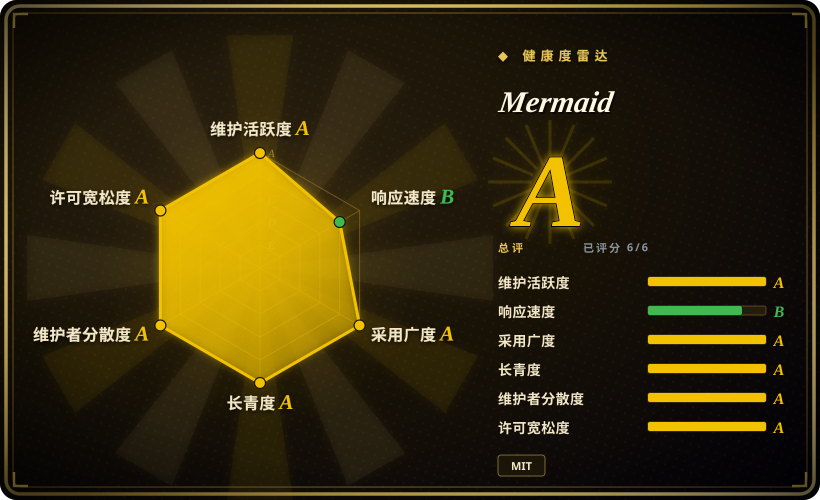
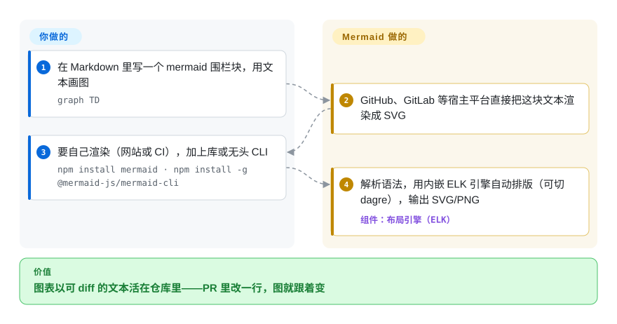

# Mermaid

一个 JavaScript/TypeScript 库，用一种类 Markdown 的文本语法渲染图表——流程图、时序图、甘特图、类图、ER 图、状态图、git-graph、饼图、思维导图等等——让图表以纯文本形式进版本库，而不再是二进制图片文件。



## 何时使用

你是个工程师，架构文档和 runbook 一直写在 Markdown 里，而图表一直在烂掉：一年前有人用 draw.io 画了流程、导出成 PNG，如今 PNG 已经过时，但没人手里还有源文件。你想让图*活在*文档里、能在 PR 里 diff、自动重渲。于是你写一个 ` ```mermaid ` 围栏块，几行 `graph TD; A-->B`，推上去，GitHub、GitLab、你的文档站（Docusaurus、MkDocs、Obsidian）和 IDE 预览全都内联渲染出来——没有二进制资产、不用外部编辑器、不会有坏掉的导出。流程一改，你只改文本，图就跟着变；评审看到的是*图本身*的 diff，而不是被换掉的一张图片。

当你是个 agent 或工具、要程序化生成图时，你也会选它：输入就是可模板化、可拼接生成的文本，所以从代码或从 LLM 产出一张时序图或 ER schema 不过是字符串拼装，再在浏览器/无头环境里 `mermaid.render()`（或用 `@mermaid-js/mermaid-cli` 的 `mmdc`）拿到 SVG/PNG。它之所以成了事实上的文本转图格式，正是因为太多宿主平台已经认得这个围栏块——你只要瞄准 Mermaid，就白白继承了 GitHub/GitLab/Notion 那一套渲染。

## 怎么用起来

Mermaid 是一个解析器加上一组排版绘制模块，运行在 JavaScript 环境里。你写的是它按图类型划分的文本语法（`graph TD`、`sequenceDiagram`、`erDiagram`……）；解析器把文本变成图模型——节点和边——布局引擎算出每个元素该放哪，渲染器再通过 D3 把它画成 SVG。自 v12.0.0（2026-09）起，内嵌的 **ELK** 引擎成为流程图/状态图/类图/ER 图的默认布局（旧的 dagre 布局仍可用 `layout: dagre` 切回），所以你从来不需要手摆任何东西。它替你做的：解析、排版、绘制、每次渲染时重画。仍归你决定的：渲染*发生在哪里*——多数团队什么都不用装，让宿主平台（GitHub、GitLab、Docusaurus、Obsidian……）渲染那个围栏块；若要自己渲染，就 `npm install mermaid`、在页面里对 `<pre class="mermaid">` 块调用 `mermaid.initialize()`，或在 CI 里跑无头 CLI 的 `mmdc -i input.mmd -o output.svg`。



<!-- flow-steps:begin (generated from flows/mermaid.json by tools/flow_card.py — do not edit) -->
<details>
<summary>流程文字版</summary>

1. **你**：在 Markdown 里写一个 mermaid 围栏块，用文本画图 — `graph TD`
2. **Mermaid**：GitHub、GitLab 等宿主平台直接把这块文本渲染成 SVG
3. **你**：要自己渲染（网站或 CI），加上库或无头 CLI — `npm install mermaid · npm install -g @mermaid-js/mermaid-cli`
4. **Mermaid**：解析语法，用内嵌 ELK 引擎自动排版（可切 dagre），输出 SVG/PNG — 组件：`布局引擎（ELK）`

**价值**：图表以可 diff 的文本活在仓库里——PR 里改一行，图就跟着变

</details>
<!-- flow-steps:end -->

## 何时不用

- **你需要像素级精确或手工微调的排版。** Mermaid 用它的布局引擎自动排版；节点不是你手摆的。当确切位置、间距或连线走向很要紧时，手动画布（draw.io/diagrams.net、Excalidraw）或一门你能调控的布局语言（Graphviz/DOT、D2）能给你 Mermaid 有意不给的控制力。
- **大或稠密的图。** 节点/边一多，自动布局质量和渲染性能都会下降；大流程图会画得乱成一团、读不下去。v12.0.0（2026-09）把更强的 ELK 引擎变成了内嵌的*默认*布局——对难缠的图是实打实的改进——但在真正的规模下，Graphviz（成熟的布局算法）仍是更好的选择。定型前先用你最大的真实图渲一遍。[推断]
- **它会在渲染器里跑 JavaScript。** Mermaid 在浏览器/JS 运行时里执行，历史上有过 XSS 面；渲染*不可信*的图文本意味着你必须把 `securityLevel`（`strict`/`sandbox`）设对，并接受部分交互功能因此被禁。别用 `securityLevel: 'loose'` 去渲染攻击者可控的 Mermaid。
- **你想要所见即所得的画图工具。** 没有拖拽画布——你编辑的是文本。指望推方块的非技术干系人不会满意；给他们 draw.io 或 Excalidraw。
- **它做得不好或根本不覆盖的图类型。** 高度自定义/自由形态的图、超出支持子集的严格 UML，或某些很特定的记号法，可能用 PlantUML（更广更严的 UML）或通用画图工具更合适。在把它定为标准前，先核实你具体那个图类型渲染得能接受。[推断]

## 横向对比

| 替代品 | 是否收录 | 我们的评价 | 取舍 |
|---|---|---|---|
| Graphviz / DOT | 未收录 | 大型或稠密图的成熟布局算法比 Markdown 原生渲染更重要时，选 Graphviz。 | 成熟、可脚本化的图**布局**引擎，对大/稠密图有强算法；自动布局极佳，但 DOT 更底层，且不像 Mermaid 那样被文档平台原生内联渲染。 |
| [PlantUML](plantuml.zh.md) | ✅ | 需要更广、更严格的 UML 覆盖，并能接受 Java/服务端渲染时，选 PlantUML。 | UML 覆盖更广更严（图类型也更多）；通常需要 Java 运行时/服务来渲染，而 Mermaid 是纯 JS 浏览器内渲染、宿主支持无处不在。 |
| [D2](d2.zh.md) | ✅ | D2 的新语言和布局引擎选择比 Mermaid 的宿主平台普及度更重要时，选 D2。 | 较新的文本转图语言（Go），有多种布局引擎（含 ELK/dagre）、追求更干净的排版；安装量小得多，内建宿主平台渲染远不如 Mermaid。 |
| draw.io（diagrams.net） | 未收录 | 需要完整所见即所得画布，而不是可版本控制的图源码时，选 draw.io。 | 完整的所见即所得画布编辑器——像素级控制、丰富图形——但图存为 XML/二进制，不是可 diff 的纯文本，也不会从围栏块自动渲染。 |
| [Excalidraw](excalidraw.zh.md) | ✅ | 手绘风白板和协作比文本转图语法更重要时，选 Excalidraw。 | 手绘风的所见即所得白板；适合草图和协作，不是文本转图语法，源文件也不能在版本库里 diff。 |
| [flowchart.js](flowchart-js.zh.md) | ✅ | 只需要一个窄的流程图 JS 库时，才选 flowchart.js。 | 只做流程图的窄 JS 库；Mermaid 覆盖的图类型多得多，生态/宿主支持也大得多。 |

## 技术栈

- **语言：** TypeScript（夹带大量 JavaScript），以 npm 包和 CDN（jsDelivr）分发；另有 `@mermaid-js/mermaid-cli`（`mmdc`）用于无头渲染。
- **渲染：** 浏览器/DOM——产出 SVG。用 **D3.js** 操作 SVG。布局按图类型而定：自 v12.0.0 起 **ELK** 引擎内嵌发布，并成为流程图/状态图/类图/ER/需求图/用例图的默认布局；**dagre** 仍可切回（`layout: dagre`），思维导图默认仍是 cose-bilkent。
- **运行基线（v12.0.0+）：** ES2024、Safari 17.4+、Node 22.12+——相比 11.x 线是一次破坏性抬高（release notes，2026-09-10）。
- **语法：** 每种图类型一套受 Markdown 启发的 DSL（`graph`/`flowchart`、`sequenceDiagram`、`classDiagram`、`erDiagram`、`stateDiagram`、`gantt`、`gitGraph`、`pie`、`mindmap`、`journey`、C4、用例图……；清单还在增长——见文档侧栏）。
- **配置/安全：** 运行时配置对象含 `securityLevel`(`strict` / `loose` / `antiscript` / `sandbox`)，控制脚本执行与沙箱 iframe 渲染。[未验证]

## 依赖

- **运行时：** 一个带 DOM 的 JavaScript 环境。生产里那就是用户浏览器（或某个已打包它的宿主平台——GitHub/GitLab/Notion/Docusaurus/MkDocs/Obsidian）。服务端/CLI 渲染则需要无头浏览器：`@mermaid-js/mermaid-cli` 12.0.0 把 `puppeteer` 声明为**对等依赖**（peer dependency，由你自行安装，或指向已装的 Chromium）。
- **库依赖：** 作为 npm 依赖拉进 D3 和 dagre（及其传递依赖）；没有需要运维的服务。
- **安装路径：** `npm i mermaid`、从 jsDelivr CDN `<script>`，或 `npm i -g @mermaid-js/mermaid-cli` 装 `mmdc`。
- **无后端/数据存储：** 它是客户端渲染库，不是服务。

## 运维难度

**低**（常见情形）：没有东西要部署或运维——你往一个已能渲染 Mermaid 的平台里塞一个围栏块，或给页面加上 npm/CDN 脚本。只有当你*自己*渲染时才出现「运维」：用 `mermaid-cli` 做服务端/无头渲染会拖进 Chromium/Puppeteer 依赖，这通常是 CI 崩溃、沙箱/权限问题和镜像膨胀的根源。另一个真正的隐患是**安全**而非可用性：一旦你要渲染不可信的图文本，把 `securityLevel` 设对（并持续打补丁对抗 XSS 公告）就是维护负担。升级才是要盯的事：v12.0.0 是一次「视觉破坏性」发布——默认布局从 dagre 切到 ELK、默认主题也换了，存量流程图/状态图/类图全部重排版、重新着色；想冻结旧观感就得钉住 `layout: dagre`、`theme: default` 和 `look: classic`，且每次大版本升级都要 diff 一遍渲染出的图。

## 健康度与可持续性

- **响应速度**：Grade B——中位首次响应时间 60.2 小时，基于 14 个 qualifying issues/PRs。
- **维护（2026-09）。** 最后 push 于 2026-09-21；旗舰包 `mermaid@12.0.0` 发布于 2026-09-10，此前 11.16→11.17 迭代很快——处于**活跃**维护，未归档。
- **治理 / bus factor。** 归属 `mermaid-js` GitHub 组织（多维护者的社区项目，而非单人作者仓库），相比单人维护的库降低了 bus-factor 风险。没有单一公司所有者。[推断]
- **年龄与 Lindy 判断。** 约 12 年（2014-11 创建）且仍活跃 ⇒ **强 Lindy** 信号；它是事实上的文本转图标准，被 GitHub/GitLab/Notion/Docusaurus/Obsidian 内嵌。[推断]
- **采用度与生态。** 采用度极大——约 90k star（gh api，2026-09-28）、上月 npm 下载 56,895,053 次（frontmatter 里的 registry 快照），更有意义的是主流平台内建的一流渲染——使它成为「图即代码」的安全默认选项。
- **风险标记。** 未发现 relicense（MIT），也无商业 open-core 切分；长期隐患有两个：**安全**——它在渲染器里跑 JS、历史上有过 XSS 面，渲染不可信输入时必须设置 `securityLevel`；以及**大版本扰动**——v12 一个版本就换掉了默认布局引擎和主题，有渲染基线文件的团队要重新对版。约 1.8k open issue 对这种覆盖面的项目而言属正常，并非健康红旗。

## 存疑（未验证）

- [未验证] 布局/渲染内部实现：v12.0.0 release notes 明确了流程图/状态图/类图/ER/思维导图的默认引擎与 dagre 回退；其余较少见图类型（pie、gantt、gitGraph 等）在 v12 下用哪个引擎未在抓取源中逐一确认——请对照当前文档核实你具体图类型的引擎。
- [未验证] `securityLevel` 的取值及其确切效果（脚本执行、沙箱 iframe、禁用交互）系据文档概括；渲染不可信输入前，请核实你那个版本的当前取值集与默认值。
- [推断] 大/稠密图上的性能与质量下降是自动布局的一般性质，而非对本库的实测基准；在定型前先用你最大的真实图测一遍。
- [推断] “某些图类型做得不好”是对自动布局适配度的推断，不是针对某一类型的缺陷断言——请评估你具体那个图类型。
- [推断] 宿主平台渲染（GitHub/GitLab/Notion/Docusaurus/Obsidian）系据 README/文档与官方集成列表陈述；各宿主内嵌的 Mermaid *版本* 未在此跟踪，可能落后于 npm 上的 12.0.0。
