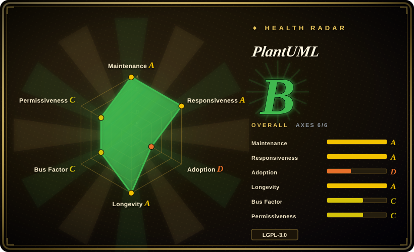
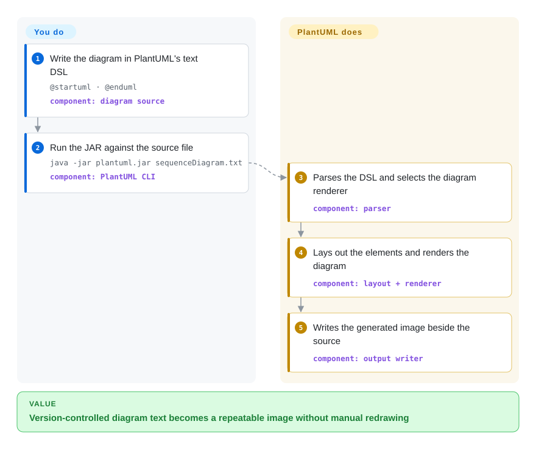

# PlantUML

A Java-based diagram-as-code tool with its own textual DSL for UML and non-UML diagrams, runnable locally as a CLI/GUI or through HTTP modes.

## When to use

You maintain architecture or design documentation where sequence, class, component, deployment, state, or other UML-oriented diagrams must be reviewed as text and regenerated in CI. Choose PlantUML when its broad, purpose-built diagram vocabulary matters more than Mermaid's native rendering across Markdown hosts, and when accepting a Java renderer or an HTTP rendering endpoint is reasonable.

It is also a strong fit when one stable DSL must cover UML plus formats such as Gantt, mind map, WBS, JSON, YAML, EBNF, and network diagrams. The deciding tradeoff is semantic breadth and a mature integration ecosystem in exchange for more rendering setup and less direct control over final node placement than a canvas editor.

## How it works

You write a text file delimited by directives such as `@startuml` and `@enduml`, then pass that file to the PlantUML JAR or an integration that invokes the same engine. PlantUML parses its DSL, selects the renderer for the diagram type, lays out the elements, and emits an image such as PNG or SVG. You own the source text, styling directives, renderer version, fonts, and build integration; PlantUML owns parsing and image generation. The same JAR can expose a basic PicoWeb endpoint, while the full servlet-based PlantUML Server and the public hosted service are separate deployment concerns.

<!-- flow-steps:begin (generated from flows/plantuml.json by tools/flow_card.py — do not edit) -->

Text version of the flow

1. **You**: Write the diagram in PlantUML's text DSL — `@startuml · @enduml` — component: `diagram source`
2. **You**: Run the JAR against the source file — `java -jar plantuml.jar sequenceDiagram.txt` — component: `PlantUML CLI`
3. **PlantUML**: Parses the DSL and selects the diagram renderer — component: `parser`
4. **PlantUML**: Lays out the elements and renders the diagram — component: `layout + renderer`
5. **PlantUML**: Writes the generated image beside the source — component: `output writer`

**Value**: Version-controlled diagram text becomes a repeatable image without manual redrawing

<!-- flow-steps:end -->

## When NOT to use

- **Your Markdown host must render diagrams without a custom build or server.** Use [Mermaid](mermaid.md) when native fenced-block support across common repository and documentation hosts is more important than PlantUML's broader UML vocabulary.
- **You need hand-positioned, pixel-tuned diagrams or non-technical drag-and-drop editing.** Use [draw.io](drawio.md) because PlantUML's layout is generated from text rather than adjusted on a canvas.
- **You primarily need arbitrary graph layout rather than UML semantics.** Use Graphviz directly; PlantUML can depend on Graphviz for several diagram families, but its DSL deliberately adds higher-level diagram concepts.
- **You want a smaller modern diagram DSL with first-class layout-engine selection.** Evaluate [D2](d2.md) instead; PlantUML offers a much older and broader diagram ecosystem, while D2 emphasizes a compact general-purpose language and selectable layout engines.
- **You cannot run Java, a native build, browser build, or a trusted renderer endpoint.** Use Mermaid for browser-side JavaScript rendering; sending private diagram source to a public PlantUML server changes the data boundary and is not required by this repository.

## Comparison

| Alternative | In index | Our verdict | Tradeoff |
|---|---|---|---|
| [Mermaid](mermaid.md) | ✅ | Choose PlantUML for broad UML-oriented notation and long-established IDE/documentation integrations; choose Mermaid when Markdown-host ubiquity and browser-native rendering decide the choice. | PlantUML gains diagram breadth and UML semantics but usually adds a Java or server rendering step; Mermaid is easier to embed directly in modern Markdown platforms. |
| [D2](d2.md) | ✅ | Choose D2 when a concise general-purpose language and explicit layout-engine choices matter more than PlantUML's UML catalog; choose PlantUML when established UML notation and integrations carry more weight. | D2 offers a smaller modern surface and multiple layout engines; PlantUML brings greater diagram-type breadth and a longer-lived ecosystem. |
| Graphviz | 未收录 | Choose Graphviz for low-level control of arbitrary node-link graphs and mature layout algorithms; choose PlantUML when authors should express sequence, class, component, or deployment semantics directly. | DOT exposes graph structure and layout attributes; PlantUML raises the abstraction level but may itself rely on Graphviz for some diagram families. |
| [draw.io](drawio.md) | ✅ | Choose draw.io when a human must place and polish shapes on a canvas; choose PlantUML when reviewable text and repeatable regeneration matter more than exact placement. | draw.io provides WYSIWYG precision and rich shape libraries; PlantUML provides compact, diffable source and automation-friendly rendering. |

## Tech stack

- **Implementation:** predominantly Java, built with Gradle or Ant; the repository also ships native-image and TeaVM/browser build paths.
- **Language:** a PlantUML-specific textual DSL with diagram-specific syntax, preprocessing, themes, styles, includes, and a bundled standard library.
- **Rendering:** outputs include PNG and SVG, with additional formats varying by diagram type; internal layout engines handle some diagrams, while Graphviz `dot` remains relevant to several UML families.
- **Interfaces:** command-line and GUI entry points in the JAR, an embedded PicoWeb HTTP mode, and Java embedding APIs. The full servlet server is maintained in the separate `plantuml/plantuml-server` repository.

## Dependencies

- **Local JAR path:** Java 11 or later is recommended by the official setup guide; a special Java 8-compatible build is also published.
- **Layout dependency:** Graphviz is required for some use-case, class, object, component, deployment, state, and legacy activity diagrams unless a supported internal layout path such as Smetana is selected. Recent Windows builds bundle a minimal `dot.exe`.
- **Assets and reproducibility:** fonts, themes, included files, standard-library content, PlantUML version, and layout-engine version can affect rendered output and should be pinned in CI.
- **Server path:** the built-in PicoWeb server only needs the JAR and Java, but a full hosted servlet deployment uses the separate PlantUML Server project and its application-server/container stack.

## Ops difficulty

**Low for local files; medium for a shared renderer.** A pinned JAR plus Java is enough for a local or CI command, though Graphviz and fonts add platform-sensitive dependencies for some diagrams. The embedded PicoWeb mode is intentionally basic and listens on all interfaces by default unless a bind address is supplied. A shared PlantUML Server adds patching, resource limits, network exposure, privacy decisions, and deterministic font/layout management; the public hosted service should not be treated as part of the availability or privacy contract of this repository. [推断]

## Health & viability

- **Maintenance: Grade A.** The scorer found a commit on the scoring date and activity in all 13 measured weeks; stable v1.2026.8 shipped on 2026-09-05, followed by further commits and a snapshot release.
- **Responsiveness: Grade A.** Median first-response time was 10.4 hours across 37 qualifying issues in the measured window.
- **Adoption: Grade D.** The automated axis found 8,155 monthly npm downloads and 0 dependent repositories for `@plantuml/core`. This measures the newer browser package, not the long-established JAR, server, IDE plugins, or documentation integrations, so it understates the project's broader distribution surface.
- **Longevity: Grade A.** The repository was 5,801 days old with a same-day commit; age combined with current activity is a strong Lindy signal for a diagramming tool. [推断]
- **Governance: Grade C.** The scorer found 42 active maintainers in 12 months, but the top contributor supplied 76.3% and the top three 89.7% of measured contributions, leaving meaningful concentration risk despite a contributor long tail.
- **License risk: Grade C.** GitHub classifies the repository as LGPL-3.0, while upstream documents GPL-3.0-or-later as the default and offers optional LGPL-3.0-or-later, Apache-2.0, BSD-3-Clause, EPL-1.0, and MIT distributions. Under the LGPL option, combined proprietary applications may keep their own terms, but redistribution must preserve notices and license texts and allow users to replace or relink the LGPL-covered part; select and ship the intended flavor deliberately.

## Caveats (unverified)

- [推断] “Low for local files; medium for a shared renderer” is an architectural operations judgment, not a measured deployment benchmark.
- [推断] The strong Lindy verdict combines repository age with current commits and releases; it is a selection prior, not a prediction of future maintenance.
- [推断] Pinning fonts, renderer, and layout-engine versions is prudent for reproducible images, but output stability was not tested across versions or operating systems during this review.
