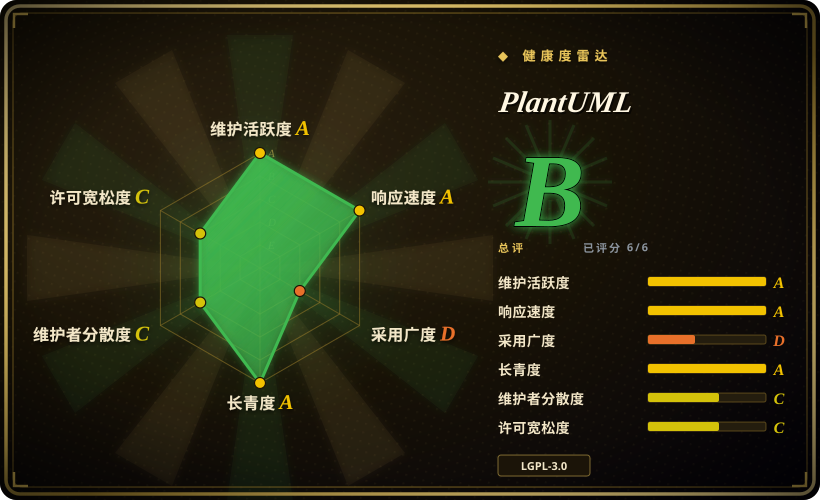
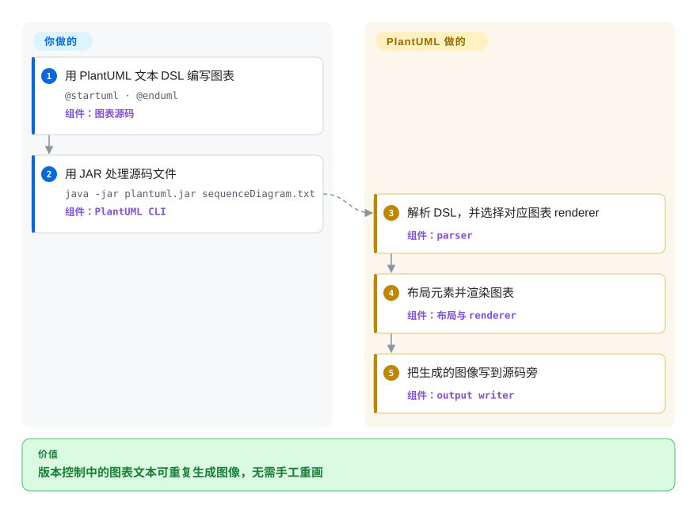

# PlantUML

一个基于 Java 的图表即代码工具，使用自有文本 DSL 描述 UML 与非 UML 图表，可通过本地 CLI、GUI 或 HTTP 模式运行。

## 何时使用

你维护架构或设计文档，其中的时序图、类图、组件图、部署图、状态图或其他 UML 导向图表需要像代码一样评审，并在 CI 中重新生成。当专用且广泛的图表词汇比 Mermaid 在 Markdown 宿主中的原生渲染更重要，而且你能接受 Java renderer 或 HTTP 渲染端点时，选 PlantUML。

当一套稳定 DSL 还要覆盖 UML 之外的 Gantt、mind map、WBS、JSON、YAML、EBNF 与网络图时，它也很合适。决定性取舍是用更多渲染配置以及比画布编辑器更少的节点位置控制，换取语义广度与成熟的集成生态。

## 怎么用起来

你编写一个由 `@startuml` 和 `@enduml` 等指令包围的文本文件，再把它交给 PlantUML JAR，或交给调用同一引擎的集成。PlantUML 解析自有 DSL，根据图表类型选择 renderer，完成布局并输出 PNG、SVG 等图像。源文本、样式指令、renderer 版本、字体与构建集成由你负责；解析和图像生成由 PlantUML 负责。同一个 JAR 可以暴露基础 PicoWeb 端点，而完整的 servlet PlantUML Server 与公共托管服务属于独立部署事项。

<!-- flow-steps:begin (generated from flows/plantuml.json by tools/flow_card.py — do not edit) -->

流程文字版

1. **你**：用 PlantUML 文本 DSL 编写图表 — `@startuml · @enduml` — 组件：`图表源码`
2. **你**：用 JAR 处理源码文件 — `java -jar plantuml.jar sequenceDiagram.txt` — 组件：`PlantUML CLI`
3. **PlantUML**：解析 DSL，并选择对应图表 renderer — 组件：`parser`
4. **PlantUML**：布局元素并渲染图表 — 组件：`布局与 renderer`
5. **PlantUML**：把生成的图像写到源码旁 — 组件：`output writer`

**价值**：版本控制中的图表文本可重复生成图像，无需手工重画

<!-- flow-steps:end -->

## 何时不用

- **你的 Markdown 宿主必须在没有自定义构建或服务器时直接渲染。** 选 [Mermaid](mermaid.zh.md)；常见代码仓库与文档宿主的 fenced block 原生支持比 PlantUML 更广的 UML 词汇更重要。
- **你需要手工定位、像素级微调，或让非技术人员拖放编辑。** 选 [draw.io](drawio.zh.md)；PlantUML 的布局由文本生成，不是在画布上调整。
- **你的核心需求是任意图布局，而不是 UML 语义。** 直接选 Graphviz；PlantUML 的若干图表族会依赖 Graphviz，但其 DSL 有意增加了更高层的图表概念。
- **你想要更小的现代图表 DSL，并把 layout engine 选择当成一等能力。** 评估 [D2](d2.zh.md)；PlantUML 的图表生态更老、更广，而 D2 强调紧凑的通用语言与可选布局引擎。
- **你无法运行 Java、native build、browser build 或可信的渲染端点。** 选 Mermaid 做浏览器端 JavaScript 渲染；把私密图表源码发给公共 PlantUML Server 会改变数据边界，而且本仓库并不要求这样做。

## 横向对比

| 替代品 | 是否收录 | 我们的评价 | 取舍 |
|---|---|---|---|
| [Mermaid](mermaid.zh.md) | ✅ | 需要广泛的 UML 导向语法与长期积累的 IDE、文档集成时选 PlantUML；Markdown 宿主普及度和浏览器原生渲染决定选择时选 Mermaid。 | PlantUML 得到更多图表类型和 UML 语义，但通常增加 Java 或 server 渲染步骤；Mermaid 更容易直接嵌入现代 Markdown 平台。 |
| [D2](d2.zh.md) | ✅ | 紧凑的通用语言与显式 layout engine 选择比 PlantUML 的 UML 目录更重要时选 D2；既有 UML 表达与集成更重要时选 PlantUML。 | D2 提供更小的现代语言表面和多种布局引擎；PlantUML 提供更广的图表类型与更长寿的生态。 |
| Graphviz | 未收录 | 任意 node-link graph 需要低层控制与成熟布局算法时选 Graphviz；作者应直接表达时序、类、组件或部署语义时选 PlantUML。 | DOT 暴露图结构与布局属性；PlantUML 提高了抽象层，但某些图表族自身也可能依赖 Graphviz。 |
| [draw.io](drawio.zh.md) | ✅ | 人工必须在画布上摆放并精修形状时选 draw.io；可评审文本与可重复生成比准确摆位更重要时选 PlantUML。 | draw.io 提供 WYSIWYG 精度与丰富 shape library；PlantUML 提供紧凑、可 diff、便于自动化的源码。 |

## 技术栈

- **实现：** 主要使用 Java，以 Gradle 或 Ant 构建；仓库还提供 native image 与 TeaVM/browser 构建路径。
- **语言：** PlantUML 专用文本 DSL，针对不同图表提供语法、preprocessing、theme、style、include 与内置 standard library。
- **渲染：** 输出 PNG、SVG 等格式，具体格式随图表类型变化；部分图表使用内部布局引擎，Graphviz `dot` 对若干 UML 图表族仍然重要。
- **接口：** JAR 提供 command line 与 GUI 入口，也提供内置 PicoWeb HTTP 模式和 Java embedding API。完整 servlet server 由独立的 `plantuml/plantuml-server` 仓库维护。

## 依赖

- **本地 JAR 路径：** 官方安装指南建议 Java 11 或更高版本，同时发布一个兼容 Java 8 的特殊构建。
- **布局依赖：** 部分 use case、class、object、component、deployment、state 与旧 activity diagram 需要 Graphviz，除非为受支持类型选择 Smetana 等内部布局路径。近期 Windows 构建内置精简 `dot.exe`。
- **素材与可复现性：** 字体、theme、include 文件、standard library 内容、PlantUML 版本与布局引擎版本都可能影响输出，CI 中应固定这些输入。
- **服务器路径：** 内置 PicoWeb 只需要 JAR 与 Java；完整托管 servlet 使用独立 PlantUML Server 项目及其 application server 或 container stack。

## 运维难度

**本地文件路径低，共享 renderer 中等。** 固定版本的 JAR 加 Java 足以支持本地或 CI 命令，但部分图表还会引入 Graphviz 与字体等平台相关依赖。内置 PicoWeb 有意保持基础能力，未指定 bind address 时默认监听所有网络接口。共享 PlantUML Server 还要处理补丁、资源限制、网络暴露、隐私决策，以及确定性的字体与布局管理；公共托管服务不应被视为本仓库可用性或隐私契约的一部分。[推断]

## 健康度与可持续性

- **维护：Grade A。** 评分器在评分当天发现提交，所测 13 周每周都有活动；稳定版 v1.2026.8 于 2026-09-05 发布，之后仍有提交与 snapshot release。
- **响应速度：Grade A。** 所测窗口内有 37 个 qualifying issues，中位首次响应时间为 10.4 小时。
- **采用广度：Grade D。** 自动评分轴只找到 `@plantuml/core` 的 8,155 次 npm 月下载量，依赖仓库数为 0。这个口径测量的是较新的 browser package，并未覆盖长期存在的 JAR、server、IDE plugin 与文档集成，因此会低估项目更广的分发面。
- **长青度：Grade A。** 评分时仓库已创建 5,801 天，最近提交就在当天；年龄与当前活跃度的组合对图表工具是很强的 Lindy 信号。[推断]
- **治理集中度：Grade C。** 评分器发现过去 12 个月有 42 名活跃维护者，但头部一人贡献占比 76.3%，前三人占 89.7%；即使存在 contributor long tail，集中度风险仍然明显。
- **许可风险：Grade C。** GitHub 把仓库识别为 LGPL-3.0，而 upstream 文档说明默认许可为 GPL-3.0-or-later，并提供可选 LGPL-3.0-or-later、Apache-2.0、BSD-3-Clause、EPL-1.0 与 MIT 分发。选择 LGPL 时，组合后的 proprietary application 可以保留自身条款，但重新分发仍须保留 notice 与许可文本，并允许用户替换或重新链接 LGPL 覆盖部分；应明确选择并交付预期的许可版本。

## 存疑（未验证）

- [推断]“本地文件路径低，共享 renderer 中等”是基于架构的运维判断，并非实测部署基准。
- [推断] 强 Lindy 判断结合了仓库年龄与当前提交、发版活动；它是选型先验，不是对未来维护的预测。
- [推断] 为得到可复现图像而固定字体、renderer 和布局引擎版本是审慎建议，但本次没有跨版本、跨操作系统测试输出稳定性。
