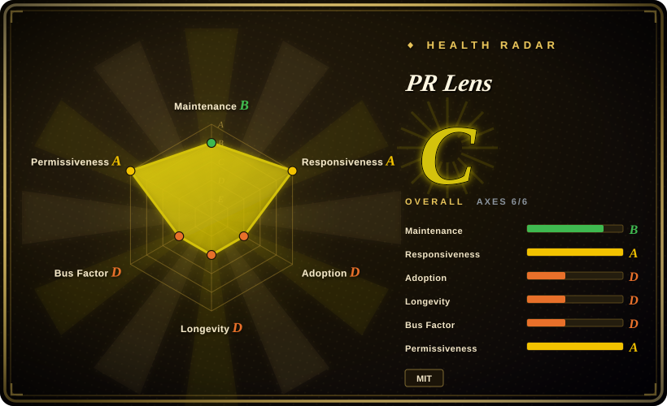
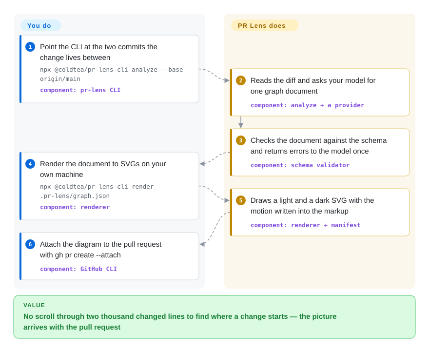

# PR Lens

An agent writes a pull request that changes 2,000 lines across thirty files, and the review opens not with a decision but with a scroll: you cannot say which files matter, or what the change sits inside, until you have read most of it. PR Lens draws that diff as an architecture diagram and an animated data-flow sequence — added, changed and deleted parts colour-coded — and posts it as a comment inside the pull request, redrawn on every push.

## When to use

You review pull requests on a team where an increasing share of each diff was written by an agent, so a routine PR is now a 1,500-line refactor across twenty files. The diff view tells you what changed but not where the change enters the system, what it retires, or whether anything still calls the function it deleted — so the first ten minutes go into scrolling and grepping before you can reason about the change at all.

Reach for PR Lens when that orientation step should happen by itself, in the place you already are: the diagram is derived from the diff, so nobody authors or maintains it, and it arrives inside the PR comment instead of in a document you have to remember to open. The deciding tradeoff against the text-diagram tools in this category is derivation versus authorship — Mermaid, D2 and PlantUML give you a diagram you write and keep true by hand, while PR Lens gives you one that nobody wrote, rebuilt from the current commits, with the delta coloured in. You pay for that with a model call per push, and with corrections that go through an overlay file rather than through editing the picture.

## How it works

You give the CLI two git refs; it reads the diff between their merge base and the head, then asks the model you named to describe that change as a single JSON document: lanes (the places the change runs through), nodes (the parts inside them), edges (the calls between parts, each tagged new, changed, unchanged or removed) and, when the change has an order to it, a flow whose steps are animated one at a time. That document is validated against the schema before anything is drawn — shape and internal consistency only, never meaning, so a node that names the wrong file still passes — and on failure the named errors go back to the model exactly once. A deterministic renderer then turns it into self-contained SVGs, one light and one dark, with the animation written as SVG markup rather than script, because GitHub strips scripts out of comments. A last pass composes the PR comment (stat chips, the diagram, collapsed drill-down sections), and the hosted GitHub App updates that same comment on every push.

The split of responsibility is the part worth being explicit about: you supply the two refs, a provider key (or nothing at all — the App runs on its own quota), and a `.github/pr-lens.yml` overlay when the picture names things wrongly. PR Lens owns extraction, validation, layout, rendering and comment upkeep. It behaves like a route map drawn for a journey you are about to take: nobody draws it by hand, and nobody has to trust it further than the next push, because the next push redraws it.

<!-- flow-steps:begin (generated from flows/pr-lens.json by tools/flow_card.py — do not edit) -->

Text version of the flow

1. **You**: Point the CLI at the two commits the change lives between — `npx @coldtea/pr-lens-cli analyze --base origin/main` — component: `pr-lens CLI`
2. **PR Lens**: Reads the diff and asks your model for one graph document — component: `analyze + a provider`
3. **PR Lens**: Checks the document against the schema and returns errors to the model once — component: `schema validator`
4. **You**: Render the document to SVGs on your own machine — `npx @coldtea/pr-lens-cli render .pr-lens/graph.json` — component: `renderer`
5. **PR Lens**: Draws a light and a dark SVG with the motion written into the markup — component: `renderer + manifest`
6. **You**: Attach the diagram to the pull request with gh pr create --attach — component: `GitHub CLI`

**Value**: No scroll through two thousand changed lines to find where a change starts — the picture arrives with the pull request

<!-- flow-steps:end -->

## When NOT to use

- **The diff is small or mechanical.** A forty-line fix, a rename sweep, a lockfile bump: the diff already says everything the picture would, and you spend a model call to learn nothing. Read the diff — or, if you want prose findings on it, use [PR-Agent](../ai-code-review/pr-agent.md).
- **What you want is review findings, not a picture.** PR Lens is a comprehension layer by construction: its schema has no findings field and rejects a document that carries one. Choose [PR-Agent](../ai-code-review/pr-agent.md), [Open Code Review](../ai-code-review/open-code-review.md) or [Claude Code Security Review](../ai-code-review/claude-code-security-review.md) for line-level comments; the two categories compose rather than compete.
- **The diagram source must be text a human owns and edits in git.** PR Lens output is generated; you steer it through `.github/pr-lens.yml`, never by editing the SVG. If a person must own the diagram source, choose [Mermaid](mermaid.md), [D2](d2.md) or [PlantUML](plantuml.md).
- **A colleague has to drag nodes around and place them exactly.** Choose [draw.io](drawio.md) or [Excalidraw](excalidraw.md); a generated layout will not give anyone that control.
- **The diff may not leave your perimeter and you will not run a local model.** The zero-configuration path is the hosted GitHub App, which sends the diff to Coldtea's service, and the shareable canvas is hosted as well. Keep it local instead by pointing the CLI at an `openai-compatible` endpoint you run yourself (Ollama, llama.cpp) — or choose a purely local renderer such as [Mermaid](mermaid.md), with no model in the loop at all.
- **You need it on GitLab or Bitbucket today.** The App, the Action and the comment-composing path are GitHub-only; the CLI's `analyze` and `render` work on any git repository but stop at SVGs on disk. Choose [PlantUML](plantuml.md) or [Mermaid](mermaid.md) for a host-neutral pipeline.

## Comparison

| Alternative | In index | Our verdict | Tradeoff |
|---|---|---|---|
| [Mermaid](mermaid.md) | ✅ | Choose Mermaid when one hand-written text diagram must render on any Markdown host with no build step and no key; choose PR Lens when the diagram has to be derived from the diff and land in the PR comment without anyone authoring it. | PR Lens buys automation, delta colour and animation, and pays with a model call per push and a generated artifact; Mermaid buys ubiquity and hand control, and pays with manual upkeep. |
| [D2](d2.md) | ✅ | Choose D2 when the diagram is a durable artifact kept beside the code; choose PR Lens when the diagram is disposable and should be regenerated from each change. | D2 is a compiler for a language you write, with selectable layout engines and several export formats; PR Lens reads commits instead of source and gives up authorship to gain derivation. |
| [PlantUML](plantuml.md) | ✅ | Choose PlantUML when formal UML notation and its Java/server rendering ecosystem are the requirement; choose PR Lens when the diagram must come from a diff and describe only what that diff touched. | PlantUML covers far more notations from hand-authored sources; PR Lens covers two lenses (architecture and data flow) but needs no author at all. |
| [draw.io](drawio.md) | ✅ | Choose draw.io when a person must place every shape and hand an editable file to a colleague; choose PR Lens when the picture should be rebuilt by machine on each push. | draw.io gives exact placement and shape libraries in a file others can edit; PR Lens gives automatic layout and machine upkeep on an artifact no one edits. |
| [PR-Agent](../ai-code-review/pr-agent.md) | ✅ | Treat this as the complement, not the substitute: run PR-Agent when you need written review findings, PR Lens when you need the shape of the change first. | One produces line-level comments, the other produces the map those comments sit on; a team reviewing agent-written PRs usually ends up wanting both. |

## Tech stack

- **Implementation:** a TypeScript pnpm monorepo, ESM throughout, Node 20.11 or newer; five workspace packages — `schema`, `renderer`, `cli`, `action`, `agent-skill` — with vitest for tests and a `pnpm verify` script that runs build, typecheck and test.
- **Schema (`@coldtea/pr-lens-schema`):** zod-validated contracts for four documents (the graph, a patch document, the repository config, and the render manifest) plus generated JSON Schema artifacts. `schema` is the only runtime dependency of `renderer`, and `cli` adds only `yaml` and zod on top of the two workspace packages.
- **Renderer (`@coldtea/pr-lens-renderer`):** does its own layout and measures text against an embedded character-width table instead of a font engine, so a CI runner with no fonts installed draws the same bytes as a laptop. Output is script-free SVG with motion expressed as `animateMotion` elements, which is what lets a diagram still move inside a GitHub comment.
- **Determinism:** golden-file and determinism tests cover the renderer; rendering one document twice produced byte-identical SVGs in a local check on 2026-09-22, and asset file names carry a content hash.

## Dependencies

- **GitHub App path:** nothing to run yourself. Install the app on the repositories you choose; the hosted service does the rest.
- **CLI / Action path:** Node 20.11+ and one model endpoint — Gemini by default, OpenAI, or anything speaking `/chat/completions`, including a local Ollama or llama.cpp server. The key is read from the environment, never a command-line flag.
- **No datastore or long-running service** in any path. The CLI writes scratch files to `.pr-lens/` and adds that directory to `.gitignore` on first write.
- **Optional hosted surface:** the shareable canvas at prlens.dev, reached through `canvas push`; the CLI also keeps `.pr-lens/canvas.json`, the write token for canvases this checkout has pushed, which is the one file there that cannot be rebuilt.
- **You provide the CI.** No `.github/` directory is committed to the repository, so no workflow running its test suite is visible; the project documents `pnpm verify` as its own gate.

## Ops difficulty

**Low** for the App path — installation is the whole operation. **Low to medium** for the CLI and the Action: there is no infrastructure to run, but every push that redraws a diagram spends a model call, which adds per-PR cost, latency and provider rate limits, and the quality of the picture moves with whichever model you point it at. Two habits matter in operation: pin the versions you depend on, because renderer releases change the rendered bytes and the Action is consumed by a moving tag; and treat `.pr-lens/` as scratch, since only the merged-system map that `export` writes is worth committing. [推断]

## Health & viability

The measured aggregate is **C, all six axes scored** (2026-09-22) — the profile of a young project: responsive and licence-clean, thin on longevity, adoption and governance.

- **Maintenance: Grade B.** v0.7.0 was published on 2026-09-19 and the last push was 2026-09-21, with 198 commits and five tagged releases since the repository was created on 2026-08-20; the scorer counted activity in 5 of the last 13 weeks. The activity is real, but the window is one month, so "actively maintained" and "unproven" are true at the same time.
- **Responsiveness: Grade A.** A 2.7-hour median first response across 9 qualifying issues, measured in the scorer's relaxed-solo band on 2026-09-22. With a single committer this is the axis most likely to move first if the project cools.
- **Governance / bus factor: Grade D.** 196 of 198 commits come from one contributor (98.9% share); the repository is owned by Coldtea AI, a company created in 2026-03 whose stated flagship is a different product (running CLI agents in the cloud). A vendor-owned repository whose roadmap serves that company's other product is a governance shape worth weighing. [推断]
- **Longevity: Grade D.** The repository was 33 days old at scoring time with a 3-day-old commit. The MIT core can be vendored and used with no service in the path, and that is what makes the low Lindy prior survivable; the App and the canvas are the hosted edges, and that is where the lock-in sits. [推断]
- **Adoption: Grade D.** 1,276 stars and 49 forks inside a month; the scorer's registry signal recorded 12,499 downloads last month and 0 dependent repositories, while the CLI package alone showed roughly 9,500 npm downloads in the month to 2026-09-22. Attention is not adoption: a star spike on a one-month-old repository is a risk flag as much as a recommendation. [推断]
- **Risk / licence: Grade A.** MIT, permissive, no relicence in the last 36 months and no CLA in the README. The structural risk is scope rather than licence: the convenience layer (App, canvas) is the part that is not in the repository, and the contributor terms ask for an approved issue before any code, which slows outside contribution.

## Caveats (unverified)

- [未验证] Whether private repositories are paid: the README says "Free for open source" and `prlens.dev/pricing` returned 404 on 2026-09-22, so the free/paid boundary could not be confirmed.
- [未验证] The semantic accuracy of a model-written graph document — whether a node names the right file or a deleted edge is truly deleted. The schema validates structure only and no accuracy measurement is published.
- [未验证] Whether the canvas is self-hostable in practice. `docs/canvas-api.md` exists as the stated starting point but was not read line by line for this page.
- [未验证] Whether a private or non-GitHub CI runs their suite: no `.github/` directory is committed (checked via the contents API and the repository tree on 2026-09-22), so the only documented gate is the local `pnpm verify`.
- [推断] "The orientation minutes are what it compresses" is an argument from where the tool sits in the review flow, not a measured time saving; no review-time measurement was performed here.
- [推断] The npm download figure of roughly 9,500/month is not a user count — CI, mirror and repeat-install traffic are included.
- [推断] The low-to-medium ops call is a judgment about the per-push model dependency and version drift, not the result of an operational study.
- [推断] "1,276 stars in a month" is read here as attention plus a young-repository risk flag; the star count is verified, the interpretation is not.
