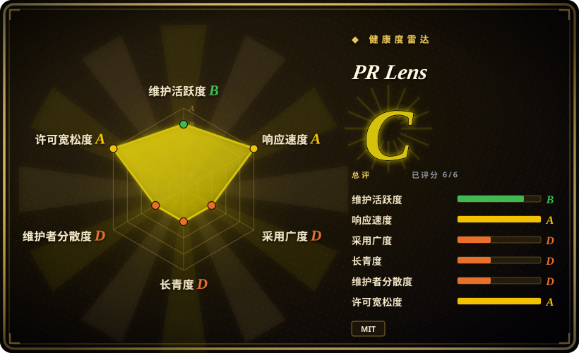
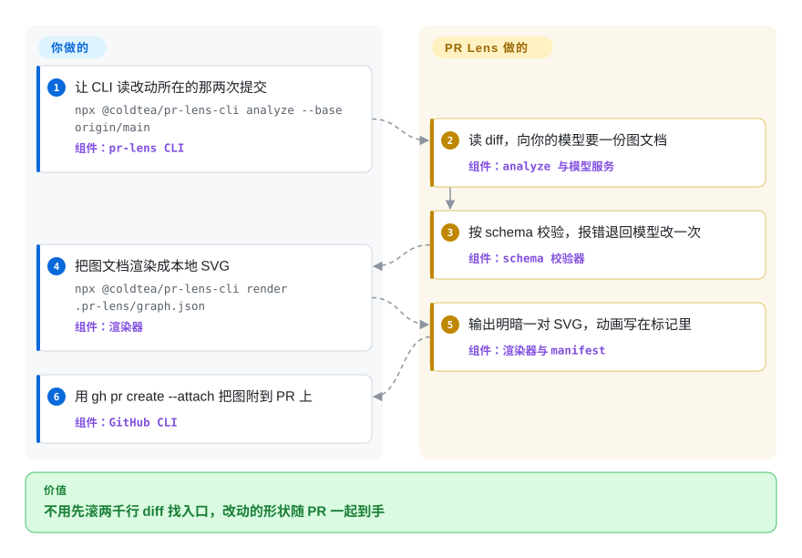

# PR Lens

现在很多 PR 是 agent 写的：一次改动两千行、三十来个文件，你打开 diff 只能一行行往下滚，说不清改动从哪儿进系统、替掉了什么、被删掉的那个函数还有谁在调。PR Lens 把这份 diff 画成体系结构图和会逐步走一遍的数据流图，新增／改动／删除分别上色，作为评论贴在 PR 里，每次 push 自动重画。

## 何时使用

你在一个多数代码由 agent 写出的团队里做 review，一个普通 PR 就是二十个文件、一千五百行的重构。diff 视图能告诉你“改了哪些行”，但告诉不了你改动从哪儿进系统、退休了哪条路径、被删掉的东西还有没有别的调用方——于是review 的前十分钟全花在滚动和 grep 上，真正的判断一行还没开始。

如果希望这个“找到着手点”的动作自动完成、而且就发生在你已经在看的地方，就用 PR Lens：图是从 diff 推导出来的，没有人需要编写或维护它，它出现在 PR 评论里而不是某个你记得要去打开的文档里。和本分类里那些文本绘图工具相比，决定性取舍是**推导与著作**：Mermaid、D2、PlantUML 给你一张由人写出来、也要靠人保持真实的图；PR Lens 给你一张没人写过的图，由当前提交重建，并把改动上色。代价是每次 push 都要一次模型调用，而且修正走 overlay 文件，而不是直接改那张图。

## 怎么用起来

你把两个 git ref 交给 CLI，它读两者 merge base 与 head 之间的 diff，然后让你指定的模型把这次改动描述成一份 JSON 文档：lanes（改动经过的地方）、nodes（里面的部件）、edges（部件之间的调用，每个都标成新增、改动、未变或删除），若改动本身有先后顺序，再加一条逐步播放的 flow。这份文档在画之前先过 schema 校验——只校验形状和内部一致性，不校验语义，所以节点写错了文件名照样能通过；校验失败就把带路径的报错退回模型，且只退一次。之后由确定性渲染器输出自包含的 SVG，明暗各一份，动画写成 SVG 标记而不是脚本，因为 GitHub 会把评论里的脚本剥掉。最后一步拼出 PR 评论（统计标签、图、可折叠的下钻小节），而托管的 GitHub App 会在每次 push 时更新同一条评论。

职责边界值得说清楚：两个 ref、一个 provider key（或者什么都不给——App 用的是它自己的额度）、以及图叫错东西时才需要写的 `.github/pr-lens.yml` overlay，都由你提供。抽取、校验、排版、渲染和评论维护由 PR Lens 负责。它像一张为即将出发的行程画的行车图：没人手绘，也没人需要相信它超过下一次 push——下一次 push 会重画。

<!-- flow-steps:begin (generated from flows/pr-lens.json by tools/flow_card.py — do not edit) -->

流程文字版

1. **你**：让 CLI 读改动所在的那两次提交 — `npx @coldtea/pr-lens-cli analyze --base origin/main` — 组件：`pr-lens CLI`
2. **PR Lens**：读 diff，向你的模型要一份图文档 — 组件：`analyze 与模型服务`
3. **PR Lens**：按 schema 校验，报错退回模型改一次 — 组件：`schema 校验器`
4. **你**：把图文档渲染成本地 SVG — `npx @coldtea/pr-lens-cli render .pr-lens/graph.json` — 组件：`渲染器`
5. **PR Lens**：输出明暗一对 SVG，动画写在标记里 — 组件：`渲染器与 manifest`
6. **你**：用 gh pr create --attach 把图附到 PR 上 — 组件：`GitHub CLI`

**价值**：不用先滚两千行 diff 找入口，改动的形状随 PR 一起到手

<!-- flow-steps:end -->

## 何时不用

- **diff 很小或者是机械性改动。** 四十行的修复、一次重命名、一次 lockfile 升级：diff 本身已经说完了图能说的一切，你花一次模型调用什么也没换来。直接读 diff；如果你要的是文字化的评审意见，用 [PR-Agent](../ai-code-review/pr-agent.zh.md)。
- **你要的是评审意见，不是一张图。** PR Lens 按设计就是理解层：它的 schema 没有 findings 字段，带这种字段的文档会被拒绝。要行级评论请选 [PR-Agent](../ai-code-review/pr-agent.zh.md)、[Open Code Review](../ai-code-review/open-code-review.zh.md) 或 [Claude Code Security Review](../ai-code-review/claude-code-security-review.zh.md)；这两类工具是互补而不是互斥。
- **图的源头必须是人在 git 里拥有和编辑的文本。** PR Lens 的产物是生成的，你只能通过 `.github/pr-lens.yml` 去引导它，永远不要改 SVG。如果必须由人拥有图源，选 [Mermaid](mermaid.zh.md)、[D2](d2.zh.md) 或 [PlantUML](plantuml.zh.md)。
- **同事需要拖着节点手工摆放位置。** 选 [draw.io](drawio.zh.md) 或 [Excalidraw](excalidraw.zh.md)；自动布局不会给任何人这种控制力。
- **代码不能出内网、你又不想跑本地模型。** 零配置路径是托管的 GitHub App，它会把 diff 发到 Coldtea 的服务；可分享的 canvas 同样是托管的。想留在本地，就把 CLI 指向你自己跑的 `openai-compatible` 端点（Ollama、llama.cpp）；或者干脆选 [Mermaid](mermaid.zh.md) 这类纯本地渲染器，链路上根本没有模型。
- **你现在就需要它在 GitLab 或 Bitbucket 上工作。** App、Action 和拼评论这条路径只支持 GitHub；CLI 的 `analyze` 和 `render` 对任何 git 仓库都能用，但产物止步于硬盘上的 SVG。要中立的托管平台链路，选 [PlantUML](plantuml.zh.md) 或 [Mermaid](mermaid.zh.md)。

## 横向对比

| 替代品 | 是否收录 | 我们的评价 | 取舍 |
|---|---|---|---|
| [Mermaid](mermaid.zh.md) | ✅ | 如果一张手写文本图要在任意 Markdown 宿主上零构建、零 key 地渲染，选 Mermaid；如果图必须从 diff 推导出来并自动落在 PR 评论里、没人需要执笔，选 PR Lens。 | PR Lens 换来自动化、改动配色和动画，付出的是每次 push 一次模型调用和一份生成物；Mermaid 换来普及度和手工控制，付出的是人工维护。 |
| [D2](d2.zh.md) | ✅ | 如果图是长期跟着代码维护的资产，选 D2；如果图是可丢弃的、每次改动都该重新生成，选 PR Lens。 | D2 是给你写的语言做编译的编译器，可选布局引擎、多种导出格式；PR Lens 读的是提交而不是源码，用放弃著作权换取自动推导。 |
| [PlantUML](plantuml.zh.md) | ✅ | 如果要求正式 UML 记法以及它那套 Java／服务端渲染生态，选 PlantUML；如果图必须来自 diff、且只描述这次改动碰到的部分，选 PR Lens。 | PlantUML 用手写源码覆盖远多的图型；PR Lens 只有体系结构与数据流两个视角，但完全不需要作者。 |
| [draw.io](drawio.zh.md) | ✅ | 如果必须由人摆放每个图形、并把可编辑文件交给同事，选 draw.io；如果图应当由机器在每次 push 时重建，选 PR Lens。 | draw.io 在可编辑文件里给出精确位置和图形库；PR Lens 给出自动布局和机器维护，代价是产物没人能直接编辑。 |
| [PR-Agent](../ai-code-review/pr-agent.zh.md) | ✅ | 把它当互补项而不是替代品：需要成文的评审意见时跑 PR-Agent，需要先看清改动的形状时用 PR Lens。 | 一个产出行级评论，一个产出这些评论所依托的地图；review agent 写的 PR 的团队通常两样都要。 |

## 技术栈

- **实现：** TypeScript 的 pnpm monorepo，全 ESM，Node 20.11 起；五个 workspace 包——`schema`、`renderer`、`cli`、`action`、`agent-skill`——测试用 vitest，`pnpm verify` 串起 build、typecheck 和 test。
- **Schema（`@coldtea/pr-lens-schema`）：** 用 zod 校验四份文档（graph、patch、仓库配置、render manifest），并产出 JSON Schema 工件。`renderer` 唯一的运行时依赖就是它，`cli` 也只在两个 workspace 包之上加了 `yaml` 和 zod。
- **Renderer（`@coldtea/pr-lens-renderer`）：** 自己做布局，文本宽度查内嵌的字宽表而不是调字体引擎，所以在没装字体的 CI runner 上和在你的笔记本上画出的字节一致。产物是无脚本 SVG，动画用 `animateMotion` 元素表达——这正是图在 GitHub 评论里还能动的原因。
- **确定性：** renderer 有 golden 文件和确定性测试覆盖；2026-09-22 本地复跑同一份文档，两次渲染出的 SVG 字节完全一致，资源文件名带内容哈希。

## 依赖

- **GitHub App 路径：** 不需要你自己跑任何东西，在你选的仓库上装一次应用，剩下的由托管服务完成。
- **CLI／Action 路径：** Node 20.11+，以及一个模型端点——默认 Gemini、OpenAI，或任何会说 `/chat/completions` 的服务，包括本地的 Ollama 和 llama.cpp。key 从环境变量读，不从命令行参数读。
- **任何路径都不需要数据库或常驻服务。** CLI 把中间文件写进 `.pr-lens/`，并在第一次写入时把该目录加进 `.gitignore`。
- **可选的托管面：** prlens.dev 上的可分享 canvas，通过 `canvas push` 推送；CLI 还会保留 `.pr-lens/canvas.json`，即这个 checkout 推过的 canvas 的写令牌，它是该目录里唯一无法重建的文件。
- **CI 要你自己提供。** 仓库里没有提交 `.github/` 目录（2026-09-22 用 contents API 与仓库树核对过），看不到跑测试的 workflow；项目自己文档化的门禁是本地的 `pnpm verify`。

## 运维难度

App 路径是**低**——装一次就是全部操作。CLI 与 Action 是**低到中**：没有基础设施要维护，但每次 push 重画都要花一次模型调用，于是每个 PR 都有成本、延迟和 provider 限流，图画得好不好也随你接的模型浮动。运维上有两个习惯要养：锁住你依赖的版本，因为 renderer 发版会改变渲染字节、而 Action 是用移动 tag 消费的；把 `.pr-lens/` 当作临时目录，只有 `export` 写出的合并后系统地图值得提交。 [推断]

## 健康度与可持续性

机器测得的综合评级是 **C（六个维度全部计分，2026-09-22）**——一个年轻项目的画像：响应快、许可证干净，但在寿命、采用度和治理三项上很薄。

- **维护：B 级。** v0.7.0 发布于 2026-09-19，最后一次 push 是 2026-09-21；从 2026-08-20 建仓起有 198 次提交和五个 tag 版本，评分器在过去 13 周里计到 5 周有活动。活跃是真的，但窗口只有一个月——“在维护”和“未经检验”同时成立。
- **响应速度：A 级。** 9 个合格 issue 的首响中位数 2.7 小时，落在评分器的 relaxed-solo 区间（2026-09-22 计）。在只有一名提交者的情况下，这是项目一旦降温最先变化的维度。
- **治理／bus factor：D 级。** 198 次提交里 196 次来自一个人（占比 98.9%）；仓库归 Coldtea AI 所有，该公司成立于 2026-03，对外的主业是另一个产品（在云端跑 CLI agent）。一个厂商自有、且路线图服务于该公司另一个产品的仓库，是值得权衡的治理形态。 [推断]
- **寿命：D 级。** 计分时仓库年龄 33 天、最近提交 3 天。MIT 核心可以被 vendor 下来、链路上不放任何服务，这正是低 Lindy 先验仍然可用的原因；App 与 canvas 是托管边缘，锁定点在那里。 [推断]
- **采用度：D 级。** 一个月内 1,276 star、49 fork；评分器的 registry 信号记录到 12,499 次下载量和 0 个依赖仓库，而 CLI 包单独的月下载量约 9,500 次（截至 2026-09-22）。注意力不等于采用：一个月大仓库的 star 陡增，既是风险信号也可能是推荐信号。 [推断]
- **风险／许可证：A 级。** MIT、许可宽松、近 36 个月无改许可证记录、README 里没有 CLA。结构性风险不在许可证而在范围：最省事的那层（App、canvas）恰恰不在仓库里；贡献须知要求先开 issue 获批再写代码，也拖慢了外部贡献。

## 存疑（未验证）

- [未验证] 私仓是否收费：README 写的是 "Free for open source"，而 `prlens.dev/pricing` 在 2026-09-22 返回 404，因此免费与付费的边界无法确认。
- [未验证] 模型写出的图文档在语义上的准确率——节点是否指向正确的文件、被删的边是否真的删了。schema 只校验结构，也没有公开任何准确率数据。
- [未验证] canvas 是否真的可以自托管。`docs/canvas-api.md` 是它给出的起点，但本页没有逐行核对该文档。
- [未验证] 他们是否在别处跑私有 CI：仓库里没有提交 `.github/` 目录（2026-09-22 查过 contents API 与仓库树），唯一有文档的门禁是本地的 `pnpm verify`。
- [推断] “被压缩的是找着手点的那几分钟”是从工具在评审流程中的位置推出的论证，不是实测的省时数字；本次没有做任何 review 耗时测量。
- [推断] 约 9,500 次/月的 npm 下载量不是用户数，其中包含 CI、镜像与重复安装流量。
- [推断] “低到中”的运维判断是针对每次 push 的模型依赖与版本漂移作出的判断，不是运维实测结论。
- [推断] “一个月 1,276 star”在此处被读作“注意力 + 年轻仓库风险信号”；star 数是核实过的，这个解读不是。
