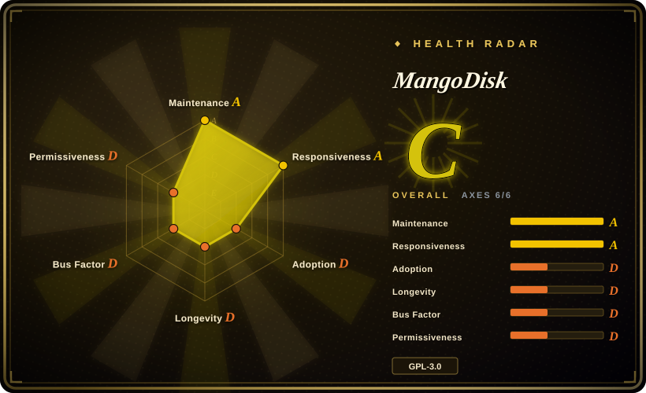
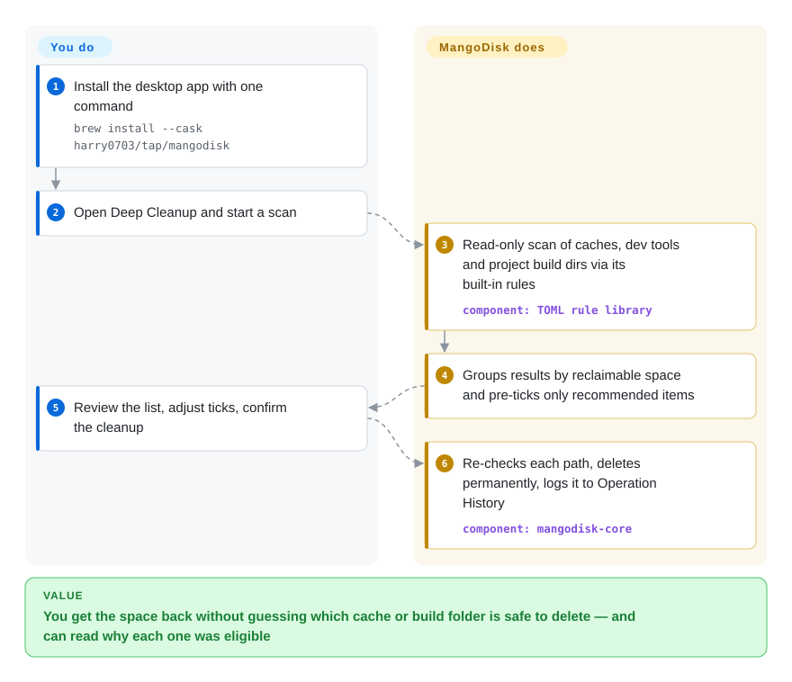

# MangoDisk

Your disk says "almost full" and the space is hiding in places you never open — gigabytes of Xcode data, `node_modules` and `target` folders in old projects, browser caches, Docker build cache, forgotten local AI models. MangoDisk scans all of those with a library of published, per-path cleanup rules, shows you what it would free and how much, and only deletes what you confirm — on macOS, Windows and (newly) Linux, as a desktop app or a CLI.

## When to use

You are a developer on a 512 GB MacBook or a Windows laptop, and the system just told you there are 4 GB left. `du -sh ~/Library/Caches ~/.cargo ~/.npm` and a hunt through `~/Library/Developer/Xcode/DerivedData` would find it, but it is an hour of guessing which folders are safe to delete. The paid cleaners (CleanMyMac, CCleaner) will do it in one click, but their rules are closed — you cannot see *why* a folder is considered disposable — and on the Windows machine you'd need a second tool anyway.

MangoDisk is the pick when you want **one cleaner across macOS, Windows and Linux whose cleanup rules you can read**: every ordinary cleanup target is a declarative TOML rule in the repository (≈244 platform rules plus 31 project-artifact ecosystems as of 2026-09-28), each carrying a risk level, a default-selection flag, and a written evidence line with references. It covers the developer-shaped mess well — package-manager and IDE caches, Xcode, Docker, per-project build output for Node, Rust, Gradle, Swift, Python, .NET and more, local AI model caches — and bundles the rest of a "disk utility" in the same app: large-file finder, content-hash duplicate finder, treemap analyzer, app uninstaller with leftovers, startup items, system tweaks and a resource monitor. Over `tw93/Mole` the deciding difference is the platform span (Mole is macOS-only) and the GUI in the open repository; over BleachBit it is macOS support plus developer-cache and project-artifact coverage.

## How it works

Everything starts as a **read-only scan**. MangoDisk's Rust core walks the locations named by its built-in rules — the rules are compiled into the binary at build time, not downloaded — measures each one, and groups the results by reclaimable space, pre-ticking only the items a rule marks as a "smart recommendation". Nothing is touched until you review the list and confirm. Then, before each deletion, it re-checks the path: it refuses protected locations, applies its policy for symbolic links and Windows reparse points (links that point elsewhere), and verifies the physical folder is still the one it scanned — think of a mover who re-reads the label on every box before throwing it out. Deletion is **permanent** (not the Trash / Recycle Bin), and each run is written to an Operation History. You choose what to clean and whether to trust a recommendation; the project decides which paths are eligible at all. The same engine ships as a standalone `mangodisk` CLI: `mangodisk clean` only reports, `mangodisk clean --apply` cleans the recommended set, and a non-interactive run additionally needs `--yes`.

<!-- flow-steps:begin (generated from flows/mangodisk.json by tools/flow_card.py — do not edit) -->

Text version of the flow

1. **You**: Install the desktop app with one command — `brew install --cask harry0703/tap/mangodisk`
2. **You**: Open Deep Cleanup and start a scan
3. **MangoDisk**: Read-only scan of caches, dev tools and project build dirs via its built-in rules — component: `TOML rule library`
4. **MangoDisk**: Groups results by reclaimable space and pre-ticks only recommended items
5. **You**: Review the list, adjust ticks, confirm the cleanup
6. **MangoDisk**: Re-checks each path, deletes permanently, logs it to Operation History — component: `mangodisk-core`

**Value**: You get the space back without guessing which cache or build folder is safe to delete — and can read why each one was eligible

<!-- flow-steps:end -->

## When NOT to use

- **You need an undo.** Cleanup, large-file and duplicate deletions are permanent — the confirm dialogs say "This cannot be undone", and the uninstaller migrated from move-to-Trash to permanent deletion. If you want deletions to land in the Trash / Recycle Bin first, clean by hand from a space analyzer such as WinDirStat or your OS file manager instead, and keep a backup either way.
- **You only need to see where the space went.** A dedicated, read-only analyzer (WinDirStat on Windows, `ncdu` or `dust` in a terminal) is lighter than installing an app that also rewrites startup items and system settings.
- **Linux is your main machine.** Linux support landed between 2026-09-17 and 2026-09-24; only 27 Linux cleanup rules exist against 125 for macOS and 92 for Windows, and no prebuilt CLI is published for Linux. Use BleachBit, which has cleaned Linux desktops for over a decade, and treat MangoDisk-on-Linux as a preview.
- **You want only one job done well — duplicates, or app removal.** Czkawka (duplicates, similar images, empty folders; MIT, cross-platform) or a dedicated Mac uninstaller go deeper on their one axis than MangoDisk's bundled module.
- **You want a scriptable, macOS-only terminal tool.** Mole (`mo`) is a single Homebrew-installed CLI with the same kind of scope, a much larger user base and a longer track record on macOS; MangoDisk's CLI covers only `clean` today.
- **A managed fleet or a locked-down machine.** It rewrites startup items, services (Windows) and system settings with administrator prompts, and the official builds call `mangodisk.app` for updates and the free AI quota. For MDM-controlled fleets, use your management platform's cleanup policies instead of a per-user GUI utility.
- **You want to embed the engine in a proprietary product.** The whole codebase is GPL-3.0-only; there is no separately licensed core library.

## Comparison

| Alternative | In index | Our verdict | Tradeoff |
|---|---|---|---|
| Mole (`tw93/Mole`) | not indexed | On a Mac where a terminal command is the interface you want, pick Mole; pick MangoDisk when the same cleaner must also run on Windows or you want a GUI whose source is in the open repository. | Mole is macOS-only and its native app is a separate paid download, but its CLI is older (2025-09) and far more widely used; MangoDisk spans three OSes but is two months old. Not added in this tab-intake batch. |
| BleachBit | not indexed | For Linux desktops and privacy-trace wiping with a 2014-era track record, pick BleachBit; pick MangoDisk for macOS, developer caches and project build folders. | BleachBit is mature and scriptable but has no macOS build and no project-artifact or duplicate modules; MangoDisk covers far more developer clutter with a much younger codebase. Not added in this tab-intake batch. |
| Czkawka | not indexed | If the problem is duplicates, similar images or empty folders across big drives, pick Czkawka; pick MangoDisk when duplicates are one part of a general cleanup. | Czkawka is MIT, fast and specialised with more match modes; MangoDisk's duplicate module is exact-content only but sits next to caches, uninstall and startup in one app. Not added in this tab-intake batch. |
| WinDirStat | not indexed | To see what fills a Windows disk and delete by hand, pick WinDirStat; pick MangoDisk when you want rule-backed recommendations instead of deciding every folder yourself. | WinDirStat (GPL-2.0, maintained since 2016 on GitHub) is a read-first analyzer with no cleanup rules; MangoDisk adds curated rules but also permanent deletion and system-changing modules. Not added in this tab-intake batch. |
| CleanMyMac / CCleaner | not a repo (closed-source commercial apps) | If you want a vendor-supported cleaner with a support desk, buy one of these; pick MangoDisk when you need to read exactly which paths are cleaned and why. | The commercial tools are polished and supported but their cleanup logic is opaque and subscription-priced; MangoDisk is free and auditable with a single maintainer behind it. |

## Tech stack

- **Core:** Rust workspace (`mangodisk-core` scanning, rules, preflight and deletion; `mangodisk-platform` OS integration; `mangodisk-cli`), toolchain pinned to Rust 1.88+; BLAKE3 hashing for duplicate detection
- **Desktop shell:** Tauri 2 (the OS web view, not a bundled Chromium) with a Vue 3 + TypeScript front end (Pinia, vue-i18n in five locales, Tailwind-style UI components)
- **Rules:** declarative TOML (filesystem rules schema v3, project-artifact rules), validated and embedded at build time
- **Platform code:** `objc2`/AppKit on macOS, `windows`/`windows-sys` (registry, COM, Direct2D) on Windows, package-manager inventory on Linux
- **Distribution:** signed and notarized builds via GitHub Releases, a Homebrew tap (`harry0703/tap/mangodisk`, `harry0703/tap/mangodisk-cli`), PowerShell and shell installers from `get.mangodisk.app`, `.deb` and AppImage on Linux; built-in updater (Tauri updater)

## Dependencies

- **macOS 12.5+**, or **64-bit Windows 10+ with WebView2 Runtime ≥ 111**, or a Debian/Ubuntu-style Linux (x64/ARM64) — compatibility on other distributions depends on system libraries
- **Administrator rights** only for modules that change startup services, system settings or run maintenance actions; plain cache cleanup runs as the user
- **Network (optional):** `mangodisk.app` for update checks, feedback and the free AI-explanation quota; a custom AI provider can be configured instead (its API key is stored as plain JSON in the app's data directory)
- **To build from source:** Node.js 24, pnpm 11.13.1, stable Rust and the Tauri 2 platform prerequisites — local builds lack signing, update metadata and the free AI quota

## Ops difficulty

**Low** for a single machine: install with one command, grant permissions when a module asks, click Scan. The effort sits in judgment, not operation — reviewing what a cleanup will permanently remove, and understanding a system tweak before applying it (the README itself warns some optimizations affect security, battery life or update behaviour). There is no server to run. Rolling it across many machines is not a supported workflow: no central policy, per-user installs, and a release every few days to keep up with.

## Health & viability

- **Maintenance (2026-09-28).** Extremely active: 15 releases from v1.0.0 (2026-08-07) to v1.1.4 (2026-09-25), commits on most days, and Linux support added within the last two weeks. The pace also means frequent behaviour changes.
- **Governance / bus factor.** One maintainer: `harry0703` authored ~215 of ~223 commits and owns the roadmap, rules and release signing; contributors so far are a handful of single PRs. CONTRIBUTING, SECURITY (private advisories) and a repository `AGENTS.md` are unusually thorough for the age.
- **Backing & Lindy.** No company or foundation behind it; created 2026-08-01, so under two months old — the Lindy prior gives it little weight yet. The author's earlier `MoneyPrinterTurbo` (≈126k stars, 2024) shows reach, not a maintenance record for this project.
- **Adoption.** ~3.4k stars and 253 forks in eight weeks; release assets on GitHub alone were downloaded ~23.3k times across versions (Homebrew and website installs not counted). Issues get a maintainer answer within days.
- **Risk flags.** GPL-3.0-only (strong copyleft for anyone embedding it); permanent deletion as the only mode; a young rule library whose mistakes already shipped once (Chrome offline-cache cleanup broke Manifest V3 extensions until v1.0.9, issue #44); official builds contact the vendor's server for updates and AI quota.

## Caveats (unverified)

- **Rule safety.** The README's claim that every rule "passes validation on real systems" was not reproduced here; the rule files carry evidence text and references, but their correctness per OS version was not tested. `[未验证：需在多台真机上逐条执行]`
- **Rule counts** (27 Linux / 125 macOS / 92 Windows / 31 project-artifact ecosystems) are counted from the default branch on 2026-09-28 and change with nearly every release. `[推断]`
- **Download total** (~23.3k) sums GitHub release-asset counts on 2026-09-28; it counts downloads, not users, and excludes Homebrew and website installs. `[推断]`
- **Signing and notarization** of official builds is stated in the README ("signing, notarization, or update metadata provided by official MangoDisk releases") and not checked against the artifacts. `[未验证：未下载安装包校验签名]`
- **What the AI feature sends.** Source shows an explicit per-item request with an allowlisted context plus install ID, app version, locale, OS version and timezone to `mangodisk.app`; what the server logs or retains was not verifiable. `[未验证：服务端不开源]`
- **Issue #66** (2026-09-28) reports files on another disk being removed; the maintainer's first reply points at the Ollama model library following `OLLAMA_MODELS` to another drive. Root cause was not settled at verification time. `[未验证]`
- **Competitor facts** (Mole's user base and paid app, BleachBit lacking macOS builds, Czkawka's match modes) are taken from their READMEs and GitHub metadata on 2026-09-28, not from running them. `[推断]`
