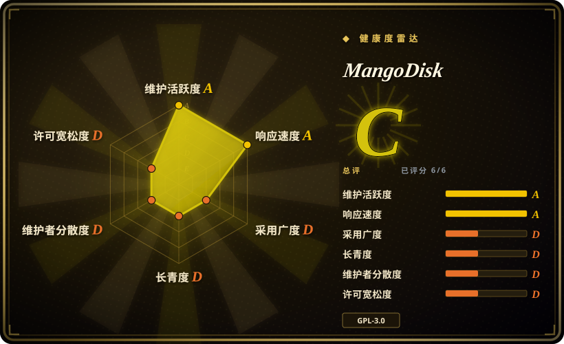
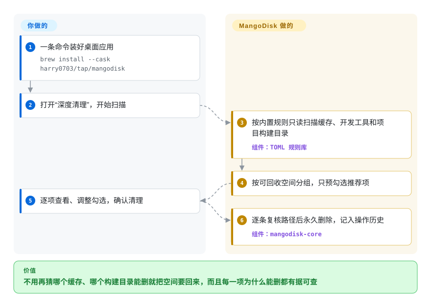

# MangoDisk

磁盘提示“快满了”，可空间藏在你从不打开的地方：几十 GB 的 Xcode 数据、旧项目里的 `node_modules` 和 `target`、浏览器缓存、Docker 构建缓存、早忘了的本地 AI 模型。MangoDisk 用一套公开的、逐路径写明理由的清理规则把这些地方扫一遍，告诉你能腾出多少、删的是什么，只删你确认过的——macOS、Windows 和（刚支持的）Linux 都能用，有桌面版也有命令行版。

## 何时使用

你是开发者，手上是一台 512 GB 的 MacBook 或一台 Windows 笔记本，系统刚提示只剩 4 GB。用 `du -sh ~/Library/Caches ~/.cargo ~/.npm` 再翻一遍 `~/Library/Developer/Xcode/DerivedData` 当然能找到，但那是一小时“这个文件夹能不能删”的猜谜。付费清理工具（CleanMyMac、CCleaner）一键就能搞定，可它们的规则是闭源的——你看不到某个文件夹凭什么被认定为可删——而且到了 Windows 那台机器上还得另装一个。

当你想要**一个同时覆盖 macOS、Windows、Linux，且清理规则可以逐条读懂的清理工具**时，选 MangoDisk：常规清理目标全部是仓库里的声明式 TOML 规则（截至 2026-09-28 约 244 条平台规则，外加 31 个项目构建产物生态），每条都写明风险等级、是否默认勾选，以及附参考链接的依据说明。它对开发者的“垃圾”覆盖得很好——包管理器和 IDE 缓存、Xcode、Docker、Node／Rust／Gradle／Swift／Python／.NET 等项目的构建输出、本地 AI 模型缓存——同时把“磁盘工具箱”的其余部分也塞进同一个应用：大文件查找、按内容哈希的重复文件查找、树状图空间分析、带残留清理的应用卸载、启动项、系统设置优化和资源监控。和 `tw93/Mole` 相比，决定性的差别是平台跨度（Mole 只支持 macOS）和开源仓库里就带图形界面；和 BleachBit 相比，是支持 macOS 以及覆盖开发缓存和项目构建产物。

## 怎么用起来

一切从一次**只读扫描**开始。MangoDisk 的 Rust 核心按内置规则列出的位置逐个遍历——这些规则在构建时就编译进程序，不是运行时下载的——量出每处占用，按可回收空间分组，只预先勾选规则标为“智能推荐”的项目。你确认之前什么都不会动。确认后，每删一处之前它都会再核一遍路径：拒绝受保护位置，对符号链接和 Windows 重解析点（指向别处的“链接”）按策略处理，并核对磁盘上的物理文件夹还是扫描时那一个——像搬家工人扔每个箱子前都再看一眼标签。删除是**永久删除**（不进废纸篓／回收站），每次操作都记入“操作历史”。删什么、信不信推荐，由你决定；哪些路径有资格被删，由项目决定。同一个引擎还单独发布成 `mangodisk` 命令行：`mangodisk clean` 只报告，`mangodisk clean --apply` 清理推荐项，非交互环境里还必须再加 `--yes`。

<!-- flow-steps:begin (generated from flows/mangodisk.json by tools/flow_card.py — do not edit) -->

流程文字版

1. **你**：一条命令装好桌面应用 — `brew install --cask harry0703/tap/mangodisk`
2. **你**：打开“深度清理”，开始扫描
3. **MangoDisk**：按内置规则只读扫描缓存、开发工具和项目构建目录 — 组件：`TOML 规则库`
4. **MangoDisk**：按可回收空间分组，只预勾选推荐项
5. **你**：逐项查看、调整勾选，确认清理
6. **MangoDisk**：逐条复核路径后永久删除，记入操作历史 — 组件：`mangodisk-core`

**价值**：不用再猜哪个缓存、哪个构建目录能删就把空间要回来，而且每一项为什么能删都有据可查

<!-- flow-steps:end -->

## 何时不用

- **你需要能撤销。** 深度清理、大文件和重复文件的删除都是永久的——确认框直接写着“无法撤销”，应用卸载也已从“移到废纸篓”改成了永久删除。想让删除先进废纸篓／回收站，就用 WinDirStat 这类空间分析器或系统文件管理器手动删，而且无论如何都先备份。
- **你只想看空间去哪了。** 专门的只读分析器（Windows 上的 WinDirStat、终端里的 `ncdu` 或 `dust`）比装一个还会改启动项和系统设置的应用轻得多。
- **Linux 是你的主力机。** Linux 支持是 2026-09-17 到 2026-09-24 才加上的；Linux 清理规则只有 27 条，macOS 有 125 条、Windows 有 92 条，且没有发布 Linux 版预编译命令行。用十多年来一直在清理 Linux 桌面的 BleachBit，把 MangoDisk 的 Linux 版当预览看。
- **你只要把一件事做好——查重，或卸载应用。** Czkawka（重复文件、相似图片、空文件夹；MIT，跨平台）或专门的 Mac 卸载工具，在各自那一件事上比 MangoDisk 附带的模块做得更深。
- **你要一个可脚本化、只用在 macOS 上的终端工具。** Mole（`mo`）是一个 Homebrew 装好即用的命令行，范围相近，用户基数大得多，在 macOS 上的历史也更长；MangoDisk 的命令行目前只有 `clean` 一个子命令。
- **受管机群或锁定的机器。** 它会在管理员授权下改启动项、服务（Windows）和系统设置，官方构建还会连 `mangodisk.app` 检查更新、领取免费 AI 额度。受 MDM 管控的机群应使用管理平台自己的清理策略，而不是每人一份的桌面小工具。
- **你想把引擎嵌进闭源产品。** 整个代码库是 GPL-3.0-only，没有单独授权的核心库。

## 横向对比

| 替代品 | 是否收录 | 我们的评价 | 取舍 |
|---|---|---|---|
| Mole（`tw93/Mole`） | 未收录 | 在 Mac 上、而且你就想要一条终端命令，选 Mole；同一个清理工具还要在 Windows 上跑，或者你要开源仓库里自带的图形界面，选 MangoDisk。 | Mole 只支持 macOS，原生 App 是单独付费下载，但命令行更早（2025-09）、用户多得多；MangoDisk 跨三个系统，但只有两个月历史。本次标签页收录批次未添加。 |
| BleachBit | 未收录 | 清理 Linux 桌面、擦除隐私痕迹，并看重 2014 年以来的长期记录，选 BleachBit；要覆盖 macOS、开发缓存和项目构建目录，选 MangoDisk。 | BleachBit 成熟且可脚本化，但没有 macOS 版，也没有项目构建产物和查重模块；MangoDisk 覆盖的开发垃圾多得多，代码库却年轻得多。本次标签页收录批次未添加。 |
| Czkawka | 未收录 | 问题是大硬盘上的重复文件、相似图片或空文件夹，选 Czkawka；查重只是整体清理的一部分时，选 MangoDisk。 | Czkawka 是 MIT 许可、速度快、专精，匹配模式更多；MangoDisk 的查重只认内容完全相同，但和缓存清理、卸载、启动项放在一个应用里。本次标签页收录批次未添加。 |
| WinDirStat | 未收录 | 想看清 Windows 磁盘被什么占满、再自己动手删，选 WinDirStat；想要有规则依据的推荐、不必每个文件夹都自己判断，选 MangoDisk。 | WinDirStat（GPL-2.0，2016 年起在 GitHub 维护）是先看后删的分析器，没有清理规则；MangoDisk 加了精选规则，同时也带来永久删除和会改系统的模块。本次标签页收录批次未添加。 |
| CleanMyMac／CCleaner | 非仓库 | 想要有厂商支持、有客服的清理工具，就买它们；需要读清楚到底清了哪些路径、为什么清，选 MangoDisk。 | 商业工具打磨好、有支持，但清理逻辑不透明且按订阅收费；MangoDisk 免费、可审计，背后只有一位维护者。它们是闭源商业应用，不是仓库。 |

## 技术栈

- **核心：** Rust workspace（`mangodisk-core` 负责扫描、规则、删除前复核与删除；`mangodisk-platform` 负责系统集成；`mangodisk-cli`），工具链锁定 Rust 1.88+；重复文件检测用 BLAKE3 哈希
- **桌面壳：** Tauri 2（用系统自带 WebView，不打包 Chromium），前端是 Vue 3 + TypeScript（Pinia、vue-i18n 五种语言、Tailwind 风格组件）
- **规则：** 声明式 TOML（文件系统规则 schema v3、项目构建产物规则），构建时校验并嵌入
- **平台代码：** macOS 用 `objc2`／AppKit，Windows 用 `windows`／`windows-sys`（注册表、COM、Direct2D），Linux 按包管理器盘点应用
- **分发：** GitHub Releases 发布的签名、公证构建，Homebrew tap（`harry0703/tap/mangodisk`、`harry0703/tap/mangodisk-cli`），`get.mangodisk.app` 的 PowerShell 与 shell 安装脚本，Linux 上的 `.deb` 和 AppImage；内置自动更新（Tauri updater）

## 依赖

- **macOS 12.5+**，或 **64 位 Windows 10+ 且 WebView2 Runtime ≥ 111**，或 Debian／Ubuntu 系 Linux（x64／ARM64）——其他发行版能否运行取决于系统库
- **管理员权限**只在改启动服务、系统设置或执行维护操作的模块里需要；普通缓存清理以当前用户身份运行
- **网络（可选）：** `mangodisk.app` 用于检查更新、提交反馈和免费 AI 解释额度；也可以改接自己的 AI 服务（其 API key 以明文 JSON 存在应用数据目录里）
- **从源码构建：** Node.js 24、pnpm 11.13.1、稳定版 Rust 和 Tauri 2 平台前置依赖——本地构建没有签名、更新元数据，也没有免费 AI 额度

## 运维难度

单台机器上**低**：一条命令安装，模块请求权限时授权，点“扫描”。真正费力的是判断而不是运维——看清一次清理会永久删掉什么，改系统设置前弄懂它的影响（README 自己就警告部分优化会影响安全、续航或更新行为）。没有服务要跑。铺到很多台机器上不是它支持的用法：没有集中策略，按用户安装，而且几天一个版本需要跟。

## 健康度与可持续性

- **维护（2026-09-28）。** 极其活跃：从 v1.0.0（2026-08-07）到 v1.1.4（2026-09-25）共 15 个版本，几乎天天有提交，Linux 支持是最近两周才加的。节奏快也意味着行为变化频繁。
- **治理／巴士系数。** 单人维护：`harry0703` 写了约 223 个提交中的约 215 个，掌控路线图、规则和发布签名；其他贡献者目前只是零星几个 PR。CONTRIBUTING、SECURITY（私下报告漏洞）和仓库自带的 `AGENTS.md` 以这个年龄来说相当完备。
- **背书与 Lindy。** 没有公司或基金会支持；2026-08-01 创建，不到两个月——Lindy 先验目前给它的权重很低。作者早先的 `MoneyPrinterTurbo`（约 12.6 万星，2024 年）说明的是影响力，不是这个项目的维护记录。
- **采用度。** 八周约 3.4k 星、253 个 fork；仅 GitHub Release 附件累计下载约 2.33 万次（不含 Homebrew 和官网安装）。issue 通常几天内有维护者回复。
- **风险信号。** GPL-3.0-only（对嵌入者是强 copyleft）；只有永久删除一种模式；规则库很年轻，已出过一次事故（清理 Chrome 离线缓存导致 Manifest V3 扩展无法启动，v1.0.9 才修复，issue #44）；官方构建会连厂商服务器检查更新和 AI 额度。

## 存疑（未验证）

- **规则安全性。** README 称每条规则都“在真实系统上通过验证”，这里没有复现；规则文件带有依据说明和参考链接，但各系统版本下是否正确没有测试。`[未验证：需在多台真机上逐条执行]`
- **规则数量**（Linux 27 条／macOS 125 条／Windows 92 条／31 个项目构建产物生态）是 2026-09-28 在默认分支上数出来的，几乎每个版本都会变。`[推断]`
- **下载总数**（约 2.33 万）是 2026-09-28 对 GitHub Release 附件下载数的加总；它数的是下载次数不是用户数，也不含 Homebrew 和官网安装。`[推断]`
- **官方构建的签名与公证**来自 README 的表述（“official MangoDisk releases”提供签名、公证和更新元数据），没有对安装包做校验。`[未验证：未下载安装包校验签名]`
- **AI 功能发送了什么。** 源码显示是按条目显式发起请求，上下文走白名单，另附安装 ID、应用版本、语言、系统版本和时区发往 `mangodisk.app`；服务端记录或保留什么无法核实。`[未验证：服务端不开源]`
- **Issue #66**（2026-09-28）报告另一块磁盘上的文件被删；维护者首次回复指向 Ollama 模型库随 `OLLAMA_MODELS` 指到了别的盘。核验时根因尚未定论。`[未验证]`
- **竞品事实**（Mole 的用户基数和付费 App、BleachBit 没有 macOS 版、Czkawka 的匹配模式）取自它们 2026-09-28 的 README 和 GitHub 元数据，没有实际运行。`[推断]`
