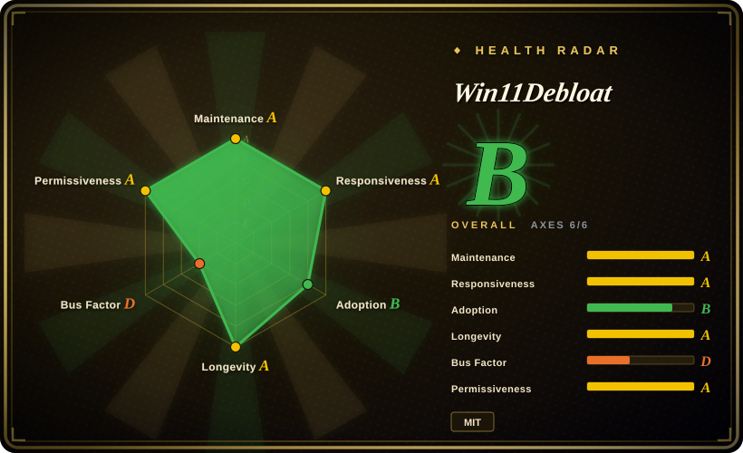
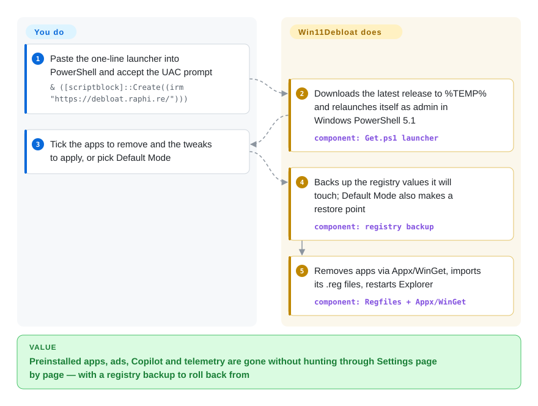

# Win11Debloat

A fresh Windows 11 install arrives with Candy Crush and Clipchamp in the Start menu, Bing results in local search, Copilot on the taskbar and "tips" on the lock screen — and turning each off means a dozen Settings pages, some registry edits and an uninstall per app. Win11Debloat is one PowerShell script that does that whole sweep from a checklist (or a single `-RunDefaults` switch), backs up the registry values it changes first, and can undo them from the same window.

## When to use

You have just set up a new Windows 11 laptop — your own, a family member's, or the tenth one this month for a small office — and the first boot greets you with a Start menu full of pinned games, a Copilot button, "Recommended" ads, and Edge nagging about Microsoft 365. You know every one of these can be switched off, but by hand it is an hour of Settings pages, `Get-AppxPackage | Remove-AppxPackage` lines you half-remember, and Group Policy keys that Home edition doesn't even have.

Reach for Win11Debloat when you want that cleanup **scripted, reviewable and reversible rather than clicked**: a GUI checklist of 104 features and 141 removable apps (each app rated safe / optional / unsafe in `Config/Apps.json`), a Default Mode that applies a conservative preset, and the same switches on the command line (`-RunDefaults -Silent`, `-Sysprep`, `-User <name>`) so one config file can be replayed on every machine. Against Chris Titus Tech's `winutil` the deciding difference is focus: Win11Debloat only declutters and does not also install software, run troubleshooting fixes or manage Windows Update settings, so there is less surface to audit. Against Sophia Script (150+ individually callable functions, each with a restore-default twin) it trades granularity for a GUI checklist, a default preset and a JSON registry backup you can restore from one window. Most tweaks are a readable `.reg` file in `Regfiles/` with a matching `Regfiles/Undo/` file (the rest — Start-menu layout, telemetry scheduled tasks, optional Windows features — are small scripts under `Scripts/Features/`), which is what you will want when a colleague asks what exactly the script did to their PC.

## How it works

Win11Debloat is a plain set of PowerShell files — no installer, no service left running. The quick-start command fetches a small launcher (`debloat.raphi.re` redirects to the `Get.ps1` attached to the latest GitHub release), which downloads that release into `%TEMP%\Win11Debloat` and relaunches the real script as administrator in Windows PowerShell 5.1 (it refuses PowerShell 7, whose module loading breaks app removal). You choose what to change — tick boxes in a WPF window, pick Default Mode, or pass switches. The script then does the work you would otherwise do by hand: it saves a JSON snapshot of every registry value the selected features will touch (and, in the default preset, a System Restore point — Windows' own whole-system checkpoint), uninstalls the chosen apps through Appx (the Store-app package system) or WinGet (Microsoft's package manager), imports one `.reg` file per tweak, and restarts Explorer so the change shows up. Think of it as a hotel housekeeper with a written checklist and a photo of the room before they started: the project supplies the checklist and the photo, you decide which items are on today's list. Reverting means re-running it and unticking a tweak, restoring the JSON backup from the Options menu, or double-clicking the matching file in `Regfiles/Undo/`; removed apps have to be reinstalled from the Microsoft Store yourself.

<!-- flow-steps:begin (generated from flows/win11debloat.json by tools/flow_card.py — do not edit) -->

Text version of the flow

1. **You**: Paste the one-line launcher into PowerShell and accept the UAC prompt — `& ([scriptblock]::Create((irm "https://debloat.raphi.re/")))`
2. **Win11Debloat**: Downloads the latest release to %TEMP% and relaunches itself as admin in Windows PowerShell 5.1 — component: `Get.ps1 launcher`
3. **You**: Tick the apps to remove and the tweaks to apply, or pick Default Mode
4. **Win11Debloat**: Backs up the registry values it will touch; Default Mode also makes a restore point — component: `registry backup`
5. **Win11Debloat**: Removes apps via Appx/WinGet, imports its .reg files, restarts Explorer — component: `Regfiles + Appx/WinGet`

**Value**: Preinstalled apps, ads, Copilot and telemetry are gone without hunting through Settings page by page — with a registry backup to roll back from

<!-- flow-steps:end -->

## When NOT to use

- **Managed or domain-joined fleets.** It writes local machine policies (so Settings and Edge show "managed by your organization") and fights whatever Intune or Group Policy later enforces; on a domain-joined machine with a broken trust relationship app removal fails outright (issue #734, error `0x800706FD`). For a fleet, express the same choices as Intune/GPO policies or bake them into the image, and keep Win11Debloat to unmanaged PCs.
- **You need a slimmer install image, not a cleaned-up install.** It works on a running Windows; it does not remove components from the ISO. Build a trimmed image with `tiny11builder` (or your own DISM/MDT pipeline) instead, accepting that a stripped image is harder to service.
- **You want a general Windows toolbox.** Installing apps in bulk, troubleshooting fixes, configuring Windows Update — that is `winutil`'s scope; Win11Debloat deliberately stops at decluttering.
- **You want per-setting control over hundreds of hardening options.** Sophia Script for Windows exposes 150+ individually callable functions, each with a function that restores the default; privacy.sexy generates a reviewable script from a large rule catalogue for Windows, macOS and Linux. Win11Debloat's 104 features are a curated subset.
- **You expect a one-click full undo.** The registry backup does not reinstall removed apps; the Microsoft Store itself and the Xbox speech-to-text overlay are hard to get back once removed (wiki "Reverting Changes"); `-ForceRemoveEdge` is marked "NOT RECOMMENDED" by the author; and restore stops at the first key that fails to write (open issue #794, 2026-10-07). Take a full disk image or VM snapshot first if the machine matters.
- **Locked-down PowerShell.** It exits when PowerShell is not in FullLanguage mode, so AppLocker/WDAC "Constrained Language" machines cannot run it; it also needs admin rights and Windows PowerShell 5.1. On such machines the change has to go through the policy owner, not a script.
- **You cannot run code fetched at run time from a domain you have not vetted.** The quick method pipes `irm` output into a script block with admin rights. Download a release zip, read it, and run `Win11Debloat.ps1` locally (the README's "Advanced method"), or apply the individual `.reg` files yourself.

## Comparison

| Alternative | In index | Our verdict | Tradeoff |
|---|---|---|---|
| `ChrisTitusTech/winutil` | not indexed | If you want one admin-run toolbox that installs software, applies tweaks, runs troubleshooting fixes and configures Windows Update, pick winutil; pick Win11Debloat when you only want decluttering with a registry backup and per-tweak undo files. | winutil covers far more jobs (and has more stars, ~63.9k) but every extra job is more code running as admin; Win11Debloat is narrower and easier to audit. Not added in this tab batch. |
| `farag2/Sophia-Script-for-Windows` | not indexed | For a power user who wants to script 150+ individual settings function by function, pick Sophia Script; pick Win11Debloat for a GUI checklist and a sane default preset you can hand to a non-expert. | Sophia (2018, ~9.8k stars, MIT) gives finer control but expects you to edit a preset script; Win11Debloat is less granular but faster to apply safely. Not added in this tab batch. |
| `undergroundwires/privacy.sexy` | not indexed | When the goal is privacy hardening across Windows, macOS and Linux with a generated script you can read before running, pick privacy.sexy; pick Win11Debloat when the goal is Windows clutter (apps, Start menu, taskbar, Copilot). | privacy.sexy is AGPL-3.0 and cross-platform but does not curate app removal or UI layout; Win11Debloat is Windows-only but covers both privacy and declutter. Not added in this tab batch. |
| `ntdevlabs/tiny11builder` | not indexed | To install Windows from an image that never contained the bloat, build it with tiny11builder; to clean a Windows that is already installed and keep Microsoft's servicing intact, use Win11Debloat. | A trimmed image avoids post-install cleanup but can break updates and features in ways that are hard to undo; Win11Debloat leaves the OS image stock. tiny11builder's last push was 2025-09 and GitHub detects no license. Not added in this tab batch. |
| O&O ShutUp10++ | not a repo (closed-source freeware) | If you only want privacy toggles in a polished signed executable, use ShutUp10++; pick Win11Debloat when you also want app removal and need to read the changes it makes. | ShutUp10++ is vendor-maintained and needs no PowerShell, but its logic is closed; Win11Debloat is MIT and its tweaks are `.reg` files and PowerShell in the repository. |

## Tech stack

- **Language:** PowerShell, targeting Windows PowerShell 5.1 only (the entry script exits under PowerShell 7 / Core); ~81 `.ps1` files under `Scripts/` split into AppRemoval, CLI, Features, FileIO, GUI, Helpers, Threading
- **GUI:** WPF windows defined in XAML (`Schemas/`), with five UI languages (en-US, it-IT, ja-JP, nl-NL, pt-BR) in `Config/Languages/`
- **Data-driven config:** `Config/Features.json` (104 features with registry keys, undo keys and Windows version limits), `Config/Apps.json` (141 apps with a safe/optional/unsafe rating and removal method), `Config/DefaultSettings.json` (the Default Mode preset)
- **Change mechanism:** `.reg` files in `Regfiles/` with `Regfiles/Undo/` (64 undo files) and `Regfiles/Sysprep/`; app removal through Appx cmdlets and WinGet; JSON registry snapshots in `Backups/`
- **Tests:** 42 Pester 5 test files run in GitHub Actions on `windows-latest` under Windows PowerShell 5.1

## Dependencies

- **Windows 10 or Windows 11** (some features are Windows-11-only; Sysprep mode refuses to run on Windows 10)
- **Windows PowerShell 5.1** in FullLanguage mode and **administrator rights** (UAC prompt)
- **WinGet ≥ 1.4** recommended — without it the script warns that some apps cannot be removed (3 of 141 apps use WinGet as their removal method)
- **Network** only for the quick method (fetches the launcher from `debloat.raphi.re` and the release zip from the GitHub API); the release zip runs offline via `Run.bat`
- **System Restore enabled** if you want the restore point the default preset asks for (the script offers to enable it)

## Ops difficulty

**Low** to run, **medium** to own. One command and a checklist, a reboot or sign-out, done — no service, no agent left behind. The cost is in judgment and in the long tail: knowing which tweaks matter on this PC, keeping the registry backup somewhere other than `%TEMP%`, and re-running after feature updates that bring apps or settings back. For many machines, export a config from the GUI once and replay it with `-Config <path> -Silent`; there is no central reporting, so you verify each machine yourself.

## Health & viability

- **Maintenance (2026-10-09).** Very active: 38 GitHub releases since 2025-05-19 on a calendar-version scheme (latest `2026.08.24`), 272 commits to `master` in the past 12 months, last commit 2026-10-08. Issues are triaged with `confirmed`/`unconfirmed` labels and get detailed maintainer replies.
- **Governance / bus factor.** A single owner: `Raphire` (a personal account) holds 475 commits against 18 for the next contributor, and owns releases and the `debloat.raphi.re` domain. Contributions come through a thorough `CONTRIBUTING.md`; funding is a Ko-fi link. If the owner stops, the quick-start domain stops with them.
- **Age / Lindy.** Created 2020-10-27 — about six years old and still shipping every few weeks, which is a reasonable Lindy prior for a Windows-tweak script. The catch is that its subject moves: each Windows feature update can add new apps or move a setting, so the value depends on continued upkeep, not on age.
- **Adoption.** ~58.9k stars and ~2.5k forks; the `Get.ps1` release asset alone was downloaded ~3.68M times across releases (2026-10-09). Widely used enough that breakages surface quickly as issues.
- **Risk flags.** MIT, no relicensing history found. Runs as admin and, in the quick method, executes code fetched at run time. Uses machine policies that some users read as "managed by your organization". Field reports of side effects exist (stutter with Game Bar integration disabled, #784; Surface boot loop attributed by the maintainers to a concurrent Windows Update, #722).

## Caveats (unverified)

- **No-breakage claim.** The README says "great care went into making sure this script does not unintentionally break any OS functionality"; that was not tested here on any Windows build. `[未验证：需在多台 Windows 实机上逐项执行]`
- **Quick-method trust chain.** On 2026-10-09 `debloat.raphi.re` returned a 301 to the latest release's `Get.ps1`; the redirect is a Cloudflare-hosted rule the owner controls and could change at any time. `[推断：仅单次请求观察]`
- **Backups under `%TEMP%`.** With the quick method the registry backups live in `%TEMP%\Win11Debloat\Backups`; whether Storage Sense or Disk Cleanup deletes them before you need them was not tested. `[推断：依据 Get.ps1 的路径，未复现]`
- **Issue #722 root cause** (Surface Pro 8 boot loop) was attributed to a Windows Update applied in the same session, not reproduced. `[未验证：报告人重装系统，无日志]`
- **Counts** (104 features, 141 apps — 86 safe / 48 optional / 7 unsafe —, 64 undo files, 42 test files, ~3.68M downloads) were read from the default branch and release API on 2026-10-09 and change with nearly every release; the released `2026.08.24` build is older than `master`. `[推断]`
- **Competitor facts** (winutil scope, Sophia's catalogue size, privacy.sexy's platforms, tiny11builder's servicing risk, ShutUp10++ being closed-source) come from their READMEs and GitHub metadata on 2026-10-09, not from running them. `[推断]`
