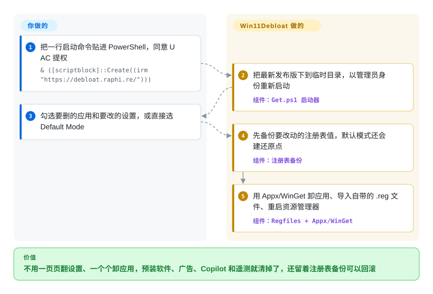

# Win11Debloat

新装的 Windows 11，开始菜单里钉着 Candy Crush 和 Clipchamp，本地搜索混进 Bing 网页结果，任务栏上有 Copilot，锁屏还在推“小贴士”——想一项项关掉，得翻十几个设置页、改几处注册表、再一个个卸应用。Win11Debloat 是一个 PowerShell 脚本，按一张勾选清单（或一个 `-RunDefaults` 开关）把这些一次清完，动手前先备份它要改的注册表值，之后还能在同一个窗口里撤回。

## 何时使用

你刚给一台新 Windows 11 笔记本开机——自己的、家里人的，或者是这个月给小办公室装的第十台——迎面就是钉满游戏的开始菜单、一个 Copilot 按钮、“推荐”区的广告，外加 Edge 不停推 Microsoft 365。你知道这些都能关，但手动做就是一个小时：一页页翻设置，凭记忆敲 `Get-AppxPackage | Remove-AppxPackage`，还有些组策略项家庭版根本没有。

当你希望这次清理**能写成脚本、能审查、能撤回，而不是靠手点**时，就该想到 Win11Debloat：一个图形界面清单，列着 104 项功能和 141 个可卸载应用（`Config/Apps.json` 给每个应用标了 safe／optional／unsafe），一个只应用保守预设的 Default Mode，命令行上也是同一套开关（`-RunDefaults -Silent`、`-Sysprep`、`-User <name>`），同一份配置可以在每台机器上重放。和 Chris Titus Tech 的 `winutil` 相比，决定性的区别是专注：Win11Debloat 只做减负，不顺带装软件、跑故障修复或管理 Windows 更新设置，以管理员身份运行的代码面更小，更好审。和 Sophia Script（150 多个可单独调用的函数，每个都有恢复默认的配对函数）相比，它用颗粒度换来了图形清单、默认预设，以及可在同一个窗口里恢复的 JSON 注册表备份。大多数调整就是 `Regfiles/` 里一个能直接读的 `.reg` 文件，并在 `Regfiles/Undo/` 里有对应的撤销文件（其余的——开始菜单布局、遥测计划任务、Windows 可选功能——是 `Scripts/Features/` 下的小脚本）；同事问“这脚本到底对我电脑做了什么”时，你要的正是这个。

## 怎么用起来

Win11Debloat 就是一组普通的 PowerShell 文件——没有安装程序，也不留常驻服务。快速启动命令先取回一个小启动器（`debloat.raphi.re` 会重定向到最新 GitHub 发布版附带的 `Get.ps1`），它把该发布版下载到 `%TEMP%\Win11Debloat`，再以管理员身份在 Windows PowerShell 5.1 里启动真正的脚本（它拒绝在 PowerShell 7 下运行，因为那里的模块加载会让应用卸载失败）。改什么由你决定：在 WPF 窗口里打勾、选 Default Mode，或者传命令行开关。剩下原本要手动做的活由脚本来干：先把所选功能会碰到的每个注册表值存成一份 JSON 快照（默认预设还会建一个系统还原点，也就是 Windows 自带的整机检查点），再通过 Appx（应用商店应用的包管理机制）或 WinGet（微软的包管理器）卸载选中的应用，每项调整导入一个 `.reg` 文件，最后重启资源管理器让改动立刻生效。可以把它想成一位拿着书面清单、开工前先给房间拍照的酒店保洁：清单和照片是项目给的，今天清哪几项由你勾。撤回有三条路：重新运行后取消勾选、在 Options 菜单里恢复那份 JSON 备份，或者双击 `Regfiles/Undo/` 里对应的文件；被卸掉的应用要你自己去 Microsoft Store 装回来。

<!-- flow-steps:begin (generated from flows/win11debloat.json by tools/flow_card.py — do not edit) -->

流程文字版

1. **你**：把一行启动命令贴进 PowerShell，同意 UAC 提权 — `& ([scriptblock]::Create((irm "https://debloat.raphi.re/")))`
2. **Win11Debloat**：把最新发布版下到临时目录，以管理员身份重新启动 — 组件：`Get.ps1 启动器`
3. **你**：勾选要删的应用和要改的设置，或直接选 Default Mode
4. **Win11Debloat**：先备份要改动的注册表值，默认模式还会建还原点 — 组件：`注册表备份`
5. **Win11Debloat**：用 Appx/WinGet 卸应用、导入自带的 .reg 文件、重启资源管理器 — 组件：`Regfiles + Appx/WinGet`

**价值**：不用一页页翻设置、一个个卸应用，预装软件、广告、Copilot 和遥测就清掉了，还留着注册表备份可以回滚

<!-- flow-steps:end -->

## 何时不用

- **受管或加入域的机器群。** 它会写本机策略（于是设置和 Edge 显示“由你的组织管理”），还会和之后 Intune 或组策略下发的设置互相打架；在域信任关系损坏的加域机器上，应用卸载会直接失败（issue #734，错误 `0x800706FD`）。机器一多，就把同样的取舍写成 Intune／GPO 策略或做进镜像，Win11Debloat 只留给不受管的个人电脑。
- **你要的是更瘦的安装镜像，而不是清理已装好的系统。** 它只处理正在运行的 Windows，不会从 ISO 里删组件。要瘦身镜像，用 `tiny11builder`（或你自己的 DISM／MDT 流水线），并接受被裁过的镜像更难维护更新。
- **你想要一个通用的 Windows 工具箱。** 批量装软件、故障修复、配置 Windows 更新——这是 `winutil` 的范围；Win11Debloat 刻意只做减负。
- **你要对上百项加固选项逐项控制。** Sophia Script for Windows 提供 150 多个可单独调用的函数，每个都配有恢复默认的函数；privacy.sexy 从一个大型规则库生成可先审后跑的脚本，覆盖 Windows、macOS 和 Linux。Win11Debloat 的 104 项功能只是精选子集。
- **你指望一键完整撤销。** 注册表备份不会把卸掉的应用装回来；Microsoft Store 本身和 Xbox 语音转文字浮层卸掉后很难找回（wiki“Reverting Changes”）；作者把 `-ForceRemoveEdge` 标为“NOT RECOMMENDED”；而且恢复时遇到第一个写不进去的键就会停下（未关闭的 issue #794，2026-10-07）。机器要紧的话，先做整盘镜像或虚拟机快照。
- **PowerShell 被锁定的机器。** PowerShell 不在 FullLanguage 模式时它会直接退出，所以开了 AppLocker／WDAC“受限语言模式”的机器跑不了；它还需要管理员权限和 Windows PowerShell 5.1。这类机器上的改动应交给策略的所有者，而不是一个脚本。
- **你不能运行“运行时从一个没审过的域名取回的代码”。** 快速方式把 `irm` 取回的内容直接以管理员身份当脚本块执行。改为下载发布版 zip、读一遍，再在本地运行 `Win11Debloat.ps1`（README 里的“Advanced method”），或者自己逐个导入 `.reg` 文件。

## 横向对比

| 替代品 | 是否收录 | 我们的评价 | 取舍 |
|---|---|---|---|
| `ChrisTitusTech/winutil` | 未收录 | 如果你要一个以管理员身份运行、既装软件又做调整、还能跑故障修复和配置 Windows 更新的工具箱，选 winutil；如果只想减负，并且要注册表备份和逐项撤销文件，选 Win11Debloat。 | winutil 能干的活多得多（星标也更多，约 63.9k），但每多一项功能就多一段以管理员身份运行的代码；Win11Debloat 更窄，也更好审。本批 tab 收录未加入。 |
| `farag2/Sophia-Script-for-Windows` | 未收录 | 想按函数逐项脚本化 150 多个具体设置的高级用户，选 Sophia Script；要一张能交给非专业人士的图形清单和稳妥的默认预设，选 Win11Debloat。 | Sophia（仓库建于 2018 年，约 9.8k 星，MIT）控制更细，但要你去改预设脚本；Win11Debloat 颗粒度粗一些，安全应用起来更快。本批 tab 收录未加入。 |
| `undergroundwires/privacy.sexy` | 未收录 | 目标是在 Windows、macOS 和 Linux 上做隐私加固，并且要先读生成的脚本再执行，选 privacy.sexy；目标是 Windows 上的杂乱（应用、开始菜单、任务栏、Copilot），选 Win11Debloat。 | privacy.sexy 是 AGPL-3.0、跨平台，但不负责挑选要卸的应用，也不管界面布局；Win11Debloat 只支持 Windows，但隐私和减负都管。本批 tab 收录未加入。 |
| `ntdevlabs/tiny11builder` | 未收录 | 想从一开始就不含这些冗余的镜像安装系统，用 tiny11builder 构建；想清理已经装好的 Windows、并保留微软的正常更新维护，用 Win11Debloat。 | 裁剪过的镜像省掉装后清理，但可能以难以撤回的方式弄坏更新和功能；Win11Debloat 不动系统镜像。tiny11builder 最近一次推送在 2025-09，GitHub 也检测不到许可证。本批 tab 收录未加入。 |
| O&O ShutUp10++ | 非仓库（闭源免费软件） | 如果只要隐私开关、想用一个打磨好的签名可执行文件，用 ShutUp10++；还要卸应用、并且需要读懂它做的改动，选 Win11Debloat。 | ShutUp10++ 由厂商维护、不需要 PowerShell，但逻辑不公开；Win11Debloat 是 MIT，调整都是仓库里的 `.reg` 文件和 PowerShell。 |

## 技术栈

- **语言：** PowerShell，只支持 Windows PowerShell 5.1（入口脚本在 PowerShell 7／Core 下会退出）；`Scripts/` 下约 81 个 `.ps1` 文件，分为 AppRemoval、CLI、Features、FileIO、GUI、Helpers、Threading
- **图形界面：** XAML 定义的 WPF 窗口（`Schemas/`），`Config/Languages/` 里有五种界面语言（en-US、it-IT、ja-JP、nl-NL、pt-BR）
- **数据驱动配置：** `Config/Features.json`（104 项功能，含注册表键、撤销键和 Windows 版本范围）、`Config/Apps.json`（141 个应用，含 safe／optional／unsafe 评级和卸载方式）、`Config/DefaultSettings.json`（Default Mode 预设）
- **改动机制：** `Regfiles/` 里的 `.reg` 文件，配 `Regfiles/Undo/`（64 个撤销文件）和 `Regfiles/Sysprep/`；应用卸载走 Appx cmdlet 和 WinGet；注册表 JSON 快照存在 `Backups/`
- **测试：** 42 个 Pester 5 测试文件，在 GitHub Actions 的 `windows-latest` 上用 Windows PowerShell 5.1 运行

## 依赖

- **Windows 10 或 Windows 11**（部分功能仅限 Windows 11；Sysprep 模式在 Windows 10 上拒绝运行）
- **Windows PowerShell 5.1**，处于 FullLanguage 模式，并有**管理员权限**（会弹 UAC）
- **建议 WinGet ≥ 1.4**——没有它脚本会警告部分应用无法卸载（141 个应用里有 3 个用 WinGet 卸载）
- **网络**只在快速方式下需要（从 `debloat.raphi.re` 取启动器、从 GitHub API 取发布版 zip）；下载好的发布版 zip 可以通过 `Run.bat` 离线运行
- **系统还原已开启**——如果你要默认预设里的还原点（脚本会提示帮你开启）

## 运维难度

**运行低，持有中。** 一条命令加一张清单，重启或注销一次就完事——不装服务，不留代理程序。成本在判断和长尾上：知道这台电脑上哪些调整真有必要，把注册表备份放到 `%TEMP%` 以外的地方，以及在功能更新把应用或设置带回来之后再跑一遍。机器多时，先在图形界面里导出一份配置，再用 `-Config <path> -Silent` 重放；它没有集中上报，每台机器得你自己核对。

## 健康度与可持续性

- **维护（2026-10-09）。** 非常活跃：自 2025-05-19 起在 GitHub 发了 38 个按日期编号的版本（最新 `2026.08.24`），过去 12 个月 `master` 上有 272 次提交，最近一次提交在 2026-10-08。issue 用 `confirmed`／`unconfirmed` 标签分诊，维护者回复详细。
- **治理／巴士系数。** 单一所有者：`Raphire`（个人账号）有 475 次提交，第二名贡献者只有 18 次；发布和 `debloat.raphi.re` 域名都在他手里。贡献靠一份很完整的 `CONTRIBUTING.md`，资金来源是一个 Ko-fi 链接。所有者一旦停手，快速启动用的域名也跟着停。
- **年龄／Lindy。** 创建于 2020-10-27，约六年，仍每隔几周发一版，对一个 Windows 调整脚本来说是不错的 Lindy 先验。但它针对的对象一直在变：每次 Windows 功能更新都可能加新应用、挪设置位置，价值取决于持续维护，而不是年龄本身。
- **采用度。** 约 58.9k 星、约 2.5k fork；仅 `Get.ps1` 这个发布附件在各版本累计下载约 368 万次（2026-10-09）。用的人足够多，出问题会很快以 issue 形式冒出来。
- **风险信号。** MIT，未发现改许可证的历史。以管理员身份运行，快速方式下执行运行时取回的代码。使用本机策略，有用户会误读为“由你的组织管理”。有副作用的现场报告（关闭 Game Bar 集成后卡顿，#784；Surface 启动循环，维护者归因于同时进行的 Windows 更新，#722）。

## 存疑（未验证）

- **“不会弄坏系统”的说法。** README 称“great care went into making sure this script does not unintentionally break any OS functionality”，本页没有在任何 Windows 版本上实测。`[未验证：需在多台 Windows 实机上逐项执行]`
- **快速方式的信任链。** 2026-10-09 请求 `debloat.raphi.re` 返回 301，指向最新发布版的 `Get.ps1`；这条重定向是所有者控制的 Cloudflare 规则，随时可以改。`[推断：仅单次请求观察]`
- **备份放在 `%TEMP%` 下。** 用快速方式时注册表备份位于 `%TEMP%\Win11Debloat\Backups`；存储感知或磁盘清理会不会在你需要之前把它删掉，没有实测。`[推断：依据 Get.ps1 的路径，未复现]`
- **issue #722 的根因**（Surface Pro 8 启动循环）被归因于同一次会话里应用的 Windows 更新，没有复现。`[未验证：报告人重装系统，无日志]`
- **各项计数**（104 项功能、141 个应用——86 safe／48 optional／7 unsafe——、64 个撤销文件、42 个测试文件、约 368 万次下载）是 2026-10-09 从默认分支和发布 API 读到的，几乎每个版本都会变；已发布的 `2026.08.24` 比 `master` 旧。`[推断]`
- **竞品事实**（winutil 的范围、Sophia 的函数数量、privacy.sexy 支持的平台、tiny11builder 的维护风险、ShutUp10++ 闭源）来自它们 2026-10-09 的 README 和 GitHub 元数据，没有实际运行。`[推断]`
