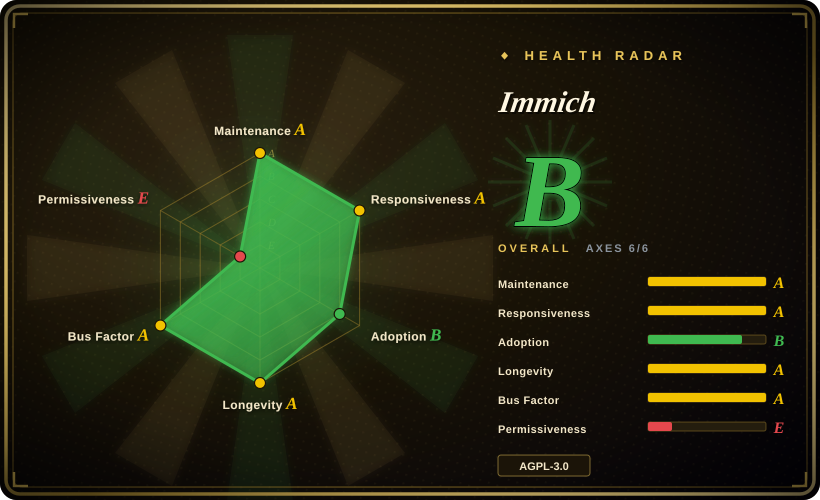
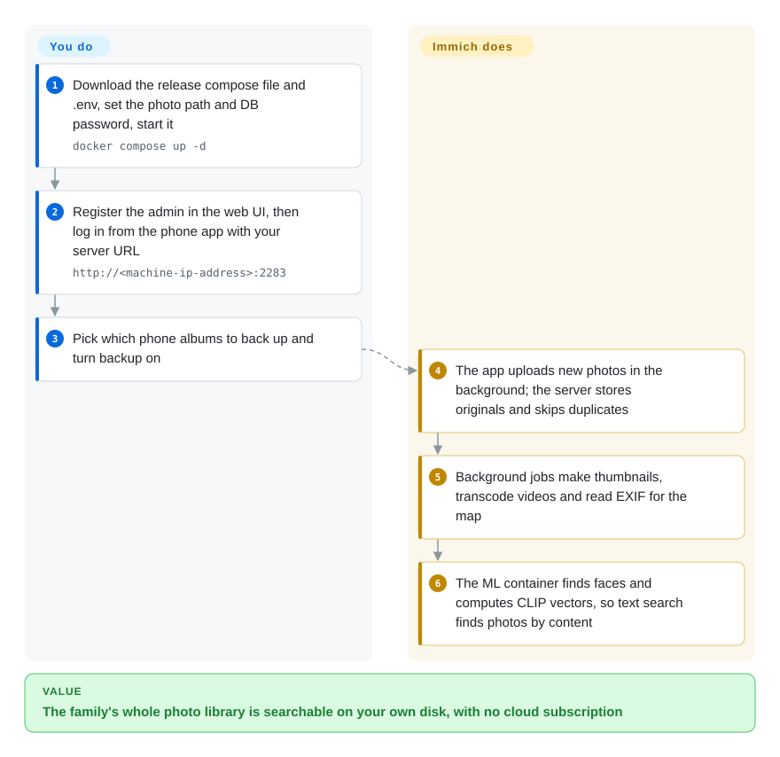

# Immich

Your phone says "iCloud storage full", the family's photos are split across three phones and two cloud accounts, and searching for "the dog at the beach" only works inside one vendor's app. Immich is a self-hosted server plus phone app that backs every photo up to your own disk and gives you the timeline, faces and "search by what's in the picture" you were paying a cloud for.

## When to use

You run a home server or a NAS for a household of four, and the monthly cloud-photo bill keeps going up while the library sits at 400 GB. You want the Google Photos experience — phones back up in the background, one shared timeline, albums for the grandparents, typing "birthday cake" finds the right photo — without the library living on someone else's servers. Immich is the project that copies that experience most closely: a native iOS/Android app with background backup, a web UI with a scrubbable timeline, face clustering, a world map from EXIF, and search by objects and free-text descriptions (CLIP — a model that turns both images and sentences into comparable vectors), all running on your own box.

You pick it over PhotoPrism or LibrePhotos when the *phone backup + family sharing* loop is the main job and you want the most active project in the space: Immich ships a stable release every few weeks (v3.0.0 on 2026-07-02, v3.3.0 on 2026-10-07) with a paid full-time team behind it. You pick it over Nextcloud when you want a dedicated photo app rather than a general file server with a gallery bolted on.

## How it works

Immich is four containers started from one `docker compose` file: the server (API, web UI and background job workers), a separate machine-learning container, PostgreSQL (the database that holds every photo's path, metadata and search vectors) and Valkey (a Redis-compatible in-memory store used as the job queue). **You** provide a server with enough disk, pick where originals live (`UPLOAD_LOCATION`), create the admin user, and install the phone app pointed at your server. **Immich** does the rest on its own: the app uploads new photos in the background, the server stores the originals untouched, then queues jobs that make thumbnails, transcode videos, read EXIF for the map, and ask the ML container to detect faces and compute CLIP vectors. Search is then a database query — the database knows which file is where, which is also why the database (auto-dumped daily to `UPLOAD_LOCATION/backups`) matters as much as the photo folder.

<!-- flow-steps:begin (generated from flows/immich.json by tools/flow_card.py — do not edit) -->

Text version of the flow

1. **You**: Download the release compose file and .env, set the photo path and DB password, start it — `docker compose up -d`
2. **You**: Register the admin in the web UI, then log in from the phone app with your server URL — `http://<machine-ip-address>:2283`
3. **You**: Pick which phone albums to back up and turn backup on
4. **Immich**: The app uploads new photos in the background; the server stores originals and skips duplicates
5. **Immich**: Background jobs make thumbnails, transcode videos and read EXIF for the map
6. **Immich**: The ML container finds faces and computes CLIP vectors, so text search finds photos by content

**Value**: The family's whole photo library is searchable on your own disk, with no cloud subscription

<!-- flow-steps:end -->

## When NOT to use

- **If the library is small and you don't already run a server, stay with iCloud / Google Photos or a plain NAS folder instead of Immich, because** the documented floor is 6 GB RAM (4 GB only with ML disabled) and a Docker host you have to update — real overhead for a few thousand photos.
- **If nobody in the house will maintain a server, use a hosted service (Google Photos, iCloud, or Ente's hosted plan) instead of Immich, because** you own upgrades (v3.0.0 had a breaking-change migration guide), disk growth, and the 3-2-1 backups the README itself warns about; Immich is a live library, not a backup.
- **If you will host on a machine you don't trust (a cheap VPS) and need end-to-end encryption, use Ente instead of Immich, because** Immich's server must read your photos to build thumbnails, faces and search vectors — they sit unencrypted on the server's disk.
- **If you plan to embed or resell Immich inside a closed product, check AGPL-3.0 and FUTO's commercial terms first, or pick a permissive-licensed alternative, because** the project relicensed MIT → AGPL-3.0 on 2024-02-12 and the FAQ sets trademark/reseller conditions for commercial use.
- **If your server CPU predates x86-64-v2 (roughly pre-2012) or you'd run it in an LXC container, use PhotoPrism or a VM instead, because** since v3 the ML image requires x86-64-v2 (the last v1-compatible release is the unsupported v2.7.5) and Docker-in-LXC is "not recommended" by the requirements page.
- **If you need RAW development (exposure, curves, lens profiles), use darktable instead of Immich, because** Immich displays RAW files and has non-destructive crop/rotate/adjust edits since v3, but it is a library and sharing app, not a darkroom.
- **If you need a public, multi-tenant photo service for thousands of unrelated users, build on object storage + a purpose-built service instead of Immich, because** Immich's model is a household or small group sharing one server, one database and one admin.

## Comparison

| Alternative | In index | Our verdict | Tradeoff |
| --- | --- | --- | --- |
| Google Photos | not a repo | Choose Google Photos when you want zero operations and the best hosted ML search; choose Immich when the library must stay on hardware you own. | Hosted SaaS, not a repository: nothing to run, but the data and storage pricing are the vendor's; Immich costs you a server and upkeep instead. |
| PhotoPrism | 未收录 | Choose PhotoPrism when the job is browsing and indexing an existing folder archive (including RAW-heavy ones) on modest hardware; choose Immich when phone backup and family sharing are the core loop. | PhotoPrism indexes folders you already have and works without a mobile backup app; Immich's native app, release pace and full-time team are stronger, but it expects to own the upload path. |
| Ente | 未收录 | Choose Ente when photos must be end-to-end encrypted, e.g. on a VPS or its hosted plan; choose Immich when server-side ML search and faces on your own LAN matter more. | Ente encrypts on the device, so the server never sees the photos; that limits server-side processing that Immich does freely on plaintext. |
| Nextcloud (Photos app) | 未收录 | Choose Nextcloud when you need a general file-sync/office server and photos are one feature among many; choose Immich for a dedicated photo library. | One platform for files, calendar and photos versus a single-purpose app with a much better photo timeline, mobile backup and ML search. |
| LibrePhotos | 未收录 | Choose LibrePhotos only for a small personal archive where a lighter, Python-based stack matters more than mobile polish; choose Immich for a household. | Smaller project and community with a thinner mobile story; Immich has far more contributors and a faster release cadence. |

## Tech stack

- **Server**: TypeScript on NestJS (v12 in `server/package.json`), Kysely as the SQL query builder, BullMQ job queues, `sharp` for image processing, FFmpeg for video transcoding (with optional hardware acceleration).
- **Web**: Svelte 5 / SvelteKit.
- **Mobile**: Flutter (iOS and Android).
- **Machine learning**: separate Python service (FastAPI + ONNX models from Hugging Face, `rapidocr` for OCR); optional CUDA / ROCm / OpenVINO / ARM NN / RKNN image variants.
- **Data**: PostgreSQL 14 image with the VectorChord vector-search extension (pgvecto.rs support dropped in v3.0.0); Valkey (Redis-compatible) for queues.
- **Deployment**: Docker Compose (recommended); docs also cover Kubernetes, Unraid, TrueNAS, Synology, QNAP and Portainer.

## Dependencies

- **Host**: 64-bit Linux strongly recommended (Windows/macOS via Docker Desktop are "strongly discouraged"); amd64 or arm64; ML on amd64 needs x86-64-v2 since v3.
- **Resources**: RAM minimum 6 GB / recommended 8 GB; CPU minimum 2 / recommended 4 cores (requirements page, 2026-10).
- **Storage**: originals plus ~10–20% extra for thumbnails and transcodes; the Postgres data directory must be on local disk (SSD ideally), never a network share, on a filesystem with Unix permissions (not NTFS/exFAT).
- **Bundled containers**: immich-server, immich-machine-learning, PostgreSQL (with VectorChord), Valkey — all in the release `docker-compose.yml`.
- **You add**: a reverse proxy with TLS if you expose it beyond the LAN, and an off-box backup of both `UPLOAD_LOCATION` and the database dumps.

## Ops difficulty

**Medium.** Install is three commands (download `docker-compose.yml` + `.env`, set paths and DB password, `docker compose up -d`), and the database dumps itself daily by default. The ongoing work is what makes it medium: follow release notes before bumping `IMMICH_VERSION` across majors (v3 required the VectorChord migration for old installs), keep the compose file in step with the release you run, watch disk growth, size CPU/GPU for the initial ML backlog on a large import, and keep a real off-site copy of originals plus dumps. Exposing it to the internet adds TLS, auth hardening and update discipline on your side.

## Health & viability

- **Maintenance (2026-10-08):** very active — commits in all of the last 13 weeks, and the project now ships release candidates before each stable; v3.0.0 (2026-07-02) through v3.3.0 (2026-10-07) landed within about three months.
- **Responsiveness:** first responses on new issues/PRs arrive within hours (scorer median 9.6 hours across 27 qualifying issues/PRs, 2026-10-08) — a team that triages daily.
- **Governance & backing:** organization-owned and funded by FUTO, which employs the core team full-time; revenue comes from optional product keys, and the FAQ refuses feature sponsorship so money does not steer the roadmap. Hundreds of contributors in the last year with the top three under a quarter of commits, so the bus factor is low risk — but the roadmap is FUTO's.
- **Age & Lindy:** created 2022-02, so ~4.7 years old and running at full speed — young for a Lindy prior, but its pace and funding make near-term abandonment unlikely. [推断]
- **Adoption:** ~115.8k GitHub stars (2026-10), millions of release-asset downloads, and 12,231 monthly npm downloads of the `@immich/cli` uploader; the de-facto default among self-hosted photo apps by visibility.
- **Risk flags:** the license grade is the weak axis — MIT → AGPL-3.0 relicense on 2024-02-12, plus FUTO's trademark/commercial-use terms. Fine for personal and household self-hosting; review it before embedding or reselling.

## Caveats (unverified)

- [未验证] Real-world RAM/CPU needs for libraries above ~100k assets beyond the documented 6 GB minimum / 8 GB recommended have not been checked.
- [推断] The age/Lindy judgment rests on four-plus years of history plus FUTO funding; a change in FUTO's commitment would change it, and that cannot be verified from the repo.
- [未验证] PhotoPrism's and LibrePhotos' relative strengths (folder indexing, RAW handling, resource use) come from their own positioning, not a side-by-side test.
- [未验证] Ente's end-to-end encryption model and its effect on server-side features were not re-read from Ente's repository for this refresh.
- [推断] The "household or small group" scope is a reading of Immich's single-instance, single-admin design; the docs do not state a user-count ceiling.
- [未验证] Star counts and release-download totals are date-sensitive (2026-10-08) and indicative only.
