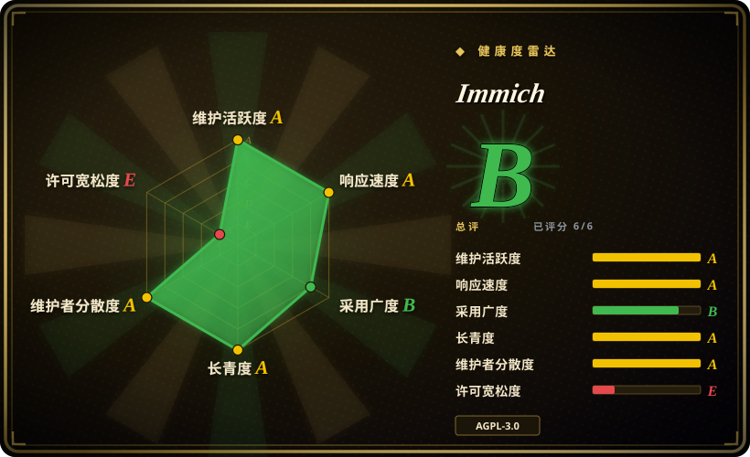
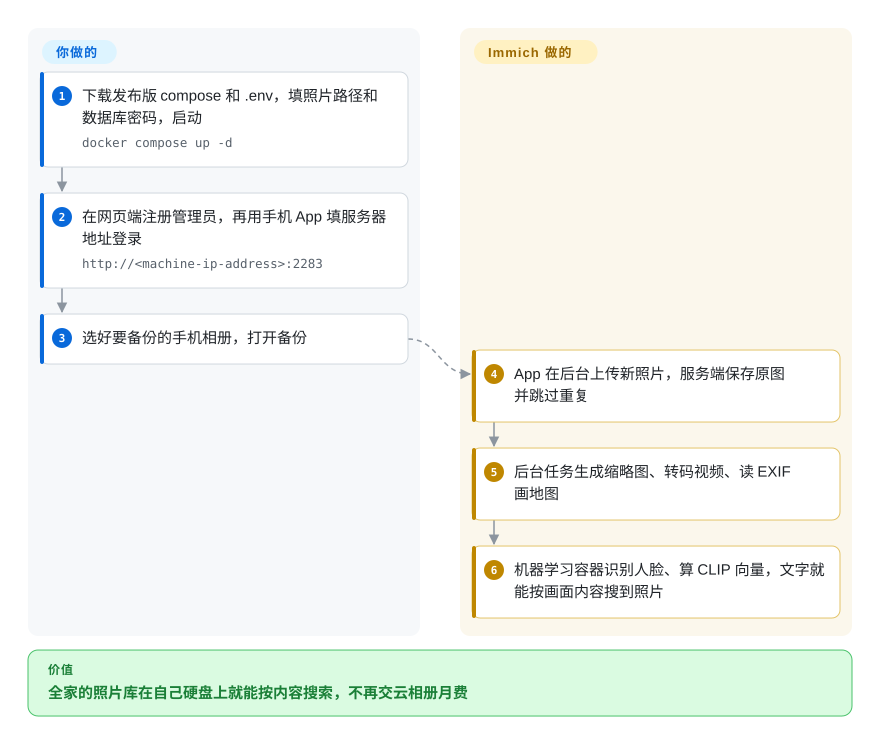

# Immich

手机天天提示“iCloud 储存空间已满”，一家人的照片散在三台手机和两个云账号里，想搜“海边那只狗”只能在某一家的 App 里搜。Immich 是一套自托管的服务端加手机 App：把每张照片备份到你自己的硬盘上，再把时间线、人脸和“按画面内容搜索”这些原本要付费给云厂商的功能搬回家。

## 何时使用

你给四口之家搭了一台家用服务器或 NAS，云相册的月费一涨再涨，相册已经 400 GB。你想要的是 Google Photos 那套体验——手机后台自动备份、一条全家共享的时间线、给爷爷奶奶建的共享相册、输入“生日蛋糕”就能找到那张照片——但不想让照片库放在别人的服务器上。Immich 是把这套体验复刻得最像的项目：原生 iOS/Android App 带后台备份，网页端有可拖动的时间线，有人脸聚类、按 EXIF 生成的世界地图，还能按物体和自由文本搜索（CLIP：一种把图片和句子都变成可比较向量的模型），全部跑在你自己的机器上。

当“手机备份 + 家人共享”是主线、而且你想选这个领域最活跃的项目时，选它而不是 PhotoPrism 或 LibrePhotos：Immich 每隔几周就发一个稳定版（v3.0.0 发布于 2026-07-02，v3.3.0 发布于 2026-10-07），背后是一支拿工资的全职团队。如果你要的是专用照片应用，而不是通用文件服务器外挂一个相册，选它而不是 Nextcloud。

## 怎么用起来

Immich 是用一个 `docker compose` 文件拉起的四个容器：服务端（API、网页界面和后台任务进程）、单独的机器学习容器、PostgreSQL（存每张照片路径、元数据和搜索向量的数据库），以及 Valkey（兼容 Redis 的内存存储，这里当任务队列用）。**你要做的**：准备一台磁盘够大的服务器，指定原图放在哪（`UPLOAD_LOCATION`），注册管理员，在手机上装 App 并填上服务器地址。**Immich 替你做的**：App 在后台上传新照片，服务端原样保存原图，然后排队跑任务——生成缩略图、转码视频、读 EXIF 画地图，再让机器学习容器识别人脸、计算 CLIP 向量。之后的搜索就是一次数据库查询。数据库记着哪个文件在哪，所以它（默认每天自动导出到 `UPLOAD_LOCATION/backups`）和照片目录一样要紧。

<!-- flow-steps:begin (generated from flows/immich.json by tools/flow_card.py — do not edit) -->

流程文字版

1. **你**：下载发布版 compose 和 .env，填照片路径和数据库密码，启动 — `docker compose up -d`
2. **你**：在网页端注册管理员，再用手机 App 填服务器地址登录 — `http://<machine-ip-address>:2283`
3. **你**：选好要备份的手机相册，打开备份
4. **Immich**：App 在后台上传新照片，服务端保存原图并跳过重复
5. **Immich**：后台任务生成缩略图、转码视频、读 EXIF 画地图
6. **Immich**：机器学习容器识别人脸、算 CLIP 向量，文字就能按画面内容搜到照片

**价值**：全家的照片库在自己硬盘上就能按内容搜索，不再交云相册月费

<!-- flow-steps:end -->

## 何时不用

- **如果照片不多、家里本来也没有服务器，继续用 iCloud / Google Photos 或一个普通 NAS 目录，而不是 Immich，因为**文档写明的下限是 6 GB 内存（只有关掉机器学习才能 4 GB 跑），还要一台你自己负责更新的 Docker 主机——为几千张照片付出这些不划算。
- **如果家里没人愿意维护服务器，用托管服务（Google Photos、iCloud 或 Ente 的托管版），而不是 Immich，因为**升级（v3.0.0 带一份破坏性变更迁移指南）、磁盘增长、README 自己反复强调的 3-2-1 备份都归你管；Immich 是在线照片库，不是备份。
- **如果要放在你不信任的机器上（比如便宜的 VPS）并且需要端到端加密，用 Ente，而不是 Immich，因为**Immich 的服务端必须读得到照片才能做缩略图、人脸和搜索向量——照片在服务器磁盘上是明文。
- **如果打算把 Immich 嵌进闭源产品或转售，先看 AGPL-3.0 和 FUTO 的商业条款，或者换宽松许可的替代品，因为**项目在 2024-02-12 从 MIT 改成了 AGPL-3.0，FAQ 还对商业使用规定了商标和转售条件。
- **如果服务器 CPU 不支持 x86-64-v2（大致是 2012 年以前的型号），或者你打算跑在 LXC 容器里，用 PhotoPrism 或换成虚拟机，因为**从 v3 起机器学习镜像要求 x86-64-v2（最后一个支持 v1 的是已停止支持的 v2.7.5），而需求页明确“不推荐”在 LXC 里跑 Docker。
- **如果你要的是 RAW 冲印（曝光、曲线、镜头校正），用 darktable，而不是 Immich，因为**Immich 能显示 RAW，v3 起也有非破坏性的裁剪、旋转和调色，但它是照片库和分享应用，不是暗房。
- **如果要做面向成千上万陌生用户的公共多租户照片服务，用对象存储加专门设计的服务，而不是 Immich，因为**Immich 的模型是一个家庭或小圈子共用一台服务器、一个数据库、一个管理员。

## 横向对比

| 替代品 | 是否收录 | 我们的评价 | 取舍 |
| --- | --- | --- | --- |
| Google Photos | 非仓库 | 想零运维、要最好的托管 ML 搜索，选 Google Photos；照片库必须留在自己硬件上，选 Immich。 | 托管 SaaS，不是仓库：什么都不用跑，但数据和存储定价都在厂商手里；Immich 则要你出一台服务器和日常维护。 |
| PhotoPrism | 未收录 | 主要任务是在一般硬件上浏览、索引已有的文件夹归档（包括 RAW 很多的），选 PhotoPrism；手机备份和家人共享是主线，选 Immich。 | PhotoPrism 直接索引你已有的目录，不依赖手机备份 App；Immich 的原生 App、发版节奏和全职团队更强，但它希望自己掌管上传路径。 |
| Ente | 未收录 | 照片必须端到端加密（比如放在 VPS 或用它的托管版），选 Ente；更看重在自家局域网里做服务端 ML 搜索和人脸，选 Immich。 | Ente 在设备端加密，服务端看不到照片；这限制了 Immich 在明文上随意做的那些服务端处理。 |
| Nextcloud（Photos 应用） | 未收录 | 需要通用的文件同步/办公服务器、照片只是其中一项功能，选 Nextcloud；要专用照片库，选 Immich。 | 一个平台管文件、日历和照片，对比一个单一用途但时间线、手机备份和 ML 搜索都好得多的应用。 |
| LibrePhotos | 未收录 | 只有一个人的小归档、比起手机端体验更在意更轻的 Python 技术栈时，才选 LibrePhotos；一家人用，选 Immich。 | 项目和社区更小，手机端更弱；Immich 贡献者多得多，发版也快得多。 |

## 技术栈

- **服务端**：TypeScript + NestJS（`server/package.json` 里是 v12），Kysely 作 SQL 查询构建器，BullMQ 任务队列，`sharp` 处理图片，FFmpeg 转码视频（可选硬件加速）。
- **网页端**：Svelte 5 / SvelteKit。
- **移动端**：Flutter（iOS 与 Android）。
- **机器学习**：独立的 Python 服务（FastAPI + 从 Hugging Face 拉取的 ONNX 模型，OCR 用 `rapidocr`）；另有 CUDA / ROCm / OpenVINO / ARM NN / RKNN 加速镜像可选。
- **数据**：带 VectorChord 向量检索扩展的 PostgreSQL 14 镜像（v3.0.0 已移除 pgvecto.rs 支持）；Valkey（兼容 Redis）做队列。
- **部署**：推荐 Docker Compose；文档另有 Kubernetes、Unraid、TrueNAS、Synology、QNAP、Portainer 的安装说明。

## 依赖

- **主机**：强烈建议 64 位 Linux（Windows/macOS 走 Docker Desktop 被标为“强烈不建议”）；支持 amd64 和 arm64；v3 起 amd64 上的机器学习容器需要 x86-64-v2。
- **资源**：内存最低 6 GB、建议 8 GB；CPU 最低 2 核、建议 4 核（需求页，2026-10）。
- **存储**：原图再加约 10–20% 的缩略图和转码文件；Postgres 数据目录必须在本地盘（最好是 SSD），不能放网络共享，文件系统要支持 Unix 权限（不能是 NTFS/exFAT）。
- **自带容器**：immich-server、immich-machine-learning、PostgreSQL（带 VectorChord）、Valkey——都在发布版的 `docker-compose.yml` 里。
- **你要自己补**：如果要暴露到局域网之外，一个带 TLS 的反向代理；以及 `UPLOAD_LOCATION` 和数据库导出文件的异地备份。

## 运维难度

**中等。**安装就三步（下载 `docker-compose.yml` 和 `.env`，填路径和数据库密码，`docker compose up -d`），数据库默认每天自动导出。让它算“中等”的是后续：跨大版本改 `IMMICH_VERSION` 前要先读发布说明（v3 要求老安装先迁到 VectorChord），compose 文件要和你跑的版本保持一致，要盯磁盘增长，大批量导入时要给首轮机器学习任务配够 CPU/GPU，还要真的做一份原图加数据库导出的异地备份。暴露到公网还要你自己负责 TLS、认证加固和及时更新。

## 健康度与可持续性

- **维护（2026-10-08）**：非常活跃——最近 13 周每周都有提交，现在每个稳定版之前还先发候选版；v3.0.0（2026-07-02）到 v3.3.0（2026-10-07）只用了大约三个月。
- **响应速度**：新 issue/PR 几小时内就有首次回复（2026-10-08 评分：27 个合格 issue/PR 的中位数 9.6 小时）——团队每天都在分拣。
- **治理与背书**：组织账号持有，由 FUTO 出资，核心团队是全职雇员；收入来自可选的产品密钥，FAQ 明确拒绝按功能赞助，避免钱左右路线图。过去一年有数百位贡献者，前三名提交占比不到四分之一，单点风险低——但路线图归 FUTO。
- **年龄与 Lindy**：2022-02 创建，约 4.7 年，仍在全速开发——按 Lindy 先验还算年轻，但节奏和资金让近期弃坑的可能性很低。[推断]
- **采用度**：GitHub 约 11.58 万星（2026-10），发布附件累计下载数百万次，命令行上传工具 `@immich/cli` 在 npm 上月下载 12,231 次；按可见度是自托管相册里事实上的默认选择。
- **风险信号**：许可是最弱的一轴——2024-02-12 从 MIT 改为 AGPL-3.0，另有 FUTO 的商标和商业使用条款。个人和家庭自托管没问题；嵌入或转售前要先审。

## 存疑（未验证）

- [未验证] 超过约 10 万个资源的照片库在文档写的 6 GB 最低 / 8 GB 建议之外实际要多少内存和 CPU，没有核实。
- [推断] 年龄与 Lindy 的判断依据是四年多的历史加上 FUTO 的资金；FUTO 的投入一旦变化，结论也会变，而这一点从仓库里查不到。
- [未验证] PhotoPrism 和 LibrePhotos 的相对长处（目录索引、RAW 处理、资源占用）来自它们自己的定位，没有做并排测试。
- [未验证] 本次刷新没有回到 Ente 的仓库重读它的端到端加密模型及其对服务端功能的影响。
- [推断] “一个家庭或小圈子”的适用范围是从 Immich 单实例、单管理员的设计推出来的；文档没有写用户数上限。
- [未验证] 星数和发布附件下载量随日期变化（2026-10-08），仅作参考。
