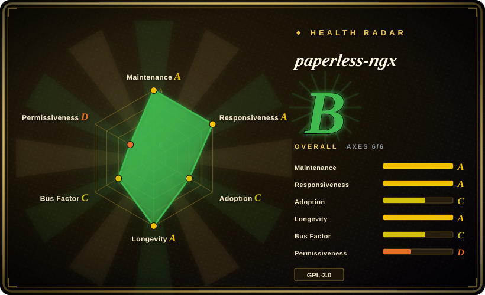
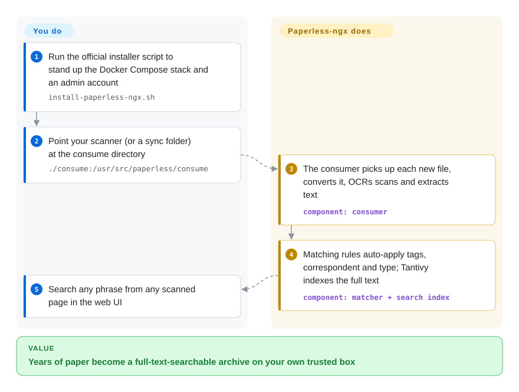

# paperless-ngx

A self-hosted document management system (DMS) that OCRs, tags, indexes, and full-text-searches scanned paperwork — bills, invoices, letters — built on Django + Angular with PostgreSQL/Redis.

## When to use

You're the one unofficial "IT person" for a two-person accounting practice run out of a spare room, and the filing cabinet has finally won: years of invoices, utility bills, client letters, and receipts in paper folders, and every time a client asks "did you ever get my March statement?" you're flipping through binders for twenty minutes. You already have a little Linux box / NAS humming in the corner on the office network, and you want every scan to land in one place you can actually search.

So you stand up paperless-ngx with its Docker-first compose stack and point your scanner at the consume folder. Now you drop a batch of scans in, paperless OCRs them, and its matching rules auto-apply tags, the correspondent, and a document type — so that March statement is one full-text search away in the web UI instead of a cabinet dive. Because the box lives on your trusted internal office network and the corpus is personal-to-small-team scale, this is squarely the "scan, archive, and forget" job paperless is built for — you're not editing these documents or routing them for approval, just making a pile of finished paperwork findable.

## How it works

paperless-ngx is a Django backend with an Angular frontend, deployed as a docker-compose stack: the web server, a consumer/worker, a Redis/Valkey broker, and a database (PostgreSQL recommended). Its spine is the **consume folder**: point your scanner's export share (or any synced directory) at it, and the consumer watches for new files, converts each to PDF, runs OCR (ocrmypdf + Tesseract) on image-only scans, and extracts text from digital ones. Matching rules then auto-assign tags, the correspondent (who the doc is from), and the document type — and since v3.0 (2026-07) the extracted full text is indexed by **Tantivy**, a Rust search engine, replacing v2's Whoosh. What the project does for you: ingest, OCR, classify, index, and serve the web UI plus a REST API. What stays yours: hosting the stack on a machine you trust (the README is explicit that documents sit in cleartext), backing up the database and the media/consume directories, and reading release notes before major upgrades — v3.0 removed API v1, dropped Python 3.10, and removed the old document-encryption feature.

<!-- flow-steps:begin (generated from flows/paperless-ngx.json by tools/flow_card.py — do not edit) -->

Text version of the flow

1. **You**: Run the official installer script to stand up the Docker Compose stack and an admin account — `install-paperless-ngx.sh`
2. **You**: Point your scanner (or a sync folder) at the consume directory — `./consume:/usr/src/paperless/consume`
3. **paperless-ngx**: The consumer picks up each new file, converts it, OCRs scans and extracts text — component: `consumer`
4. **paperless-ngx**: Matching rules auto-apply tags, correspondent and type; Tantivy indexes the full text — component: `matcher + search index`
5. **You**: Search any phrase from any scanned page in the web UI

**Value**: Years of paper become a full-text-searchable archive on your own trusted box

<!-- flow-steps:end -->

## When NOT to use

- **Not a security / compliance store** — documents are stored in cleartext on disk and full text is stored plain in the database; filenames are not encrypted. Built-in document/thumbnail encryption was **removed in v3.0.0** (release notes, 2026-07), and `[未验证]` maintainers have reportedly indicated no plan to add encryption at rest. Disk-level encryption is on you.
- **Not on an untrusted/shared host** — the project explicitly warns against this.
- **Not for strict multi-tenant / per-document privacy** — the permission/ownership model has known gaps (e.g. documents ingested via the consume folder may get no owner and become visible to all users). It is not a hardened multi-user system.
- **Not an enterprise EDMS** — no built-in multi-step approval workflows, lifecycle/retention management, or e-signatures (use Mayan EDMS for that).
- **Not for collaborative authoring/editing** — it's an archive of *finished* documents, not a Google-Docs replacement.
- **Poor fit for large-scale OCR on weak hardware** — OCR and auto-matching are CPU/RAM-intensive; the docs themselves suggest cutting workers, processing only the first page, and disabling NLTK on constrained devices (Raspberry Pi etc.).
- **Windows is not supported** (Linux host required).
- **Upgrade lock-in / maintenance risk** — community-supported with no commercial backer; the v3.0 line (2026-07) shipped its breaking changes for real (API v1 removed, migrations recreated, pre/post-consume script arguments changed), and minor versions have kept a fast cadence since (v3.1 2026-08, v3.2 2026-09). Pin versions and read release notes before upgrading.

## Comparison

| Alternative | In index | Our verdict | Tradeoff |
|---|---|---|---|
| Mayan EDMS | 未收录 | Choose Mayan EDMS when workflow, versioning, and granular enterprise permissions are mandatory; choose paperless-ngx for a personal or small-team scan archive where OCR/search automation matters and ops must stay moderate. | Also Python/Django, but a heavier enterprise EDMS with a real workflow engine, versioning and granular permissions; far steeper to operate and overkill for a personal scan archive. Apache-2.0 (more permissive than paperless's GPLv3). |
| Docspell | 未收录 | Choose Docspell for an email-first inbox and metadata-extraction workflow; keep paperless-ngx when a Docker-first scanned-paper archive and the larger self-hosted DMS community matter more. | Inbox/metadata-extraction model with strong email ingestion; Scala/JVM stack means heavier memory footprint and a smaller community than paperless-ngx. |
| Teedy / sismics docs | 未收录 | Choose Teedy when a Java stack, document versioning, and modest resource needs take priority; keep paperless-ngx when OCR and auto-tagging automation are the deciding features. | Lightweight Java DMS with versioning, clean UI and modest resource needs; weaker automated OCR/auto-tagging and smaller momentum. |
| OpenDocMan | 未收录 | Choose OpenDocMan only for basic PHP/MySQL business file control on an existing PHP stack; keep paperless-ngx when the core job is searchable OCR archival. | PHP/MySQL DMS for business file control + access rules; dated UI, no first-class OCR/auto-tagging — only if you need simple web access control on an existing PHP stack. |
| Self-built (Tesseract + Meilisearch/Elasticsearch + object storage) | 未收录 | Build your own only when encryption, schema, or security constraints make paperless-ngx unacceptable; otherwise paperless-ngx buys you a maintained ingest/OCR/index/UI pipeline. | Maximum flexibility and full control over encryption/schema, but you build and maintain the whole ingest/OCR/index/UI pipeline — worth it only when paperless's data model or security constraints are dealbreakers. |

## Tech stack

- Python, Django (backend); Angular 22, TypeScript (frontend — moved to Angular v22 "zoneless" in v3.0)
- PostgreSQL (recommended); SQLite or MariaDB supported — the postgres compose files ship `postgres:18`
- Redis / Valkey (message broker; the default compose runs `valkey/valkey:9-alpine`)
- Tesseract OCR + ocrmypdf (ocrmypdf 17.x on the current release), ImageMagick ≥ 6
- Apache Tika + Gotenberg (optional — Office/EML/HTML ingestion; the `-tika` compose files run both: gotenberg 8.x + tika 3.x, verified 2026-09)
- Search: **Tantivy** since v3.0 (replaced v2's Whoosh; automatic segment merging, no manual optimize)
- Docker / docker-compose (official `install-paperless-ngx.sh` bootstraps the stack)

## Dependencies

- **PostgreSQL** (recommended; SQLite or MariaDB also supported)
- **Redis or Valkey** (mandatory message broker)
- **Tesseract OCR** 4.0.0+ with language packs
- **ImageMagick** 6+
- **Apache Tika + Gotenberg** — only if ingesting Office/non-PDF formats
- **Docker + docker-compose** (recommended deployment)
- **Linux host** (Windows not supported — verbatim in the docs); bare-metal installs require Python 3.11, 3.12, 3.13 or 3.14 (docs/setup.md, verified 2026-09; the v2 line is superseded)

## Ops difficulty

**Medium.** Multi-container docker-compose stack (web + worker + Redis/Valkey + DB, plus Tika/Gotenberg for Office docs). Day-to-day operation is low-touch once configured, but: OCR is CPU/RAM-heavy and slow on low-power hardware; you own backups of both the DB and the document/media volumes; and the v2→v3 upgrade (2026-07) went through real breaking changes — API v1 removed, Python 3.10 dropped, migrations recreated, consume-script arguments changed — so upgrades require reading release notes and the migration guide. Must not be exposed on an untrusted host.

## Health & viability

- **Responsiveness**: Grade A — median first-response time 0.4 hours across 37 qualifying issues/PRs.
- **Maintenance (2026-09).** Last pushed 2026-09-28; v3.0 went GA 2026-07-22 and the line has moved fast since (v3.1 2026-08-27, v3.2 2026-09-19, v3.2.1 2026-09-20) — **actively** developed, not archived. The very low open-issue count (~19, 2026-09-28) suggests aggressive triage, not stagnation. [推断]
- **Governance / bus factor.** Community-maintained under the `paperless-ngx` org — itself the community continuation after the original `paperless`/`paperless-ng` lineage stalled, which is reassuring (the project has *already* survived one maintainer handoff) but it has **no commercial backer** (DigitalOcean sponsors the demo, not the roadmap); longevity rests on volunteer continuity. [推断]
- **Age & Lindy verdict.** ~4.5 years as `paperless-ngx` (created 2022-02), with deeper roots via its predecessors ⇒ a **moderate Lindy** signal — proven in the homelab/DMS niche, though younger than the underlying paperless idea. [推断]
- **Adoption & ecosystem.** Strong (~46k stars, gh api 2026-09-28; the default self-hosted DMS recommendation, packaged for Docker-first deployment) — a healthy, widely-deployed project.
- **Risk flags.** GPL-3.0 (no relicense found). The real flags are **upgrade lock-in / breaking changes** (v3.0 removed API v1, recreated migrations, changed consume scripts — and removed at-rest document encryption) and the security posture (cleartext on disk, permission-model gaps) — pin versions and read release notes before upgrading. [推断]

## Caveats (unverified)

- [未验证] "Maintainers have no plan to add encryption at rest" is a reported stance from the older review; not re-checked against a current issue thread this pass (the v3.0.0 *removal* itself is confirmed in the release notes, 2026-09-28).
- [未验证] The permission-model gap ("documents ingested via the consume folder may get no owner and become visible to all users") predates this pass; re-verify against current docs/issues before relying on it for a multi-user deployment.
- [未验证] Resource needs — "CPU/RAM heavy" is a qualitative judgment from the docs' resource-saving guidance; no official min RAM/CPU spec is published.
- [推断] Describing Tantivy as "a Rust search engine" and the ~19-issue count as aggressive triage are general-knowledge/inference, not measurements from this session.
