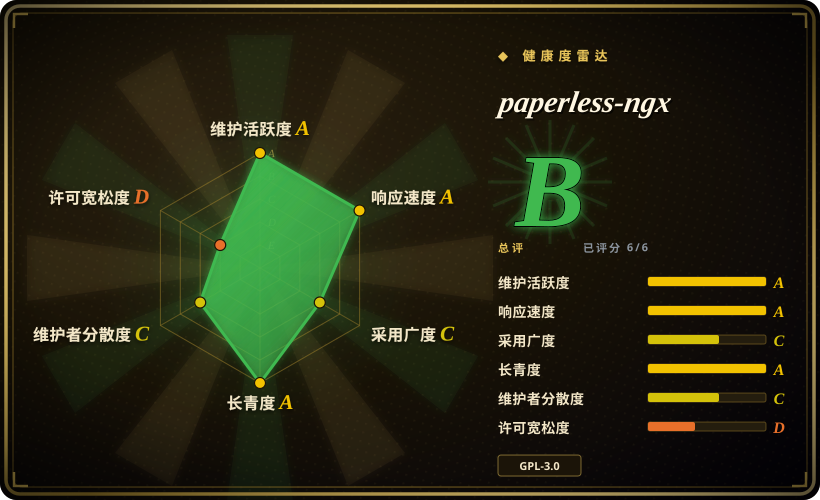
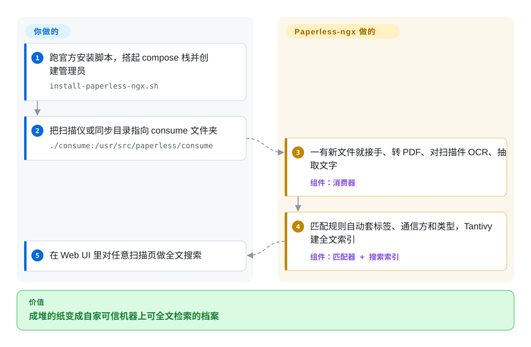

# paperless-ngx

一套自托管文档管理系统（DMS），基于 Django + Angular，配合 PostgreSQL/Redis，把账单、发票、信件等纸质/扫描件自动 OCR、打标签、建索引并提供全文检索。

## 何时使用

你是一家两人会计事务所里那个“顺带管 IT”的人，事务所开在一间空出来的房间里，而文件柜终于把你逼到了墙角：好几年的发票、水电账单、客户信件和收据都塞在纸质文件夹里，每次客户问“我三月那份对账单你到底收到没有？”，你都得翻二十分钟活页夹。办公室网络的角落里本来就摆着一台小 Linux 机器 / NAS 在嗡嗡运转，你只想让每一张扫描件都落到一个真正能搜得到的地方。

于是你用它 Docker 优先的 compose 栈把 paperless-ngx 跑起来，把扫描仪对准 consume 文件夹。现在你把一批扫描件丢进去，paperless 就对它们做 OCR，并按匹配规则自动套上标签、通信方（correspondent）和文档类型——于是那份三月对账单不再需要翻柜子，在 Web UI 里做一次全文检索就能找到。因为这台机器就待在你受信任的内部办公网络上，文档规模也处于个人到小团队级别，这正是 paperless 为之而生的“扫描、归档、然后忘掉”那类活——你并不会去编辑这些文档、也不会把它们送去走审批，只是想让这一堆已完成的纸质文件变得能被找到。

## 怎么用起来

paperless-ngx 是 Django 后端加 Angular 前端，以 docker-compose 栈部署：web 服务、消费/工作进程、Redis/Valkey 消息代理和一个数据库（推荐 PostgreSQL）。它的主干是 **consume 目录**：把扫描仪的导出共享（或任何同步目录）指到它上面，消费器就会盯着新文件——每来一个就转成 PDF、对纯图片扫描件跑 OCR（ocrmypdf + Tesseract）、对数字文档直接抽取文字。随后匹配规则自动套上标签、通信方（correspondent，文档来自谁）和文档类型；自 v3.0（2026-07）起，抽出的全文由 **Tantivy**（一个 Rust 写的搜索引擎）建索引，取代了 v2 的 Whoosh。它替你做的：接收、OCR、分类、索引，并给出 Web UI 和 REST API。仍归你的：把这套栈跑在你信任的机器上（README 明说文档以明文存放）、备份数据库和 media/consume 目录、大版本升级前读 release notes——v3.0 移除了 API v1、放弃 Python 3.10，也移除了旧的文档加密功能。

<!-- flow-steps:begin (generated from flows/paperless-ngx.json by tools/flow_card.py — do not edit) -->

流程文字版

1. **你**：跑官方安装脚本，搭起 compose 栈并创建管理员 — `install-paperless-ngx.sh`
2. **你**：把扫描仪或同步目录指向 consume 文件夹 — `./consume:/usr/src/paperless/consume`
3. **paperless-ngx**：一有新文件就接手、转 PDF、对扫描件 OCR、抽取文字 — 组件：`消费器`
4. **paperless-ngx**：匹配规则自动套标签、通信方和类型，Tantivy 建全文索引 — 组件：`匹配器 + 搜索索引`
5. **你**：在 Web UI 里对任意扫描页做全文搜索

**价值**：成堆的纸变成自家可信机器上可全文检索的档案

<!-- flow-steps:end -->

## 何时不用

- **不是安全/合规存储库**——文档以明文形式存储在磁盘上，全文以明文存入数据库，文件名也不加密。内置的文档/缩略图加密已在 **v3.0.0 移除**（release notes，2026-07），并且 `[未验证]` 据称维护者表示没有添加静态加密的计划。磁盘级加密得你自己来。
- **不要跑在不可信/共享主机上**——项目明确警告反对这样做。
- **不适合严格的多租户 / 逐文档隐私**——权限/归属模型存在已知缺口（例如经 consume 文件夹导入的文档可能没有 owner，从而对所有用户可见）。它不是一套加固过的多用户系统。
- **不是企业级 EDMS**——没有内置的多步审批工作流、生命周期/留存管理或电子签名（这些请用 Mayan EDMS）。
- **不适合协作撰写/编辑**——它是*已完成*文档的档案库，而非 Google Docs 的替代品。
- **弱硬件上做大批量 OCR 体验差**——OCR 和自动匹配都吃 CPU/RAM；文档自身就建议在受限设备（树莓派等）上削减 worker 数、只处理首页、禁用 NLTK。
- **不支持 Windows**（需要 Linux 主机）。
- **升级锁定 / 维护风险**——社区维护，无商业方背书；v3.0 线（2026-07）已把这些破坏性变更真正落地（移除 API v1、重建 migrations、改动 pre/post-consume 脚本参数），其后小版本节奏仍很快（v3.1 2026-08、v3.2 2026-09）。升级前请锁定版本并阅读 release notes。

## 横向对比

| 替代品 | 是否收录 | 我们的评价 | 取舍 |
|---|---|---|---|
| Mayan EDMS | 未收录 | 当工作流、版本管理和企业级细粒度权限是硬需求时，选 Mayan EDMS；当个人或小团队扫描归档更看重 OCR/检索自动化且运维必须保持中等复杂度时，选 paperless-ngx。 | 同样是 Python/Django，但属于更重的企业级 EDMS，带有真正的工作流引擎、版本管理和细粒度权限；运维陡峭得多，对个人扫描档案库而言是杀鸡用牛刀。Apache-2.0（比 paperless 的 GPLv3 更宽松）。 |
| Docspell | 未收录 | 当你要的是邮件优先的收件箱和元数据抽取工作流时，选 Docspell；当 Docker 优先的扫描件归档和更大的自托管 DMS 社区更重要时，保留 paperless-ngx。 | 收件箱/元数据抽取模型，邮件导入能力强；Scala/JVM 技术栈意味着更重的内存占用，社区也比 paperless-ngx 小。 |
| Teedy / sismics docs | 未收录 | 当 Java 技术栈、文档版本管理和适中的资源需求优先时，选 Teedy；当 OCR 和自动打标签才是决定性功能时，保留 paperless-ngx。 | 轻量级 Java DMS，带版本管理、界面干净、资源需求适中；自动 OCR/自动打标签较弱，势头也较小。 |
| OpenDocMan | 未收录 | 只有当你要在既有 PHP 栈上做基础企业文件管控时，才选 OpenDocMan；当核心任务是可检索的 OCR 归档时，保留 paperless-ngx。 | 面向企业文件管控和访问规则的 PHP/MySQL DMS；界面陈旧，没有一流的 OCR/自动打标签——仅当你需要在既有 PHP 栈上做简单 Web 访问控制时才考虑。 |
| 自建（Tesseract + Meilisearch/Elasticsearch + 对象存储） | 未收录 | 只有当加密、schema 或安全约束让 paperless-ngx 不可接受时，才自建；否则 paperless-ngx 已经提供维护中的 ingest/OCR/index/UI 流水线。 | 灵活性最高，对加密/schema 完全掌控，但你得自行搭建并维护整条 ingest/OCR/index/UI 流水线——只有当 paperless 的数据模型或安全约束成为硬伤时才值得。 |

## 技术栈

- Python、Django（后端）；Angular 22、TypeScript（前端——v3.0 升到 Angular v22「zoneless」）
- PostgreSQL（推荐）；支持 SQLite 或 MariaDB——postgres 版 compose 已改用 `postgres:18`
- Redis / Valkey（消息代理；默认 compose 跑 `valkey/valkey:9-alpine`）
- Tesseract OCR + ocrmypdf（当前版本线用 ocrmypdf 17.x）、ImageMagick ≥ 6
- Apache Tika + Gotenberg（可选——导入 Office/EML/HTML；`-tika` 的 compose 文件两个都起：gotenberg 8.x + tika 3.x，2026-09 已核实）
- 搜索引擎：**Tantivy**（v3.0 起，取代 v2 的 Whoosh；段合并自动，无需手动 optimize）
- Docker / docker-compose（官方 `install-paperless-ngx.sh` 一键搭栈）

## 依赖

- **PostgreSQL**（推荐；也支持 SQLite 或 MariaDB）
- **Redis 或 Valkey**（必需的消息代理）
- **Tesseract OCR** 4.0.0+ 及语言包
- **ImageMagick** 6+
- **Apache Tika + Gotenberg**——仅在需要导入 Office/非 PDF 格式时
- **Docker + docker-compose**（推荐的部署方式）
- **Linux 主机**（不支持 Windows——文档原话）；裸机安装要求 Python 3.11、3.12、3.13 或 3.14（docs/setup.md，2026-09 已核实；v2 线已被取代）

## 运维难度

**中等。** 多容器 docker-compose 栈（web + worker + Redis/Valkey + DB，处理 Office 文档还需加 Tika/Gotenberg）。配置完成后日常运维很轻，但是：OCR 吃 CPU/RAM，在低功耗硬件上很慢；数据库和文档/媒体卷的备份都得你自己负责；v2→v3 升级（2026-07）经历了实打实的破坏性变更——移除 API v1、放弃 Python 3.10、重建 migrations、改动 consume 脚本参数——升级需要读 release notes 和迁移指南。绝不能暴露在不可信主机上。

## 健康度与可持续性

- **响应速度**：Grade A——中位首次响应时间 0.4 小时，基于 37 个 qualifying issues/PRs。
- **维护（2026-09）。** 最后 push 于 2026-09-28；v3.0 于 2026-07-22 转正，之后节奏很快（v3.1 2026-08-27、v3.2 2026-09-19、v3.2.1 2026-09-20）——处于**活跃**开发，未归档。open issue 极少（约 19，2026-09-28）显示积极的 triage，而非停滞。[推断]
- **治理 / bus factor。** 由 `paperless-ngx` 组织社区维护——它本身就是原 `paperless`/`paperless-ng` 谱系停滞后的社区延续，这点让人安心（项目**已经**挺过一次维护者交接），但它**没有商业方背书**（DigitalOcean 赞助的是演示站，不是路线图）；存续依赖志愿者的延续性。[推断]
- **年龄与 Lindy 判断。** 作为 `paperless-ngx` 约 4 年半（2022-02 创建），经由前身有更深的根基 ⇒ **中等 Lindy** 信号——在 homelab/DMS 细分领域已被验证，但比底层的 paperless 理念年轻。[推断]
- **采用度与生态。** 很强（约 46k star，gh api 2026-09-28；是自托管 DMS 的默认推荐，按 Docker 优先方式打包）——一个健康、被广泛部署的项目。
- **风险标记。** GPL-3.0（未发现 relicense）。真正的标记是**升级锁定 / 破坏性变更**（v3.0 移除 API v1、重建 migrations、改动 consume 脚本，还移除了文档静态加密）以及安全姿态（磁盘明文、权限模型缺口）——升级前锁版本并阅读 release notes。[推断]

## 存疑（未验证）

- [未验证] 「维护者没有添加静态加密的计划」是早前评审转述的立场，本轮未对照最新 issue 线程复核（v3.0.0 **移除**加密这一事实已在 release notes 确认，2026-09-28）。
- [未验证] 权限模型缺口（「经 consume 文件夹导入的文档可能没有 owner、对所有用户可见」）早于本轮评审；多用户部署前请对照当前文档/issue 重新核实。
- [未验证] 资源需求——「吃 CPU/RAM」是根据文档中省资源指引得出的定性判断；官方未发布最低 RAM/CPU 规格。
- [推断] 把 Tantivy 描述为「Rust 写的搜索引擎」、以及把约 19 个 open issue 解读为「积极 triage」，属于通用认知/推断，不是本轮的测量结果。
