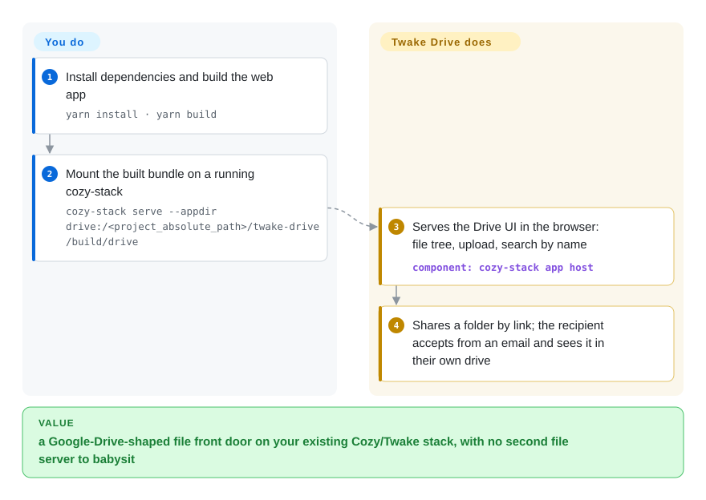

# Twake Drive

Your team's files live on individual laptops and in chat attachments, and there is no single place to drop a folder and hand someone a link. Twake Drive is that place — a Google-Drive-shaped file app (file tree, upload, share-by-URL, search, in-browser preview) that you serve from your own Cozy/Twake stack, not from Google. It is a personal/team file drive, NOT an OCR document archiver.

## When to use

You're running Twake Workplace (or a Cozy server) for a small team and you want the file-storage piece of that suite — somewhere people drop documents, photos, ID scans, payslips and tax notices, browse them in a familiar file-tree UI, and share a folder with a colleague by link. You don't want yet another standalone server to babysit; you want the drive that plugs into the auth, sharing and connector model you already run. So you serve the Twake Drive web app from your cozy-stack, and your users get a clean React UI with upload, search-by-name, in-browser PDF/image preview, and "share this link" — plus the Cozy connectors that auto-pull bills and statements from utility/telecom providers into the drive. It's the "Google-Drive-shaped" front door to your self-hosted stack, not a records-management system.

This is the right pick when your real goal is *file storage and link-sharing inside the Twake/Cozy ecosystem*, and your "documents" are things people keep and occasionally retrieve by name or folder — not a corpus you need to OCR, auto-tag and full-text search the way a paperwork archive demands.

## How it works

Twake Drive is the front end, not the whole stack — it ships a React app, not storage. The backend is **cozy-stack** (a separate Go server) which owns the files, the accounts, auth, and the sharing/data model; the app talks to it through the `cozy-client` library. You build the bundle (`yarn build`) and tell cozy-stack where to find it (`cozy-stack serve --appdir drive:…/build/drive`); cozy-stack installs it as an app and serves it to your users' browsers. What it does for you: the file-tree UI, drag-and-drop upload, search by name, in-browser PDF/image preview, share-by-link (for a link to another Cozy instance, the recipient gets an "accept the sharing" email and the folder then appears in their own drive), and the connector panel (`cozy-harvest-lib`) that auto-pulls bills from utility/telecom providers. What stays yours: standing up and upgrading cozy-stack, its datastore, and mail delivery for share invites — production deployment topology is not defined in this repo, which ships only dev tooling and an E2E compose file.

<!-- flow-steps:begin (generated from flows/twake-drive.json by tools/flow_card.py — do not edit) -->

Text version of the flow

1. **You**: Install dependencies and build the web app — `yarn install · yarn build`
2. **You**: Mount the built bundle on a running cozy-stack — `cozy-stack serve --appdir drive:/<project_absolute_path>/twake-drive/build/drive`
3. **Twake Drive**: Serves the Drive UI in the browser: file tree, upload, search by name — component: `cozy-stack app host`
4. **Twake Drive**: Shares a folder by link; the recipient accepts from an email and sees it in their own drive

**Value**: a Google-Drive-shaped file front door on your existing Cozy/Twake stack, with no second file server to babysit

<!-- flow-steps:end -->

## When NOT to use

- **You actually want OCR / full-text search of scanned paperwork.** This is the category's anti-pattern for Twake Drive: it has no OCR, no content extraction, no auto-tagging, no full-text search of document *contents*. Search is name/metadata-based. If you're indexing scanned invoices, use [paperless-ngx](paperless-ngx.md) instead.
- **You want a single standalone DMS binary.** This repo is only the front-end web app; it requires a running **cozy-stack** backend (a separate Go project) and the surrounding Cozy/Twake infrastructure. It is not a one-container `docker run` document server.
- **You're not on the Cozy / Twake Workplace stack.** It's a Cozy app (`manifest.webapp`, served via `cozy-stack serve`, `cozy/cozy-app-dev`). Adopting it effectively means adopting cozy-stack and its data model — meaningful platform lock-in, not a drop-in DMS.
- **You need an enterprise EDMS** — versioned records, retention/lifecycle policies, multi-step approval workflows, e-signatures, granular per-document ACLs. None of that is the goal here.
- **You want a plain WebDAV/HTTP file server to expose a folder.** Twake Drive is heavyweight for that; a single-binary file server (e.g. [copyparty](copyparty.md)) is a far smaller surface.
- **AGPL-3.0 is a blocker.** Network-copyleft obligations apply if you offer it as a service and modify it — a problem for some commercial/proprietary deployments.

## Comparison

| Alternative | In index | Our verdict | Tradeoff |
|---|---|---|---|
| [paperless-ngx](paperless-ngx.md) | ✅ | Choose paperless-ngx when documents mean OCRed, auto-tagged, full-text-searchable scans; choose Twake Drive when the job is a Cozy/Twake file drive with sharing, preview, and connectors. | A true OCR/DMS: ingests, OCRs, auto-tags and full-text-searches scanned paperwork. The right tool when "documents" means searchable scans. Twake Drive does none of that — it's a file drive, not an archiver. |
| [copyparty](copyparty.md) | ✅ | Choose copyparty for a standalone lightweight file drop, upload UI, and multi-protocol serving; choose Twake Drive when suite-integrated auth, sharing, and connector ecosystem are the deciding factors. | Single-binary file server with upload UI, WebDAV, sharing and (optional) media indexing; far lighter to run than Twake Drive's Cozy-stack dependency, but no suite/auth/connector ecosystem. |
| Nextcloud | 未收录 | Choose Nextcloud for the mainstream standalone Drive/groupware platform with apps and collaborative office; choose Twake Drive when you are already committed to Cozy/Twake and want its native drive app. | The mainstream self-hosted Drive+groupware platform — files, sharing, collaborative office, huge app ecosystem; much heavier (PHP/DB stack) but standalone and not tied to cozy-stack. |
| Seafile | 未收录 | Choose Seafile when sync, delta-sync, versioning, and desktop/mobile clients are primary; choose Twake Drive when Cozy/Twake suite integration and link-sharing matter more than a sync engine. | Sync-first self-hosted drive with strong delta-sync, versioning and (Pro) encryption; standalone server, weaker suite/groupware integration than Twake/Cozy. |
| Cozy Drive (upstream) | 未收录 | Treat Cozy Drive and Twake Drive as ecosystem choices rather than feature substitutes: use upstream Cozy Drive for Cozy Cloud deployments, and Twake Drive for Linagora/Twake Workplace deployments. | This *is* the upstream — Twake Drive is Linagora/Twake Workplace's fork/rebrand of `cozy/cozy-drive`. Same architecture; pick based on which ecosystem (Cozy Cloud vs Twake Workplace) you run. |

## Tech stack

- **Frontend:** React 18, Redux, React-Router, `react-dnd`, built with Rsbuild + Babel; Jest for tests.
- **Cozy libraries:** `cozy-client`, `cozy-ui` / `cozy-ui-plus`, `cozy-bar`, `cozy-sharing`, `cozy-search`, `cozy-realtime`, `cozy-harvest-lib` (connectors), `cozy-viewer`.
- **Viewers:** EmbedPDF / `react-pdf` (PDF), Excalidraw, Leaflet (map for geo-tagged items).
- **Backend (separate repo):** **cozy-stack** (Go) provides storage, auth, sharing and the data layer — not in this repository.
- **Languages:** JavaScript (~77%), TypeScript (~21%), Stylus.

## Dependencies

- **cozy-stack** — mandatory backend; you serve this app via `cozy-stack serve --appdir drive:…`. Without it the app does nothing.
- **Node.js 24** (`.nvmrc`, `engines: ~24`) + **Yarn** to build/develop the web app.
- **CouchDB** is cozy-stack's datastore `[推断]` (cozy-stack's standard backing store; not configured from this repo).
- **MailHog / an SMTP server** for the share-by-email flow in dev.
- **Docker** image `cozy/cozy-app-dev` for the in-VM dev workflow; `docker-compose.e2e.yml` for E2E tests. Production deployment is via the Cozy/Twake Workplace platform, not a compose file in this repo.

## Ops difficulty

**Medium-to-high — but mostly inherited from cozy-stack, not this app.** Building the web app itself is a routine Node/Yarn workflow. The real operational burden is standing up and maintaining the **cozy-stack** backend and the surrounding Twake Workplace/Cozy platform (auth, sharing, connectors, datastore), which this repo assumes already exists. If you only want "a place to put files," that platform requirement makes Twake Drive a heavy choice; if you already run Twake Workplace, the drive is just another served app and ops is low.

## Health & viability

- **Responsiveness**: Grade A — median first-response time 136.2 hours across 23 qualifying issues/PRs.
- **Maintenance (2026-09).** Last pushed 2026-09-25 with a recent tag (1.107.0, 2026-09-08) and `master` ahead at 1.108.0 — **actively** developed, not archived. [推断]
- **Governance / backing.** Owned by **Linagora**, a French open-source company, as part of its Twake Workplace suite — a vendor-backed project (not a lone maintainer), which is reassuring for continuity but ties the roadmap to one company's suite strategy. It is a fork/rebrand of upstream `cozy/cozy-drive`. [推断]
- **Age & Lindy verdict.** The repo dates to ~2016 (created 2016-12) and the Cozy Drive lineage it descends from is older still ⇒ the *codebase* has a **moderate-to-strong Lindy** prior, but as a **Linagora rebrand its independent track record is shorter** and adoption (~990 stars) is modest — judge by the suite's traction, not raw age. [推断]
- **Adoption.** Low star count (~990, gh 2026-09-28) signals a small standalone community; its real adoption is gated to teams already running Twake Workplace / Cozy, not a broad independent user base. [未验证]
- **Risk flags.** **AGPL-3.0** is the headline flag — network-copyleft obligations bite if you offer a modified version as a service. Plus heavy **platform lock-in**: this repo is front-end only and requires the separate cozy-stack backend. [推断]

## Caveats (unverified)

- [未验证] `gh` reports latest tagged release **1.107.0** (2026-09-08) while `package.json`/`manifest.webapp` on `master` show **1.108.0** — master is ahead of the latest tag; treat the exact "current version" as approximate.
- [未验证] Star count ~987 (gh, 2026-09-28). GitHub stars are unreliable and date-sensitive; indicative only.
- [推断] cozy-stack uses CouchDB as its datastore and provides the actual file storage/auth/sharing layer — inferred from the Cozy architecture, not from files in this repo (which is front-end only).
- [推断] "No OCR / no full-text content search / no auto-tagging" is inferred from the README feature list (file tree, upload, URL sharing, name search) and the absence of any OCR/index dependency; verify against current cozy-stack capabilities if content search matters.
- [未验证] Relationship to upstream `cozy/cozy-drive` (fork vs rebrand) is inferred from `manifest.webapp` `source`/`editor` fields and the `cozy-drive` package name; exact governance not confirmed this session.
- [未验证] Production deployment topology (containers, datastore, object storage) is not defined in this repo; it ships only an E2E compose file and a dev Docker image.
