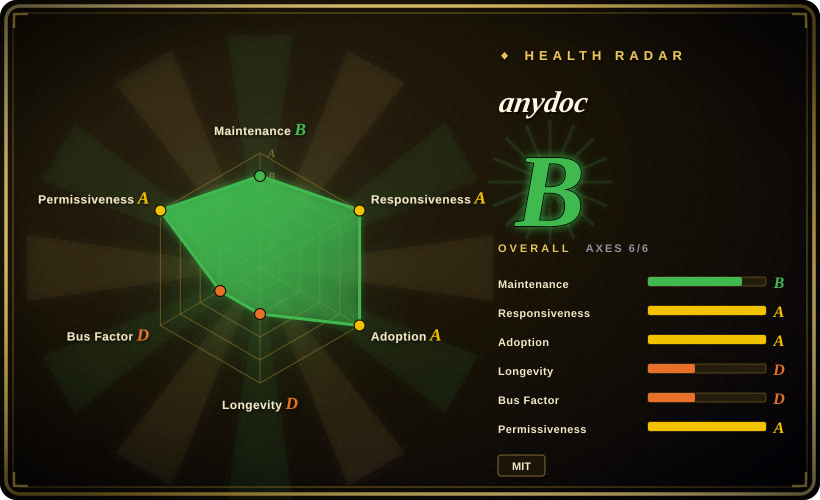
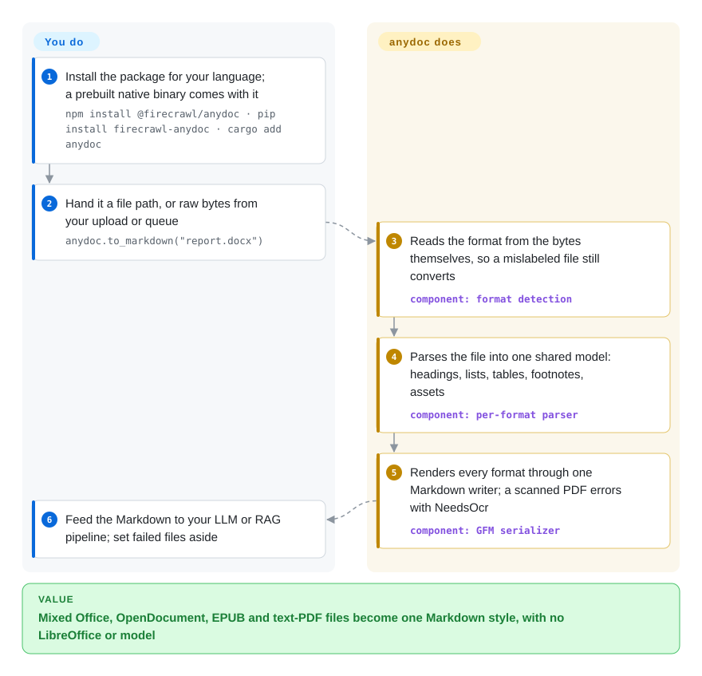

# anydoc

Your ingestion job receives a folder of `.doc`, `.pptx`, `.xlsx`, `.odt`, `.rtf` and PDF files, and every converter you try either skips half of those formats, needs LibreOffice installed on the box, or spends a second per file. anydoc parses all of them itself inside one Rust library (with Node, Python and browser builds) and writes the same style of Markdown for each, in milliseconds — but it cannot read scanned pages.

## When to use

You maintain the document-ingestion step of a RAG or agent product. Users upload whatever they have: a 2003 `.doc` contract, a `.pptx` sales deck with speaker notes, an `.xlsx` price list with merged header cells, an `.odt` from a government portal. Today your worker shells out to `soffice --headless --convert-to` for half of these and runs a Python converter for the rest; each file takes around a second, the container image carries a full office suite, and the tables come out differently depending on which path a file took — pipes escaped in one, not in the other.

You reach for anydoc when **format breadth, speed and a small footprint** matter more than layout understanding. It reads the old binary Office formats (`.doc`, `.ppt`, `.xls`) as well as OOXML, OpenDocument, RTF, EPUB, CSV and text-layer PDFs with no external program, detects the format from the file bytes instead of the extension, and funnels every format through one Markdown writer, so a table-escaping behaviour is the same for docx and odt. Pick it over [MarkItDown](markitdown.md) when you need the legacy binary formats and one output style across them; over [Docling](docling.md) or [Marker](marker.md) when your documents are born-digital and you would rather not ship ML models or a GPU; and over [Pandoc](../markdown-tools/pandoc.md) when the pile includes old binary Office files, OpenDocument spreadsheets/slides or PDFs, none of which Pandoc reads.

## How it works

Every input goes through the same three stages inside the library. First it looks at the file's own bytes — the PDF header, the RTF opening brace, the stream names inside an old Office file, the type marker inside a zipped modern Office file — to decide what the file is (CSV has no such marker, so you name it). Then a parser written for that format turns the file into a shared in-memory **document model**: a tree of headings, paragraphs, lists, tables, footnotes and embedded assets such as images. Finally a single serializer writes that tree as GitHub-Flavored Markdown (GFM, the Markdown dialect with tables and task lists), so a fix in the writer applies to every format at once — like one printer serving many typewriters. PDFs are the exception: they go through Firecrawl's separate `pdf-inspector` crate, which emits Markdown directly, and if any page has no text layer the whole call fails with `NeedsOcr` instead of returning partial text. What you do is pick a binding, call `to_markdown` / `toMarkdown` on a path or bytes, and decide what to do with the files that raise errors; the Node and Python bindings (not the Rust crate) can instead upload those PDFs to the hosted Firecrawl Parse API when you pass `ocr="hosted"`.

<!-- flow-steps:begin (generated from flows/anydoc.json by tools/flow_card.py — do not edit) -->

Text version of the flow

1. **You**: Install the package for your language; a prebuilt native binary comes with it — `npm install @firecrawl/anydoc · pip install firecrawl-anydoc · cargo add anydoc`
2. **You**: Hand it a file path, or raw bytes from your upload or queue — `anydoc.to_markdown("report.docx")`
3. **anydoc**: Reads the format from the bytes themselves, so a mislabeled file still converts — component: `format detection`
4. **anydoc**: Parses the file into one shared model: headings, lists, tables, footnotes, assets — component: `per-format parser`
5. **anydoc**: Renders every format through one Markdown writer; a scanned PDF errors with NeedsOcr — component: `GFM serializer`
6. **You**: Feed the Markdown to your LLM or RAG pipeline; set failed files aside

**Value**: Mixed Office, OpenDocument, EPUB and text-PDF files become one Markdown style, with no LibreOffice or model

<!-- flow-steps:end -->

## When NOT to use

- **Your inputs include scanned or photographed pages.** Use [Marker](marker.md), [olmOCR](olmocr.md) or [Docling](docling.md) instead, because anydoc does no OCR at all. In v0.2.4 a single image-only page makes the whole PDF fail with `NeedsOcr` and return nothing, including its text pages (issue #144), and users reported that the same check refuses some born-digital PDFs that v0.2.3 converted (issue #162: 13 of 30 in one corpus). Both were still open on 2026-09-29.
- **The documents must not leave your network, and some of them are scans.** Use a local OCR-capable parser such as [Docling](docling.md) or [Marker](marker.md), because anydoc's only built-in OCR route is `ocr="hosted"`, which uploads the entire document (not just the scanned pages) to Firecrawl Parse at `api.firecrawl.dev`. The Rust crate itself never makes network calls; local-OCR hooks exist only as feature requests (#146, #157).
- **You need layout-faithful PDF tables or multi-column pages.** Use [Docling](docling.md) or [Marker](marker.md), because anydoc's PDF path bypasses its own document model and relies on `pdf-inspector`'s heuristics; a multi-column table collapsing into one blob is an open bug (#173).
- **The value is in Word headers and footers — letterheads, invoice numbers, page stamps.** Read those parts with `python-docx` or check [Unstructured](unstructured.md), because anydoc's docx parser only loads the main document, styles, numbering, footnotes and endnotes; `header*.xml` / `footer*.xml` are not read (issue #132, closed without a code change; no header/footer handling in `src/formats/docx` as of 2026-09-29).
- **You need a target other than Markdown, or a round trip back to Office.** Use [Pandoc](../markdown-tools/pandoc.md), because anydoc is one-way: many input formats, exactly one output.
- **Your inputs are images, audio, HTML pages or emails.** Use [MarkItDown](markitdown.md), because anydoc accepts office, ebook, CSV and PDF files only; HTML, MHTML and `.eml` support exist only as unmerged community PRs (#147, #149, #164).
- **You want chunking, metadata enrichment and source connectors, not just conversion.** Use [Unstructured](unstructured.md), because anydoc stops at a Markdown string (or its document model) and leaves chunking and embedding to you.
- **You need an upstream that answers quickly and a stable API.** Pin an exact version, or prefer [MarkItDown](markitdown.md) / [Pandoc](../markdown-tools/pandoc.md) with longer track records, because anydoc is two months old, about 91% of its commits come from one author, it is still 0.x (an open PR marks `Format` `#[non_exhaustive]`), and nothing has been merged to `main` since 2026-08-28 while community fixes queue up.

## Comparison

| Alternative | In index | Our verdict | Tradeoff |
|---|---|---|---|
| [MarkItDown](markitdown.md) | ✅ | Choose MarkItDown when the inputs include images, audio or HTML and a Python-only pipeline is fine; choose anydoc when legacy `.doc`/`.ppt`/`.xls` and OpenDocument files matter and you want the same table and escaping behaviour across every format. | MarkItDown has a wider input list, a Microsoft-backed team and a longer track record; anydoc adds binary-Office and ODF parsing plus Node/Rust/WASM builds, but has no image/audio input and only a hosted OCR route. |
| [Docling](docling.md) | ✅ | Choose Docling when scanned pages, reading order or complex PDF tables decide the quality of your RAG answers; choose anydoc when documents are born-digital and throughput or image size matters more. | Docling runs layout and table models locally and handles scans; anydoc is pure Rust with no models, milliseconds per file, but no layout understanding and no local OCR. |
| [Pandoc](../markdown-tools/pandoc.md) | ✅ | Choose Pandoc for modern-format documents that must convert into many targets (LaTeX, HTML, docx) or round-trip; choose anydoc when the inputs include `.doc`/`.ppt`/`.xls`, `.ods`/`.odp` or PDFs and only Markdown is needed. | Pandoc is a ~20-year-old universal converter with dozens of outputs and reads docx/pptx/xlsx/odt/rtf/epub, but not the legacy binary Office formats, ODS/ODP or PDF; anydoc reads those, yet emits Markdown only. |
| [Unstructured](unstructured.md) | ✅ | Choose Unstructured when you need partitioning into typed elements, chunking, connectors and an enterprise path; choose anydoc when you only need a fast, dependency-free converter inside an existing pipeline. | Unstructured is a full ETL stack with heavier Python and system dependencies; anydoc is a single native library with no system packages but no chunking or enrichment. |
| [Marker](marker.md) | ✅ | Choose Marker when PDFs — including scans, equations and academic layouts — are the main input and a GPU or slower CPU run is acceptable; choose anydoc when PDFs are a minority among Office files and must convert in milliseconds. | Marker uses deep-learning models and handles OCR; anydoc covers far more non-PDF formats with no models, but its PDF path is heuristic text extraction only. |

## Tech stack

- **Core:** Rust (edition 2024, `rust-version` 1.88), published as the `anydoc` crate; one parser module per format family (`doc`, `docx`, `ppt`, `pptx`, `sheet` for xls/xlsx/xlsb, `odf`, `rtf`, `epub`, `csv`, `pdf`) feeding a shared model in `src/model` and one GFM renderer in `src/render/markdown`.
- **Parsing crates:** `cfb` (old Office compound files), `zip` + `flate2` (OOXML/ODF/EPUB packages), `quick-xml`, `encoding_rs` (legacy code pages such as Shift-JIS and Cyrillic), `csv`, and Firecrawl's own `pdf-inspector` for PDFs.
- **Bindings:** Node via napi-rs (prebuilt for macOS, Linux glibc/musl and Windows x64; conversions run on the libuv thread pool), Python via maturin (releases the GIL; distribution name `firecrawl-anydoc`, import `anydoc`), and a WebAssembly build `@firecrawl/anydoc-wasm` for browsers.
- **Extras:** equations converted from OMML/MathML/RTF to LaTeX math; an Agent Skill (`skills/convert-documents-to-markdown`) that teaches coding agents to call the CLI through `npx`.
- **Quality tooling:** `insta` snapshot tests over a committed fixture corpus, mutation-style robustness tests, and `cargo-fuzz` targets per format.

## Dependencies

- **Runtime:** nothing beyond the package — no LibreOffice, Java, Python stack or ML model. Node bindings need Node ≥ 20; Python needs ≥ 3.10; building the crate needs Rust ≥ 1.88.
- **Network (optional):** only when you opt into `ocr: 'hosted'` / `ocr="hosted"` / `--ocr hosted` in Node, Python or the CLI, which POSTs the whole document to `https://api.firecrawl.dev` (override with `FIRECRAWL_API_URL`); works without signup, `FIRECRAWL_API_KEY` raises the limits. The Rust crate has no OCR option and no network code.
- **No service or database:** it is an in-process library and a CLI.

## Ops difficulty

**Low.** `npm install`, `pip install` or `cargo add`, then one function call; the Node package downloads a prebuilt binary, so most machines need no compiler. The things to plan for are behavioural rather than operational: every conversion is capped by fixed, non-configurable safety limits (for example 128 MiB per archive entry, 512 MiB decompressed per file, 4 million spreadsheet grid slots), so an unusually bloated real workbook can hit `ResourceLimit` (issue #156); the Node binding was reported to keep a high memory high-water mark per worker thread after large XLSX files (issue #155); and your pipeline must route `NeedsOcr`, `Encrypted` and `Unsupported` results somewhere, because anydoc will not silently return partial output.

## Health & viability

- **Maintenance, 2026-09-29:** very fast start, then a pause. The repo was created 2026-08-03, shipped v0.1.x through v0.2.4 within about four weeks (latest release 2026-08-27), and its last commit to `main` was a README edit on 2026-08-28; since then roughly two dozen community PRs and the v0.2.4 OCR-gate regressions sit unmerged, with 100 open issues and PRs combined.
- **Governance / bus factor:** owned by the `firecrawl` organization (copyright Sideguide Technologies Inc.), but one account (`tomsideguide`) authored 118 of about 130 commits — effectively a single-maintainer project backed by a company.
- **Backing:** Firecrawl uses anydoc inside its hosted Firecrawl Parse product and routes OCR to that paid service, which gives the vendor a commercial reason to keep it working; the same incentive makes local OCR a less likely upstream priority. [推断]
- **Age / Lindy:** under two months old — the Lindy prior gives it almost no credit yet; treat it as a promising young library, not a settled dependency.
- **Adoption:** about 22.2k stars and 1.39k forks in eight weeks, npm `@firecrawl/anydoc` 1.21M downloads and PyPI `firecrawl-anydoc` 5,781,244 downloads in the last month (health scorer, 2026-09-29), crates.io 433k total — exceptionally high for the age, while the scorer found no dependent repositories to explain it.
- **Risk flags:** clean MIT license with no relicense history; the risks are 0.x API churn, the unresolved all-or-nothing `NeedsOcr` behaviour, and the self-run, vendor-authored benchmark in the README.

## Caveats (unverified)

- [未验证] The README benchmark (score 81 vs 40–70 for LibreOffice, Unstructured, MarkItDown, Pandoc, Docling, mammoth; median 4.4 ms) was run by the vendor with an LLM judge on a corpus that is not redistributable, so it cannot be reproduced; treat both the quality and the speed numbers as vendor claims until tested on your documents.
- [推断] The PyPI download volume (about 5.8M/month for a two-month-old package) and the star/fork velocity likely include CI, mirror and agent-skill-driven installs; they are not evidence of that many production users.
- [推断] The month-long pause in merges after 2026-08-28 may be a temporary lull rather than a slowdown; re-check commit activity before a long-term bet.
- [未验证] Whether issue #132 (docx headers/footers) was closed as intended behaviour or planned work is not stated in the issue; the absence of header/footer parsing was confirmed only in the 2026-09-29 source, not in a maintainer statement.
- [未验证] Conversion quality on right-to-left scripts in PDFs depends on the bundled `pdf-inspector` version (issues #170, #175, #181 ask to bump it); not tested here.
- [推断] Firecrawl's commercial interest in the hosted Parse API may shape which features (for example local OCR) land upstream.
