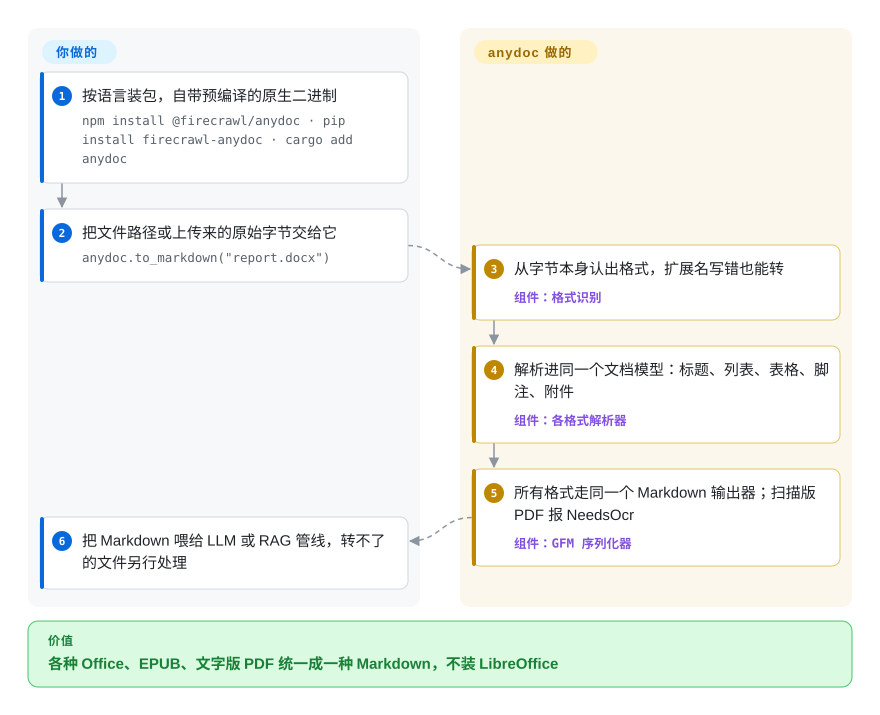

# anydoc

用户一次扔进来一整个文件夹：`.doc`、`.pptx`、`.xlsx`、`.odt`、`.rtf`、PDF 混在一起，你试过的转换器要么只认其中一半格式，要么得在机器上装一整套 LibreOffice，要么一个文件转一秒。anydoc 用一个 Rust 库（另有 Node、Python 和浏览器版本）自己解析全部这些格式，每个文件几毫秒就吐出风格一致的 Markdown——只是扫描出来的页面它读不了。

## 何时使用

你负责一个 RAG 或 agent 产品里的文档入库环节。用户手上有什么就传什么：2003 年的 `.doc` 合同、带演讲者备注的 `.pptx` 销售材料、表头有合并单元格的 `.xlsx` 报价单、从政府网站下载的 `.odt`。现在你的 worker 对一半文件调 `soffice --headless --convert-to`，另一半走某个 Python 转换器；每个文件一秒左右，容器镜像里塞着整套办公软件，而且同样是表格，走哪条路径输出就长什么样——一条路转义了竖线，另一条没有。

当**格式覆盖面、速度和体积**比版面理解更重要时，你会想到 anydoc。它不借助任何外部程序，就能读老的二进制 Office 格式（`.doc`、`.ppt`、`.xls`）以及 OOXML、OpenDocument、RTF、EPUB、CSV 和带文字层的 PDF；它看文件字节而不是扩展名来判断格式，并让所有格式走同一个 Markdown 输出器，所以 docx 和 odt 的表格转义行为完全一样。需要老二进制格式、又想要跨格式统一输出时，选它而不是 [MarkItDown](markitdown.zh.md)；文档是原生电子版、你不想打包模型或 GPU 时，选它而不是 [Docling](docling.zh.md) 或 [Marker](marker.zh.md)；文件堆里有老二进制 Office 文件、OpenDocument 表格或演示文稿、PDF 这些 Pandoc 读不了的格式时，选它而不是 [Pandoc](../markdown-tools/pandoc.zh.md)。

## 怎么用起来

每个输入在库里都走同样三步。第一步看文件自己的字节——PDF 文件头、RTF 开头的花括号、老 Office 文件内部的流名称、新版 Office 压缩包里的类型标记——来判断这是什么文件（CSV 没有这种标记，需要你告诉它）。第二步由专门写给该格式的解析器，把文件变成一份共享的内存**文档模型**：由标题、段落、列表、表格、脚注和图片等嵌入资源组成的一棵树。第三步由唯一的一个序列化器把这棵树写成 GitHub 风格 Markdown（GFM，支持表格和任务列表的 Markdown 方言），所以修一次输出器就等于修好所有格式——好比很多台打字机共用一台打印机。PDF 是例外：它走 Firecrawl 另一个 `pdf-inspector` 库，直接产出 Markdown；只要有一页没有文字层，整次调用就以 `NeedsOcr` 失败，而不是返回残缺文本。你要做的是选一个语言绑定，对路径或字节调用 `to_markdown` / `toMarkdown`，再决定报错的文件怎么处理；Node 和 Python 绑定（Rust 库本身不行）在你传 `ocr="hosted"` 时，可以改为把这类 PDF 上传给托管的 Firecrawl Parse 接口。

<!-- flow-steps:begin (generated from flows/anydoc.json by tools/flow_card.py — do not edit) -->

流程文字版

1. **你**：按语言装包，自带预编译的原生二进制 — `npm install @firecrawl/anydoc · pip install firecrawl-anydoc · cargo add anydoc`
2. **你**：把文件路径或上传来的原始字节交给它 — `anydoc.to_markdown("report.docx")`
3. **anydoc**：从字节本身认出格式，扩展名写错也能转 — 组件：`格式识别`
4. **anydoc**：解析进同一个文档模型：标题、列表、表格、脚注、附件 — 组件：`各格式解析器`
5. **anydoc**：所有格式走同一个 Markdown 输出器；扫描版 PDF 报 NeedsOcr — 组件：`GFM 序列化器`
6. **你**：把 Markdown 喂给 LLM 或 RAG 管线，转不了的文件另行处理

**价值**：各种 Office、EPUB、文字版 PDF 统一成一种 Markdown，不装 LibreOffice

<!-- flow-steps:end -->

## 何时不用

- **输入里有扫描件或拍照页。** 改用 [Marker](marker.zh.md)、[olmOCR](olmocr.zh.md) 或 [Docling](docling.zh.md)，因为 anydoc 完全不做 OCR。v0.2.4 里只要有一页是纯图片，整个 PDF 就以 `NeedsOcr` 失败、一个字都不返回，连有文字的页也丢了（issue #144）；还有用户报告同一个检查把 v0.2.3 能转的部分原生电子版 PDF 也拒了（issue #162：某语料里 30 份中有 13 份）。截至 2026-09-29 两个问题都未关闭。
- **文档不能离开内网，而其中有扫描件。** 改用能本地 OCR 的解析器，比如 [Docling](docling.zh.md) 或 [Marker](marker.zh.md)，因为 anydoc 内置的唯一 OCR 路径是 `ocr="hosted"`，会把整份文档（不只是扫描页）上传到 `api.firecrawl.dev` 的 Firecrawl Parse。Rust 库本身不发任何网络请求；本地 OCR 接口目前只是功能请求（#146、#157）。
- **需要忠实还原 PDF 表格或多栏版面。** 改用 [Docling](docling.zh.md) 或 [Marker](marker.zh.md)，因为 anydoc 的 PDF 路径绕过了自己的文档模型，完全依赖 `pdf-inspector` 的启发式规则；多栏表格被压成一坨是未修复的 bug（#173）。
- **有价值的信息在 Word 页眉页脚里——信头、发票号、页面印章。** 用 `python-docx` 直接读这些部件，或看看 [Unstructured](unstructured.zh.md)，因为 anydoc 的 docx 解析只加载正文、样式、编号、脚注和尾注，不读 `header*.xml` / `footer*.xml`（issue #132 关闭时没有对应代码改动；截至 2026-09-29 `src/formats/docx` 里没有页眉页脚处理）。
- **目标格式不是 Markdown，或需要转回 Office。** 改用 [Pandoc](../markdown-tools/pandoc.zh.md)，因为 anydoc 是单向的：多种输入，只有一种输出。
- **输入是图片、音频、HTML 网页或邮件。** 改用 [MarkItDown](markitdown.zh.md)，因为 anydoc 只接受办公文档、电子书、CSV 和 PDF；HTML、MHTML 和 `.eml` 支持目前只是未合并的社区 PR（#147、#149、#164）。
- **你要的是切块、元数据增强和数据源连接器，而不只是转换。** 改用 [Unstructured](unstructured.zh.md)，因为 anydoc 到 Markdown 字符串（或文档模型）就结束了，切块和向量化都留给你。
- **你需要一个响应快的上游和稳定的 API。** 锁定精确版本，或者优先选历史更长的 [MarkItDown](markitdown.zh.md) / [Pandoc](../markdown-tools/pandoc.zh.md)，因为 anydoc 才两个月大、约 91% 的提交来自一个作者、仍是 0.x（有个未合并 PR 要把 `Format` 标成 `#[non_exhaustive]`），而且 2026-08-28 之后 `main` 上没有任何合并，社区修复一直在排队。

## 横向对比

| 替代品 | 是否收录 | 我们的评价 | 取舍 |
|---|---|---|---|
| [MarkItDown](markitdown.zh.md) | ✅ | 输入包括图片、音频或 HTML，且全 Python 管线就够时选 MarkItDown；老的 `.doc`/`.ppt`/`.xls` 和 OpenDocument 文件很重要、又想让所有格式的表格和转义行为一致时选 anydoc。 | MarkItDown 输入种类更广、有微软团队背书、历史更长；anydoc 多了二进制 Office 和 ODF 解析，以及 Node/Rust/WASM 版本，但不收图片音频，OCR 只有托管这一条路。 |
| [Docling](docling.zh.md) | ✅ | 扫描页、阅读顺序或复杂 PDF 表格决定了 RAG 回答质量时选 Docling；文档是原生电子版、更在乎吞吐量或镜像体积时选 anydoc。 | Docling 在本地跑版面和表格模型，能处理扫描件；anydoc 是纯 Rust、不带模型、每个文件几毫秒，但没有版面理解，也没有本地 OCR。 |
| [Pandoc](../markdown-tools/pandoc.zh.md) | ✅ | 现代格式的文档要转成多种目标（LaTeX、HTML、docx）或来回转换时选 Pandoc；输入里有 `.doc`/`.ppt`/`.xls`、`.ods`/`.odp` 或 PDF，而且只要 Markdown 时选 anydoc。 | Pandoc 是近 20 年的通用转换器，输出格式几十种，能读 docx/pptx/xlsx/odt/rtf/epub，但读不了老二进制 Office、ODS/ODP 和 PDF；anydoc 能读这些，却只能输出 Markdown。 |
| [Unstructured](unstructured.zh.md) | ✅ | 需要按类型切分元素、切块、连接器和企业版路径时选 Unstructured；只想在现有管线里塞一个快速、无依赖的转换器时选 anydoc。 | Unstructured 是完整 ETL 栈，Python 与系统依赖更重；anydoc 是单个原生库，不需要系统包，但没有切块和增强。 |
| [Marker](marker.zh.md) | ✅ | PDF（含扫描件、公式、学术版式）是主要输入、能接受 GPU 或较慢的 CPU 运行时选 Marker；PDF 只是办公文件里的少数、必须毫秒级转完时选 anydoc。 | Marker 用深度学习模型并能 OCR；anydoc 覆盖多得多的非 PDF 格式且不带模型，但它的 PDF 路径只是启发式文字抽取。 |

## 技术栈

- **核心：** Rust（edition 2024，`rust-version` 1.88），以 `anydoc` crate 发布；每类格式一个解析模块（`doc`、`docx`、`ppt`、`pptx`、负责 xls/xlsx/xlsb 的 `sheet`、`odf`、`rtf`、`epub`、`csv`、`pdf`），汇入 `src/model` 里的共享模型，再由 `src/render/markdown` 里唯一的 GFM 渲染器输出。
- **解析依赖：** `cfb`（老 Office 复合文件）、`zip` + `flate2`（OOXML/ODF/EPUB 压缩包）、`quick-xml`、`encoding_rs`（Shift-JIS、西里尔文等旧代码页）、`csv`，以及 Firecrawl 自家处理 PDF 的 `pdf-inspector`。
- **语言绑定：** Node 走 napi-rs（为 macOS、Linux glibc/musl 和 Windows x64 预编译；转换跑在 libuv 线程池上），Python 走 maturin（释放 GIL；发行名 `firecrawl-anydoc`，导入名 `anydoc`），浏览器用 WebAssembly 版 `@firecrawl/anydoc-wasm`。
- **附加：** 把 OMML/MathML/RTF 公式转成 LaTeX 数学；附带一个 Agent Skill（`skills/convert-documents-to-markdown`），教编码 agent 通过 `npx` 调 CLI。
- **质量工具：** 对提交进仓库的样例语料做 `insta` 快照测试、变异式健壮性测试，以及每种格式一个 `cargo-fuzz` 目标。

## 依赖

- **运行时：** 除了包本身什么都不需要——没有 LibreOffice、Java、Python 栈或 ML 模型。Node 绑定要求 Node ≥ 20；Python 要求 ≥ 3.10；编译 crate 要求 Rust ≥ 1.88。
- **网络（可选）：** 只有在 Node、Python 或 CLI 里显式开启 `ocr: 'hosted'` / `ocr="hosted"` / `--ocr hosted` 时，才会把整份文档 POST 到 `https://api.firecrawl.dev`（可用 `FIRECRAWL_API_URL` 改地址）；无需注册，设置 `FIRECRAWL_API_KEY` 可提高限额。Rust crate 没有 OCR 选项，也没有网络代码。
- **没有服务或数据库：** 它是进程内的库加一个 CLI。

## 运维难度

**低。** `npm install`、`pip install` 或 `cargo add`，然后一次函数调用；Node 包会下载预编译二进制，大多数机器不需要编译器。真正要规划的是行为而不是运维：每次转换都受固定、不可配置的安全上限约束（比如单个压缩条目 128 MiB、每个文件解压后 512 MiB、表格 400 万个网格位置），所以一个异常臃肿的真实工作簿可能触发 `ResourceLimit`（issue #156）；有人报告 Node 绑定处理大 XLSX 后每个工作线程的内存高水位一直偏高（issue #155）；而且你的管线必须给 `NeedsOcr`、`Encrypted`、`Unsupported` 这些结果安排去处，因为 anydoc 不会悄悄返回残缺输出。

## 健康度与可持续性

- **维护，2026-09-29：** 起步极快，随后停顿。仓库 2026-08-03 创建，大约四周内从 v0.1.x 发到 v0.2.4（最新版本 2026-08-27），`main` 最后一次提交是 2026-08-28 的 README 修改；此后约二十多个社区 PR 和 v0.2.4 的 OCR 检查回归都没有合并或修复，open 的 issue 与 PR 合计 100 个。
- **治理与巴士因子：** 归属 `firecrawl` 组织（版权方 Sideguide Technologies Inc.），但约 130 次提交里有 118 次出自同一个账号（`tomsideguide`）——实际上是公司背书的单人维护项目。
- **背书：** Firecrawl 在自家托管产品 Firecrawl Parse 里使用 anydoc，并把 OCR 导流到这个付费服务，这让厂商有商业动机维持它可用；同样的动机也让本地 OCR 不太可能成为上游优先事项。[推断]
- **年龄与 Lindy：** 不到两个月——Lindy 先验几乎给不了分；把它当作有前途的年轻库，而不是稳定依赖。
- **采用度：** 八周约 2.22 万 star、1.39k fork；最近一个月 npm `@firecrawl/anydoc` 下载 121 万次、PyPI `firecrawl-anydoc` 下载 5,781,244 次（健康度评分器，2026-09-29 口径），crates.io 累计 43.3 万次——就其年龄而言异常高，而评分器没有找到任何依赖它的仓库来解释这个量。
- **风险标记：** MIT 许可证干净，没有改许可历史；风险在于 0.x 的 API 变动、尚未解决的“要么全转要么全失败”的 `NeedsOcr` 行为，以及 README 里厂商自测的基准。

## 存疑（未验证）

- [未验证] README 基准（得分 81，对比 LibreOffice、Unstructured、MarkItDown、Pandoc、Docling、mammoth 的 40–70；中位耗时 4.4 ms）由厂商用 LLM 评审在不可再分发的语料上跑出，无法复现；在你自己的文档上测过之前，质量和速度数字都只算厂商说法。
- [推断] PyPI 下载量（两个月大的包每月约 578 万次）以及 star/fork 增速很可能包含 CI、镜像和 agent skill 触发的安装，不能证明有这么多生产用户。
- [推断] 2026-08-28 之后一个月没有合并，可能只是暂时停顿而非放缓；做长期押注前请重新查看提交活动。
- [未验证] issue #132（docx 页眉页脚）是按“预期行为”还是“计划中”关闭的，issue 里没有说明；页眉页脚未被解析这一点只在 2026-09-29 的源码里确认过，没有维护者表态。
- [未验证] PDF 中从右到左文字的转换质量取决于捆绑的 `pdf-inspector` 版本（issue #170、#175、#181 都在要求升级），本次没有测试。
- [推断] Firecrawl 在托管 Parse 接口上的商业利益，可能影响哪些功能（比如本地 OCR）会进入上游。
